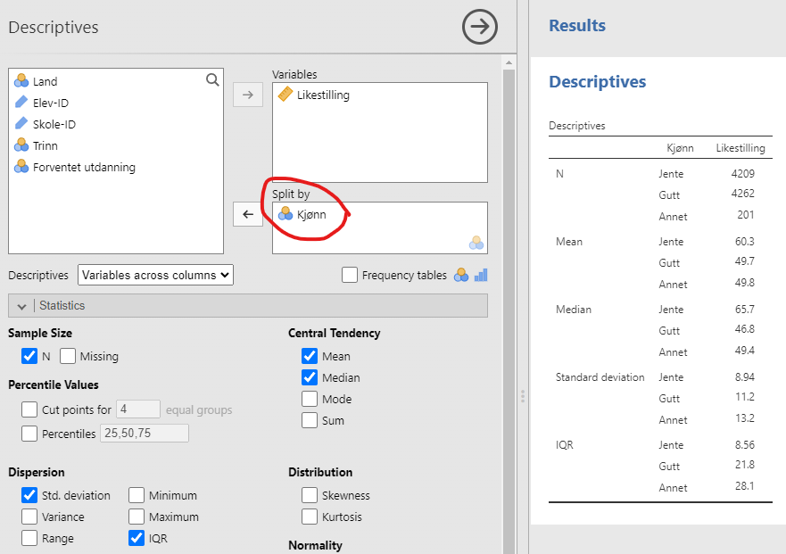
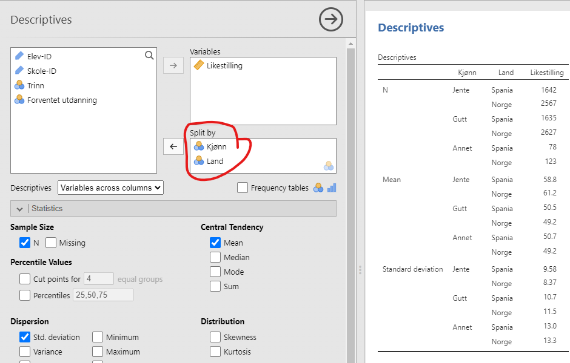
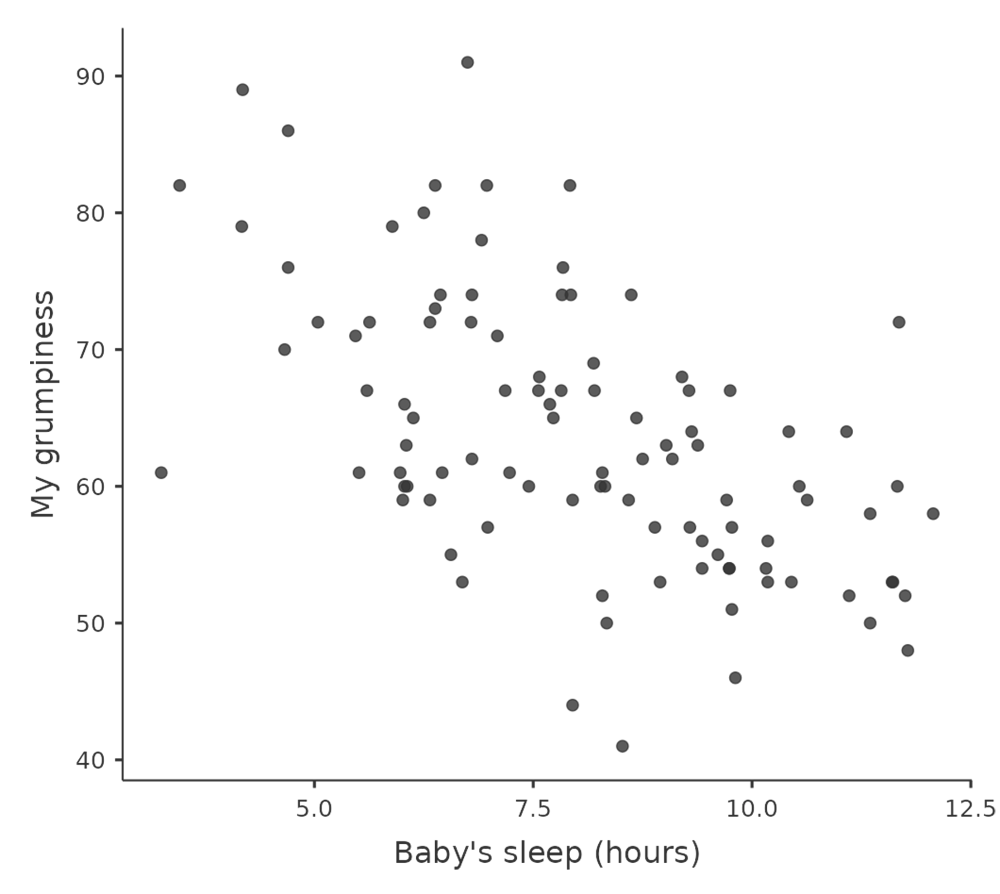
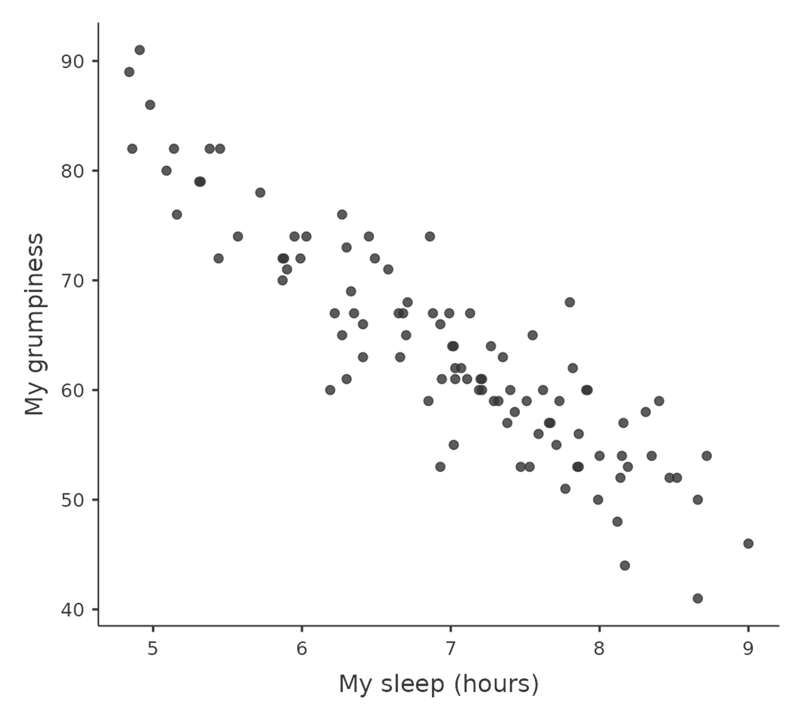
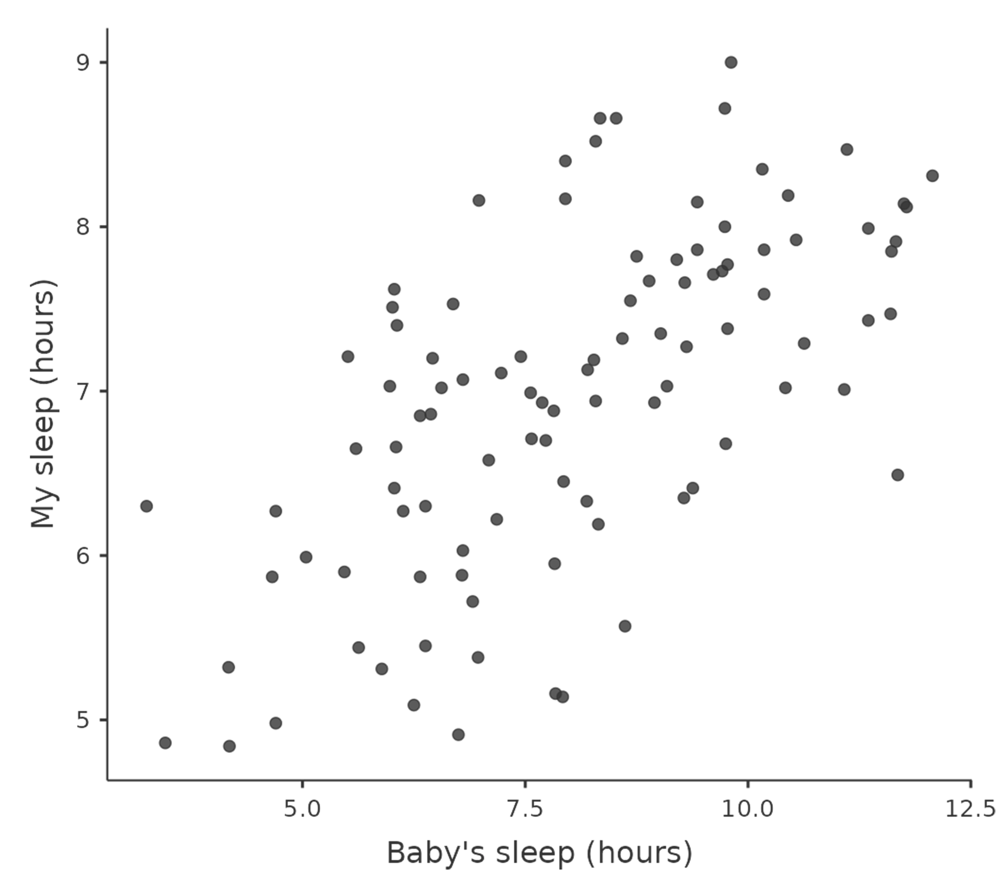

<!-- \placetextbox{0.26}{0.06}{\scriptsize{©2025 D.R. Foxcroft and D.J. Navarro,}} -->
<!-- \placetextbox{0.195}{0.05}{\scriptsize{CC BY-SA 4.0}} -->

# Å beskrive sammenhenger mellom variable {#sec-associations}

```{r}
#| include: FALSE
source("chapter_header.R")
```

<!-- TODO (kapittelnivå): ICCS er utvidet til fire land (Norge, Spania, Polen, Brasil) og har fått flere variable (Sivilkunnskap, Bøker hjemme, Innvandringsstatus, Elevinteresse, Åpen klasseromsdiskusjon, Tradisjonelt medborgerskap, Forventet politisk deltakelse). Alle jamovi-skjermbilder i kapittelet er fortsatt fra det gamle to-lands-utvalget (kun Norge/Spania) og må tas på nytt. Tallspesifikke tolkninger ("550 spanske elever", "16,5 %", "61,2 mot 58,8" osv.) må også oppdateres etter at figurene er regenerert. -->

I forrige kapittel lærte du å beskrive én variabel om gangen -- med frekvenstabeller, histogram, gjennomsnitt, standardavvik og lignende. Det er nyttig for å forstå *hva* dataene inneholder, men i de fleste studier er vi mest interessert i *hvordan variable henger sammen*. Er det forskjell mellom elever fra ulike land? Henger sosioøkonomisk status sammen med holdninger til likestilling? Slike spørsmål krever at vi ser på to variable samtidig.

```{r}
ICCS <- readRDS("data_and_tables/ICCS.RDS")
set.seed(123)
utvalg <- ICCS |>
  slice_sample(n = 50)
```

Framgangsmåten avhenger av hva slags variable vi har. Derfor organiserer vi kapittelet etter variabeltype: først to kategoriske variable, deretter en kategorisk og en kontinuerlig variabel, og til slutt to kontinuerlige variable.

## Kategorisk × kategorisk {#sec-associations-cat-cat}

Når begge variablene er kategoriske (nominelle eller ordinale) bruker vi krysstabeller og stablede stolpediagram.

### Krysstabeller {#sec-associations-contingency}

I @sec-descriptive lærte du å lage frekvenstabeller for enkeltvariabler. Hvis du ønsker en tabell med to variabler -- for eksempel for å kombinere _Forventet utdanning_ og _Land_ for å se om det er forskjell i hvor lang utdanning elevene ser for seg i de ulike landene -- trenger du en **krysstabell** (_contingency table_ på engelsk). Resultatet for vårt eksempel ser du i @tbl-associations-contingency. Tallene er antall elever, og prosentene i parentes er andelen innenfor hvert land (kolonneprosent).

```{r}
#| label: tbl-associations-contingency
#| tbl-cap: Krysstabell over _Forventet utdanning_ og _Land_. Cellene viser antall elever og kolonneprosent (andel innenfor hvert land).

ICCS |>
  dplyr::count(`Forventet utdanning`, Land) |>
  dplyr::group_by(Land) |>
  dplyr::mutate(
    pct = formatC(n / sum(n) * 100, format = "f", digits = 1, decimal.mark = ","),
    celle = paste0(n, " (", pct, " %)")
  ) |>
  dplyr::ungroup() |>
  dplyr::select(`Forventet utdanning`, Land, celle) |>
  tidyr::pivot_wider(names_from = Land, values_from = celle) |>
  tt() |>
  theme_tt("spacing")
```

::: {.callout-tip}
## Slik gjør du i jamovi
Velg "Frequencies" → "Contingency Tables" → "Independent Samples". Flytt _Forventet utdanning_ til "Rows"-boksen og _Land_ til "Columns"-boksen. Trykk på "Cells" og kryss av for "Counts" og "Percentages: Columns" for å få samme oppsett som i tabellen over.
:::

Når du tolker krysstabellen, kan du for eksempel se på cellen for spanske elever som ser for seg en kort utdanning (for eksempel ett- til to-årig fagskole). Tallet utenfor parentesen er antallet -- altså hvor mange spanske elever i utvalget som havner i den kategorien. Tallet i parentesen er kolonneprosenten, og siden _Land_ ligger på kolonnene betyr det "andel innenfor Spania som ser for seg kort utdanning". Hvis vi i stedet hadde valgt radprosenter, ville samme tall betydd "andelen av elevene som ser for seg kort utdanning, som er fra Spania". Det er to helt forskjellige spørsmål, så vær bevisst på hvilken prosent du regner ut.

Krysstabeller er nyttige! Se for eksempel at norske elever skiller seg ut ved at en betydelig større andel ser for seg å avslutte utdanningen etter ungdomsskolen, mens brasilianske elever i datasettet i praksis ikke gjør det -- hvorfor det, mon tro?

### Stolpediagram for undergruppeanalyse {#sec-associations-bar-subgroup}

Du lærte å lage stolpediagram i @sec-descriptive. Hvis du legger til en kategorisk variabel som "Split by", får du et stolpediagram der du kan sammenligne undergrupper. I @fig-associations-edu-x-country har vi _Forventet utdanning_ som hovedvariabel og _Land_ i "Split by"; i @fig-associations-country-x-edu har vi byttet rekkefølge. Hvis du lurer på hvilken du skal velge, må du tenke over "hvilken kommuniserer best det poenget jeg prøver å få frem?" eller "hvilken besvarer forskningspørsmålet best?"

::: {.callout-tip}
## Slik gjør du i jamovi
Lag først et vanlig stolpediagram som i @sec-descriptive. Legg så ønsket gruppevariabel inn i "Split by"-feltet for å få ett stolpediagram per gruppe.
:::

::: {#fig-associations-bar-subgroups layout-ncol=1 fig-pos="H"}
```{r}
#| label: fig-associations-edu-x-country
#| fig-cap: _Land_ i "Split by"
#| out.width: "100%"
knitr::include_graphics("images/fig-diagram-jamovi-edu-x-country.png")
```

```{r}
#| label: fig-associations-country-x-edu
#| fig-cap: _Forventet utdanning_ i "Split by"
#| out.width: "100%"
knitr::include_graphics("images/fig-diagram-jamovi-country-x-edu.png")
```
Undergruppeanalyse av _Forventet utdanning_ for hvert _Land_.
:::

Vi kan også legge til _enda en variabel_ ved å plassere flere variabler i "Split by". I @fig-associations-bar-threeway ser du resultatet med _Land_ som hovedvariabel og både _Forventet utdanning_ og _Kjønn_ som splittvariabler. Uff, det ble en koloss av en figur! Hvis du klarer å lese skriften, vil du likevel se at den er ganske informativ. Vi skal forbedre den med stablede stolpediagrammer i neste delkapittel.

```{r}
#| label: fig-associations-bar-threeway
#| fig-cap: Undergruppeanalyse av _Forventet utdanning_ for hvert _Land_ og _Kjønn_
#| out.width: "100%"
knitr::include_graphics("images/fig-diagram-jamovi-bar-threeway.png")
```

### Stablede stolpediagram {#sec-associations-stacked-bar}

Stolpediagrammer kan stables oppå hverandre, noe som gjør dem mer kompakte og lettere å forstå i noen sammenhenger. Resultatet for vårt eksempel ser du i @fig-associations-stacked-bar.

::: {.callout-tip}
## Slik gjør du i jamovi
Velg "Analyses" → "Frequencies" → "Independent samples ($\chi^2$ test of association)". Trykk deg inn på "Plots" og kryss av for "Bar plot". Innstillingene vises i @fig-associations-jamovi-stacked-bar:

- Legg _Forventet utdanning_ på "Rows" og _Land_ på "Columns". (Dette er smak og behag for hvordan "Contingency Tables", som også genereres, blir seende ut.)
- Velg "Bar Type: Stacked" -- altså "Stolpetype: Stablet".
- Velg "Percentages" på "Y-axis", siden vi vil se andelen fra hvert land som ser for seg ulike utdanninger.
- Velg "Percentages within column" for å regne prosenter innenfor hvert land (siden _Land_ ligger på "Columns").
:::

<!-- TODO: Vurder om skjermbildet av innstillingsmenyen (@fig-associations-jamovi-stacked-bar) bør flyttes ned i callout-boksen, eller eventuelt fjernes hvis bullet-listen er tilstrekkelig. -->

```{r}
#| label: fig-associations-jamovi-stacked-bar
#| fig-cap: Innstillinger i jamovi for å få et stablet stolpediagram for _Forventet utdanning_ for hvert _Land_
#| out-width: "100%"
knitr::include_graphics("images/fig-diagram-jamovi-stacked-bar.png")
```

<!-- TODO: ICCS har nå fire land (Norge, Spania, Polen, Brasil). Tolkningen under sammenligner kun Norge og Spania og bør skrives om når den nye stablede stolpediagram-figuren foreligger. -->

Det stablede diagrammet (@fig-associations-stacked-bar) viser at en noe større andel av de norske elevene planlegger høyere utdanning sammenlignet med de spanske elevene, men forskjellen er ganske liten. Sammenlign gjerne med stolpediagrammet i @fig-associations-edu-x-country, som viser absolutte tall. Der virker forskjellen mye større -- nesten dobbelt så mange norske som spanske elever ser for seg høyere utdanning! Grunnen til denne store forskjellen er imidlertid at det er betydelig flere norske enn spanske elever i utvalget vårt (`r sum(ICCS[["Land"]] == "Norge")` mot `r sum(ICCS[["Land"]] == "Spania")`). Sannsynligvis er vi mer interessert i andelen elever som ser for seg høyere utdanning, og det stablede stolpediagrammet viser dette tydeligere.

```{r}
#| label: fig-associations-stacked-bar
#| fig-cap: Stablet stolpediagram av _Forventet utdanning_ for hvert _Land_
#| out-width: "100%"
knitr::include_graphics("images/fig-diagram-stacked-bar.png")
```

Nå kan vi igjen prøve å gjøre en analyse på tvers av to variable, _Kjønn_ og _Land_. Resultatet blir som i @fig-associations-stacked-bar-threeway. Her skinner virkelig det stablede stolpediagrammet -- se så kompakt og lesbart det ble i forhold til samme informasjon vist som et vanlig stolpediagram (@fig-associations-bar-threeway). Den største forskjellen mellom disse to diagrammene er at "Annet" var umulig å lese med det vanlige stolpediagrammet fordi stolpene ble så små, men med stablede stolper gikk det an å se at de norske elevene som valgte "Annet" i veldig stor grad ikke ser for seg mer skole etter ungdomsskolen. (Men husk at disse stolpene er basert på veldig få elever.)

::: {.callout-tip}
## Slik gjør du i jamovi
For å splitte i tre variable: behold _Forventet utdanning_ på "Rows" og _Kjønn_ på "Columns", og legg _Land_ inn under "Layers".
:::

<!-- TODO: ICCS har nå fire land. Vurder om "stablede stolper for hvert kjønn × land" fortsatt er lesbart med fire land, eller om eksempelet bør formuleres annerledes (f.eks. velge ut to land, eller bytte ut Land med en variabel med færre nivåer). Skjermbildet i fig-associations-stacked-bar-threeway må uansett tas på nytt. -->

```{r}
#| label: fig-associations-stacked-bar-threeway
#| fig-cap: Stablet stolpediagram av _Forventet utdanning_ for hvert _Land_ og _Kjønn_
#| classes: .enlarge-image
#| out.width: "100%"
knitr::include_graphics("images/fig-diagram-stacked-bar-threeway.png")
```


## Kategorisk × kontinuerlig {#sec-associations-cat-cont}

Hva om du vil se om en *kontinuerlig* variabel varierer mellom ulike grupper? For eksempel: svarer norske og spanske elever forskjellig på variabelen _Likestilling_? Da trenger du deskriptiv statistikk *separat for hver gruppe*.

### Deskriptiv statistikk separat for hver gruppe {#sec-associations-subgroup}

```{r}
five_first <- head(utvalg, 5)
```

Det er svært vanlig at du trenger å se på deskriptiv statistikk for forskjellige undergrupper i dataene dine. Det hadde for eksempel vært interessant å vite om de spanske og norske elevene svarer forskjellig på variabelen _Likestilling_. Eller kanskje om de som ser for seg høyere utdanning svarer forskjellig fra de som ser for seg å stoppe utdanningen etter videregående. Slike spørsmål er svært interessante, og derfor er undergruppeanalyser ofte det masterstudenter benytter til å besvare forskningsspørsmålene sine.

Vi titter på noen rader fra ICCS-dataene våre igjen:

```{r}
five_first |> tt()
```

Vi ser at de undergruppene vi ønsker å undersøke (Norge/Spania, Høyere utdanning/VGS) er de forskjellige verdiene til nominelle eller ordinale variable (henholdsvis _Land_ og _Forventet utdanning_). En måte å tenke på verdiene til nominelle og ordinale variable er altså som undergrupper.

> Å gjøre deskriptiv statistikk for undergrupper er å gjøre utregningene separat for hver verdi av en nominell variabel.

For å regne ut deskriptiv statistikk separat for Gutt, Jente og Annet, må vi dele opp dataene med verdiene i variabelen _Kjønn_. Resultatet ser du i @fig-associations-equality-x-gender.

::: {.callout-tip}
## Slik gjør du i jamovi
Gå til "Analyses" → "Exploration" → "Descriptives" som før. Legg variabelen du vil beskrive (her _Likestilling_) i "Variables", og legg gruppevariabelen (her _Kjønn_) inn i "Split by". Da får du deskriptiv statistikk for hver verdi av _Kjønn_.
:::

```{r}
#| label: fig-associations-equality-x-gender
#| classes: .enlarge-image
#| fig-cap: Et skjermbilde av jamovi som viser _Likestilling_ for de forskjellige verdiene av _Kjønn_
#| fig-alt: Et jamovi-skjermbilde som viser at _Kjønn_ er lagt til i vinduet "Split by". Da vises deskriptiv statistikk for Gutt, Jente og Annet i et vindu til høyre

```

Fra @fig-associations-equality-x-gender ser vi at jentene har mye høyere gjennomsnittskår på _Likestilling_ enn guttene, 60,3 mot 49,7. De som oppga Annet har tilsvarende gjennomsnitt som gutta, 49,8. Jentene har dessuten vesentlig mindre standardavvik, 8,94 mot 11,2. De som oppga "Annet" har mer sprikende svar. Og tolkningen av dataene ser helt lik ut om vi heller ser på medianen og kvartilbredden enn gjennomsnittet og standardavviket.

Vi kan også lure på om det er forskjell mellom landene for hvert kjønn. Da legger vi til variabelen _Land_ i "Split by" sammen med _Kjønn_, se @fig-associations-equality-x-gender-country. Vi ser at de norske jentene er mer for likestilling enn de spanske jentene (61,2 mot 58,8), men at de norske gutta er _mindre_ for likestilling enn de spanske guttene (49,2 mot 50,5)! Skjerpings, gutter!

<!-- TODO: ICCS har nå fire land. Tallene over (61,2 / 58,8 / 49,2 / 50,5) gjelder bare Norge og Spania -- både skjermbildet @fig-associations-equality-x-gender-country og denne tolkningen må oppdateres. Vurder om poenget "skjerpings, gutter" fortsatt fungerer når Polen og Brasil er med, eller om eksemplet bør avgrenses eksplisitt til to land. -->

```{r}
#| label: fig-associations-equality-x-gender-country
#| classes: .enlarge-image
#| fig-cap: Et skjermbilde av jamovi som viser _Likestilling_ for de forskjellige verdiene av _Kjønn_ og _Land_
#| fig-alt: Et jamovi-skjermbilde som viser at _Kjønn_ og _Land_ er lagt til i vinduet "Split by". Da vises deskriptiv statistikk for Gutt, Jente og Annet separat for hvert land i et vindu til høyre

```

PS: Når man deler inn i ulike undergrupper på denne måten, kan det være at enkelte undergrupper har svært få respondenter. Vi ser i @fig-associations-equality-x-gender-country at det er svært få som har oppgitt Annet kjønn i Spania, 78 respondenter. Dette er fremdeles mange nok til at det gir mening å regne gjennomsnitt, men andre ganger vil det være like greit å si at man ikke har mange nok respondenter til å gjøre en undergruppeanalyse for akkurat dem. Merk at dette er et etisk problem for forskere, for hvis forskning kan gagne mennesker er det et problem om noen grupper mennesker stadig vekk blir utelatt.

### Side-by-side boksplott og histogrammer

Undergruppeanalyse med tall er nyttig, men en visualisering gjør sammenhengen mye tydeligere. Du lærte i @sec-descriptive at boksplott og histogrammer egner seg godt for kontinuerlige variable, og det samme grepet med "Split by" gir oss automatisk ett plott per gruppe.

::: {.callout-tip}
## Slik gjør du i jamovi
Lag et boksplott eller histogram som beskrevet i @sec-descriptive (under "Plots" i "Descriptives"-menyen). Legg så gruppevariabelen i "Split by" -- du får ett plott per verdi av gruppevariabelen.
:::

Se @fig-associations-equ-x-edu for en sammenlikning. Det er rett og slett vanskelig å se forskjell på undergruppene med histogrammet, men med boksplottet er det lett å se at dess høyere utdanning eleven ser for seg, dess mer er eleven for likestilling mellom kjønnene. (Men merk at dette gjelder på gruppenivå og at det er mange unntak.)

:::{#fig-associations-equ-x-edu out.width="100%" layout-ncol=1}
```{r}
#| label: fig-associations-histogram-equ-x-edu
#| fig-cap: Med histogrammet er det vanskelig å se forskjell på gruppene.
#| out.width: "100%"
knitr::include_graphics("images/fig-diagram-histogram-equ-x-edu.png")
```

```{r}
#| label: fig-associations-boxplot-equ-x-edu
#| fig-cap: Med boksplott kommer forskjellen tydelig frem, kanskje spesielt ved medianen og nedre kvartil.
#| out.width: "100%"
knitr::include_graphics("images/fig-diagram-boxplot-equ-x-edu.png")
```
Sammenlikning av histogram og boksplott for å vise variabelen _Likestilling_ for hvert forventede utdanningsnivå, plottet med jamovi
:::

Merk at krysstabellen (@sec-associations-contingency) også var en type undergruppeanalyse, bare at den var mellom to kategoriske variable. Undergruppeanalyse av deskriptiv statistikk handler om sammenhengen mellom en kategorisk og en kontinuerlig variabel.


## Kontinuerlig × kontinuerlig {#sec-associations-cont-cont}

Hva om begge variablene er kontinuerlige? Da kan vi ikke dele inn i grupper, siden det ville bli altfor mange. I stedet bruker vi spredningsplott og korrelasjon.

### Spredningsplott {#sec-associations-scatter}

**Spredningsplott** viser sammenhengen mellom to tallvariable. ICCS-datasettet vårt har flere tallvariable, blant annet _Likestilling_ og _Sosioøkonomisk status_. Et naturlig spørsmål å stille er om elevene med ulik sosioøkonomisk status har forskjellig syn på likestilling mellom kjønnene. Hvis man prøver å gjøre en undergruppeanalyse der undergruppene er definert av _Sosioøkonomisk status_, støter man på problemer, fordi det er `r length(unique(ICCS[["Sosioøkonomisk status"]]))` ulike verdier av _Sosioøkonomisk status_. Man kan ikke vise så mange undergrupper!

Løsningen er å legge hver sin variabel på hver sin akse og plotte hvert punkt. Resultatet ser du i @fig-associations-scatter. Uavhengig av sosioøkonomisk status virker den vanligste verdien på _Likestilling_ å være den høyeste. Ut fra figuren er det ikke klart om sosioøkonomisk status har noen sammenheng med syn på likestilling i det hele tatt.

::: {.callout-tip}
## Slik gjør du i jamovi
Velg "Analyses" → "Exploration" → "Scatterplot". Legg variabelen du vil ha på $x$-aksen (her _Sosioøkonomisk status_) i "X-Axis", og variabelen for $y$-aksen (her _Likestilling_) i "Y-Axis". Innstillingsmenyen er vist i @fig-associations-jamovi-scatter.
:::


::: {#fig-associations-scatter-panel out.width="100%" layout-ncol=2}

```{r}
#| label: fig-associations-jamovi-scatter
#| fig-cap: Trykk på "Analyses" → "Exploration" → "Scatter plot" for å få opp denne menyen.
#| fig-alt: Menyen der man velger innstillinger for "Scatter plot" i jamovi
#| out-width: "100%"
knitr::include_graphics("images/fig-diagram-jamovi-scatter.png")
```


```{r}
#| label: fig-associations-scatter
#| fig-cap: Spredningsplott over _Likestilling_ og _Sosioøkonomisk status_.
#| fig-alt: Et spredningsplott med Likestilling på y-aksen og Sosioøkonomisk status på x-aksen. Veldig mange punkter er samlet i en linje horisontal linje langs hele toppen, og ellers er punktene jevnt spredt utover.
#| out-width: "100%"
knitr::include_graphics("images/fig-diagram-scatter.png")
```
Spredningsplott med jamovi
:::

For å gjøre sammenhengen tydeligere er det vanlig å legge en linje over spredningsplottet, slik som i @fig-associations-scatter-line. Den viser at det er en svak positiv tendens, altså at elever med høy sosioøkonomisk status svarer høyere på spørsmålene om likestilling. Du lærer mer om slike linjer, regresjonslinjer, i @sec-correlation.

::: {.callout-tip}
## Slik gjør du i jamovi
I "Scatterplot"-menyen, kryss av for "Regression line" → "Linear" under "Regression" for å legge til en rett linje gjennom punktene.
:::

```{r}
#| label: fig-associations-scatter-line
#| fig-cap: Spredningsplott med en regresjonslinje lagt til
#| fig-alt: Samme figur som det forrige spredningsplottet, men med en linje lagt oppå punktene. Linja heller svakt oppover mot høyre.
#| classes: .enlarge-image
knitr::include_graphics("images/fig-diagram-scatter-line.png")
```


### En korrelasjons styrke og retning {#sec-associations-correlation-strength}

Et spredningsplott gir oss en god pekepinn på hvordan to variabler henger sammen, men ofte vil vi gjerne si noe mer presist enn bare å se på et bilde. Vi trenger et *tall* som forteller oss hvor sterk sammenhengen er, og om den er positiv eller negativ. Det tallet heter **korrelasjonskoeffisienten**.

For å illustrere dette bruker vi et annet datasett. Tenk deg at Danielle, en småbarnsforelder, er nysgjerrig på hvordan søvnmønsteret til spedbarnet hennes påvirker hennes eget humør. Hun har samlet inn data om sin egen og babyens søvn over 100 dager (@tbl-associations-parenthood). Datasettet er fiktivt, men inspirert av ekte småbarnsliv. Danielle har vurdert sin egen grettenhet på en skala fra 0 (blid som en sol) til 100 (ekstremt gretten) og i tillegg registrert hvor mange timer både hun og babyen har sovet.

```{r}
#| label: tbl-associations-parenthood
#| tbl-cap: Data for korrelasjonsanalyse -- deskriptiv statistikk for *foreldreskap*-dataene

tibble(
  variable = c(
    "Danielles grettenhet",
    "Danielles søvn (timer)",
    "Babyens søvn (timer)"
  ),
  min = c(41, 4.84, 3.25),
  max = c(91, 9.00, 12.07),
  mean = c(63.71, 6.97, 8.05),
  median = c(62, 7.03, 7.95),
  `std. dev` = c(10.05, 1.02, 2.07),
  IQR = c(14, 1.45, 3.21)
) |>
  tt()

```

Ta en titt på de to plottene nedenfor. Det til venstre (@fig-associations-scatter-baby) viser sammenhengen mellom hvor mye babyen sover og hvor gretten Danielle er. Det til høyre (@fig-associations-scatter-dani) viser sammenhengen mellom *Danielles egen* søvn og grettenheten hennes. Når vi ser dem side om side, er det lett å se at begge forteller samme historie: mer søvn betyr mindre grettenhet! Men det er også tydelig at sammenhengen er mye *sterkere* i det høyre plottet. Punktene ligger tettere samlet, og plottet ser rett og slett mer "ryddig" ut.

::: {#fig-associations-scatter-grump layout-ncol="2" layout-valign="bottom" width="100%" fig-pos="H"}
{#fig-associations-scatter-baby fig-align="left" fig-alt="Spredningsplott som viser sammenhengen mellom 'Barnets søvn (timer)' på x-aksen og 'Min grettenhet' på y-aksen. Trenden indikerer at når barnet sover mer, avtar grettenheten." width="100%"}

{#fig-associations-scatter-dani fig-align="left" fig-alt="Et spredningsplott med tittelen 'Min grettenhet vs. Min søvn (timer)'. X-aksen er merket 'Min søvn (timer)' fra 5 til 9, og y-aksen er merket 'Min grettenhet' fra 40 til 90. Datapunktene viser en negativ korrelasjon mellom søvn og surhet." width="100%"}

Spredningsplott fra jamovi som viser sammenhengen mellom babyens søvn og Danielles grettenhet (venstre) og sammenhengen mellom Danielles søvn og grettenhet (høyre)
:::

Nå som vi har sett på *styrken* i en sammenheng, la oss se på *retningen*. Ta en titt på de to plottene i @fig-associations-scatter-direction. Her sammenligner vi sammenhengen mellom babyens søvn og Danielles grettenhet (til venstre) med sammenhengen mellom babyens søvn og *Danielles* søvn (til høyre). Denne gangen er styrken i de to sammenhengene ganske lik, men retningen er helt motsatt. Det betyr at når babyen sover mer, får også Danielle mer søvn -- en *positiv sammenheng* (plottet til høyre). Samtidig, når babyen sover mer, blir Danielle mindre gretten -- en *negativ sammenheng* (plottet til venstre).

::: {#fig-associations-scatter-direction layout-ncol="2" layout-valign="bottom" width="90%" fig-pos='h!'}

{#fig-associations-scatter-dir-neg fig-align="left" fig-alt="Spredningsplott som viser sammenhengen mellom 'Barnets søvn (timer)' på x-aksen og 'Min surhet' på y-aksen. Trenden indikerer at når barnet sover mer, avtar surheten." width="100%"}

{#fig-associations-scatter-dir-pos fig-align="left" fig-alt="Spredningsplott som viser sammenhengen mellom 'Barnets søvn (timer)' på x-aksen og 'Min søvn (timer)' på y-aksen. Datapunktene indikerer at når barnets søvn øker fra 5 til 12,5 timer, har forelderens søvn også en tendens til å øke fra 5 til 9 timer." width="100%"}

Spredningsplott fra jamovi som viser sammenhengen mellom babyens søvn og Danielles grettenhet (venstre), sammenlignet med sammenhengen mellom babyens søvn og Danielles søvn (høyre)
:::

### Korrelasjonskoeffisienten {#sec-associations-correlation-coefficient}

For å få et bedre grep om disse ideene, la oss introdusere **korrelasjonskoeffisienten** mer formelt. Den kalles ofte Pearsons korrelasjonskoeffisient og skrives som $r$. Denne koeffisienten er et tall mellom -1 og 1 som måler styrken og retningen på sammenhengen mellom to variabler, $X$ og $Y$ (noen ganger skrevet $r_{XY}$).

- En $r = 1$ betyr en perfekt positiv sammenheng.
- En $r = -1$ betyr en perfekt negativ sammenheng.
- En $r = 0$ betyr at det ikke er noen lineær sammenheng i det hele tatt.

Ta en titt på @fig-associations-correlation-examples for å se eksempler på hvordan ulike korrelasjoner ser ut.

```{r}
#| label: fig-associations-correlation-examples
#| out-width: "100%"
#| fig-width: 8.571429
#| fig-asp: 1.5
#| fig-cap: Illustrasjon av effekten av å variere styrken og retningen på en korrelasjon. I venstre kolonne er korrelasjonene $0; 0{,}33; 0{,}66$ og $1$. I høyre kolonne er korrelasjonene $0; -0{,}33; -0{,}66$ og $-1$.
#| fig-alt: "Spredningsplott med varierende grad av positiv og negativ korrelasjon. Positive korrelasjoner: 0, 0.33, 0.66 og 1. Negative korrelasjoner: 0, -0.33, -0.66 og -1. 0 viser ingen korrelasjon, og 1 og -1 viser perfekte korrelasjoner."

onePlot <- function(r, n = 100) {
  sigma <- cbind(c(1, r), c(r, 1))
  X <- MASS::mvrnorm(n, c(0, 0), sigma, empirical = FALSE)
  ggplot(data.frame(X), aes(x = X[, 1], y = X[, 2])) +
    geom_point(col = blueshade, size = .5) +
    ylab(r) +
    theme(
      axis.text.y = element_blank(),
      axis.title.y = element_text(vjust = 0.5, angle = 0, size = 16),
      axis.ticks.y = element_blank(),
      axis.line.y = element_blank(),
      axis.text.x = element_blank(),
      axis.title.x = element_blank(),
      axis.ticks.x = element_blank(),
      axis.line.x = element_blank(),
      plot.background = element_rect(color = "lightgrey", linewidth = 0.4)
    )
}

onePlot_out <- lapply(c(0, .33, -.33, .66, -.66, 1, -1), function(r) {
  onePlot(r)
})

tgrob <- ggpubr::text_grob(
  "Positive Correlations",
  hjust = 0.7,
  vjust = 0.7,
  size = 16
)
plot_01 <- ggpubr::as_ggplot(tgrob)
tgrob <- ggpubr::text_grob(
  "Negative Correlations",
  hjust = 0.7,
  vjust = 0.7,
  size = 16
)
plot_02 <- ggpubr::as_ggplot(tgrob)


library(patchwork)

theme_border <- theme_gray() +
  theme(
    plot.background = element_rect(fill = NA, colour = 'black', linewidth = 4)
  )
p1 <- plot_01 +
  onePlot_out[[1]] +
  onePlot_out[[2]] +
  onePlot_out[[4]] +
  onePlot_out[[6]] +
  plot_layout(ncol = 1, heights = c(1, 4, 4, 4, 4)) +
  plot_annotation(theme = theme_border)

p2 <- plot_02 +
  onePlot_out[[1]] +
  onePlot_out[[3]] +
  onePlot_out[[5]] +
  onePlot_out[[7]] +
  plot_layout(ncol = 1, heights = c(1, 4, 4, 4, 4)) +
  plot_annotation(theme = theme_border)

p3 <- p1 | p2 + plot_annotation(theme = theme_border)
p3

```

Vi ser at korrelasjonen måler i hvor stor grad punktene faller på en rett linje i et spredningsplott. Dette er velegnet til å beskrive sammenhengen mellom kontinuerlige variable.

### Beregne korrelasjoner i jamovi {#sec-associations-correlation-jamovi}

Korrelasjonsmatrisen for *parenthood*-dataene er vist i @fig-associations-correlation-jamovi.

::: {.callout-tip}
## Slik gjør du i jamovi
Velg "Analyses" → "Regression" → "Correlation Matrix". Flytt alle de kontinuerlige variablene du vil korrelere, over i boksen til høyre. Pearsons $r$ er valgt som standard.
:::

```{r}
#| label: fig-associations-correlation-jamovi
#| classes: .enlarge-image
#| fig-cap: Korrelasjoner mellom variablene i *parenthood.csv*-filen
#| fig-alt: Et skjermbilde fra jamovi som viser dataanalyseverktøy. Hovedfokuset er på en korrelasjonsmatrise med variabelnavn som «dan.sleep», «baby.sleep» og «dan.grump». Valg for Pearson-korrelasjon, rapportering av signifikans og konfidensintervaller er synlige
#| out-width: "100%"

```

<!-- TODO: Skjermbildet @fig-associations-correlation-jamovi viser fortsatt innstillingspanelet. Vurder å beskjære det til kun resultattabellen, siden klikk-instruksjonene nå ligger i callout-boksen. -->

### Tolkning av en korrelasjon {#sec-associations-correlation-interpretation}

I det virkelige liv ser man sjelden korrelasjoner på $1$. Så hvordan skal man tolke en korrelasjon på, si, $r = 0{,}4$? Det ærlige svaret er at det avhenger av hva du skal bruke dataene til, og hvor sterke korrelasjonene i fagfeltet ditt pleier å være. Når man ser etter, for eksempel, korrelasjoner mellom undervisning og læring gjør man det svært bra hvis man får en korrelasjon på $0{,}3$. Men hvis man korrelerer hvor godt en elev gjør det på den samme rettskrivningprøven på mandag og på tirsdag, bør den vise svært høy korrelasjon. Kort sagt, tolkningen av en korrelasjon avhenger i stor grad av konteksten. Når det er sagt, er det mange som benytter veiledere som i @tbl-associations-correlation-guide.

```{r}
#| label: tbl-associations-correlation-guide
#| tbl-cap: En omtrentlig veileder for tolkning av korrelasjoner (som noen gang vil være OK)

tibble(
  Korrelasjon = c(
    "-1,0 til -0,9",
    "-0,9 til -0,7",
    "-0,7 til -0,4",
    "-0,4 til -0,2",
    "-0,2 til 0",
    "0 til 0,2",
    "0,2 til 0,4",
    "0,4 til 0,7",
    "0,7 til 0,9",
    "0,9 til 1,0"
  ),
  Styrke = c(
    "Veldig sterk",
    "Sterk",
    "Moderat",
    "Svak",
    "Ubetydelig",
    "Ubetydelig",
    "Svak",
    "Moderat",
    "Sterk",
    "Veldig sterk"
  ),
  Retning = c(
    "Negativ",
    "Negativ",
    "Negativ",
    "Negativ",
    "Negativ",
    "Positiv",
    "Positiv",
    "Positiv",
    "Positiv",
    "Positiv"
  )
) |>
  tt(
    notes = "Merk at dette er en grov veiledning. Det finnes ingen nøyaktige regler for hva som er en sterk og svake sammenheng. Det avhenger av konteksten."
  )
```

### Anscombes kvartett {#sec-associations-anscombe}

Vi kan ikke få sagt det nok: Se alltid på spredningsplottet før du begynner å tolke dataene. Grunnen er enkel: En korrelasjon betyr ikke alltid det du tror.

Et klassisk eksempel som viser dette perfekt, er "Anscombes kvartett" [@Anscombe1973]. Kvartetten består av fire datasett, og hvert av dem har en $X$- og en $Y$-variabel. Kvartetten er laget slik at de deskriptive statistikkene er så å si identiske for alle fire:

- Gjennomsnittet for alle $X$-variablene er $9{,}0$ og for alle $Y$-variablene er $7{,}5$.
- Standardavvikene er også praktisk talt like for både $X$ og $Y$.
- Og for å toppe det hele, er korrelasjonen mellom $X$ og $Y$ i *alle* de fire tilfellene $r = 0{,}816$.

Dette kan du forresten enkelt sjekke selv, for dataene ligger klare i filen *[anscombe.csv](data_and_tables/anscombe.csv)*.

Basert på kun disse tallene skulle man tro at datasettene er nokså like, men det er de absolutt ikke. Først når vi visualiserer dataene som spredningsplott, slik du ser i @fig-associations-anscombe, avsløres sannheten: De fire datasettene er helt ulike. Da skjønner vi hvorfor mange statistikere har følgende leveregel, som mange dessverre glemmer i praksis:

> **Visualiser alltid dataene dine!**


```{r}
#| label: fig-associations-anscombe
#| fig-cap: Spredningsplott for Anscombes kvartett. Alle fire datasettene har en Pearson-korrelasjon på $r = 0,816$, men de er likevel svært forskjellige fra hverandre.
#| fig-alt: Fire spredningsplott som viser samme positive korrelasjon mellom x og y. De fire plottene illustrerer henholdsvis en lineær sammenheng, en ikke-lineær sammenheng, en avviksverdi og en innflytelsesrik observasjon.
#| out-width: "100%"
#| fig-width: 8.571428
#| fig-asp: 1

library(quartets)

ggplot(anscombe_quartet, aes(x = x, y = y)) +
  geom_point(colour = blueshade, size = 2) +
  geom_smooth(method = "lm", formula = "y ~ x", se = FALSE, colour = 'gray90') +
  xlab("\n\nx") +
  ylab("y\n\n") +
  theme(
    strip.text = element_blank(),
    axis.line = element_line(linewidth = .1),
    panel.spacing = unit(3, "lines"),
    axis.text.y = element_blank(),
    axis.text.x = element_blank(),
    axis.ticks.y = element_blank(),
    axis.ticks.x = element_blank()
  ) +
  facet_wrap(~dataset, scales = 'free')

```


## Oppsummering

Deskriptiv statistikk for en enkelt variabel forteller deg *hva* dataene inneholder; å beskrive sammenhenger forteller deg *hvordan variable henger sammen*. I dette kapittelet har vi sett at framgangsmåten avhenger av hva slags variable du har:

-   **Kategorisk × kategorisk**: Bruk [krysstabeller][Krysstabeller] for å se tallene og [stablede stolpediagram][Stablede stolpediagram] for å visualisere sammenhengen.
-   **Kategorisk × kontinuerlig**: Bruk [deskriptiv statistikk separat for hver gruppe][Deskriptiv statistikk separat for hver gruppe] for å sammenligne tall, og [side-by-side boksplott][Side-by-side boksplott og histogrammer] for å se forskjellene visuelt.
-   **Kontinuerlig × kontinuerlig**: Bruk [spredningsplott][Spredningsplott] for å visualisere sammenhengen, og [korrelasjonskoeffisienten][Korrelasjonskoeffisienten] for å beskrive styrken og retningen med et tall. Husk [Anscombes kvartett][Anscombes kvartett]: visualiser alltid dataene dine!
