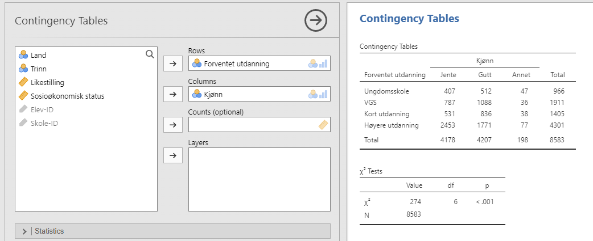
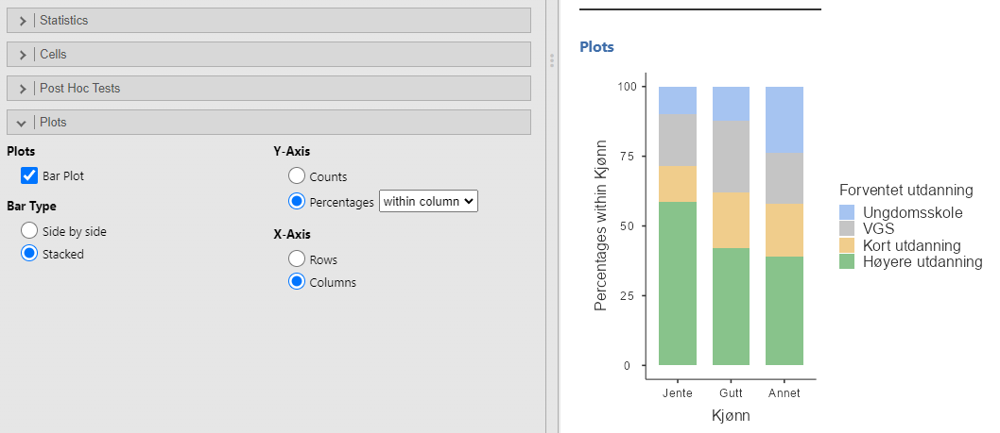

\placetextbox{0.26}{0.06}{\scriptsize{©2025 D.R. Foxcroft and D.J. Navarro,}}
\placetextbox{0.195}{0.05}{\scriptsize{CC BY-SA 4.0}}
\placetextbox{0.70}{0.06}{\scriptsize{\url{https://doi.org/10.11647/OBP.0333.10}}}

```{r}
#| include: FALSE
source("chapter_header.R")
```

<!-- PLAN:

- bare ta med 'test of independence'. Men det var et rævva eksempel.
- evt. ta med goodness of fit test

Hvert kapittel har med

- hva er nullhypotese og alternativhypotese
- deskriptive data som kan benyttes
- testobservatoren og dens utvalgsfordeling under nullhypotesen
- hvordan man gjør testen i jamovi
- antagelser
-->

# Analyse av kategoriske data {#sec-categorical}

Nå som vi har dekket den grunnleggende teorien bak hypotesetesting, er det på tide å se på spesifikke tester som brukes ofte i utdanningsforskning. Hvor skal vi begynne? Lærebøker er ikke alltid enige om hva man bør starte med, men jeg velger å starte med  kategoriske data og $\chi^2$-tester, som uttales "kji-kvadrat", som kanskje er det letteste å forstå.

Husk at begrepet "kategoriske data" er bare et annet navn for "data på nominalnivå" som ble presentert i @sec-Scales-of-measurement. I sammenheng med dataanalyse brukes begrepet "kategoriske data" oftere enn "nominalnivådata". **Analyse av kategoriske data** refererer til en samling verktøy du kan bruke når dataene dine er på nominalnivå. De brukes også ofte for data på ordinalnivå, men da tar ikke analysen hensyn til at verdiene har en rekkefølge.

## Sammenheng mellom to kategoriske variable: $\chi^2$-test for uavhengighet

$\chi^2-testen$ tester om det er en sammenheng mellom to kategoriske variable. Den kalles en "test for uavhengighet", fordi nullhypotesen sier at det *ikke* er en sammenheng mellom variablene, altså at de er uavhengige av hverandre. Vi benytter oss av dataene fra ICCS-studien som ble presentert i kapittelet om deskriptiv statistikk, @sec-descriptive. Vi skal spesielt benytte oss av to variable, _Forventet utdanning_ og _Kjønn_.

### Nullhypotesen og alternativhypotesen

Først må vi uttrykke nullhypotesen for at det ikke er en sammenheng mellom variablene. For at det ikke skulle være noen sammenheng mellom variablene måtte hver verdi av _Kjønn_ (gutt, jente, annet) ha like stor andel som så for seg hver type utdanning (ungdomsskole, VGS, kort utdanning, høyere utdanning).

> $H_0$: Andelen som valgte hver type utdanning er lik mellom kjønnene
> 
> $H_0$ (alternativ): _Forventet utdanning_ er uavhengig av _Kjønn_

Hvis man skal uttrykke dette generelt for to variable $X_1$ og $X_2$, lyder det:

> $H_0$: Andelen av $X_1$ sine verdier er lik på tvers av $X_2$ sine verdier.

Alternativhypotesen blir som alltid bare "alt annet enn $H_0$:

> $H_1$: _Forventet utdanning_ er ikke uavhengig av _Kjønn_

For å belyse en $\chi^2$-test for uavhengighet er det naturlig å først titte på en krysstabell (se @sec-descriptive-contingency) med variablene, se @tbl-categorical-contingency.

```{r}
#| label: tbl-categorical-contingency
#| tbl-cap: Krysstabell med _Forventet utdanning_ og _Kjønn_

ICCS <- readRDS("data_and_tables/ICCS.RDS")

  xtabs(
    ~  + `Forventet utdanning` + `Kjønn`,
    data = ICCS, drop.unused.levels = TRUE
    ) |>
  as.tibble() |>
  pivot_wider(names_from = Kjønn, values_from = n) |> 
  tt()
```

Uffda, det var ikke så lett å se ut fra tabellen om dataene var relatert eller ikke. Det er lettere å lese hvis vi lager tabellen med andeler, for eksempel prosenter, slik som i @tbl-categorical-contingency-pct.

```{r}
#| label: tbl-categorical-contingency-pct
#| tbl-cap: Krysstabell med prosenter for _Forventet utdanning_ og _Kjønn_. Prosentene er regnet ut per kjønn, slik at tallet øverst til venstre betyr 9,7% av jentene ser for seg ungdomsskole som høyeste utdanning.

ICCS |>
  tabyl(`Forventet utdanning`, Kjønn, show_missing_levels = FALSE, show_na = FALSE) |> adorn_percentages("col") |>
  adorn_pct_formatting(affix_sign = TRUE, digits = 1) |> 
  tt()
```

Denne tabellen gjør det mye lettere å se om det er en sammenheng mellom variablene, og det ser det kanskje ut til at det er? For eksempel er det mye større andel av jentene som ser for seg å ta høyere utdanning. Spørsmålet som stilles i hypotesetesten er om forskjellene vi ser i tabellen er store nok til å kunne forkaste nullhypotesen om at det ikke er noen sammenheng mellom _Kjønn_ og _Forventet utdanning_.

### Testobservatoren $\chi^2$ og dens utvalgsfordeling

Nå må vi konstruere en testobservator, altså et tall som vi regner ut på bakgrunn av dataene, som er egnet til å uttale seg om nullhypotesen kan falsifiseres. Idéen bak testobservatoren er at under nullhypotesen har vi en forventning om hvor mange deltagere som skulle vært i hver celle i krysstabellen. Hvis den forventede verdien avviker mye fra den observerte verdien har vi dårlig samsvar med nullhypotesen, så disse avvikene kan brukes til å lage en testobservator. I @tbl-categorical-contingency-expected har jeg vist de forventede verdiene for hver celle i krysstabellen, sammen med de verdiene vi faktisk observerte.

::: {#tbl-categorical-contingency-expected}

| Forventet utdanning | | | Jente | | Gutt | | Annet | | Total | |
|---|---|---|---|---|---|---|---|---|---|---|
| **Ungdomsskole** | | Observert | 407 | | 512 | | 47 | | 966 | |
| | | Forventet | 470 | | 473 | | 22.3 | | 966 | |
| **VGS** | | Observert | 787 | | 1088 | | 36 | | 1911 | |
| | | Forventet | 930 | | 937 | | 44.1 | | 1911 | |
| **Kort utdanning** | | Observert | 531 | | 836 | | 38 | | 1405 | |
| | | Forventet | 684 | | 689 | | 32.4 | | 1405 | |
| **Høyere utdanning** | | Observert | 2453 | | 1771 | | 77 | | 4301 | |
| | | Forventet | 2094 | | 2108 | | 99.2 | | 4301 | |
| **Total** | | Observert | 4178 | | 4207 | | 198 | | 8583 | |
| | | Forventet | 4178 | | 4207 | | 198.0 | | 8583 | |

Krysstabell for _Forventet utdanning_ og _Kjønn_ som viser både de observerte og de verdiene vi hadde forventet om nullhypotesen var korrekt.
:::

For å regne ut de forventede verdiene gjør man følgende. For ruten øverst til venstre, antall jenter som ser for seg ungdomsskole som høyeste utdanning, regnet jeg først ut hvor stor andel av hele utvalget som ser for seg ungdomsskole som høyeste utdanning. Dette er 966 elever av totalt 8583 elever, som gir at $\frac{966}{8583} = 11{,}3\%$. Det er 4178 jenter i utvalget og nullhypotesen forventer at jentene har samme andel som ser for seg ungdomsskole som høyeste utdanning, 11,3%, altså $4178\cdot 0{,}113 = 470$ jenter.

Avviket mellom den observerte verdien (407) og den forventede verdien (470) blir altså $407 - 470 = -63$, som betyr at 63 elever jenter mindre enn forventet så for seg ungdomsskole. Man kunne tenkt at å summere opp disse avvikene ville gitt $\chi^2$-verdien, men man gå gjøre to ting til. Først må man kvadrere avvikene, akkurat som når man regner ut variansen. Jeg forklarte i kapittelet om varians, @sec-descriptive-dispersion, hvorfor man ofte kvadrerte. Deretter må man dele på den forventede verdien. Grunnen til dette er at et avvik på 63 er veldig lite hvis man forventet 1 000 000, men det er ganske masse hvis man forventet 470. Så utregningen for den første cellen blir

$$ \frac{(407-470)^2}{470} = 8{,}44.$$

Hvis man gjør en slik utregning for hver celle og summerer opp alle resultatene får man testobservatoren $\chi^2$.

Det som gjør at $\chi^2$ er egnet som en testobservator er at den måler et avvik fra nullhypotesen og at vi kjenner utvalgsfordelingen, den følger $\chi^2$-fordelingen som vi viste i @sec-probability-other-distributions.

::: {.callout-warning}
## Vi har forenklet litt

Hvis du leser om kjikvadrat-fordelingen et hvilket som helst annet sted vil du se at den finnes i forskjellige versjoner ut fra hvor mange **frihetsgrader** du har. Vi dropper dette. Programvaren finner det ut for deg, og detaljnivået blir for høyt for denne boka. Intuisjonen bak frihetsgradene er at dess flere celler man har i krysstabellen tilhørende $\chi^2$-testen, dess usikrere estimat av $\chi^2$ får man. Siden det er tre verdier av _Kjønn_ og fire verdier av _Forventet utdanning_ har krysstabellen 12 celler. Når utvalgsstørrelsen er 8583 vil det være veldig mange personer i hver celle, som gir et godt estimat. Hvis krystabbelen hadde hatt 500 celler hadde det bare vært noen få personer i hver celle, som ville gitt dårligere estimater. Det er dette frihetsgradene fanger opp.
:::

```{r} 
#| label: fig-categorical-chi-square-dist
#| fig-cap: Illustrasjon av forkastningsområdet ved $\chi^2$-test.
#| fig-alt: En kji-kvadrat-fordeling som viser en høyreskjev kurve. En pil peker på verdien 12,6 på x-aksen, merket "Den kritiske verdien er 12,6." Området under grafen til høyre for 12,6 er skravert og markert med "Kritisk område".
critical_value <- qchisq(0.95,6)
xlim <- c(0, critical_value*1.8)
ggplot(data = data.frame(x = seq(0, xlim[2], 0.01)), aes(x)) +
  stat_function(fun = dchisq, n = 1000, args = list(df = 6), linetype = "solid", col="black", linewidth=0.7) +
  stat_function(fun = dchisq, n = 1000, args = list(df = 6), geom = "area",
                fill = blueshade, alpha=0.8, xlim = c(critical_value, xlim[2])) +
  scale_x_continuous(breaks = seq(0, xlim[2], 2)) +
  geom_text(x=critical_value*0.96, y=.12, label=sprintf("Den kritiske verdien er %0.1f", critical_value), check_overlap = TRUE) +
  geom_segment(x = critical_value, y = .11, xend = critical_value, yend = .026,
               arrow = arrow(length = unit(0.03, "npc")), stat = "unique") +
  geom_text(x=critical_value*1.4, y=.06, label="Det kritiske området er skravert", check_overlap = TRUE) +
  ylab("Probability Density\n") +
  xlab("\nKjikvadrat-verdi") +
  theme(
    axis.title.y = element_blank(),
    axis.text.y = element_blank(),
    axis.line.y = element_blank(),
    axis.ticks.y = element_blank(),
    axis.title.x = element_marquee(size=9),
    legend.title = element_blank(),
    legend.text = element_text(size=9),
    legend.key.width= unit(1, 'cm'),
    legend.position = c(0.6, 0.8)
    )
```


### Å gjennomføre testen i jamovi

Nå som vi vet hvordan testen fungerer kan vi se hvordan den utføres i jamovi. Du må trykke på 'Frequencies' → 'Contingency Tables' → 'Independent Samples'). Der fyller vi inn _Kjønn_ og _Forventet utdanning_ slik som i @fig-categorical-jamovi-independence. Resultatene viser en krysstabell og resultatene av $\chi^2$-testen. Testobservatoren har verdien 274, og hvis vi sammenlikner med @fig-categorical-chi-square-dist ser vi at 274 er langt inne i forkastningsområdet. Dette samsvarer med $p$-verdien som er mege lav, lavere enn 0,001.

Det var enkelt, ikke sant! Du kan også be jamovi om å vise deg de forventede verdiene - bare klikk på avkrysningsboksen for 'Counts' -- 'Expected' i 'Cells'-alternativene, så vil de forventede verdiene vises i krysstabellen.

```{r}
#| label: fig-categorical-jamovi-independence
#| fig-cap: $\chi^2$-test for uavhengighet i jamovi
#| fig-alt: Et jamovi-skjermbilde som viser Krysstabell. Grensesnittet inkluderer alternativer for å velge rader, kolonner og lag for tabellene, samt visning av statistikk, celler og plot. En tabell med observerte og forventede verdier vises til høyre
#| fig-pos: 'H'
#| out-width: "100%"

```

Denne utskriften gir oss nok informasjon til å rapportere resultatet:

> Testen for uavhengighet viser en signifikant sammenheng mellom hvilke utdanninger kjønnene ser for seg $(\chi^2(6) = 274, p< 0{,}001)$.

Problemet med dette resultatet er at vi ikke aner hvilken vei sammenhengen går. Heldigvis inneholder jamovi en fin måte å visualisere testen på også, se @fig-categorical-jamovi-independence-diagram. Jeg har valgt et stablet stolpediagram der kolonnene er _Kjønn_.

```{r}
#| label: fig-categorical-jamovi-independence-diagram
#| fig-cap: Et stablet stolpediagram fra jamovi som visualiserer $\chi^2$-testen
#| fig-alt: Et jamovi-skjermbilde som viser et stablet stolpediagram. Kjønn på x-aksen, og vertikale stolper som viser andelen av hver verdi for _Forventet utdanning_.
#| out-width: "100%"

```

Figuren viser på en flott måte at jentene ser for seg høyere utdanning enn guttene, og at de som har valgt "Annet" ser for seg minst utdanning.

## Sammendrag

Her er det viktigste vi har gått gjennom i dette kapittelet:

- **$\chi^2$-test for uavhengighet** brukes for å teste om det er en sammenheng mellom to kategoriske variable. Nullhypotesen er at det ikke er noen sammenheng eller assosiasjon mellom variablene, altså at andelene er like i hele utvalget som i kategoriene til den uavhengige variabelen.
- **Testobservatoren $\chi^2$** måler avviket mellom de observerte verdiene i krysstabellen og de verdiene vi hadde forventet under nullhypotesen.
- **Utbroder testresultatene ved å visualisere med et stolpediagram.**
