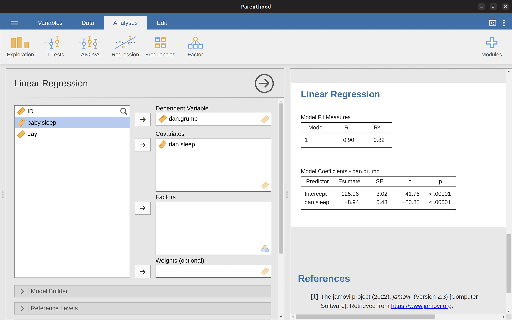
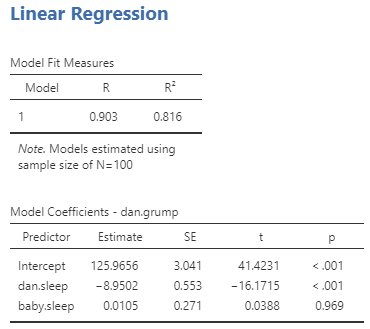

<!-- \placetextbox{0.26}{0.06}{\scriptsize{©2025 D.R. Foxcroft and D.J. Navarro,}} -->
<!-- \placetextbox{0.195}{0.05}{\scriptsize{CC BY-SA 4.0}} -->
<!-- \placetextbox{0.70}{0.06}{\scriptsize{\url{https://doi.org/10.11647/OBP.0333.12}}} -->

# Lineær regresjon {#sec-correlation}

```{r}
#| include: FALSE
source("chapter_header.R")
```

::: {.callout-warning}
Heller ikke i dette kapittelet har jeg ikke rukket å gjøre eksemplene relevante for utdanningsvitenskap. Det er mye arbeid å finne relevante datasett fra utdanningsvitenskap og forklare analysene ved hjelp av dem, og det rakk jeg ikke før semesterstart for dette kapittelet. Derfor er eksempelet hentet fra originalboka @navarro2025, og er nok oppkonstruert.
:::

I @sec-associations lærte du om korrelasjon, som beskriver styrken og retningen på sammenhengen mellom to kontinuerlige variable. I dette kapittelet tar vi steget videre med **lineær regresjon**, som lar oss beskrive sammenhengen med en linje og bruke den til å predikere verdier.

## Enkel lineær regresjon {#sec-regression}

Lineær regresjon kan ses på som en mer avansert og kraftfull versjon av Pearsons korrelasjon, som vi så på i @sec-associations. For å illustrere dette bruker vi datasettet *[parenthood.csv](data_and_tables/parenthood.csv)*. Datasettet er fiktivt, men inspirert av ekte småbarnsliv: Danielle, en småbarnsforelder, har samlet inn data om sin egen søvn og sitt eget humør over 100 dager. Hver dag har hun registrert hvor mange timer hun sov og vurdert sin egen grettenhet på en skala fra 0 (blid som en sol) til 100 (ekstremt gretten). Sammenhengen mellom de to viser seg å være en sterk negativ korrelasjon på $r = -0{,}90$.

Når vi ser på et slikt plott, er det naturlig å forestille seg en rett linje som går gjennom midten av datapunktene, slik som i @fig-fig12-11(a). I statistikken kalles en slik linje for en **regresjonslinje**. Intuisjonen vår forteller oss at linjen bør følge trenden i dataene. Vi ville neppe tegnet en linje som den i @fig-fig12-11(b), som åpenbart ikke passer til punktene i det hele tatt.

```{r}
#| label: fig-fig12-11
#| fig-cap: Panel (a) viser spredningsplottet for søvn--grettenhet med den best tilpassede regresjonslinjen tegnet inn. Ikke overraskende går linjen gjennom midten av dataene. Panel (b) de samme dataene, men med et svært dårlig valg av regresjonslinje.
#| fig-alt: To spredningsplott sammenligner tilpasningen av regresjonslinjer for sammenhengen mellom antall søvntimer og grettenhet. Det venstre plottet viser en sterk negativ korrelasjon med en bratt regresjonslinje; det høyre plottet viser en svakere tilpasning og en flatere regresjonslinje.
#| out-width: "100%"
#| fig-width: 8.571429
#| fig-pos: 'H'

load("data_and_tables/parenthood.Rdata")

p1 <- ggplot(parenthood, aes(dan.sleep, dan.grump)) +
  geom_point(col = "darkgrey", size = 0.8) +
  geom_smooth(method = 'lm', se = F, col = blueshade, linewidth = 0.5) +
  ggtitle("Den best tilpassede\nregresjonslinja") +
  xlab("My sleep (hours)\n\n(a)") +
  ylab("My grumpiness (0-100)\n") +
  theme(
    plot.title = element_text(), #size = 8),
    axis.title = element_text(), #size = 7),
    axis.text = element_text(), #size = 6),
    axis.line = element_line(size = 0.2),
    axis.ticks = element_line(size = 0.2)
  )

p2 <- ggplot(parenthood, aes(dan.sleep, dan.grump)) +
  geom_point(col = "darkgrey", size = 0.8) +
  geom_abline(intercept = 80, slope = -3, col = blueshade, linewidth = 0.5) +
  ggtitle("En dårlig tilpasset\nregresjonslinje") +
  xlab("Danielles søvn (timer)\n\n(b)") +
  ylab("Danielles grettenhet (0-100)\n") +
  theme(
    plot.title = element_text(), #size = 8),
    axis.title = element_text(), #size = 7),
    axis.text = element_text(), #size = 6),
    axis.line = element_line(size = 0.2),
    axis.ticks = element_line(size = 0.2)
  )

gridExtra::grid.arrange(p1, p2, ncol = 2)

```


Dette virker nok helt logisk. Linjen i @fig-fig12-11(b) passer rett og slett dårlig, så det gir liten mening å bruke den til å oppsummere dataene. Denne enkle observasjonen -- at noen linjer passer bedre enn andre -- er faktisk utrolig kraftfull når vi formaliserer den med matematikk.

For å komme dit, starter vi med en rask repetisjon fra matematikktimene på ungdomsskolen og videregående. Formelen for en rett linje skrives vanligvis slik:

$$y=ax + b$$

De to variablene er $x$ og $y$, og vi har to koeffisienter, $a$ og $b$. Koeffisienten $b$ representerer konstantleddet, altså skjæringspunktet med $y$-aksen, og koeffisient $a$ representerer stigningstallet til linjen. Konstantleddet tolkes som "verdien av $y$ når $x = 0$". Tilsvarende betyr et stigningstall på $a$ at hvis du øker $x$-verdien med 1 enhet, øker $y$-verdien med $a$ enheter. Et negativt stigningstall betyr at $y$-verdien vil synke.

Siden likningen $y = ax + b$ kan beskrive alle rette linjer, bruker vi nøyaktig samme formel for en regresjonslinje. Det store spørsmålet er hvordan man kommer frem til den riktige regresjonslinja. Vi skal ikke lære å regne den ut, men vi skal lære prinsippet som ligger bak.

Prinsippet bygger på på avviket mellom linja og datapunktene, se @fig-fig12-12. Ser du at regresjonslinja ikke går gjennom de riktige $y$-verdiene, men at den bommer på alle punktene? Hvor mye linja bomma med har vi markert med mange grå linjer; hvis de grå linjene er lange, bomma regresjonslinja grovt, og hvis den er kort, bomma regresjonslinja lite. Lengden på de grå linjene markerer altså avviket mellom den $y$-verdien vi observerte og den $y$-verdien som regresjonslinja predikerer. Dette kalles *residualet*. Nå kan vi uttrykke prinsippet for hvordan man finner regresjonslinja: man finner den linja som totalt sett gir minst residualer. Og siden statistikere ser ut til å like å opphøye alt mulig i andre, av svært gode grunner, så blir definisjonen av regresjonslinja som følger:

> Regresjonslinja $y = ax + b$ har verdier for $a$ og $b$ slik at kvadratet av residualene blir minst mulig.

Dette betyr at linja i @fig-fig12-12 a) er regresjonslinja fordi residualene, de små grå linjene, er på sitt minste. Uansett hvilken annen linje du hadde valgt ville kvadratet av residualene vært større.

```{r}
#| label: fig-fig12-12
#| fig-cap: En illustrasjon av residualene til den best tilpassede regresjonslinjen (panel a), og residualene til en dårlig regresjonslinje (panel b). Residualene er mye mindre for den gode regresjonslinjen. Dette er igjen ingen overraskelse, gitt at den gode linja er den som går midt gjennom dataene.
#| fig-alt: To spredningsplott side om side, begge viser "Grettenhet vs. Søvn". Timer søvn (x-akse) fra 0 til 9 og grettenhet (y-akse) fra 0 til 100. Hvert plott har en blå regresjonslinje som viser en negativ korrelasjon.
#| out-width: "100%"
#| fig-width: 8.571429
#| fig-pos: 'H'

load("data_and_tables/parenthood.Rdata")
fit <- lm(data = parenthood, dan.grump ~ dan.sleep)
parenthood$predicted <- stats::predict(fit)
parenthood$residuals <- stats::residuals(fit)
parenthood <- parenthood |>
  dplyr::select(dan.grump, dan.sleep, predicted, residuals)
mydat <- parenthood |>
  tidyr::gather(key = "grp", value = "x", -1, -predicted, -residuals)

p1 <- ggplot(mydat, aes(x = x, y = dan.grump)) +
  stat_smooth(method = "lm", colour = blueshade, se = F, size = 0.5) +
  geom_segment(
    aes(xend = x, yend = predicted),
    colour = "grey50",
    alpha = .7,
    size = 0.3
  ) +
  geom_point(aes(fill = residuals), colour = "grey50", size = 0.8) +
  ggtitle("Den best tilpassede\nregresjonslinja") +
  xlab("Danielles søvn (timer)\n\n(a)") +
  ylab("Danielles grettenhet (0-100)\n") +
  guides(fill = "none") +
  theme(
    plot.title = element_text(),
    axis.title = element_text(),
    axis.text = element_text(),
    axis.line = element_line(size = 0.2),
    axis.ticks = element_line(size = 0.2)
  )

parenthood$predicted <- with(parenthood, predicted <- 80 + -3 * dan.sleep)
parenthood$residuals <- with(parenthood, residuals <- dan.sleep - predicted)
parenthood <- parenthood |>
  dplyr::select(dan.grump, dan.sleep, predicted, residuals)
mydat <- parenthood |>
  tidyr::gather(key = "grp", value = "x", -1, -predicted, -residuals)

p2 <- ggplot(mydat, aes(x = x, y = dan.grump)) +
  geom_abline(intercept = 80, slope = -3, col = blueshade, linewidth = 0.5) +
  geom_segment(
    aes(xend = x, yend = predicted),
    colour = "grey50",
    alpha = .7,
    size = 0.3
  ) +
  geom_point(aes(fill = residuals), colour = "grey50", size = 0.8) +
  ggtitle("En dårlig tilpasset\nregresjonslinje") +
  xlab("Danielles søvn (timer)\n\n(a)") +
  ylab("Min grettenhet (0-100)\n") +
  guides(fill = "none") +
  theme(
    plot.title = element_text(),
    axis.title = element_text(),
    axis.text = element_text(),
    axis.line = element_line(size = 0.2),
    axis.ticks = element_line(size = 0.2)
  )

gridExtra::grid.arrange(p1, p2, ncol = 2)

```

### Lineær regresjon i jamovi

La oss utføre en enkel lineær regresjonsanalyse! For å gjøre dette, åpner du 'Regression' → 'Linear Regression'-analysen i jamovi, ved å bruke datafilen *[parenthood.csv](data_and_tables/parenthood.csv)*. Her spesifiserer du `dani.grump` som 'Dependent Variable' (avhengig variabel) og `dani.sleep` som 'Covariates'. En "covariate" er bare et annet ord for uavhengig variabel.^[Hmm, jeg glemte av "kovariat" som et annet ord for uavhengig variabel i @tbl-design-var-names. La oss ikke skrive det inn for å ikke overlesse leseren! 🤷]

Dette gir resultatene vist i @fig-fig12-13. Vi ser vi har funnet et konstantledd ("intercept") $b = 125{,}96$ og et stigningstall $a = -8{,}94$. Med andre ord, den best tilpassede regresjonslinjen vi plottet i @fig-fig12-12 kan uttrykkes med denne formelen:

$$ y = 125{,}96 -8{,}94 x$$

Hvis man vil uttrykke det mer folkelig, kan man skrive:

$$ \text{grettenhet} = 125{,}96 - 8{,}94 \cdot \text{timer søvn} $$

```{r}
#| label: fig-fig12-13
#| out-width: "100%"
#| fig-cap: Et jamovi-skjermbilde som viser en enkel lineær regresjonsanalyse
#| fig-alt: Et jamovi-skjermbilde som viser grensesnittet for å utføre lineær regresjonsanalyse. Grensesnittet inneholder seksjoner for valg av variabler, innstilling av kovariater og faktorer, og visning av resultater som mål på modelltilpasning og koeffisienter.

```

Det er noen tall til vi bør være oppmerksomme på, nemlig de som står øverst og som beskriver "Model Fit Measures", altså mål på hvor godt denne modellen passer med dataene. Mer om disse i i neste delkapittel.

### Å tolke resultatene fra regresjonen

Nå skal vi se på hvordan vi tolker disse koeffisientene -- dette er en viktig del av analysen!

La oss begynne med $a$, altså stigningstallet. Som vi husker fra definisjonen, betyr en regresjonskoeffisient på $a = -8{,}94$ at for hver enhets økning i $X$ (den uavhengige variabelen), forventer vi en reduksjon på $8{,}94$ i $Y$ (den avhengige variabelen). Overført til vårt eksempel betyr dette at for hver ekstra time søvn (`dani.sleep`) vi får, vil grettenheten (`dani.grump`) reduseres med $8{,}94$ poeng. Det høres jo ut som en god ting for humøret!

Men hva med konstantleddet, $b = 125{,}96$? Siden $b$ representerer den forventede verdien av $y$ når $x$ er lik 0, er tolkningen ganske enkel. I vårt tilfelle betyr dette at hvis vi får null timer søvn ($X = 0$), forventes grettenheten å være hele $125{,}96$ poeng ($y = 125{,}96$). Dette er en ganske ekstrem verdi og understreker viktigheten av å få nok søvn -– best å unngå null timer, for humørets skyld! Mer seriøst understreker det at man i ikke bør spå verdier langt utenfor der man har data. Siden den minste verdien for $x$ var 5, så da bør man ikke tolke konstantleddet, siden det tilsvarer $x = 0$.

Merk at jamovi også spytter ut en standardfeil (SE, "standard error"), en $t$-verdi og en $p$-verdi. Disse verdiene antar at datapunktene er hentet med enkelt tilfeldig utvalg fra en eller annen populasjon, og at man bruker dataene til å regne ut populasjonsparametre.

Våre data er ikke trukket enkelt tilfeldig, men er Danielles 100 første netter med spedbarnet sitt. For å avgjøre om testen jamovi spytter ut har noen mening bør vi vurdere om dette vil være "likt" et enkelt tilfeldig utvalg fra en eller annen populasjon. For meg høres det OK ut å si at disse 100 nettene er omtrent tilfeldig trukket fra "alle netter Danielle kommer til å ha med et spedbarn". I så fall betyr $\text{SE} = 0{,}43$ at standardavviket til utvalgsfordelingen til $a$ er $0{,}43$, og at $a$ er signifikant forskjellig fra null ($t = -20{,}85, p < 0{,}00001$). Dette er altså utsagn om populasjonen; hvis det i populasjonen "alle Danielles netter med spedbarn" er slik at $a = 0$ er det ekstremt lite sannsynlig å observere utvalget i våre data.

Du kan tilfreds legge merke til at denne testen også har $t$ som testobservator, så forståelsen av $t$-verdier du bygde fra @sec-means kan brukes flere steder.

Siden konstantleddet ikke burde tolkes så nøye i dette tilfellet unnlater jeg å tolke dets tester.

At vi har funnet en regresjonslinje betyr ikke at regresjonslinja passer godt til dataene. Det kan være observasjonene ligger tett rundt regresjonslinja, slik at den predikerer verdiene godt, eller det kan være observasjonene ligger langt unna regresjonslinja, slik at den predikerer dårlig. Vi trenger altså et mål på hvor tett rundt regresjonslinja punktene ligger. Heldigvis har vi det fra før av, det var det vi kalte (Pearsons) korrelasjon, $r$, se @sec-associations-correlation-coefficient.

Når jamovi viser tallet $R$ under "Model Fit Measures", så er dette ingenting annet enn korrelasjonen. Vel, nesten. $R$ vil alltid være en positiv verdi, siden regresjonslinja passer like godt til dataene uansett om korrelasjonen er $+0{,}9$ eller $-0{,}9$. Det andre tallet, $R^2 = 0{,}816$, er bare kvadratet av $R$. Sukk, enda en kvadrering? Også denne kvadreringen er godt begrunnet, for $R^2$ har en veldig tilfredsstillende tolkning: den angir hvor stor andel av variansen i den avhengige variabelen som blir forklart av den uavhengige variabelen. I dette tilfellet: siden $R^2 = 0{,}816$, så blir 81,6% av variasjonen i Danielles grettenhet forklart av Danielles søvn. 

## Multippel lineær regresjon

Til nå har vi sett på den enkle lineære regresjonsmodellen, som typisk fokuserer på én enkelt prediktorvariabel -- som i vårt eksempel var `dani.sleep`. Mange av de statistiske verktøyene vi har utforsket har antatt at du arbeider med én prediktor og én utfallsvariabel. Men i den virkelige verden er det sjelden så enkelt! Ofte har du flere faktorer som kan påvirke utfallet du studerer.

Heldigvis kan vi enkelt utvide den lineære regresjonen til å inkludere flere prediktorer. Dette er nettopp det **multippel regresjon** handler om! Konseptuelt er multippel regresjon overraskende enkelt. Alt vi gjør er å legge til flere ledd i regresjonsligningen vår. I stedet for $y = ax + b$ der $x$ er den eneste prediktoren, så kan man for eksempes inkludere tre prediktorer $x_1, x_2$ og $x_3$ slik:
$$y = ax_1 + bx_2 + cx_3 + d$$

La oss si at vi ønsker å forstå grettenheten min (`dani.grump`) bedre. Tidligere så vi kun på min egen søvn (`dani.sleep`), men hva om sønnen min sin søvn (`baby.sleep`) også spiller en rolle? Hvis vi utfører en slik regresjon vil man ha ett stigningstall for `dani.sleep` og ett stigningstall for `baby.sleep`. Gir ikke det mening? Hvis Danielle sover dårlig, men babyen sover godt, vil ikke Danielle være like gretten som om begge sov dårlig. Derfor ønsker vi å bruke både `dani.sleep` *og* `baby.sleep` for å predikere Danielles grettenhet.

### Multippel lineær regresjon i jamovi {#sec-correlation-multiple}

Multippel regresjon i jamovi er ikke annerledes enn enkel regresjon. Alt vi trenger å gjøre er å legge til flere variabler i 'Covariates'-boksen i jamovi. For eksempel, hvis vi ønsker å bruke både `dani.sleep` og `baby.sleep` som prediktorer i vårt forsøk på å forklare hvorfor jeg er så gretten, så flytter vi `baby.sleep` over til 'Covariates'-boksen sammen med `dani.sleep`. Som standard antar jamovi at modellen skal inkludere et konstantledd. Resultatene viser vi i @fig-correlation-jamovi-multiple.

```{r}
#| label: fig-correlation-jamovi-multiple
#| tbl-cap: Å legge til flere variabler som prediktorer i en regresjon i jamovi gir en multippel regresjon


```

Stigningstallet knyttet til `dani.sleep` er ganske stor, $-8{,}9502$, noe som antyder at hver time jeg mister søvn gjør meg ordentlig gretten. Koeffisienten for `baby.sleep` er imidlertid veldig liten, noe som indikerer at det egentlig ikke spiller noen rolle for Danielle hvor mye søvn sønn hennes får. Hvis vi ser på den øverste tabellen, som viser hvor godt regresjonslinja passer til dataene, så ser vi at $R^2$ fremdeles er 0,816%, så regresjonsmodellen som inkluderer babyens søvn forklarte dessverre ikke noe mer av variasjonen i Danielles grettenhet.

Det var det! Multippel lineær regresjon er blant de virkelig store arbeidshestene i statistikken og passer i svært mange ulike sammenhenger. 

## Sammendrag

I dette kapittelet har vi dekket følgende:

-   Noen grunnleggende ideer om hva en lineær regresjonsmodell er.
-   Hvordan man utfører regresjonen i jamovi og tolker resultatet.
-   Hvordan man utvider modellen til en multippel lineær regresjon.
-   Hvordan man tallfester hvor godt regresjonsmodellen passer ved hjelp av $R^2$.
