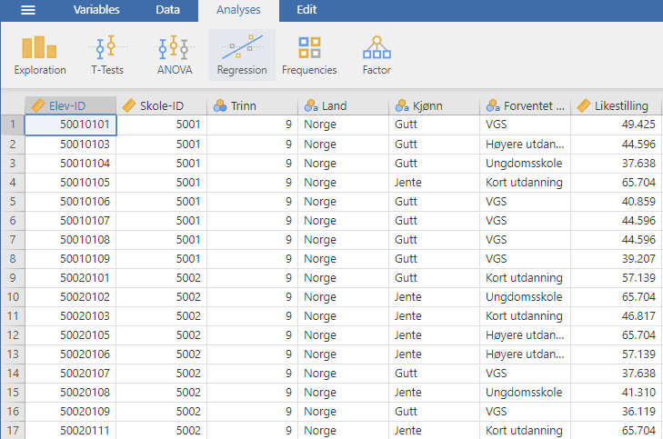
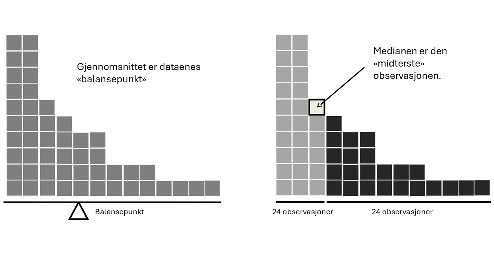
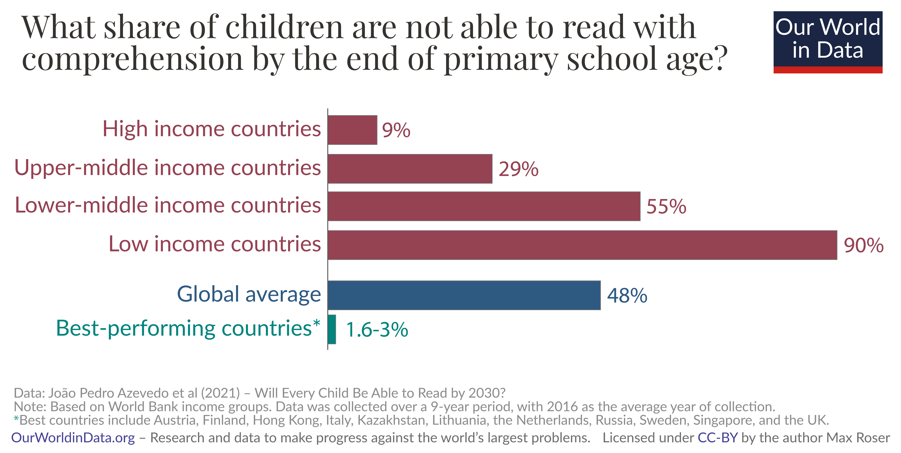
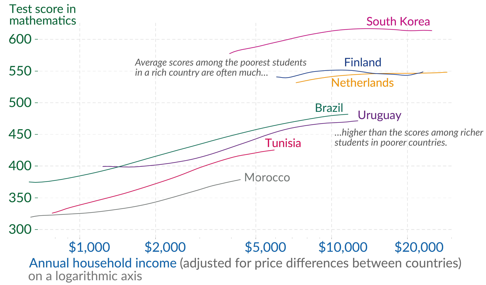

<!-- \placetextbox{0.26}{0.06}{\scriptsize{©2025 D.R. Foxcroft and D.J. Navarro,}} -->
<!-- \placetextbox{0.195}{0.05}{\scriptsize{CC BY-SA 4.0}} -->
<!-- \placetextbox{0.70}{0.06}{\scriptsize{\url{https://doi.org/10.11647/OBP.0333.04}}} -->

# Å beskrive én variabel {#sec-descriptive}

```{r}
#| include: FALSE
source("chapter_header.R")
```

Når du skal analysere et nytt datasett, må du finne måter å beskrive dataene på som er både konsise og lett forståelige. Dette kalles **deskriptiv statistikk**, eller beskrivende statistikk. I denne boka er det to kapitler om deskriptiv statistikk, dette kapittelet og det neste. I dette kapittelet beskriver vi én variabel, og i neste kapittel beskriver vi sammenhengen mellom flere variabler.

Man kan dele deskriptiv statistikk inn i to hovedformer:

- Man kan bruke tall for å beskrive dataene, for eksempel utregning av gjennomsnittet av en variabel.
- Man kan lage et diagram som viser dataene, for eksempel et søylediagram. Diagrammer kalles også figurer og plott.

I de neste to kapitlene lærer du om vanlige tall og diagrammer som man bruker for å beskrive data.


::: {.callout-warning}

## Ikke tenk at du beskriver populasjonen

Merk deg at deskriptiv statistikk kun beskriver de dataene som er samlet inn, altså utvalget. Ofte ønsker man å generalisere til en populasjon, men da må man bruke inferensiell statistikk, noe du lærer i @sec-inferential. 
:::

```{r}
ICCS <- readRDS("data_and_tables/ICCS.RDS")

n_elever <- nrow(ICCS)
```

Rå data er sjelden informative i seg selv. Jeg har forberedt et lite datasett fra den store internasjonale undersøkelsen ICCS, International Civic and Citizenship Education Study [@fraillon2024]. Dette datasettet inneholder variabler for kjønn, skole, land, forventet høyeste fullførte utdanning og en samlevariabel for hvor enig man er i at kjønnene bør ha like rettigheter. Datasettet har `r n_elever` rader, én rad for hver elev, men vi viser bare 50 rader. Se i @tbl-ICCS-data for å vurdere hvor informative disse dataene er.

```{r}
#| label: tbl-ICCS-data
#| tbl-cap: Utvalgte variabler fra ICCS-studien.
set.seed(1234)
utvalg <- ICCS |>
  slice_sample(n = 50)
utvalg |>
  select(`Skole-ID`, Land, Kjønn, `Forventet utdanning`, Likestilling) |>
  tt() |>
  format_tt(j = "Likestilling", digits = 1, num_fmt = "decimal") |>
  theme_tt("spacing") |>
  style_tt(i = 0, bold = TRUE)
```

Gir denne tabellen deg egentlig noen klar forståelse av mønstre i dataene, for eksempel forskjeller mellom grupper, typiske verdier eller sammenhenger mellom variabler? Sannsynligvis ikke. De fleste vil oppleve at det er vanskelig å få øye på slike trekk direkte i rådataene, og at man trenger at dataene blir oppsummert og fremstilt på en mer oversiktlig måte.

Det er dette som er deskriptiv statistikk, å gjøre rå data om til tall og figurer som gir innsikt.

I dag gjør man all statistikk på en datamaskin, så la oss vise dataene i statistikkprogrammet, jamovi. Etter å ha åpnet filen *[ICCS.omv](data_and_tables/ICCS.omv)* ser det ut som i @fig-descriptive-ICCS-data.

```{r}
#| label: fig-descriptive-ICCS-data
#| fig-cap: Et skjermbilde av jamovi som viser variablene lagret i filen *ICCS.omv*
#| fig-alt: Et jamovi-skjermbilde viser et dataanalysegrensesnitt med 7 kolonner. Én kolonne med numeriske data er merket "likestilling".
#| out-width: "100%"

```

For å få en nærmere forståelse av dataene må vi beskrive dem med tall og figurer. Vi organiserer framstillingen etter typen variabel vi analyserer. Først presenteres kategoriske variabler (nominelle og ordinale), og deretter kontinuerlige variabler (intervall- og forholdstallsnivå). De kategoriske variablene er markert med et symbol med tre fargede sirkler i jamovi, og er altså _Land_, _Trinn_, _Kjønn_ og _Forventet utdanning_.

## Kategoriske variabler

Hvis du ser på variabelen *Forventet utdanning* i @fig-descriptive-ICCS-data, vil du se at den har verdiene "Høyere utdanning", "Kort utdanning", "VGS" og "Ungdomsskole". Denne variabelen viser hva elevene ser for seg at de har som høyeste utdanning når de er ferdige med studiene. Hvordan ville du analysert denne variabelen? Sannsynligvis på de to måtene du skal lære nå.

### Frekvenstabeller

En av de mest grunnleggende oppgavene innen dataanalyse er å telle antall observasjoner for de ulike verdiene til nominelle og ordinale variabler. For variabelen *Forventet utdanning* vil det si å telle hvor mange som ser for seg å ta høyere utdanning, en kort utdanning, kun VGS eller kanskje stoppe etter ungdomsskolen. Siden et slikt antall kalles en *frekvens*, kalles tabellen der man viser opptellingen for en **frekvenstabell**.

Frekvenstabellen vises i @tbl-descriptive-frequency.

::: {.callout-tip collapse="true" title="I jamovi: lage en frekvenstabell"}
Analyses → Exploration → Descriptives. Legg _Forventet utdanning_ i "Variables" og kryss av for "Frequency tables".
:::

```{r}
#| label: tbl-descriptive-frequency
#| tbl-cap: Frekvenstabell for _Forventet utdanning_

ICCS |>
  dplyr::filter(!is.na(`Forventet utdanning`)) |>
  dplyr::count(`Forventet utdanning`, name = "Antall") |>
  dplyr::mutate(
    Prosent = Antall / sum(Antall) * 100
  ) |>
  tt() |>
  format_tt(j = "Prosent", digits = 1, num_fmt = "decimal") |>
  theme_tt("spacing") |>
  style_tt(i = 0, bold = TRUE)
```

```{r}
andel_ingen_utdanning <- ICCS |>
  dplyr::filter(!is.na(`Forventet utdanning`)) |>
  dplyr::summarise(p = mean(`Forventet utdanning` %in% c("Ungdomsskole", "VGS")) * 100) |>
  dplyr::pull(p) |>
  round(1)
```

Tabellen viser en opptelling av _Forventet utdanning_. Radene svarer til de ulike verdiene, og i _Antall_-kolonnen finner du hvor mange det var av hver verdi, altså frekvensen. I tillegg viser kolonnen _Prosent_ hvor stor andel av totalen hvert antall utgjør. Legger vi sammen prosentene for de to laveste verdiene, ser vi at `r andel_ingen_utdanning` % av elevene ser for seg "Ungdomsskole" eller "VGS" som høyeste fullførte utdanning.

Stort mer er det ikke å si om frekvenstabeller, annet enn hvordan man lager et diagram for å vise det samme.

### Stolpediagram {#sec-diagram-bar}

Frekvenstabeller er enkle å lage og lese, men ofte er en visualisering enda mer slående. For nominelle og ordinale data er **stolpediagrammet** den vanligste visualiseringen. Et stolpediagram for _Forventet utdanning_ vises i @fig-diagram-jamovi-bar. Siden _Forventet utdanning_ er en ordinal variabel, er stolpene sortert i riktig rekkefølge.

::: {.callout-tip collapse="true" title="I jamovi: lage et stolpediagram"}
Analyses → Exploration → Descriptives. Legg variabelen i "Variables", åpne "Plots" og kryss av for "Bar plot".
:::

```{r}
#| label: fig-diagram-jamovi-bar
#| fig-cap: Et stolpediagram over _Forventet utdanning_. Venstre y-akse viser antall elever, høyre y-akse viser samme stolper avlest som andel i prosent.
#| fig-alt: Et stolpediagram med fire blå stolper for hver verdi av Forventet utdanning. Venstre y-akse er merket Antall og viser antall elever; høyre y-akse er merket Prosent og viser samme informasjon som andel i prosent.

source("R/jamovi-bar.R")
ICCS |>
  jamovi_bar(`Forventet utdanning`, dual_axis = TRUE) +
  scale_x_discrete(labels = scales::label_wrap(10))
```

Man kan velge om stolpediagrammet skal vise antall eller prosent. I @fig-diagram-jamovi-bar har jeg laget to y-akser for å vise begge. Venstre viser antall elever, altså frekvensen fra _Antall_-kolonnen i frekvenstabellen. Høyre akse viser nøyaktig de samme stolpene, men avlest som andel i prosent, de samme tallene som står i _Prosent_-kolonnen i @tbl-descriptive-frequency.

Hvorfor vise begge? For én variabel er det egentlig samme bilde, bare lest på to måter. Disse to lesemåtene blir imidlertid viktige når vi senere skal sammenligne grupper av ulik størrelse. Antallet kan da være misvisende: Gruppen med flest elever vil få høyest stolpe nesten uansett hva andelene er. Andelene gjør stolpene sammenliknbare på tvers av grupper og datasett av ulik størrelse, og det er som regel det vi er ute etter. Vi viser slike analyser i neste kapittel, i @sec-associations-stacked-bar.

::: {.callout-tip collapse="true" title="I jamovi: stolpediagram med y-aksen i prosent"}
Descriptives gir kun y-aksen i antall. For prosent-aksen: Analyses → Frequencies → N Outcomes -- $\chi^2$ goodness of fit. Legg variabelen i "Variable", åpne "Plots", kryss av for "Bar plot" og velg "Y-axis: Percentages". Jamovi viser én akse av gangen, ikke begge samtidig.
:::

### Typetallet {#sec-mode}

```{r}
forste_elever <- head(utvalg, 7)
kjonn <- forste_elever |>
  dplyr::pull(`Kjønn`)
typetall_kjonn_smaa <- names(which.max(table(droplevels(kjonn))))
typetall_kjonn_full <- names(which.max(table(droplevels(ICCS$`Kjønn`))))
```

Typetallet til en variabel er den verdien som forekommer hyppigst. Typetallet er det eneste sentraltendensmålet som fungerer for nominelle variabler; hverken median eller gjennomsnitt gir mening når verdiene ikke har noen naturlig rekkefølge eller tallverdi. En nominell variabel i ICCS-dataene er _Kjønn_, som har de tre mulige verdiene "Jente", "Gutt" og "Annet". Typetallet til _Kjønn_ vil si oss hvilket kjønn det er flest av i dataene. De syv første elevene i datasettet er:

> `r kjonn`.

Typetallet til _Kjønn_ for disse syv elevene er "`r typetall_kjonn_smaa`" fordi det var flest av den verdien.

For å finne typetallet i hele datasettet lager vi en **frekvenstabell** for _Kjønn_ på samme måte som vi gjorde for _Forventet utdanning_ tidligere i kapittelet. Frekvenstabellen, @tbl-descriptive-frequency-kjonn, viser at "`r typetall_kjonn_full`" er den hyppigste verdien, dog med knapp margin, så typetallet til _Kjønn_ er "`r typetall_kjonn_full`".

```{r}
#| label: tbl-descriptive-frequency-kjonn
#| tbl-cap: Frekvenstabell for _Kjønn_

ICCS |>
  dplyr::filter(!is.na(`Kjønn`)) |>
  dplyr::count(`Kjønn`, name = "Antall") |>
  dplyr::mutate(
    Prosent = Antall / sum(Antall) * 100
  ) |>
  tt() |>
  format_tt(j = "Prosent", digits = 1, num_fmt = "decimal") |>
  theme_tt("spacing") |>
  style_tt(i = 0, bold = TRUE)
```

Selv om typetallet er det eneste sentraltendensmålet som fungerer for nominelle variabler, kan det også være nyttig å vite typetallet til en ordinal-, intervall- eller forholdstallsvariabel. Hvis vi ser tilbake på frekvenstabellen for _Forventet utdanning_ i @tbl-descriptive-frequency, så var "Høyere utdanning" den hyppigste verdien. Typetallet til _Forventet utdanning_ er altså "Høyere utdanning".

### Medianen for ordinale data {#sec-descriptive-median-ordinal}

```{r}
forventet_utdanning <- forste_elever |>
  dplyr::pull(`Forventet utdanning`)
n_smaa <- length(forventet_utdanning)
midten <- (n_smaa + 1) / 2
```

For ordinale data kan vi i tillegg bruke **medianen** som mål på sentraltendens. Medianen er den midterste verdien når observasjonene er sortert i rekkefølge. Den fungerer når verdiene har en naturlig rekkefølge, selv uten tallverdier.

La oss se på _Forventet utdanning_ for de `r n_smaa` første elevene i utvalget:

> `r forventet_utdanning`.

Sorterer vi dem i rekkefølge får vi:

> `r sort(forventet_utdanning)`.

Middelverdien er "`r sort(forventet_utdanning)[midten]`", og det er altså medianen til _Forventet utdanning_ for disse `r n_smaa` elevene.

For tallvariabler regner vi medianen på akkurat samme måte: Sorter, og finn middelverdien. Av og til er det ingen verdier helt i midten, slik som her:

> 1, 3, 5, 6, 10, 15

Her er både 5 og 6 like nære midten. Da er medianen definert til å være gjennomsnittet av disse to verdiene, altså 5,5. For ordinale variabler går ikke dette, siden verdiene ikke kan legges sammen; er de to midterste verdiene forskjellige, oppgir man dem derfor gjerne begge som median.

Vi kommer tilbake til medianen i @sec-descriptive-mean-or-median, der vi ser hvordan den står seg mot gjennomsnittet.

## Tallvariabler

Nå beveger vi oss over til tallvariabler, altså data på intervall- eller forholdstallsnivå. I resten av kapittelet skal vi fokusere på variabelen _Likestilling_ fra ICCS-dataene. Som du kanskje oppfattet fra @sec-measurement bør man først spørre seg hva variabelen egentlig måler. Dette er viktig nok til at vi bruker litt tid på det.

Jeg fant frem i dokumentasjonen til ICCS 2022 [@fraillon2024] at _Likestilling_ er en samlevariabel satt sammen av følgende Likert-påstander (se @sec-measurement):

- Men and women should have equal opportunities to take part in government.
- Men and women should have the same rights in every way.
- Women should stay out of politics.
- When there are not many jobs available, men should have more right to a job than women.
- Men and women should get equal pay when they are doing the same jobs.
- Men are better qualified to be political leaders than women.

Alle påstandene ser jo ut til å måle likestilling på en relevant måte, men i Norge kan operasjonaliseringen kanskje virke litt tam, siden nesten alle norske elever støtter likestilling mellom kjønnene. For norske elever ville man kanskje valgt påstander som det faktisk er uenighet om. En mer relevant vinkling kunne være holdninger til likestilling i idrett: er det rettferdig at mannlige fotballspillere tjener mye mer og har bedre betingelser enn kvinnelige spillere, eller er forskjeller mellom kvinner og menn i idretter som skihopp akseptable? Slike påstander ligger nærmere ungdomsskoleelevenes egen erfaring og er lettere å være uenige i. Men nasjonalt tilpassede påstander som dette ville neppe passet like godt i alle de andre landene der ICCS gjennomføres.

Den verdien eleven får på variabelen _Likestilling_ gir altså bare mening i lys av disse påstandene. Hadde påstandene vært annerledes, hadde verdien vært en annen og kanskje fortalt en annen historie. I tillegg regner ICCS om elevenes svar på disse påstandene til en samlevariabel. Den går fra ca. 15 (svært imot likestilling mellom kjønnene) til ca. 67 (svært for). Hvis du er interessert i å vite hvordan ICCS gjør denne omregningen, er det bare å slå opp i dokumentasjonen, men det trenger vi ikke for denne boka.

Nå skal vi beskrive denne variabelen ved hjelp av deskriptiv statistikk, og vi starter med histogrammer.

### Histogrammer {#sec-histogram}

**Histogrammer** er blant de mest grunnleggende og nyttige måtene å visualisere data på. De fungerer for tallvariabler, altså variabler på intervall- eller forholdstallsnivå, og gir et tydelig inntrykk av hvordan tallene fordeler seg. De fleste kjenner nok til histogrammer, siden de brukes så ofte, men jeg vil likevel forklare kort hvordan de fungerer.

Prinsippet er enkelt: Du deler opp de mulige verdiene i intervaller og teller hvor mange observasjoner som faller innenfor hvert intervall. Denne tellingen kalles frekvensen til intervallet og vises som en vertikal stolpe. Jeg tror noe av grunnen til at de oppfattes som så enkle, er at de minner om stolpediagrammer. Forskjellen på histogram og stolpediagram er at histogrammet brukes for tallvariabler og viser fordelingen med sammenhengende stolper, mens stolpediagrammet brukes for kategoriske variabler og viser kategorier med adskilte stolper. @fig-diagram-ICCS-histogram viser et histogram av _Likestilling_ for alle elevene i datasettet, altså elever fra Norge, Spania, Polen og Brasil. Vi ser at de fleste elevene skårer høyt på variabelen, men at en betydelig andel svarer mye lavere. Stolpen helt til høyre representerer de elevene som fikk høyest skår, og høyden på stolpen viser at det er rundt 6000 av dem. Antallet elever leser du av på $y$-aksen, mens selve skåren står på $x$-aksen.

```{r}
#| label: fig-diagram-ICCS-histogram
#| fig-cap: Et histogram av variabelen _Likestilling_ fra ICCS 2022.
#| fig-alt: Histogram som viser variabelen _Likestilling_. Den horisontale aksen (x-aksen) strekker seg fra fra 15 til 70, og den vertikale aksen (y-aksen) viser tetthet, altså hvor mange svar som havner innad i hver søyle.

source("R/jamovi-histogram.R")
ICCS |>
  jamovi_histogram(Likestilling, 16)
```

::: {.callout-tip collapse="true" title="I jamovi: lage et histogram"}
Analyses → Exploration → Descriptives. Legg variabelen i "Variables", åpne "Plots" og kryss av for "Histogram".
:::

Problemet med histogrammer er at utseende deres er veldig avhengig av hvor mange stolper man lager. I @fig-diagram-histogram-bins ser vi den samme variabelen med litt forskjellig valg av antall stolper. De blir seende helt forskjellige ut.

```{r}
#| label: fig-diagram-histogram-bins
#| fig-cap: Variabelen _Likestilling_ framstilt med ulikt antall stolper.
#| classes: .enlarge-image
#| out-width: 100%
#| fig-width: 8.571429

bins <-  c(5, 10, 20, 50)

p <- lapply(
  bins,
  function(bins){
    ICCS |>
      jamovi_histogram(Likestilling, bins = bins) +
      labs(title = paste("Antall stolper:",bins))
  }
)

library(patchwork)
(p[[1]] + p[[2]])/(p[[3]] + p[[4]])

```

Det finnes ingen fasit for hvor mange stolper man skal lage i et histogram. Antall stolper bør velges slik at histogrammet gir et tydelig og informativt bilde av fordelingen, uten at viktige mønstre forsvinner eller drukner i detaljer.

### Sentraltendensmål for tallvariabler

Å tegne histogrammer er en effektiv måte å vise fram hovedbudskapet i dataene dine, men det kan også være nyttig å sammenfatte dataene med noen få enkle tall. Det første du som regel vil vite noe om, er **sentraltendensen**, altså hva som er "midten", "gjennomsnittet", "det typiske" for dataene. Du har allerede møtt to sentraltendensmål, typetallet i @sec-mode og medianen i @sec-descriptive-median-ordinal. Nå legger vi til **gjennomsnittet**.

#### Gjennomsnittet

```{r}
likestilling <- forste_elever |>
  dplyr::pull(Likestilling)
likestilling <- sprintf("%.1f", likestilling) |>
  as.numeric()
lik_sum <- sum(likestilling)
lik_n <- length(likestilling)
lik_mean <- round(lik_sum / lik_n, 2)
lik_sum_str <- paste(likestilling, collapse = " + ")
```


**Gjennomsnittet** finner vi ved å legge sammen alle verdiene og dele på antall verdier. De første `r lik_n` verdiene for variabelen _Likestilling_ i @tbl-ICCS-data var

> `r likestilling`,

så gjennomsnittet blir:

$$\begin{aligned}
&\frac{`r lik_sum_str`}{`r lik_n`} \\
&= \frac{`r lik_sum`}{`r lik_n`} \\
&= `r lik_mean`
\end{aligned}$$

Dette er sannsynligvis godt kjent for de fleste.

Det som kanskje er nytt, er at man nesten aldri regner dette ut for hånd. Når du har mange observasjoner, slik som `r n_elever` elever i ICCS-dataene, gjør vi heller beregningene digitalt. @tbl-descriptive-mean viser standard deskriptiv statistikk for _Likestilling_.

::: {.callout-tip collapse="true" title="I jamovi: regne ut gjennomsnitt og annen deskriptiv statistikk"}
Analyses → Exploration → Descriptives. Legg _Likestilling_ i "Variables". En tabell med standard deskriptiv statistikk dukker opp på høyre side av skjermen.
:::

```{r}
#| label: tbl-descriptive-mean
#| tbl-cap: Standard deskriptiv statistikk for variabelen _Likestilling_.

tibble::tibble(
  Mål = c("N", "Gjennomsnitt", "Median", "Standardavvik", "Minimumsverdi", "Maksimumsverdi"),
  Likestilling = c(
    format(nrow(ICCS), big.mark = " "),
    format(round(mean(ICCS$Likestilling), 1), nsmall = 1),
    format(round(median(ICCS$Likestilling), 1), nsmall = 1),
    format(round(sd(ICCS$Likestilling), 1), nsmall = 1),
    format(round(min(ICCS$Likestilling), 1), nsmall = 1),
    format(round(max(ICCS$Likestilling), 1), nsmall = 1)
  )
) |>
  tt() |>
  theme_tt("spacing") |>
  style_tt(i = 0, bold = TRUE)
```

Tabellen viser at gjennomsnittsverdien for _Likestilling_ er `r round(mean(ICCS$Likestilling), 1)`. I tillegg får du annen nyttig informasjon som det totale antallet observasjoner (N = `r n_elever`)
^[Bokstaven _n_, enten den er stor eller liten, beskriver alltid utvalgsstørrelsen.],
samt median-, minimumsverdi- og maksimumsverdi og standardavviket for variabelen.

Det er viktig å huske at disse sentraltendensene og spredningsmålene er en oppsummering av hele gruppa, ikke en beskrivelse av noen enkelt elev. At gjennomsnittsskåren på _Likestilling_ er `r round(mean(ICCS$Likestilling), 1)`, betyr ikke at den typiske eleven skåret `r round(mean(ICCS$Likestilling), 1)`; elevene fordeler seg over et stort spenn rundt det tallet.

Variabelen _Likestilling_ gir tallverdier, men hvordan gjør vi det hvis vi vil regne ut gjennomsnittet av variabelen _Forventet utdanning_? De `r n_smaa` første verdiene av denne variabelen er

> `r forventet_utdanning`.

Hvordan skal man regne gjennomsnittet av dette? Det går ikke, for man kan ikke legge sammen verdiene. Derfor kan man bare regne gjennomsnitt for variabler med tall, altså variabler på intervall- og forholdstallskala.

#### Gjennomsnitt eller median? {#sec-descriptive-mean-or-median}

Det er ikke nok å vite hvordan man regner ut gjennomsnitt og median; du må også forstå hva de forteller deg om dataene dine. Dette er illustrert i @fig-descriptive-weight. Tenk på gjennomsnittet som "tyngdepunktet" til datasettet ditt, mens medianen er "middelverdien" i dataene. Her er noen praktiske retningslinjer:

-   **For nominelle variabler** kan du hverken bruke gjennomsnitt eller median, typetall er den eneste sentraltendensen som fungerer.

-   **For ordinale variabler** vil medianen stort sett være det beste valget. Medianen bruker kun rekkefølgeinformasjonen i dataene dine (hvilke verdier som er større eller mindre enn andre), noe som passer perfekt for ordinale data. Gjennomsnittet derimot, er avhengig av presise tallverdier. Det er likevel ganske vanlig å regne gjennomsnitt av variabler på ordinalnivå. Da setter man for eksempel det laveste nivået til tallet 1, det neste nivået til tallet 2 osv.

-   **For tallvariabler** er både median og gjennomsnitt relevante valg.

Hva du velger av median og gjennomsnitt for å analysere tallvariabler, avhenger av hva du ønsker å fremheve.

```{r}
salaries <- data.frame(
  person = c("Arne", "Berit", "Cato", "Erling"),
  salary = c(50000, 60000, 65000, 30000000)
)
```

Vi må forklare med et eksempel. Tenk deg at Arne (månedsinntekt 50 000 kr), Berit (60 000 kr) og Cato (65 000 kr) sitter ved et bord. Gjennomsnittsinntekten ved bordet er 58 333 kr og medianinntekten er 60 000 kr. Begge disse er gode sentralverdier for dataene.

Så kommer Erling Braut Haaland og setter seg ved bordet (månedsinntekt 30 000 000 kr). Plutselig gjør gjennomsnittsinntekten et byks til
`r format(mean(salaries$salary), big.mark = " ", scientific = FALSE)` kr,
mens medianen kun stiger til
`r format(median(salaries$salary), big.mark = " ", scientific = FALSE)` kr!
Gjennomsnittsverdien representerer plutselig ikke de andre i det hele tatt, fordi den ekstreme verdien til Erling Braut Haaland trekker gjennomsnittet opp for mye. Medianen, derimot, ser ikke den ekstreme verdien i det hele tatt.

Medianens styrke er altså at den er robust mot ekstreme verdier. Gjennomsnittet kan likevel være relevant hvis du er interessert i den totale inntekten ved bordet, men hvis du vil vite hva som er en typisk inntekt ved Haaland-bordet, ville medianen gi deg et mye mer representativt bilde.

Virkeligheten er vanligvis ikke like ekstrem som Haaland-eksempelet, men samme tankemåte spiller inn når fordelingen er skjev. @fig-descriptive-weight illustrerer at i en skjev fordeling, med hovedtyngden til venstre og en hale av ekstreme verdier til høyre, ligger medianen nærmere hovedtyngden, mens gjennomsnittet trekkes mot halen.

```{r}
#| label: fig-descriptive-weight
#| classes: .enlarge-image
#| fig-cap: En illustrasjon av forskjellen mellom hvordan gjennomsnittet og medianen bør tolkes. Gjennomsnittet er \"balansepunktet\" til datasettet. Hvis du forestiller deg at histogrammet av dataene er et klosser på et brett, så er gjennomsnittet balansepunktet. Medianen er derimot den midterste observasjonen, slik at halvparten av klossene ligger til venstre og halvparten ligger til høyre for medianen.
#| fig-alt: "Et stolpediagram på venstre side har 48 observasjoner og ligner på et trappetrinnmønster med avtagende høyder fra venstre til høyre. Teksten lyder\\: \"Gjennomsnittet er 'balansepunktet' til dataene.\" Under diagrammet er det en horisontal linje merket \"balansepunkt\" med et trekantet støttepunkt som symboliserer balanse. Det samme stolpediagrammet vises på høyre side med dataene delt inn i to grupper på 24 observasjoner. Den venstre gruppen er skyggelagt i lys grå, og den høyre gruppen er skyggelagt i mørk grå. En pil peker på den 24. observasjonen med teksten \"Medianen er den 'midterste observasjonen' i datasettet\""
#| fig-pos: 'H'
#| out-width: 100%

```

Valget mellom gjennomsnitt og median er viktig når dataene har en hale som trekker opp eller ned gjennomsnittet. I slike tilfeller bør du velge median for at sentraltendensmålet skal samsvare best med hovedtyngden av dataene. Slike fordelinger med en lang hale på én side kalles **skjeve**, og du vil møte begrepet i forskningsartikler. Et eksempel der skjevhet er viktig er sammenlikninger av gjennomsnittsinntekt. USA har høyere gjennomsnittsinntekt enn Norge, men lavere medianinntekt. Årsaken er at USA har flere superrikinger som trekker opp gjennomsnittet på samme måte som Erling Braut Haaland gjorde i vårt eksempel. Men den vanlige lønnstaker sin inntekt er mer lik medianinntekten, og en vanlig lønnstaker tjener mer i Norge enn i USA.

### Spredningsmål {#sec-descriptive-dispersion}

Alt vi har sett på så langt handler om sentraltendens, altså hvilke verdier som ligger "i midten" eller som er mest "typiske" i dataene våre. I tillegg trenger vi ofte å forstå hvor spredt dataene er. Ligger de fleste observasjonene tett rundt gjennomsnittet, eller er de spredt jevnt utover? Dette kaller vi **spredning**.

Spredning er også en viktig egenskap ved dataene. Tenk deg to klasser som begge har 4,0 i snitt på en prøve. I den ene ligger nesten alle elevene rundt fireren. I den andre er halve klassen på topp og halve på bunn, slik at snittet på 4,0 skjuler at nesten ingen elever egentlig ligger der. Som lærer vet du at dette er to helt forskjellige klasser å undervise, men gjennomsnittet alene klarer ikke å skille dem. Det er nettopp dette et spredningsmål fanger opp: om elevene ligger tett rundt gjennomsnittet, eller spredt utover.

La oss utforske fire ulike måter å måle spredning på ved hjelp av ICCS-dataene. Hvert spredningsmål har sine egne fordeler og ulemper, så det er nyttig å kjenne til flere.

#### Variasjonsbredde {#sec-descriptive-range}

**Variasjonsbredden** er det aller enkleste spredningsmålet. Den regnes ut ved å ta den største verdien minus den minste verdien. @tbl-descriptive-dispersion viser variasjonsbredden og andre spredningsmål for _Likestilling_.

::: {.callout-tip collapse="true" title="I jamovi: regne ut spredningsmål"}
Analyses → Exploration → Descriptives. Under "Statistics" finner du seksjonen "Dispersion" med avkryssingsbokser for "Std. deviation", "Variance", "Range", "Minimum" og "Maximum". Variasjonsbredde heter "Range" på engelsk, så kryss av for den.
:::

```{r}
#| label: tbl-descriptive-dispersion
#| tbl-cap: Spredningsmål for variabelen _Likestilling_.

tibble::tibble(
  Mål = c("Variasjonsbredde", "Kvartilbredde", "Standardavvik", "Varians", "Minimumsverdi", "Maksimumsverdi"),
  Likestilling = c(
    format(round(diff(range(ICCS$Likestilling)), 1), nsmall = 1),
    format(round(IQR(ICCS$Likestilling), 1), nsmall = 1),
    format(round(sd(ICCS$Likestilling), 1), nsmall = 1),
    format(round(var(ICCS$Likestilling), 1), nsmall = 1),
    format(round(min(ICCS$Likestilling), 1), nsmall = 1),
    format(round(max(ICCS$Likestilling), 1), nsmall = 1)
  )
) |>
  tt() |>
  theme_tt("spacing") |>
  style_tt(i = 0, bold = TRUE)
```

Variasjonsbredden er lett å forstå, men har en egenskap som ofte er en ulempe: Den påvirkes veldig av ekstreme verdier.

Se for deg denne lille datamengden: -100, 2, 3, 4, 5, 6, 7, 8, 9, 10

Her får vi en variasjonsbredde på hele 110 på grunn av den ene ekstreme verdien (-100). Men hvis vi fjerner denne ekstreme verdien, blir variasjonsbredden bare 8. Det er en enorm forskjell! Dette må man være obs på når man benytter variasjonsbredden.

#### Kvartilbredde

```{r}
q <- quantile(ICCS$Likestilling, c(.25, .5, .75))

# Norske verdier (komma via OutDec) til brødteksten
quantiles <- format(round(q, 1), nsmall = 1, trim = TRUE)
kvartilbredde <- format(round(IQR(ICCS$Likestilling), 1), nsmall = 1, trim = TRUE)

# Engelske verdier (punktum) til forskningssitatet under
quantiles_en <- sprintf("%.1f", q)
```

Ordet "kvartil" i **kvartilbredden** er satt sammen av "kvart" og "persentil". "Kvart" betyr en firedel, og tanken er at vi deler det sorterte datasettet i fire like store deler. En **persentil** er en verdi som en viss andel av observasjonene ligger under: den 25. persentilen er verdien som 25 % av observasjonene er mindre enn. Kvartilene er navn på tre bestemte persentiler, 25., 50. og 75., og kalles henholdsvis første, andre og tredje kvartil.

**Kvartilbredden** er litt som variasjonsbredden, men i stedet for forskjellen mellom den største og minste verdien ser vi på forskjellen mellom første og tredje kvartil, altså mellom 25. og 75. persentil.

::: {.callout-tip collapse="true" title="I jamovi: regne ut persentiler"}
Analyses → Exploration → Descriptives → "Percentile Values" og kryss av for "Percentiles".
:::

Kvartilbredden (_interquartile range, IQR_) er altså differansen mellom 25. og 75. persentil, og for variabelen _Likestilling_ er 

- første kvartil lik `r quantiles[1]`,
- andre kvartil lik `r quantiles[2]`,
- tredje kvartil lik `r quantiles[3]`.

Vi kan finne kvartilbredden ved å regne avstanden mellom første og tredje kvartil:
`r quantiles[3]` $-$ `r quantiles[1]` $=$ `r kvartilbredde`.
Siden 25% av dataene er mindre enn `r quantiles[1]` og 75% av dataene er mindre enn `r quantiles[3]`, ligger 50% av dataene i et intervall som er `r kvartilbredde` bredt. Legg også merke til at 50. persentil og medianen har samme verdi, `r quantiles[2]`, akkurat slik det skal være. I forskningsartikler oppsummeres alt dette slik:

> The median value of _gender equality_ was `r paste0(quantiles_en[2], " (IQR = ", quantiles_en[1], "--", quantiles_en[3], ")")`.

Dette er en effektiv måte å vise sentraltendens og spredning. Medianen viser hva midtpunktet i dataene er og kvartilbredden viser hvor spredt halvparten av verdiene ligger rundt medianen. Senere skal du lese om boksplott, som er bygd rundt median og interkvartilbredde, @sec-descriptive-box-plot.

Kvartilbredden har den samme gode egenskapen som medianen: den påvirkes lite av ekstreme verdier. Har du mange observasjoner, vil én enkelt ekstremverdi som Haalands lønn knapt flytte 25.- og 75.-persentilen, mens gjennomsnittet spretter opp slik vi så i @sec-descriptive-mean-or-median. Derfor fungerer kvartilbredden dårlig til å vise spredningen rundt et gjennomsnitt, siden gjennomsnittet kan ligge utenfor 25. og 75. persentil. Det ville den gjort i Haaland-eksempelet.

Kvartilbredden fungerer teknisk sett også for ordinale data, men i praksis brukes den nesten utelukkende på tallvariabler.

#### Standardavvik og varians {#sec-descriptive-sd}

De to spredningsmålene vi har sett på så langt er differanser, enten mellom største og minste verdi eller mellom tjuefemte og syttifemte persentil. En annen tilnærming er å regne ut hvor stort et "typisk" avvik er fra gjennomsnittet. Det mest brukte spredningsmålet som gjør dette er **standardavviket**.

```{r}
likestilling_mean = mean(ICCS$Likestilling)
likestilling_sd = sd(ICCS$Likestilling)

# Avvik og kvadrerte avvik regnes på de viste (avrundede) verdiene, slik at
# tabellen og formelen under alltid stemmer for leseren som regner etter.
avvik_vist <- round(likestilling - lik_mean, 1)
kvadrat_vist <- round(avvik_vist^2, 1)

# Variansen er gjennomsnittet av de kvadrerte avvikene (feltet Gjennomsnitt
# i tabellen), og standardavviket er kvadratroten av den.
sd_eks_var <- mean(kvadrat_vist)
sd_eks <- sqrt(sd_eks_var)
```

La oss regne det ut for hånd på de samme `r lik_n` verdiene av _Likestilling_ som vi brukte for gjennomsnittet, se _Data_ i @tbl-descriptive-sd. Gjennomsnittet av dem var `r lik_mean`. **Avviket** til en observasjon er hvor langt den ligger fra gjennomsnittet, altså verdien minus gjennomsnittet; det første avviket er for eksempel `r format(likestilling[1], nsmall = 1)` $-$ `r lik_mean` $=$ `r format(avvik_vist[1], nsmall = 1)`. Avvikene vises som _Avvik_ i samme tabell.

```{r}
#| label: tbl-descriptive-sd
#| tbl-cap: Utregning av standardavviket for de syv første _Likestilling_-verdiene, én verdi per elev. Avvikene har gjennomsnitt null, mens gjennomsnittet av de kvadrerte avvikene er variansen.

fmt <- function(x) format(round(x, 1) + 0, nsmall = 1, trim = TRUE)
data_v  <- fmt(likestilling)
avvik_v <- fmt(avvik_vist)
kvad_v  <- fmt(kvadrat_vist)
snitt   <- fmt(c(mean(likestilling), mean(avvik_vist), mean(kvadrat_vist)))

if (knitr::is_html_output()) {
  # Stående tabell: én elev per rad. Smal nok for mobilskjerm.
  data.frame(
    ` ` = c(seq_len(lik_n), "Gjennomsnitt"),
    Data = c(data_v, snitt[1]),
    Avvik = c(avvik_v, snitt[2]),
    `Kvadrert<br>avvik` = c(kvad_v, snitt[3]),
    check.names = FALSE
  ) |>
    tt() |>
    theme_tt("spacing") |>
    style_tt(i = 0, bold = TRUE) |>
    style_tt(i = lik_n + 1, bold = TRUE) |>
    style_tt(j = 1, bold = TRUE) |>
    style_tt(j = 2:4, align = "r")
} else {
  # Bred tabell: én elev per kolonne. Fyller tekstbredden i typst/PDF.
  m <- rbind(
    c(data_v, snitt[1]),
    c(avvik_v, snitt[2]),
    c(kvad_v, snitt[3])
  )
  colnames(m) <- c(seq_len(lik_n), "Gjennomsnitt")
  data.frame(
    ` ` = c("Data", "Avvik", "Kvadrert avvik"),
    m,
    check.names = FALSE
  ) |>
    tt() |>
    theme_tt("spacing") |>
    style_tt(i = 0, bold = TRUE) |>
    style_tt(j = 1, bold = TRUE) |>
    style_tt(j = 2:(lik_n + 2), align = "r")
}
```

Vi vil sammenfatte avvikene til ett tall som forteller hvor stort et typisk avvik er. Det nærliggende er å ta gjennomsnittet av avvikene, men det går ikke: de positive og negative avvikene opphever hverandre, så gjennomsnittet blir alltid nøyaktig null, slik _Gjennomsnitt_ i @tbl-descriptive-sd viser. Trikset er å **kvadrere** hvert avvik først, slik at alt blir positivt; det første avviket, $`r format(avvik_vist[1], nsmall = 1)`$, blir da $(`r format(avvik_vist[1])`)^2 =  `r format(kvadrat_vist[1], nsmall = 1)`$, se raden _Kvadrert avvik_. Nå kan vi ta gjennomsnittet: snittet av de kvadrerte avvikene er `r format(round(sd_eks_var, 1), nsmall = 1)`, og standardavviket er kvadratroten av det, slik at vi kommer tilbake til samme størrelsesorden som dataene:

$$ s = \sqrt{`r format(round(sd_eks_var, 1), nsmall = 1)`} = `r format(round(sd_eks, 1), nsmall = 1)` $$

Et typisk avvik fra gjennomsnittet er altså omtrent `r format(round(sd_eks, 1), nsmall = 1)` likestillingspoeng for disse elevene. Det virker jo ganske fornuftig ut fra _Avvik_-verdiene i tabellen.

Tallet under rottegnet, `r format(round(sd_eks_var, 1), nsmall = 1)`, har et eget navn: det er **variansen**, altså det gjennomsnittlige kvadrerte avviket nederst til høyre i tabellen. Variansen er viktig, og vi møter det igjen i @sec-inferential.

::: {.callout-tip title="Teknisk om variansen" collapse="true"}
Det er vanskelig å tolke variansen direkte fordi enheten også er kvadrert. Akkurat som "meter" og "kvadratmeter" er helt forskjellige ting, så er "likestillingspoeng" og "kvadratlikestillingspoeng" helt forskjellige ting. Hvis du hører fra gymlæreren at elevene i klassen din sprang i gjennomsnitt 2300 meter på Cooper-testen, så vil du synes det var rart om han sa at variasjonen var ca. 160 000 kvadratmeter. Det gir mye mening å ta kvadratroten og oppgi at variasjonen var 400 m. Standardavviket er intuitivt fordi vi tar kvadratroten til slutt. I @sec-inferential skal vi se hvorfor variansen også er viktig.
:::

::: {.callout-warning title="Teknisk advarsel om jamovi" collapse="true"}
En liten teknisk detalj: vi delte summen av de kvadrerte avvikene på antallet observasjoner, $n = `r lik_n`$. Statistikkprogrammer som jamovi deler i stedet på $n - 1$, og ville derfor fått et litt annet tall enn vårt. Forskjellen er ubetydelig for store datasett, men *hvorfor* det gjøres slik henger sammen med skillet mellom å beskrive utvalget og å estimere populasjonen. Det kommer vi tilbake til i @sec-inferential.
:::

Husk likevel at standardavviket sammenfatter spredningen i ett enkelt tall og sier ingenting om _formen_ på fordelingen. To variabler kan ha samme standardavvik selv om histogrammene deres ser helt forskjellige ut. Dette gjelder for alle sentraltendensene og spredningsmålene: Figurer gir ofte et bedre bilde enn tallene alene.

Når man rapporterer standardavviket i en forskningsartikkel gjøres det gjerne slik:

> The mean of the variable _Gender equality_ was `r sprintf("%1.1f (SD = %1.1f)", likestilling_mean, likestilling_sd)`.

Her står SD for _standard deviation_, som er engelsk for standardavvik.

#### Hvilket spredningsmål skal du bruke?

Vi har gitt deg fire ulike spredningsmål: variasjonsbredde, kvartilbredde, varians og standardavvik. Vi oppsummerer egenskapene deres kort:

-   **Variasjonsbredde**: Viser avstanden mellom den største og minste verdien i dataene. Variasjonsbredden påvirkes lett av ekstremverdier, så den brukes vanligvis kun når du har spesielle grunner til å fokusere på ytterpunktene.
-   **Kvartilbredde**: Beskriver hvor "den midterste halvdelen" av dataene befinner seg. Den er robust mot ekstremverdier og passer perfekt sammen med medianen. Et godt valg!
-   **Standardavvik**: Er kvadratroten av variansen. Den kombinerer matematisk nytteverdi og praktisk tolkbarhet siden den bruker samme enheter som dataene. Den klare favoritten når gjennomsnittet er din foretrukne sentraltendens. Standardavviket er definitivt det mest brukte spredningsmålet!
-   **Varians**: Grunnlaget standardavviket er utledet fra. Variansen bruker kvadrerte enheter og er derfor vanskelig å tolke direkte, men den er nyttig i videre statistikk.

Kort fortalt: Kvartilbredde og standardavvik er de to klart mest populære valgene for å beskrive variabilitet, men variansen er den nyttigste i senere utregninger. Variasjonsbredden bruker mange studenter som spredningsmål i mastergradene sine, sikkert fordi den er så intuitiv, så det er viktig å vite om dens styrker og svakheter også.

### Boksplott {#sec-descriptive-box-plot}

Et godt alternativ til histogrammer er **boksplott**. Ideen bak et boksplott er å gi deg en rask og tydelig visuell oversikt over medianen og kvartilbredden. Siden denne informasjonen var enkel å regne ut også før datamaskiner ble vanlig, og fordi boksplott presenterer all denne informasjonen på en kompakt måte, er boksplott populære. Vi tar en titt på variabelen _Likestilling_, se i @fig-diagram-boxplot-equality.

::: {.callout-tip collapse="true" title="I jamovi: lage et boksplott"}
Analyses → Exploration → Descriptives. Legg variabelen i "Variables", åpne "Plots" og kryss av for "Box plot".
:::

```{r}
#| label: fig-diagram-boxplot-equality
#| fig-cap: Et boksplott av variabelen _Likestilling_.
#| fig-alt: Et stående boksplott av variabelen Likestilling. Boksen strekker seg fra 25. til 75. persentil med en tykk medianlinje inni. En tynn linje (whisker) går nedover til den minste verdien, men det er ingen linje oppover siden 75. persentil er lik den største verdien. Ingen avviksverdier vises.
#| out-width: 30%
#| fig-width: 2.5714285714
#| fig-asp: 2

source("R/jamovi-boxplot.R")
ICCS |>
  jamovi_boxplot(Likestilling)
```

Den blågrå boksen starter og slutter ved første og tredje kvartil, og viser derfor kvartilbredden. Den tykke linjen midt i boksen viser medianen. De tynne linjene viser variasjonsbredden ved at de strekker seg ut til de mest ekstreme datapunktene i hver retning, i hvert fall nesten. I dette plottet går det ingen strek oppover, fordi ingen verdier er høyere enn 75. persentil; så mange elever fikk toppskår på _Likestilling_. Som vi skrev i @sec-descriptive-range, så er variasjonsbredden veldig følsom for hvor ekstreme de mest ekstreme verdiene er. Derfor viser de fleste boksplott ikke variasjonsbredden, men kutter strekene ved en eller annen grense. Som standard er denne grensen satt til 1,5 ganger kvartilbredden (IQR). Hvis noen observasjoner faller utenfor dette området, vises de som prikker eller sirkler i stedet for. Disse kalles **avviksverdier** (_outliers_ på engelsk).
^[Av naturlige årsaker blir dette ofte oversatt til "uteliggere" på norsk. Av like naturlige årsaker velger jeg å _ikke_ benytte ordet "uteligger" for avviksverdiene.]

I våre _Likestilling_-data er det ingen observasjoner som er avvikende, så det er ingen avviksverdier og derfor ingen prikker.

Boksplottet kommer virkelig til sin rett når man sammenlikner undergrupper, som kommer i @sec-associations-subgroup.

## Profesjonelle grafer

Alle grafene i dette kapittelet er laget i jamovi, og jamovi tegner standardgrafer som er tydelige og minimalistiske. Hva skiller dem fra mer forseggjorte grafer? Stort sett fargevalg og tekst-annoteringer som må skreddersys til hver graf. Se for eksempel på stolpediagrammet i @fig-diagram-owid-bar. Det er et vanlig stolpediagram, men

- det er lagt horisontalt slik at teksten skal bli lettere å lese,
- hver søyle er markert med prosenter,
- aksene er fjernet,
- farger er brukt for å vise grupper av søyler,
- tittel og figurnoter forteller hele historien.

Alt i alt blir øyet ledet rundt i figuren slik at den samlet sett forteller en interessant historie om globale utdanningsforskjeller.

```{r}
#| label: fig-diagram-owid-bar
#| fig-cap: Et profesjonelt stolpediagram. Legg merke til forklarende tekst og farger. Grafen er laget av Roser -@roser2022. Utgitt under lisensen CC-BY.
#| classes: .enlarge-image
#| out-width: "100%"

```

Eksempelet i @fig-diagram-owid-bar er et standard stolpediagram; andre diagrammer er spesiallaget. Se for eksempel på @fig-diagram-owid-line, som på en svært illustrerende måte viser at ungene lærer mer i Sør-Korea, Finland og Nederland enn i Brasil og Uruguay, selv hvis man sammenlikner familier med samme kjøpekraft.

```{r}
#| label: fig-diagram-owid-line
#| fig-cap: Et profesjonelt linjediagram. Legg merke til forklarende tekst og farger. Grafen er laget av Roser -@roser2022. Utgitt under lisensen CC-BY.
#| classes: .enlarge-image
#| out-width: "100%"

```

Andre visualiseringer er enda mer spesialiserte, som for eksempel for [å vise hvordan amerikanere tilbringer dagene sine](https://flowingdata.com/2015/12/15/a-day-in-the-life-of-americans/) eller hele denne saken fra NRKs team med data-journalister som [visualiserer naturnedbygging i Norge](https://www.nrk.no/dokumentar/xl/nrk-avslorer_-44.000-inngrep-i-norsk-natur-pa-fem-ar-1.16573560). Det er lov å la seg inspirere!

## Lagre bildefiler med jamovi

Du lurer kanskje på hvordan du lagrer alle grafene vi har laget. Bare høyreklikk på grafen og eksporter det til en fil. Du kan velge mellom flere formater som "png", "eps", "svg" eller "pdf". Alle disse formatene gir deg høy kvalitet på bildene, perfekt for å dele med kolleger, inkludere i oppgaver eller bruke i artikler og presentasjoner, men ".png" er trolig det som vil samarbeide best med Microsoft Word.

## Oppsummering

Å beregne grunnleggende deskriptiv statistikk og lage gode figurer er noe av det første du gjør når du analyserer data. Deskriptiv statistikk beskriver utvalget og forteller altså ingenting om verdiene for populasjonen.

Vi har dekket disse temaene:

-   **Kategoriske variabler**: Vi viste hvordan man lager [Frekvenstabeller] og [Stolpediagram][Stolpediagram] for nominelle og ordinale data, og hvordan man finner [Typetallet].
-   **Histogrammer**: [Histogrammer] viser fordelingen av tallvariabler og er ofte det mest informative verktøyet.
-   **Mål for sentraltendens**: [Typetallet] fungerer for alle variabeltyper, [medianen][Medianen for ordinale data] krever ordinal- eller tallvariabler, og [gjennomsnittet][Sentraltendensmål for tallvariabler] krever tallvariabler. Bruk medianen hvis dataene er [skjeve](#sec-descriptive-mean-or-median); bruk gjennomsnittet ellers.
-   **Mål for spredning**: [Spredningsmål] viser deg hvor "spredt" dataene dine er. De viktigste målene er kvartilbredde og standardavvik, mens varians spiller en nøkkelrolle i videre statistikk.
-   **Boksplott**: [Boksplott] er en kompakt måte å visualisere spredning og sentraltendens, spesielt nyttig for å sammenligne undergrupper.
