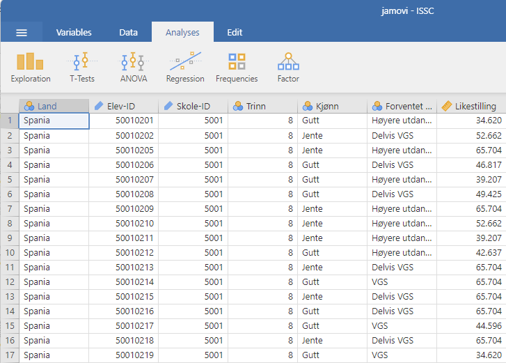
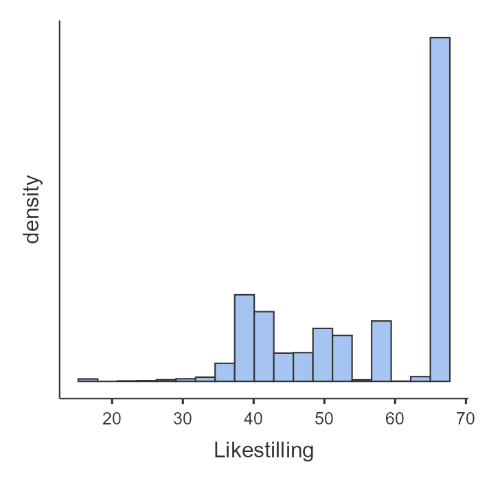
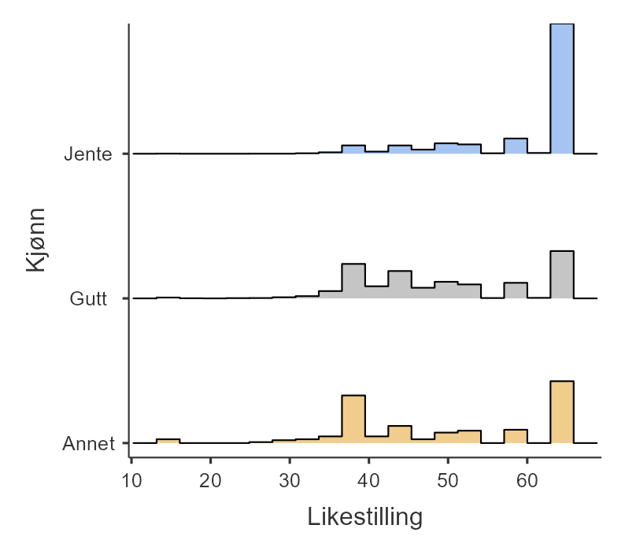
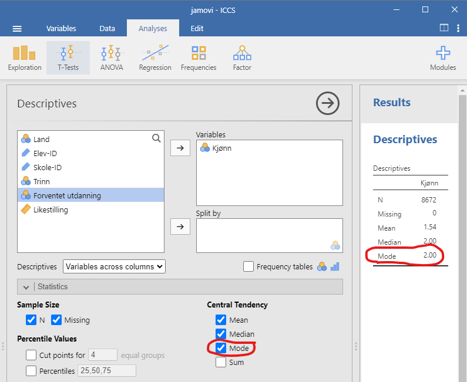
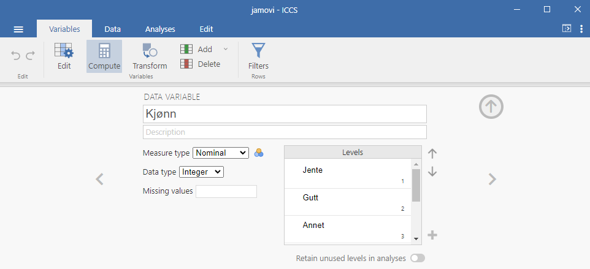

\placetextbox{0.26}{0.06}{\scriptsize{©2025 D.R. Foxcroft and D.J. Navarro,}}
\placetextbox{0.195}{0.05}{\scriptsize{CC BY-SA 4.0}}
\placetextbox{0.70}{0.06}{\scriptsize{\url{https://doi.org/10.11647/OBP.0333.04}}}

# Deskriptiv statistikk {#sec-descriptive}

```{r}
#| include: FALSE
source("chapter_header.R")
```

Hver gang du skal analysere et nytt datasett, må du finne måter å beskrive dataene på en kompakt og lett forståelig måte. Dette kalles **deskriptiv statistikk**, eller beskrivende statistikk. Merk at når man beskriver dataene, så beskriver man kun utvalget, og statistikken som sier noe om populasjonen kommer senere i @sec-inferential.

```{r}
ICCS <- readRDS("data_and_tables/ICCS.RDS")

n_elever <- nrow(ICCS)
```


Det har blitt ganske vanlig å høre begrunnelser som "det er det dataene viser" eller formaninger som "du må se på dataene, dummen!" Jeg tror ikke man kan lære så mye ved å se på dataene, men vi får vel prøve, da, og se hvor mye klokere vi blir. Jeg har forberedt et lite datasett fra den store internasjonale undersøkelsen ICCS, International Civic and Citizenship Education Study. Dette datasettet inneholder variable for kjønn, skole, land, trinn, forventet høyeste fullførte utdanning og en samlevariabel for hvor enig man er i at kjønnene bør ha like rettigheter. Datasettet har `r n_elever` rader, én rad for hver elev, men vi viser bare 50 rader:

```{r}
#| label: tbl-ICCS-data
#| tbl-cap: Noen få av variablene fra ICCS-studien.
set.seed(2025)
utvalg <- ICCS |>
  dplyr::slice_sample(n = 50)
utvalg |> 
  tt() |> 
  theme_tt("spacing")
```

Nå, ble du noe klokere? Jeg tipper du ikke ble noe klokere, og at du lengter etter å få dataene omarbeidet og presentert på en eller annen måte. Det er det som kalles deskriptiv statistikk.

La oss åpne filen i et statistikkprogram. For å gjøre dette åpner vi filen *[ICCS.csv](data-and-tables/ICCS.csv)* og ser hvilke variabler som er lagret i filen, se @fig-descriptive-ICCS-data.

```{r}
#| label: fig-descriptive-ICCS-data
#| fig-cap: Et skjermbilde av jamovi som viser variablene lagret i filen *ICCS.csv*
#| fig-alt: Et jamovi-skjermbilde viser et dataanalysegrensesnitt med 7 kolonner. Én kolonne med numeriske data er merket "likestilling".

```

Vi skal fokusere på variabelen _Likestilling_ først. Som du kanskje oppfattet fra @sec-measurement bør man først spørre seg hva variabelen egentlig måler. Jeg fant frem i dokumentasjonen til ICCS 2022 [@fraillon2024] at _Likestilling_  er en samlevariabel satt sammen av følgende Likert-spørsmål:

- Men and women should have equal opportunities to take part in government.
- Men and women should have the same rights in every way.
- Women should stay out of politics.
- When there are not many jobs available, men should have more right to a job than women.
- Men and women should get equal pay when they are doing the same jobs.
- Men are better qualified to be political leaders than women.

Alle spørsmålene virker jo å måle likestilling på en fin måte, men i Norge virker konstruktet litt tamt. I Norge ville man kanskje spurt om kjønnskvotering til høyere utdanning eller fordeling av foreldrepermisjon, men det hadde sikkert ikke vært så relevant i de andre landene der ICCS avholdes.

Å se på rådataene fortalte oss lite, og for å få en forståelse av hva dataene faktisk sier, må vi beregne deskriptiv statistikk (dette kapittelet) og lage noen fine figurer (@sec-graphs). Siden deskriptiv statistikk er det enkleste av de to temaene, starter vi med det. Likevel viser jeg et histogram av *likestilling*-dataene, slik at vi vet hva det er vi prøver å beskrive med deskriptiv statistikk, se @fig-descriptive-ICCS-histogram. Neste kapittel inneholder mye mer om histogrammer.

```{r}
#| label: fig-descriptive-ICCS-histogram
#| fig-cap: Et histogram av variabelen _Likestilling_ fra ICCS 2022.
#| fig-alt: Histogram som viser variabelen _Likestilling_. Den horisontale aksen ($x$-aksen) strekker seg fra fra 15 til 70, og den vertikale aksen (y-aksen) viser tetthet, altså hvor mange svar som havner innad i hver søyle.

```

Histogrammet i @fig-descriptive-ICCS-histogram viser oss godt at de fleste svarer veldig høyt på _Likestilling_, men at en betydelig andel svarer mye lavere. Hvis man ønsker å undersøke videre, for eksempel å undersøke kjønnsforskjeller, så er det bare å lage et histogram for hvert kjønn, @fig-descriptive-ICCS-histogram-gender.

```{r}
#| label: fig-descriptive-ICCS-histogram-gender
#| fig-cap: Et histogram av variabelen _Likestilling_ for hver verdi av variabelen _Kjønn_.
#| fig-alt: Histogram som viser variabelen _Likestilling_ for de tre verdiene i variabelen Kjønn; gutt, jente og annet. 

```

De fleste jentene er skårer maksimumsverdien på _Likestilling_, mens det blant guttene er vanlig å svare lavere også. Det var ganske få elever som oppga "Annet" på variabelen _Kjønn_, så det nederste histogrammet er basert på svært få verdier, men ellers likner histogrammet på gutta sitt.

## Sentraltendensmål

Å tegne bilder av dataene, som jeg gjorde i @fig-descriptive-ICCS-histogram, er en flott måte å vise fram hovedbudskapet i dataene dine, men det kan også være nyttig å sammenfatte dataene med noen få enkle tall. Det første du som regel vil vite noe om, er **sentraltendensen**,  altså hva som er "midten", "gjennomsnittet", "det typiske" av dataene. Det finnes mange mål på sentraltendens, men de tre mest brukte gjennomsnitt, median og typetall. Vi presenterer hver og en av dem og diskuterer deretter når de er lure å bruke.

### Gjennomsnittet

```{r}
set.seed(100)
five_first <- head(utvalg, 5)
likestilling <- five_first |> 
  dplyr::pull(Likestilling)
likestilling <- sprintf("%.1f", likestilling) |> 
  as.numeric()
```


**Gjennomsnittet** er det vanlige gjennomsnittet du kjenner fra før. Du legger sammen alle verdiene og deler på antall verdier. De første fem verdiene på _Likestilling_ i @tbl-ICCS-data var

> `r likestilling`,

så gjennomsnittet blir:

$$\frac{42.6 + 62.9 + 52.7 + 37.6 + 42.6}{5} = \frac{238.4}{5} = 47.68$$

Dette er selvsagt ikke noe nytt for deg, siden du allerede er godt kjent med gjennomsnitt.

Det som kanskje er nytt for deg er hvordan man kan få statistikk-programvare til å gjøre regnejobben for oss! Når du har mange observasjoner, vi hadde `r n_elever`, er det mye lettere å regne ut ting digitalt. 

Slik gjør man det i jamovi:

1. Klikk på "Exploration"-knappen
2. Velg "Descriptives"
3. Merk variabelen _Likestilling_
4. Klikk på høyre pil for å flytte den til 'Variables'-boksen

Straks du har gjort dette dukker en tabell med standard deskriptiv statistikk opp på høyre side av skjermen, som vist i @fig-descriptive-jamovi-mean. (Hvis du ikke finner 'Exploration'-knappen må du trykke på "Analyses" først.)

```{r}
#| label: fig-descriptive-jamovi-mean
#| classes: .enlarge-image
#| fig-cap: Standard deskriptiv statistikk for variabelen _Likestilling_.
#| fig-alt: Et skjermbilde fra jamovi som viser resultater fra deskriptiv analyse. Til venstre kan man velge variable og dele opp dataene. Til høyre vises deskriptiv statistikk for "Likestilling" med verdier for N, Missing, Mean, Median, Standard deviation, Minimum og Maximum.
knitr::include_graphics("images/fig-descriptive-jamovi-mean.png")
```

Som du kan se i den røde markeringen i @fig-descriptive-jamovi-mean, viser resultatet at gjennomsnittsverdien for _Likestilling_ er 54,8. I tillegg får du annen nyttig informasjon som det totale antallet observasjoner (N = `r n_elever`)
^[Bokstaven _n_, enten den er stor eller liten, beskriver alltid utvalgsstørrelsen.], 
antall manglende verdier, samt median-, minimum- og maksimumsverdier  og standardavviket for variabelen. ("Manglende verdier" er typisk at elever har unnlatt å svare på et spørsmål, eller at svaret var uleselig. Ingen verdier mangler i dette tilfellet, siden jeg fjernet manglende verdier da jeg forberedte dataene.)

```{r}
forventet_utdanning <- five_first |> 
  dplyr::pull(`Forventet utdanning`)
```

Hva hvis vi skal regne ut gjennomsnittet av variabelen _Forventet utdanning_? De fem første verdiene av denne variabelen er

> `r forventet_utdanning`.

Hvordan skal man regne gjennomsnittet av dette? Det går ikke an, for man kan ikke legge sammen verdiene. Derfor kan man bare regne gjennomsnitt for variable med tall, altså variable på intervall- og forholdstallskala.

### Medianen

Et annet mål for sentraltendens er **medianen**, og den er enda enklere å forstå enn gjennomsnittet. Medianen av et sett observasjoner er ganske enkelt middelverdien. Hvis vi tar de fem første verdiene av _Likestilling_ fra @tbl-ICCS-data igjen, får vi

> `r paste(likestilling, sep = "   ")`.

For å finne medianen sorterer vi disse tallene i stigende rekkefølge:

> `r paste(sort(likestilling), sep = "   ")`.

Da ser vi at `r sort(likestilling)[3]` står i midten, så `r sort(likestilling)[3]` er medianen.

Av og til er det ingen verdier i midten, for eksempel her:

> 1, 3, 5, 6, 10, 15

Her er både 5 og 6 like nære midten. Da er medianen definert til å være gjennomsnittet av disse to verdiene, altså 5,5.

Man kan regne medianen av ordinale data. De fem første verdiene av variabelen _Forventet utdanning_ var

> `r forventet_utdanning`.

Hvis man sorterer dem i rekkefølge får man:

> `r forventet_utdanning`.

Da ser man at medianen er `r forventet_utdanning[3]`.

Selvfølgelig er det uaktuelt å regne medianen for hånd med våre `r n_elever` verdier. Derfor bruker vi jamovi, som allerede har beregnet en medianverdi på percentiles["50%"] for _Likestilling_, se i den røde markeringen i  @fig-descriptive-jamovi-mean.

### Gjennomsnitt eller median? Hva er forskjellen? {#sec-descriptive-mean-or-median}

Det er ikke nok å vite hvordan man regner ut gjennomsnitt og medianer -- du må også forstå hva de forteller deg om dataene dine. Dette er illustrert i @fig-descriptive-weight. Tenk på gjennomsnittet som "tyngdepunktet" til datasettet ditt, mens medianen er "middelverdien" i dataene. Valget mellom dem avhenger av hvilken type data du har og hva du ønsker å oppnå. Her er noen praktiske retningslinjer:

-   **For nominale data** kan du hverken bruke gjennomsnitt eller median. 

-   **For ordinale data** vil medianen stort sett være det beste valget. Medianen bruker kun rekkefølgeinformasjonen i dataene dine (hvilke tall som er større) og trenger ikke eksakte tallverdier. Dette passer perfekt for ordinale data. Gjennomsnittet derimot, er avhengig av de presise tallverdiene. Det er likevel ganske vanlig å regne gjennomsnitt av variable på ordinalnivå. Da setter man, for eksempel, det laveste nivået til tallet 1, det neste nivået til tallet 2, osv.

-   **For intervall- og forholdstallsdata** er både median og gjennomsnitt fine valg! Hva du velger avhenger av hva du ønsker å fremheve. Gjennomsnittet har den fordelen at det bruker all verdiene i dataene, men dette gjør den svært følsom for ekstreme verdier.

```{r}
salaries <- data.frame(
  person = c("Arne", "Berit", "Cato", "Erling"),
  salary = c(50000, 60000, 65000, 30000000)
)
```

Vi må forklare dette ved et eksempel. Tenk deg at Arne (månedsinntekt 50 000 kr), Berit (60 000 kr) og Cato (inntekt 65 000 kr) sitter ved et bord. Gjennomsnittsinntekten ved bordet er 58 333 kr og medianinntekten er 60 000kr. Begge disse er gode sentralverdier for dataene.

Så kommer Erling Braut Haaland og setter seg ved bordet (månedsinntekt 30 000 000 kr). Plutselig gjør gjennomsnittsinntekten et byks til `r mean(salaries$salary)`, mens medianen kun stiger til `r median(salaries$salary)`! Gjennomsnittsverdien representerer plutselig ikke de andre i det hele tatt, fordi den ekstreme verdien til Erling Braut Haaland trekker gjennomsnittet opp for mye. Medianen, derimot, ser ikke den ekstreme verdien i det hele tatt.

Hvis du er interessert i den totale inntekten ved bordet, kan gjennomsnittet være relevant. Men hvis du vil vite hva som er en typisk inntekt ved bordet, ville medianen gi deg et mye mer representativt bilde.

Dette illustreres også i @fig-descriptive-weight, hvor du kan se at når histogrammet er asymmetrisk, ligger medianen nærmere "hovedvekten" av dataene, mens gjennomsnittet blir trukket mot "halen" der de ekstreme verdiene befinner seg.

```{r}
#| label: fig-descriptive-weight
#| classes: .enlarge-image
#| fig-cap: En illustrasjon av forskjellen mellom hvordan gjennomsnittet og medianen bør tolkes. Gjennomsnittet er \"balansepunktet\" til datasettet. Hvis du forestiller deg at histogrammet av dataene er et klosser på et brett, så er gjennomsnittet balansepunktet. Medianen den midterste observasjonen, og halvparten av klossene lenger til venstre og halvparten og halvparten lenger til høyre.
#| fig-alt: "Et stolpediagram på venstre side har 48 observasjoner og ligner på et trappetrinnmønster med avtagende høyder fra venstre til høyre. Teksten lyder\\: \"Gjennomsnittet er 'balansepunktet' til dataene.\" Under diagrammet er det en horisontal linje merket \"balansepunkt\" med et trekantet støttepunkt som symboliserer balanse. Det samme stolpediagrammet vises på høyre side med dataene delt inn i to grupper på 24 observasjoner. Den venstre gruppen er skyggelagt i lys grå, og den høyre gruppen er skyggelagt i mørk grå. En pil peker på den 24. observasjonen med teksten \"Medianen er den 'midterste observasjonen' i datasettet\""
#| fig-pos: 'H'
knitr::include_graphics("images/fig-descriptive-weight.png")
```

Valget mellom gjennomsnitt og median er viktig når dataene har en hale som trekker opp eller ned gjennomsnittet. Et eksempel er at USA har høyere gjennomsnittsinntekt enn Norge, men lavere medianinntekt. Årsaken er at USA har flere superrikinger som trekker opp gjennomsnittet på samme måte som Erling Braut Haaland gjorde i eksempelet. Men den vanlige lønnstager sin inntekt er nok mer lik medianinntekten, og den er høyere i Norge.

### Typetallet {#sec-mode}

```{r}
kjonn <- five_first |> 
  dplyr::pull(`Kjønn`)
```

Typetallet til en variabel er den verdien som forekommer hyppigst. Vi kan finne typetallet til nominelle variable, noe som gjør dem velegnet til slike data. En nominell variabel i ICCS-dataene er _Kjønn_. Typetallet til _Kjønn_ vil si oss hvilket kjønn det er flest av i dataene. De fem første verdiene er:

> `r kjonn`.

Typetallet er Gutt fordi det var flest av den verdien.

Hvis vi skal finne typetallet for _Kjønn_ i hele datasettet må vi sette oss ned og telle hvor mange det er av Gutt, Jente og Annet. Selvsagt gjør vi det heller med programvare, altså jamovi. @fig-descriptive-jamovi-mode viser et skjermbilde av hvordan det ser ut.

```{r}
#| label: fig-descriptive-jamovi-mode
#| classes: .enlarge-image
#| fig-cap: Et skjermbilde av jamovi som viser typetall og frekvenstabell for variabelen _Kjønn_
#| fig-alt: Et jamovi-skjermbilde for analyse av variabelen Kjønn. Et panel til venstre inkluderer alternativer for å velge variabler og hvilke sentraltendenser man ønsker å regne ut. Det høyre panelet viser resultatene
#| fig-pos: 'H'

```

I @fig-descriptive-jamovi-mode har jeg valgt variabelen "Kjønn" ved å dra den over i vinduet "Variables". Det engelske ordet for typetall er "mode", og derfor trykket jeg på "Mode". Resultatet er skuffende, for jamovi velger å si at typetallet er 2. (Se i den rød håndtegnede ellipsen.) Hæ? Typetallet må jo være "Gutt", "Jente" eller "Annet"! Dette er en beklagelig teknikalitet som er forårsaket av at nominelle variable sine verdier er lagret som heltall (noe de ikke er), men tolkes som kategorier (noe de er). Du kan se at jamovi tilogmed har regnet ut _Kjønn_ sitt gjennomsnitt og funnet ut at det er 1,54. 💩

For å finne ut av hva typetallet 2 betyr, må du trykke på 'Variables' → 'Kjønn' → 'Edit', se @fig-descriptive-jamovi-gender. Du kan se at "Jente" er lagret som 1, "Gutt" som 2 og "Annet" som 3. Typetallet 2 er altså "Gutt", så det er flest gutter i datasettet.

```{r out.wdith="100%"}
#| label: fig-descriptive-jamovi-gender
#| classes: .enlarge-image
#| fig-cap: Et skjermbilde av jamovi som viser informasjon om variabelen _Kjønn_.
#| fig-alt: Et jamovi-skjermbilde for analyse av variabelen Kjønn. Det står at _Kjønn_ er en nominell variabel der \"Jente\" er lagret som 1, \"Gutt\" er lagret som 2, og \"Annet\" er lagret som 3.
#| fig-pos: 'H'

```

En mer tilfredsstillende måte å finne typetallet på er å telle opp antallet av alle verdiene. Dette kalles å lage en **frekvenstabell**. I jamovi kan man akkurat som før trykke på "Analyses" → "Exploration" → "Descriptives", men nå kan man velge "Frequency table", se @fig-descriptive-jamovi-frequency-table.

```{r out.wdith="100%"}
#| label: fig-descriptive-jamovi-frequency-table
#| classes: .enlarge-image
#| fig-cap: Et skjermbilde av jamovi som viser frekvenstabell til _Kjønn_.
#| fig-alt: Et skjermbilde av jamovi som viser frekvenstabell til _Kjønn_.
#| fig-pos: 'H'
knitr::include_graphics("images/fig-descriptive-jamovi-frequency-table.png")
```

Selv om typetallet oftest beregnes for nominelle variable, kan det være nyttig å vite typetallet til en ordinal-, intervall- eller forholdstallsvariabel. For eksempel, hvis vi tenker oss tilbake til variabelen _Likestilling_ og histogrammet i @fig-descriptive-ICCS-histogram, så husker vi at den største søyla var ved den høyeste verdien. Det betyr at typetallet er den høyeste verdien -- noe som er litt betryggende.

## Spredningsmål {#sec-descriptive-dispersion}

Alt vi har sett på så langt handler om sentraltendens, altså hvilke verdier som ligger "i midten" eller som er mest "typiske" i dataene våre. I tillegg trenger vi ofte å å forstå hvor spredt dataene er. Ligger de fleste observasjonene tett rundt gjennomsnittet, eller er de spredt jevnt utover? Dette kaller vi **spredning**.

La oss utforske fire ulike måter å måle spredning på ved hjelp av ICCS-dataene. Hvert spredningsmål har sine egne fordeler og ulemper, så det er nyttig å kjenne til flere. 

### Variasjonsbredde

**Variasjonsbredden** er det aller enkleste spredningsmålet. Den regnes ut ved å ta den største verdien minus den minste verdien. I @fig-descriptive-jamovi-dispersion

```{r}
#| label: fig-descriptive-jamovi-dispersion
#| classes: .enlarge-image
#| fig-cap: Et skjermbilde av hvordan man finner ulike spredningsmål i jamovi
#| fig-alt: Et skjermbilde av jamovi som likner på de foregående, men der boksene for "Dispersion" er krysset av; Std. deviation, Variance, Range, Minimum, Maximum
#| fig-pos: 'H'
knitr::include_graphics("images/fig-descriptive-jamovi-dispersion.png")
```

Variasjonsbredden er lett å forstå, men har en egenskap som ofte er en ulempe: den påvirkes veldig av ekstreme verdier.  

Se for deg denne lille datamengden:
-100, 2, 3, 4, 5, 6, 7, 8, 9, 10

Her får vi en variasjonsbredde på hele 110 på grunn av den ene ekstreme verdien (-100). Men hvis vi fjerner denne ekstreme verdien, blir variasjonsbredden bare 8. Det er en enorm forskjell! Dette må man være obs på når man benytter variasjonsbredden.

### Kvartilbredde

```{r}
quantiles <- sprintf(
  "%.1f",
  quantile(
    ICCS$Likestilling,
    c(.25, .5, .75)
    )
)
kvartilbredde <- sprintf(
  "%.1f",
  IQR(ICCS$Likestilling)
)
```


**Kvartilbredden** er litt som variasjonsbredden, men i stedet for å regne ut forskjellen mellom den største og minste verdien, regner vi ut forskjellen mellom tjuefemte persentil og syttifemte persentil. Ordet "kvartil" henspiller på "kvart" og "persentil", og som vi skal se må man regne ut hvor hver kvart av dataene ligger. 

Hvis du kjenner begrepet **persentil** fra før, kan du tenke på det slik: den 10. persentilen til en variabel er det minste tallet x slik at 10% av verdiene ligger under denne verdien. Dette er faktisk ikke helt nytt -– medianen er nemlig den femtiende persentilen siden femte prosent av verdiene ligger under denne verdien! I jamovi finner du enkelt hvilken som helst persentil ved å huke av for "Percentiles" under 'Exploration' → 'Descriptives' → 'Percentile Values'.

Som du kan se tilbake i @fig-descriptive-jamovi-dispersion, tilsvarer kvartilbredden (_interquartile range, IQR_) for variabelen _Likestilling_ differansen mellom 25. og 75. persentil, altså `r quantiles[3]` - `r quantiles[1]` = `r kvartilbredde`. Siden 25% av dataene er mindre enn `r quantiles[1]` og 75% av dataene er mindre enn `r quantiles[3]`, ligger 50% av dataene i et intervall som er `r kvartilbredde` bredt. Legg også merke til at 50. persentil og medianen har samme verdi, `r quantiles[2]`, akkurat slik det skal være. I forskningsartikler oppsummeres alt dette slik: 

> The median value of _gender equality_ was `r paste(quantiles[2], "(IQR = ", quantiles[1], "--", quantiles[3])`)."

Dette er en effektiv måte å vise sentraltendens og spredning. Medianen viser hva midtpunktet i dataene er og kvartilbredden viser hvor spredt halvparten av verdiene ligger rundt medianen. Merk at kvartilbredden ikke fungerer like godt for å vise spredningen rundt et gjennomsnitt. Årsaken er at gjennomsnittet kan ligge utenfor 25. og 75. persentil. (Bare tenk på kvartilbredden og gjennomsnittslønna når Haaland satte seg ved bordet i eksempelet i @sec-descriptive-mean-or-median.)

Variasjonsbredden var veldig påvirket av ekstreme verdier, men kvartilbredden er ikke det -- den ignorerer de 25% av dataene som har størst verdi og de 25% av dataene som har minst verdi.

### Varians

De to spredningsmålene vi har sett på så langt er differanser, enten mellom største og minste verdi eller mellom tjuefemte og syttifemte persentil. En annen tilnærming er å regne ut hvor stort et "typisk" avvik er fra sentraltendensen.

Vi tar et eksempel. De fem første verdiene på variabelen _Likestilling_ er vist i første kolonne i @tbl-descriptive-deviation. Gjennomsnittet av _Likestilling_ er 54,8. Da kan man regne ut hvor mye hver verdi avviker fra gjennomsnittet. I tabellen ser vi at første verdi avviker `r abs(likestilling[1] - 54.8)` fra gjennomsnittet.
^[Utregningen blir altså å ta "verdien minus gjennomsnittet og droppe fortegnet". Første verdi på _Likestilling_ er 42,6, så for å regne ut første avvik tar man 42,6 - 54,8 = -12,2, men så dropper man fortegnet og får 12,2.]
Den nye kolonnen _Avvik fra gjennomsnittet_ inneholder alle disse avvikene. Disse verdiene kan man bruke til å beskrive spredningen, for eksempel ved å regne gjennomsnittet eller medianen av dem. Slike spredningsmål blir brukt, men de desidert vanligste spredningsmålene legger til et steg til.

```{r}
#| label: tbl-descriptive-deviation
#| tbl-cap: Noen verdier på variabelen _Likestilling_ og deres avvik fra gjennomsnittet, 54,8.

avvik <- tibble(
  Likestilling = likestilling,
  `Avvik fra gjennomsnittet` = abs(likestilling - 54.8)
  )
avvik |> 
  tt() |> 
  theme_tt("spacing")
```

Det første av de vanligste og mest elegante spredningsmålene vi skal møte er **varians**. For å regne ut dette tar man ikke gjennomsnittlig avvik, men gjennomsnittlig _kvadratisk_ avvik. Det første avviket var $12,2$ og da er det kvadratiske avviket $12,2^2 = 148,84$, man opphøyer altså tallet i andre. Da kan man regne ut kvadratet av alle avvikene, se @tbl-descriptive-variance.

```{r}
#| label: tbl-descriptive-variance
#| tbl-cap: Noen verdier på variabelen _Likestilling_ og deres avvik fra gjennomsnittet, 54,8.

avvik <- tibble(
  Likestilling = likestilling,
  `Avvik fra gjennomsnittet` = abs(likestilling - 54.8),
  `Kvadratisk avvik` = `Avvik fra gjennomsnittet`^2
  )
avvik |> 
  tt() |> 
  theme_tt("spacing")
```

Variansen er definert som gjennomsnittet av alle disse kvadratiske avvikene. Fra jamovi sine utregninger ser vi at variansen til _Likestilling_ var 133. Hvis du husker histogrammet i @fig-descriptive-ICCS-histogram, så stusser du sikkert litt nå, for verdiene på _Likestilling_ strakk seg fra ca. 15 til ca. 70. Hvordan kan det da gi mening at variansen er 133? Svaret er at det ikke gir mening og at variansen er vanskelig å tolke.

Grunnen til at variansen er vanskelig å tolke er fordi vi kvadrerer alle verdiene. Hvis vi sier _Likestilling_ blir målt i "likestillingspoeng", så blir et avvik på 12,2 likestillingspoeng til et kvadratisk avvik på 148,84 "kvadratlikestillingspoeng". Det er en enhet jeg ikke klarer å se for meg. For å vise hvor absurd det er: se for deg at gjennomfører en 12 minutters løpstest i kroppsøving -- Cooper-testen -- for alle elevene på skolen og regner du ut at gjennomsnittlig løpslengde er 2300 meter og at variansen er 16000 _kvadratmeter_. For meg er ikke et areal et meningsfullt mål for spredningen av elevenes løpsdistanser! Grunnen til at varians likevel er et viktig spredningsmål er fordi har så mange gode matematiske egenskaper, men de skal vi ikke gå inn på videre, men de gjør at varians er motoren i nesten all statistikk.
^[Hvis du er nysgjerrig: Den kanskje viktigste egenskapen er at **varianser er additive**. Det betyr at hvis du har to variabler $X$ og $Y$ med varianser $Var(X)$ og $Var(Y)$ og du lager en ny variabel $Z = X + Y$, så blir variansen til $Z$ ganske enkelt $Var(X) + Var(Y)$. Dette ligger bak utsagn som "foreldrenes utdanningsbakgrunn forklarer 30% av elevenes skoleresultater". (Jeg fant på dette tallet, altså.)]

Så hvordan tolker du variansen? Deskriptiv statistikk skal tross alt beskrive ting og variansen virker bare som et meningsløst tall som er helt ubrukelig hvis du vil kommunisere med et faktisk menneske. Løsningen er standardavviket.

### Standardavvik {#sec-descriptive-standard-deviation}

Du kan stole på oss om at varians er flott på grunn av alle de praktiske matematiske egenskapene, som vi ikke har gått gjennom her, men du ønsker også et spredningsmål som har de samme enhetene som selve dataene (altså _likestillingspoeng_, ikke _kvadratlikestillingspoeng_). Hva gjør du da? 

Løsningen er enkel, du tar bare kvadratroten av variansen, noe som kalles **standardavviket**! Standardavviket løser problemet vårt på en elegant måte. Mens de fleste av oss har liten anelse om hva "spredningen i elevenes løpstest var 16000 kvadratmeter" betyr, så er det mer opplagt hva "spredningen i elevenes løpstest var 400 meter". Dette er forskjellen på varians og standardavvik. Standardavviket er mye mer intuitivt å forstå siden det er uttrykt i de samme enhetene som de opprinnelige dataene.

<!-- However, as you might have guessed from our discussion of the variance, what jamovi actually calculates is slightly different to the formula given above. Just like we saw with the variance, what jamovi calculates is a version that divides by $N - 1$ rather than $N$. -->

<!-- [Additional technical detail[^04-descriptive-statistics-10]] -->

<!-- [^04-descriptive-statistics-10]: For reasons that will make sense when we return to this topic in @sec-Estimating-unknown-quantities-from-a-sample I'll refer to this new quantity as $\hat{\sigma}$ (read as: "sigma hat"), and the formula for this is: $$\hat{\sigma}=\sqrt{\frac{1}{N-1} \sum_{i=1}^{N} ( X_i - \bar{X} )^2}$$ -->

Tolkning av standardavvik er likevel litt komplisert. Fordi standardavviket er utledet fra variansen, og variansen er en størrelse som er vanskelig å tolke, så er ikke standardavviket helt enkelt å tolke heller. Derfor husker de fleste kun en enkel tommelfingerregel. Ofte vil 68% av dataene falle innenfor 1 standardavvik fra gjennomsnittet, 95% av dataene falle innenfor 2 standardavvik fra gjennomsnittet, og 99,7% av dataene falle innenfor 3 standardavvik fra gjennomsnittet. Denne regelen er ikke eksakt, men passer veldig godt hvis histogrammet er symmetrisk og "klokkeformet", slik som i @fig-descriptive-sd-simul. Denne figuren inneholder oppkonstruerte data for variabelen _Likestilling_ og viser ikke de ekte dataene fra ICCS-studien. Denne variabelen har samme gjennomsnitt (54,8) og standardavvik (11,5) som ICCS-variabelen, men er normalfordelt. Her stemmer tommelfingerregelen veldig godt.

::: {#fig-descriptive-sd-rule layout-ncol=1}
```{r out.width="100%"}
#| label: fig-descriptive-sd-simul
#| fig-cap: Variabelen _Likestilling_ slik den hadde vært om den var normalfordelt. Her gjelder tommelfingerregelen om at 68 % av verdiene er innenfor ett standardavvik rundt gjennomsnittet (rødt), 95% av verdiene innenfor to standardavvik rundt gjennomsnittet (blått).
#| fig-width: 8.571429
#| classes: .enlarge-image


n_samples <- nrow(ICCS)

likestilling_mean = mean(ICCS$Likestilling)
likestilling_sd = sd(ICCS$Likestilling)

set.seed(123)
sim_likestilling = rnorm(
  n_samples,
  likestilling_mean,
  likestilling_sd
  )
  
source("R/two-sd-histogram.R")
two_sd_histogram(sim_likestilling, 10, 100, x_label = "Likestilling")

```

```{r out.width="100%"}
#| label: fig-descriptive-sd-ICCS
#| classes: .enlarge-image
#| fig-cap: Den faktiske variabelen _Likestilling_ fra ICCS-dataene. Denne er overhodet ikke normalfordelt, så tommelfingerregelen gjelder ikke.
#| fig-width: 8.571429

two_sd_histogram(ICCS$Likestilling, 10, 100, x_label = "Likestilling")

```
Two figures, linked inextricably.
:::

```{r}
#| include: FALSE

breaks <- c(-Inf, seq(likestilling_mean - 2*likestilling_sd, likestilling_mean + 2*likestilling_sd, likestilling_sd),Inf)
category <- cut(ICCS$Likestilling, breaks)
levels <- c(">2sd", "<2sd", "<1sd")
levels(category) <- c(levels[1:3],levels[3:1])
rule_of_thumb <- category |> table() |> prop.table() |> rev() |> cumsum()
rule_of_thumb <- sprintf("%1.0f%%", rule_of_thumb*100)

```


I @fig-descriptive-sd-ICCS har vi samme diagram, bare for de ekte dataene. Slik vi husker fra starten av kapittelet var variabelen _Likestilling_ overhodet ikke normalfordelt -- de aller fleste elevene fikk høyeste skår. Her fungerer tommelfingerregelen ikke, faktisk var `r rule_of_thumb[1]` av dataene innenfor ett standardavvik av gjennomsnittet (rødt) og `r rule_of_thumb[2]` av dataene innenfor to standardavvik av gjennomsnittet. La dette være en advarsel mot å kun basere seg på en sentraltendens og spredningsmål for å beskrive dataene: de to histogrammene i @fig-descriptive-sd-rule har samme gjennomsnitt og standardavvik og likevel er dataene helt ulike. Hvis målet med deskriptiv statistikk er å beskrive dataene, noe det jo er, så virker diagrammer å være bedre enn disse tallene.

Når man rapporterer standardavviket til dataene dine i en forskningsartikkel gjøres det gjerne slik:

> The mean of the variable _Gender equality_ was `r sprintf("%1.1f (SD = %1.1f)", likestilling_mean, likestilling_sd)`.

Her står SD for _standard deviation_, som er engelsk for standardavvik.

### Hvilket mål skal du bruke?

Vi har gitt deg fire ulike spredningsmål: variasjonsbredde, kvartilbredde, varians og standardavvik. Vi oppsummerer egenskapene deres fort

-   **Variasjonsbredde**: Viser avstanden mellom den største og minste verdien i dataene. Variasjonsbredden påvirkes lett av ekstremverdier, så den brukes vanligvis kun når du har spesielle grunner til å fokusere på ytterpunktene.

-   **Kvartilbredde**: Beskriver hvor "den midterste halvdelen" av dataene befinner seg. Den er robust mot ekstremverdier og passer perfekt sammen med medianen. Et godt valg!

-   **Varians**: Måler det "gjennomsnittlig kvadrerte avviket fra gjennomsnittet". Variansen er viktig fordi den er så gode matematiske egenskaper som gjør den nyttig i senere kapitler, men den er vanskelig å tolke siden den ikke bruker samme enheter som de opprinnelige dataene. Du vil sjelden se variansen rapportert, men den er grunnlaget for mange statistiske metoder.

-   **Standardavvik**: Er kvadratroten av variansen. Den kombinerer matematisk nytteverdi og praktisk tolkbarhet siden den bruker samme enheter som dataene. Den klare favoritten når gjennomsnittet er ditt foretrukne sentralmål. Standardavviket er definitivt det mest brukte variasjonsmålet!

Kort fortalt: kvartilbredde og standardavvik er de to klart mest populære valgene for å beskrive variabilitet, men variansen er den nyttigste i senere utregninger. Variasjonsbredden bruker mange studenter som spredningsmål i mastergradene sine, sikkert fordi den er så intuitiv, så det er viktig å vite om dens styrker og svakheter også.

## Skjevhet

Det er et mål til som er verdt å ta med seg fra dette kapittelet, og det er skjevhet. Vi skal ikke lære å regne ut noen mål på skjevhet, men vi skal lære hva det vil si og hvordan histogrammet til en skjevfordelt variabel vil se ut.

Skjevhet er et mål på asymmetri. En variabel er symmetrisk hvis høyre og venstre side er speilbilder av hverandre, og asymmetrisk hvis de ikke er speilbilder av hverandre. Vi sier at variabelen er venstreskjev hvis verdiene som ligger til venstre for gjennomsnittet ligger langt unna, altså at vi har lengre hale til venstre enn til høyre. Dette kalles også **negativ skjevhet**. Høyreskjevhet kalles **positiv skjevhet**. @fig-descriptive-skew er bildet du bør ha i hodet.

```{r out.width="100%"}
#| label: fig-descriptive-skew
#| classes: .enlarge-image
#| fig-cap: En illustrasjon av skjevhet. Til venstre har vi et negativt skjevt datasett, i midten har vi et datasett uten skjevhet, og til høyre har vi et positivt skjevt datasett
#| fig-alt: Tre stolpediagram demonstrerer henholdsvis negativ skjevhet, ingen skjevhet og positiv skjevhet. Diagrammet til venstre viser en lengre hale til venstre, det midterste diagrammet er symmetrisk, og diagrammet til høyre viser en lengre hale til høyre
#| fig-width: 8.571429

x1 <- tidyr::as_tibble(rbeta(n = 100000, shape1= 10, shape2 = 2))
x2 <- tidyr::as_tibble(rbeta(n = 100000, shape1= 10, shape2 = 10))
x3 <- tidyr::as_tibble(rbeta(n = 100000, shape1= 2, shape2 = 10))
X <- list(x1,x2,x3)
X_labels <- c(
  "Negativ skjevhet\nVenstreskjev fordeling",
  "Ingen skjevhet\nSymmetrisk fordeling",
  "Positiv skjevhet\nHøyreskjev fordeling")
skewplots <- lapply(1:3, function(i) {
  ggplot(X[[i]], aes(x=value)) +
    geom_histogram(binwidth=0.04, col="white", fill=blueshade, alpha=0.6) +
    ggtitle(X_labels[[i]]) +
    theme(
        axis.title.x = element_blank(),
        axis.line.x = element_blank(),
        axis.text.x = element_blank(),
        axis.ticks.x = element_blank(),
        axis.title.y = element_blank(),
        axis.text.y = element_blank(),
        axis.ticks.y = element_blank(),
        axis.line.y = element_blank(),
        plot.title = element_text(hjust = 0.5, size = rel(0.6)))
  })
library(patchwork)
skewplots[[1]] + skewplots[[2]] + skewplots[[3]]
```

## Deskriptiv statistikk separat for hver gruppe

Det er svært vanlig at du trenger å se på deskriptiv statistikk for forskjellige undergrupper i dataene dine. Det hadde for eksempel vært interessant å vite om de spanske og norske elevene svarer forskjellig på variabelen _Likestilling_. Eller kanskje om de som ser for seg høyere utdanning svarer forskjellig fra de som seg for seg å stoppe utdanningen etter videregående. Slike spørsmål er svært interessante, og derfor er undergruppeanalyser ofte det masterstudenter benytter til å besvare forskningsspørsmålene sine.

Vi titter på noen rader fra ICCS-dataene våre igjen:

```{r}
five_first |> tt()
```
Vi ser at de undergruppene vi ønsker å undersøke (Norge/Spania, Høyere utdanning/VGS) er de forskjellige verdiene til nominelle eller ordinale variable (henholdsvis _Land_ og _Forventet utdanning_. En måte å tenke på verdiene til nominelle og ordinale variable er altså som undergrupper.

> Å gjøre deskriptiv statistikk for undergrupper er å gjøre utregningene separat for hver verdi av en nominell variabel.

Dette er ganske enkelt å gjøre i jamovi. For å regne ut deskriptiv statistikk separat for Gutt, Jente og Annet, må jeg dele opp dataene med verdiene i variabelen _Kjønn_. I jamovi går man nok en gang til menyen for deskriptiv statistikk ("Analyses" → "Exploration" → "Descriptives"). Deretter legger du til variabelen Kjønn i vinduet der det står "Split by", se den røde markeringen i @fig-descriptive-jamovi-equality-x-gender. 

```{r}
#| label: fig-descriptive-jamovi-equality-x-gender
#| classes: .enlarge-image
#| fig-cap: Et skjermbilde av jamovi som viser _Likestilling_ for de forskjellige verdiene av _Kjønn_
#| fig-alt: Et jamovi-skjermbilde som viser at _Kjønn_ er lagt til i vinduet "Split by". Da vises deskriptiv statistikk for Gutt, Jente og Annet i et vindu til høyre
knitr::include_graphics("images/fig-descriptive-jamovi-equality-x-gender.png")
```

Fra @fig-descriptive-jamovi-equality-x-gender ser vi at jentene har mye høyere gjennomsnittskår på _Likestilling_ enn guttene, 60,3 mot 49,7. De som oppga Annet har tilsvarende gjennomsnitt som gutta, 49,8. Jentene har dessuten vesentlig mindre standardavvik, 8,94 mot 11,2. De som oppga "Annet" har mer sprikende svar. Og tolkningen av dataene ser helt lik ut om vi heller ser på medianen og kvartilbredden enn gjennomsnittet og standardavviket.

Vi kan også lure på om det er forskjell mellom Norge og Spania for hvert kjønn. Da legger vi til variabelen _Land_ i "Split by", se @fig-descriptive-jamovi-equality-x-gender-country. Vi ser at de norske jentene er mer for likestilling enn de spanske jentene (61,2 mot 58,8), men at de norske gutta er _mindre_ for likestilling enn de spanske guttene (49,2 mot 50,5)! Skjerpings, gutter!

```{r}
#| label: fig-descriptive-jamovi-equality-x-gender-country
#| classes: .enlarge-image
#| fig-cap: Et skjermbilde av jamovi som viser _Likestilling_ for de forskjellige verdiene av _Kjønn_ og _Land_
#| fig-alt: Et jamovi-skjermbilde som viser at _Kjønn_ og _Land_ er lagt til i vinduet "Split by". Da vises deskriptiv statistikk for Gutt, Jente og Annet separat for hvert land i et vindu til høyre
knitr::include_graphics("images/fig-descriptive-jamovi-equality-x-gender-country.png")
```

Når man deler inn i ulike undergrupper på denne måten, kan det være at enkelte undergrupper har svært få respondenter. Vi ser i @fig-descriptive-jamovi-equality-x-gender-country at det er svært få som har oppgitt Annet kjønn i Spania, 78 respondenter. Dette er fremdeles mange nok til at det gir mening å regne gjennomsnitt, men andre ganger vil det være like greit å si at man ikke har mange nok respondenter til å gjøre en undergruppeanalyse for akkurat dem. Merk at dette er et etisk problem for forskere, for hvis forskning kan gagne mennesker er det et problem om noen grupper mennesker stadig vekk blir utelatt.

## Standardskår {#sec-standard-scores}

Hittil har alt dreid seg om å beskrive dataene som helhet, men dette delkapittelet dreier seg om å beskrive et enkelt datapunkt i forhold til alle de andre. Dette gjør man ved å regne ut en standardskår for hver person.

Det er ofte nødvendig å regne ut en standardskår fordi måleenheten i seg selv ikke sier så mye. Hvis jeg svarte på spørreskjemaet i ICCS-studien, kunne jeg spurt forskerne "Hvor mye var jeg for likestilling?" og de kunne svart "58", men svaret ville ikke vært særlig informativt. Det ville vært mye mer informativt hvis de svarte "Du skåret `r sprintf("%1.0f%%", (58 - likestilling_mean)/likestilling_sd*100)` over gjennomsnittet." Det er akkurat dette en standardskår er.

En **standardskår** (også kalt en _z_-skår) er definert til å være antall standardavvik unna gjennomsnittet. Jeg fikk standardskåren $z = 0,58$, mens en mer vanlig norsk gutt i ICCS-studien hadde kanskje fått $z = -0,3$, som betyr at han svarte 30% av et standardavvik under gjennomsnittet. Man kan regne det ut slik:
$$\text{standardskår} = \frac{\text{opprinnelig skår} - \text{gjennomsnitt}}{\text{standardavvik}}$$

Man kan tolke denne verdien på ca. samme måte som standardavviket. Hvis du husker tommelfingerregelen om standardavviket (68% av verdiene er innenfor ett standardavvik av gjennomsnittet), så skjønner du at 68% av verdiene er mellom $z = -1$og $z = 1$, 95% av verdiene ligger mellom $z = -2$ og $z = 2$ og 99% av verdiene ligger mellom $z = -3$ og $z = 3$.

Du har sett standardskår en gang tidligere i kapittelet. I figur @fig-descriptive-sd-rule var det to x-akser, en på bunn og en på topp. x-aksen på bunnen viste de opprinnelige skårene på _Likestilling_, mens x-aksen på topp viste standardskårene. Dette er det indre blikket jeg har på standardskårer; standardskåren $z = 0,58$ ser jeg for meg som en verdi litt til høyre for gjennomsnittet på et fint normalfordelt histogram.

I tillegg til å la deg tolke en verdi i forhold til resten av dataene dine (som dermed lar deg forstå variabler på skalaer, slik som _Likestilling_), har standardskårer en annen nyttig funksjon. De kan sammenlignes med hverandre i noen situasjoner der de opprinnelige skårene ikke kan det. Anta for eksempel at vennen min, Bård, svarte på et annet spørreskjema som målte holdning til likestilling mellom kjønnene, og han fikk skår 4. Verdien jeg fikk på ICCS sitt spørreskjema, 58, er overhodet ikke sammenliknbar med verdien han fikk på det andre spørreskjemaet, 4. Men hvis vi vet at Bård sin standardskår var $z = 3,1$ kan vi sammenlikne verdiene. Siden jeg fikk $z = 0,58$ var Bård sin skår mye høyere. Min skår betyr at jeg skårte over gjennomsnittet i min studie, men ikke veldig langt over. Bård sin skår betyr at han svarte himmelhøyt over, han må være likestillingens fanebærer! I hvert fall lå den mange flere standardavvik over gjennomsnittet i hans studie. Hvis utvalget i Bårds studie var medlemmene i "Norsk Forening for Tradisjonelle Kjønnsrolle", så ville det ikke betydd så mye at han skåret himmelhøytover gjennomsnittet. Derfor er standardskårene kun sammenliknbare hvis utvalgene er det.

## Oppsummering

Å beregne grunnleggende deskriptive statistikk er blant de første tingene du gjør når du analyserer data. Deskriptiv statistikk beskriver utvalget, og har altså ingenting med verdiene for populasjonen.

Vi har dekket disse temaene:

-   **Mål for sentraltendens**: Disse forteller deg hvor dataene dine har sin "kjerne". De tre mest brukte målene i litteraturen er gjennomsnittet, medianen og typetallet.
-   **Mål for spredning**: Disse viser deg hvor "spredt" dataene dine er. De viktigste målene for å beskrive dataene er variasjonsbredde, kvartilbredde og standardavvik, mens varians spiller en nøkkelrolle i nesten all videre statistikk.
-   **Skjevhet**: Skjevhet måler om variabelen er symmetrisk fordelt, eller har en lang hale til den ene eller andre siden.
-   **Deskriptiv statistikk for ulike grupper**: Er ofte en sentral del av analysen i mastergrader. Vi viste hvordan man gjorde det i jamovi.
-   **Standardskårer**: *z*-skåren viser hvor mange standardavvik man er over eller under gjennomsnittet. Sørg for at du forstår standardskårer godt, for det er viktig videre i boken.

I neste kapittel kommer den kanskje viktigste delen av deskriptiv statistikk og god dataanalyse -- gode visualiseringer!
