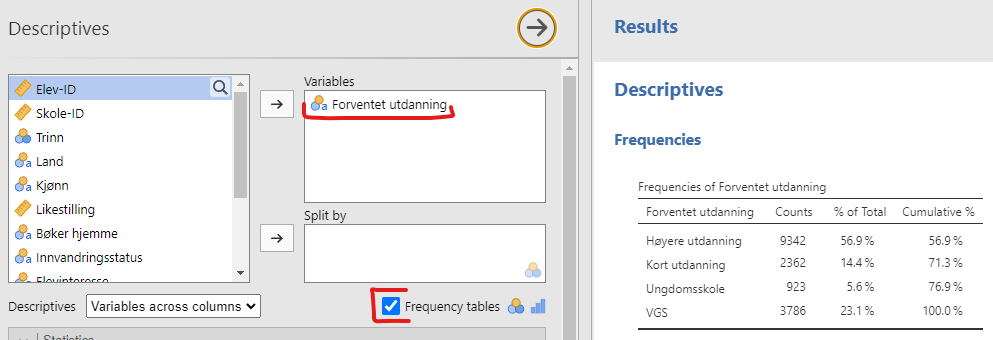
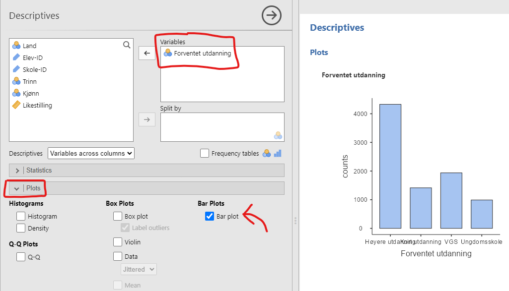
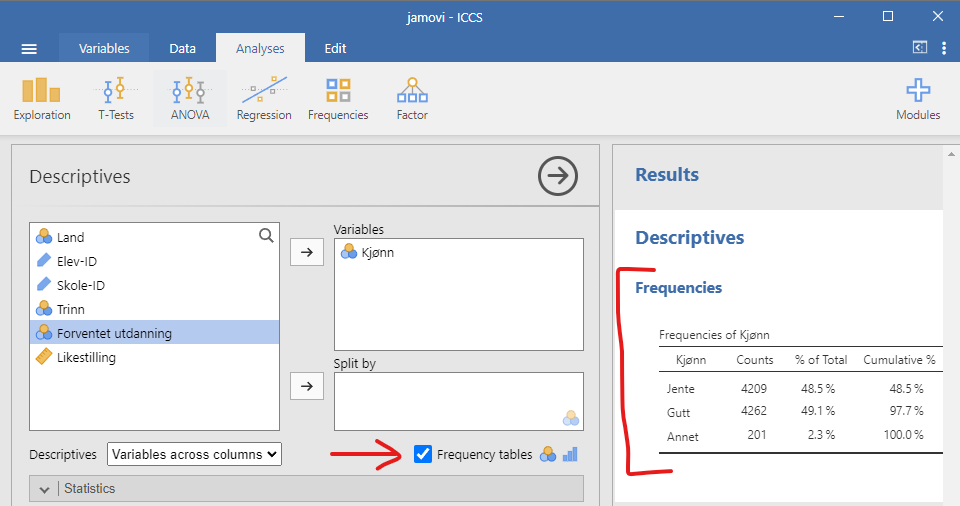
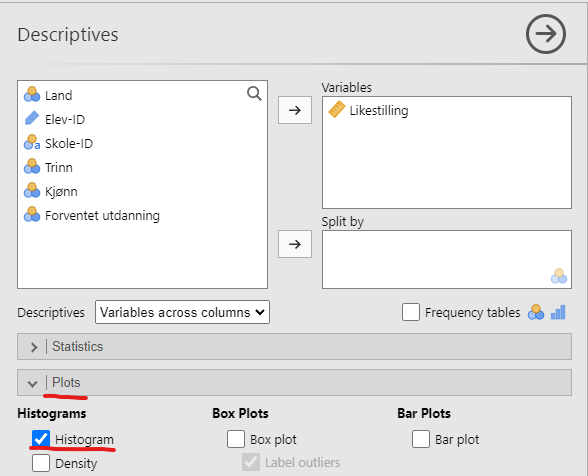
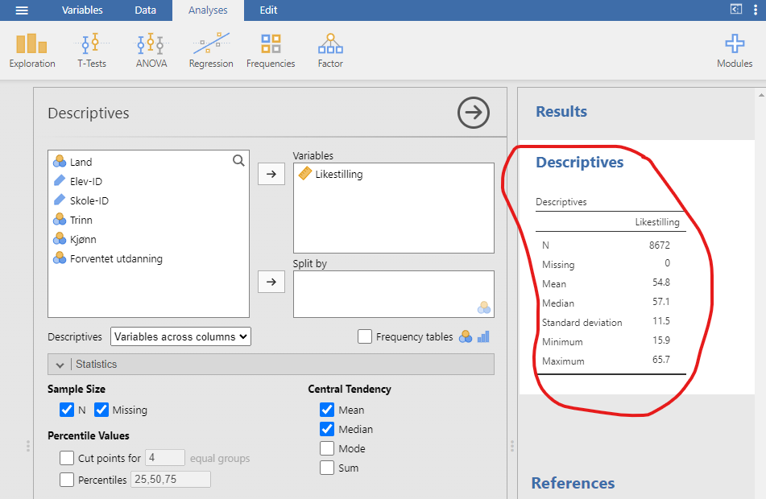
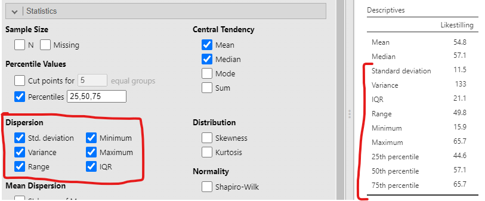
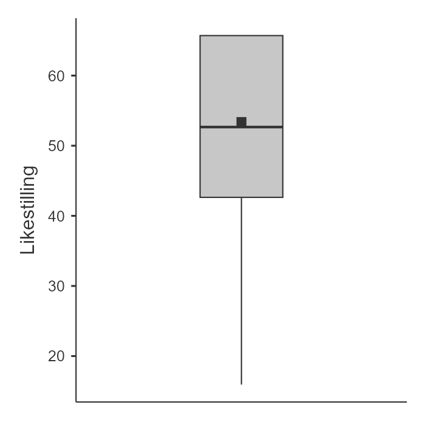

<!-- \placetextbox{0.26}{0.06}{\scriptsize{©2025 D.R. Foxcroft and D.J. Navarro,}} -->
<!-- \placetextbox{0.195}{0.05}{\scriptsize{CC BY-SA 4.0}} -->
<!-- \placetextbox{0.70}{0.06}{\scriptsize{\url{https://doi.org/10.11647/OBP.0333.04}}} -->

# Å beskrive én variabel {#sec-descriptive}

```{r}
#| include: FALSE
source("chapter_header.R")
```

Hver gang du skal analysere et nytt datasett, må du finne måter å beskrive dataene på en kompakt og lett forståelig måte. Dette kalles **deskriptiv statistikk**, eller beskrivende statistikk. I denne boka er det to kapitler om deskriptiv statistikk, dette kapittelet og det neste. I dette kapittelet beskriver vi én variabel, og i neste kapittel beskriver vi sammenhengen mellom flere variable.

Videre kan man dele inn deskriptiv statistikk i to. For det første kan vi regne ut tall som skal beskrive dataene, for eksempel kan vi regne ut gjennomsnittet. Et slikt tall man regner ut basert på datamaterialet kalles en *observator*, og uttales med samme trykk som "alligator". For det andre kan vi lage et diagram som viser dataene, for eksempel et søylediagram. Diagrammer kan også kalles figurer eller plott. I de neste to kapitlene lærer du om vanlige observatorer og diagrammer man bruker for å beskrive data.


::: {.callout-warning}

## Ikke tenk at du beskriver populasjonen

Merk deg at deskriptiv statistikk kun beskriver de dataene som er samlet inn, altså utvalget. Ofte ønsker man å generalisere til en populasjon, men da må man bruke inferensiell statistikk, noe du lærer i @sec-inferential. 
:::

```{r}
ICCS <- readRDS("data_and_tables/ICCS.RDS")

n_elever <- nrow(ICCS)
```

Rå data er sjelden informative i seg selv. Jeg har forberedt et lite datasett fra den store internasjonale undersøkelsen ICCS, International Civic and Citizenship Education Study. Dette datasettet inneholder variable for kjønn, skole, land, trinn, forventet høyeste fullførte utdanning og en samlevariabel for hvor enig man er i at kjønnene bør ha like rettigheter. Datasettet har `r n_elever` rader, én rad for hver elev, men vi viser bare 50 rader. Se i @tbl-ICCS-data for å se hva dataene viser.

```{r}
#| label: tbl-ICCS-data
#| tbl-cap: Noen få av variablene fra ICCS-studien.
set.seed(123)
utvalg <- ICCS |>
  slice_sample(n = 50)
utvalg |>
  tt() |>
  theme_tt("spacing")
```

Nå, ble du noe klokere? Jeg tipper du ikke ble noe klokere, og at du lengter etter å få dataene omarbeidet og presentert på en eller annen måte. Det er det som kalles deskriptiv statistikk -- å gjøre rå data om til tall og figurer som gir innsikt.

Nå til dags gjør man all statistikk på en datamaskin, så la oss vise dataene i et statistikkprogram, jamovi. For å gjøre dette åpner vi filen *[ICCS.csv](data_and_tables/ICCS.csv)*, se @fig-descriptive-ICCS-data.

```{r}
#| label: fig-descriptive-ICCS-data
#| fig-cap: Et skjermbilde av jamovi som viser variablene lagret i filen *ICCS.csv*
#| fig-alt: Et jamovi-skjermbilde viser et dataanalysegrensesnitt med 7 kolonner. Én kolonne med numeriske data er merket "likestilling".
#| out-width: "100%"
knitr::include_graphics("images/fig-descriptive-ICCS-data.png")
```

For å få en forståelse av dataene, må vi beskrive dem med observatorer og diagrammer, altså tall og figurer. Vi organiserer kapittelet etter typen variabel vi analyserer: først kategoriske variable (nominelle og ordinale), deretter kontinuerlige variable (intervall- og forholdstallsnivå). De kategoriske variablene er markert med et symbol med tre fargede sirkler i jamovi, og er altså _Land_, _Trinn_, _Kjønn_ og _Forventet utdanning_.

## Kategoriske variable

Hvis du titter på *Forventet utdanning* i @fig-descriptive-ICCS-data vil du se at den har verdiene "Høyere utdanning", "Kort utdanning", "VGS", "Delvis VGS" og "Ungdomsskole". Denne variabelen viser hva elevene ser for seg at de har som høyeste utdanning når de er ferdige å studere. Hvordan ville du analysert denne variabelen? Sannsynligvis på de to måtene du skal lære nå.

### Frekvenstabeller

En av de mest grunnleggende oppgavene innen dataanalyse er å telle opp hvor mange du har av de ulike verdiene for nominelle og ordinale variable. For variabelen *Forventet utdanning* vil dette si å telle opp hvor mange som ser for seg å ta høyere utdanning, en kort utdanning, kun VGS eller kanskje stoppe etter ungdomsskolen. Siden et slikt antall kalles en *frekvens* kalles tabellen der man viser opptellingen for en **frekvenstabell**. 

Frekvenstabellen vises i @fig-descriptive-jamovi-frequency. Denne laget jeg i statistikkprogrammet jamovi. Jeg trykket først på "Analyses", deretter på "Exploration" og "Descriptives. I menyen som dukker opp er det en avkryssingsboks som heter "Frequency tables", se @fig-descriptive-jamovi-frequency. Jeg lastet inn _Forventet utdanning_ i "Variables" og krysser av for "Frequency tables".

```{r}
#| label: fig-descriptive-jamovi-frequency
#| fig-cap: Frekvenstabell for _Forventet utdanning_
#| out-width: "100%"


```

Frekvenstabellen er til høyre i figuren. De viser en opptelling av _Forventet utdanning_-variabelen. Radene svarer til ulike verdier av _Forventet utdanning_. I "Counts"-kolonnen finner du hvor mange det var av hver verdi, altså frekvensen. I tillegg har tabellen litt ekstra snadder. Kolonnen "% of Total" viser hvor mange prosent av totalen dette antallet utgjør. I "Cumulative %" summerer man de foregående prosentene. Slik ser man at 66,5 % av elevene skal ha "Høyere utdanning" eller "Kort utdanning".

Stort mer er det ikke å si om frekvenstabeller. Annet enn hvordan man lager et diagram for å illustrere.

### Stolpediagram {#sec-diagram-bar}

Frekvenstabeller er enkle å lage og lese, men ofte er en visualisering enda mer slående. For nominelle og ordinale data er **stolpediagrammet** den vanligste visualiseringen. 

For å tegne et stolpediagram i jamovi trykker du på det samme som for frekvenstabellen, "Analyses" → "Exploration" → "Descriptives", akkurat som for frekvenstabellen. Nå, derimot, må du trykke på "Plots" og krysse av for "Bar plot", se @fig-diagram-jamovi-bar. I figuren har vi lagt til "Forventet utdanning" i variabelvinduet. Voilá, et flott stolpediagram. Siden "Forventet utdanning" er en ordinal variabel er stolpene tilogmed sortert i riktig rekkefølge.

```{r}
#| label: fig-diagram-jamovi-bar
#| fig-cap: Et stolpediagram over "Forventet utdanning" i jamovi.
#| out-width: "100%"

```

Som du ser av figuren er den langt fra optimal -- navnene på verdiene er så vide at de overlapper hverandre og blir uleselige! I jamovi er det ingen enkel måte å endre dette på. Det kanskje enkleste er å gå på "Variables" → "Edit" og skrive inn kortere navn på verdiene, for eksempel "Hø.Utd." i stedet for "Høyere utdanning". Der ser du med en gang at å lage figurer i jamovi er enkelt, men at å gjøre tilpasninger kan være klønete.

Hvis du vil sammenligne stolpediagram mellom undergrupper -- for eksempel sammenligne forventet utdanning mellom land -- kan du bruke "Split by" i jamovi. Du lærer mer om slike undergruppeanalyser i neste kapittel, @sec-associations.

### Typetallet {#sec-mode}

```{r}
five_first <- head(utvalg, 5)
kjonn <- five_first |>
  dplyr::pull(`Kjønn`)
```

Typetallet til en variabel er den verdien som forekommer hyppigst. Typetallet er det eneste sentraltendensmålet som fungerer for nominelle variable -- hverken median eller gjennomsnitt gir mening når verdiene ikke har noen naturlig rekkefølge eller tallverdi. En nominell variabel i ICCS-dataene er _Kjønn_, som har de tre mulige verdiene Jente, Gutt og Annet. Typetallet til _Kjønn_ vil si oss hvilket kjønn det er flest av i dataene. De fem første elevene i datasettet er:

> `r kjonn`.

Typetallet til _Kjønn_ for disse 5 elevene er Gutt fordi det var flest av den verdien.

For å finne typetallet i hele datasettet må vi telle opp hvor mange det er av Jente, Gutt og Annet. Det gjør vi enklest med en **frekvenstabell**, slik vi laget tidligere i kapittelet. I jamovi trykker vi "Analyses" → "Exploration" → "Descriptives", legger _Kjønn_ i "Variables" og krysser av for "Frequency tables", se @fig-descriptive-jamovi-frequency-table.

```{r}
#| label: fig-descriptive-jamovi-frequency-table
#| fig-cap: Et skjermbilde av jamovi som viser frekvenstabell til _Kjønn_.
#| fig-alt: Et skjermbilde av jamovi som viser frekvenstabell til _Kjønn_.
#| fig-pos: 'H'
#| out-width: "100%"

```

Av tabellen ser vi at Gutt er den hyppigste verdien, så typetallet til _Kjønn_ er Gutt.

Selv om typetallet er det eneste sentraltendensmålet som fungerer for nominelle variable, kan det også være nyttig å vite typetallet til en ordinal-, intervall- eller forholdstallsvariabel. For eksempel, hvis vi tenker oss tilbake til frekvenstabellen for _Forventet utdanning_ i @fig-descriptive-jamovi-frequency, så var _Høyere utdanning_ den hyppigste verdien. Typetallet til _Forventet utdanning_ er altså _Høyere utdanning_.

### Medianen for ordinale data {#sec-descriptive-median-ordinal}

```{r}
forventet_utdanning <- five_first |>
  dplyr::pull(`Forventet utdanning`)
```

For ordinale data kan vi i tillegg bruke **medianen**. Medianen er middelverdien når observasjonene er sortert i rekkefølge. Den fungerer når verdiene har en naturlig orden, selv uten tallverdier.

La oss se på _Forventet utdanning_ for de fem første elevene i utvalget:

> `r forventet_utdanning`.

Sorterer vi dem i rekkefølge får vi:

> `r sort(forventet_utdanning)`.

Middelverdien er `r sort(forventet_utdanning)[3]`, og det er altså medianen til _Forventet utdanning_ for disse fem elevene.

Vi kommer tilbake til medianen i @sec-descriptive-median, der vi bruker den på tallvariable og ser hvordan den står seg mot gjennomsnittet.

## Intermezzo: Variabelen _Likestilling_

I resten av kapittelet skal vi fokusere på variabelen _Likestilling_. Som du kanskje oppfattet fra @sec-measurement bør man først spørre seg hva variabelen egentlig måler. Dette er viktig nok til at vi bruker litt tid på det.

Jeg fant frem i dokumentasjonen til ICCS 2022 [@fraillon2024] at _Likestilling_  er en samlevariabel satt sammen av følgende Likert-spørsmål:

- Men and women should have equal opportunities to take part in government.
- Men and women should have the same rights in every way.
- Women should stay out of politics.
- When there are not many jobs available, men should have more right to a job than women.
- Men and women should get equal pay when they are doing the same jobs.
- Men are better qualified to be political leaders than women.

Alle spørsmålene virker jo å måle likestilling på en fin måte, men i Norge virker konstruktet litt tamt. Jeg tipper jo at alle vil være enige i disse spørsmålene. I Norge ville man kanskje stilt spørsmål som det er uenighet om, slik som kjønnskvotering til høyere utdanning eller fordeling av foreldrepermisjon, men det hadde sikkert ikke vært så relevant i de andre landene der ICCS avholdes. Og kanskje har ikke ungdomsskoleelever gjort seg opp en mening om foreldrepermisjon, slår det meg!

La oss se et diagram av variabelen før vi går videre, slik at vi skjønner hva det er vi skal beskrive, se @fig-diagram-ICCS-histogram.

```{r}
#| label: fig-diagram-ICCS-histogram
#| fig-cap: Et histogram av variabelen _Likestilling_ fra ICCS 2022.
#| fig-alt: Histogram som viser variabelen _Likestilling_. Den horisontale aksen (x-aksen) strekker seg fra fra 15 til 70, og den vertikale aksen (y-aksen) viser tetthet, altså hvor mange svar som havner innad i hver søyle.

source("R/jamovi-histogram.R")
ICCS |>
  jamovi_histogram(Likestilling, 16)
```

Vi ser at de fleste svarer veldig høyt på _Likestilling_, men at en betydelig andel svarer mye lavere.

## Kontinuerlige variable

Nå beveger vi oss over til tallvariable, altså data på intervall- eller forholdstallsnivå. For slike variable beskriver vi dataene med figurer (histogrammer, boksplott) og tall (sentraltendensmål og spredningsmål). Vi starter med histogrammer, slik at du ser hva du prøver å beskrive med tallene som følger.

### Histogrammer {#sec-histogram}

**Histogrammer** er blant de mest grunnleggende og nyttige måtene å visualisere data på. De fungerer best når du har tallvariable, altså data på intervall- eller forholdstallsnivå slik som variabelen _Likestilling_ fra ICCS-dataene, og ønsker å få et overordnet inntrykk. De fleste kjenner nok til histogrammer, siden de brukes så ofte, men la meg likevel forklare hvordan de fungerer.

Prinsippet er enkelt: Du deler opp de mulige verdiene i **intervaller** og teller hvor mange observasjoner som faller innenfor hvert intervall. Denne tellingen kalles frekvensen eller tettheten til intervallet og vises som en vertikal stolpe. Jeg tror noe av grunnen til at de oppfattes som så enkle er at de minner om stolpediagrammer. For variabelen _Likestilling_ finner vi for eksempel rundt 4000 elever som fikk max poengsum, noe som representeres av høyden på den høyre stolpen i histogrammet vi så i Intermezzoen (@fig-diagram-ICCS-histogram).

For å lage dette histogrammet i jamovi trykker vi "Analyses" → "Exploration" → "Descriptives" og velger "Plots" og "Histogram", se @fig-diagram-jamovi-ICCS-histogram.

```{r}
#| label: fig-diagram-jamovi-ICCS-histogram
#| fig-cap: Innstillingene man trenger for å få frem histogrammet i jamovi
#| out-width: "100%"

```

Problemet med histogrammer er at utseende deres er veldig avhengig av hvor mange stolper man lager. I @fig-diagram-histogram-bins ser vi den samme variabelen med litt forskjellig valg av antall stolper. De blir seende helt forskjellige ut.

```{r}
#| label: fig-diagram-histogram-bins
#| fig-cap: Det er ikke lett å si hva som er korrekt antall stolper i et histogram.
#| classes: .enlarge-image
#| out-width: 100%
#| fig-width: 8.571429

bins <-  c(5, 10, 20, 50)

p <- lapply(
  bins,
  function(bins){
    ICCS |>
      jamovi_histogram(Likestilling, bins = bins) +
      labs(title = paste("Antall stolper:",bins))
  }
)

library(patchwork)
(p[[1]] + p[[2]])/(p[[3]] + p[[4]])

```

Det finnes ingen fasit for antall stolper. Prøv flere alternativer og velg det som viser fordelingen tydeligst.

### Sentraltendensmål

Å tegne histogrammer er en flott måte å vise fram hovedbudskapet i dataene dine, men det kan også være nyttig å sammenfatte dataene med noen få enkle tall. Det første du som regel vil vite noe om, er **sentraltendensen**, altså hva som er "midten", "gjennomsnittet", "det typiske" av dataene. De to mest brukte sentraltendensmålene for tallvariable er gjennomsnitt og median.

#### Gjennomsnittet

```{r}
five_first <- head(utvalg, 5)
likestilling <- five_first |>
  dplyr::pull(Likestilling)
likestilling <- sprintf("%.1f", likestilling) |>
  as.numeric()
```


**Gjennomsnittet** er det vanlige gjennomsnittet du kjenner fra før. Du legger sammen alle verdiene og deler på antall verdier. De første fem verdiene på _Likestilling_ i @tbl-ICCS-data var

> `r likestilling`,

så gjennomsnittet blir:

$$\frac{42.6 + 62.9 + 52.7 + 37.6 + 42.6}{5} = \frac{238.4}{5} = 47.68$$

Dette er selvsagt ikke noe nytt for deg, siden du allerede er godt kjent med gjennomsnitt.

Det som kanskje er nytt for deg er hvordan man kan få statistikk-programvare til å gjøre regnejobben for oss! Når du har mange observasjoner, vi hadde `r n_elever`, er det mye lettere å regne ut ting digitalt.

Slik gjør man det i jamovi:

1. Klikk på "Exploration"-knappen
2. Velg "Descriptives"
3. Merk variabelen _Likestilling_
4. Klikk på høyre pil for å flytte den til 'Variables'-boksen

Straks du har gjort dette dukker en tabell med standard deskriptiv statistikk opp på høyre side av skjermen, som vist i @fig-descriptive-jamovi-mean. (Hvis du ikke finner 'Exploration'-knappen må du trykke på "Analyses" først.)

```{r}
#| label: fig-descriptive-jamovi-mean
#| fig-cap: Standard deskriptiv statistikk for variabelen _Likestilling_.
#| out-width: "100%"
#| fig-alt: Et skjermbilde fra jamovi som viser resultater fra deskriptiv analyse. Til venstre kan man velge variable og dele opp dataene. Til høyre vises deskriptiv statistikk for "Likestilling" med verdier for N, Missing, Mean, Median, Standard deviation, Minimum og Maximum.

```

Som du kan se i den røde markeringen i @fig-descriptive-jamovi-mean, viser resultatet at gjennomsnittsverdien for _Likestilling_ er 54,8. I tillegg får du annen nyttig informasjon som det totale antallet observasjoner (N = `r n_elever`)
^[Bokstaven _n_, enten den er stor eller liten, beskriver alltid utvalgsstørrelsen.],
antall manglende verdier, samt median-, minimum- og maksimumsverdier  og standardavviket for variabelen. ("Manglende verdier" er typisk at elever har unnlatt å svare på et spørsmål, eller at svaret var uleselig. Ingen verdier mangler i dette tilfellet, siden jeg fjernet manglende verdier da jeg forberedte dataene.)

Hva hvis vi skal regne ut gjennomsnittet av variabelen _Forventet utdanning_? De fem første verdiene av denne variabelen er

> `r forventet_utdanning`.

Hvordan skal man regne gjennomsnittet av dette? Det går ikke an, for man kan ikke legge sammen verdiene. Derfor kan man bare regne gjennomsnitt for variable med tall, altså variable på intervall- og forholdstallskala.

#### Medianen {#sec-descriptive-median}

Du møtte **medianen** kort under ordinale data i @sec-descriptive-median-ordinal: middelverdien i sorterte observasjoner. For tallvariable regner vi den på akkurat samme måte. Hvis vi tar de fem første verdiene av _Likestilling_ fra @tbl-ICCS-data igjen, får vi

> `r paste(likestilling, sep = "   ")`.

For å finne medianen sorterer vi disse tallene i stigende rekkefølge:

> `r paste(sort(likestilling), sep = "   ")`.

Da ser vi at `r sort(likestilling)[3]` står i midten, så `r sort(likestilling)[3]` er medianen.

Av og til er det ingen verdier i midten, for eksempel her:

> 1, 3, 5, 6, 10, 15

Her er både 5 og 6 like nære midten. Da er medianen definert til å være gjennomsnittet av disse to verdiene, altså 5,5.

Selvfølgelig er det uaktuelt å regne medianen for hånd med våre `r n_elever` verdier. Derfor bruker vi jamovi, som allerede har beregnet en medianverdi på `r median(ICCS$Likestilling) |> round(digits = 1)` for _Likestilling_, se i den røde markeringen i  @fig-descriptive-jamovi-mean.

Tips: Sørg for at du finner ut hva som er medianens største styrke i neste delkapittel.

#### Gjennomsnitt eller median? {#sec-descriptive-mean-or-median}

Det er ikke nok å vite hvordan man regner ut gjennomsnitt og medianer -- du må også forstå hva de forteller deg om dataene dine. Dette er illustrert i @fig-descriptive-weight. Tenk på gjennomsnittet som "tyngdepunktet" til datasettet ditt, mens medianen er "middelverdien" i dataene. Her er noen praktiske retningslinjer:

-   **For nominale data** kan du hverken bruke gjennomsnitt eller median.

-   **For ordinale data** vil medianen stort sett være det beste valget. Medianen bruker kun rekkefølgeinformasjonen i dataene dine (hvilke tall som er større) og trenger ikke eksakte tallverdier. Dette passer perfekt for ordinale data. Gjennomsnittet derimot, er avhengig av de presise tallverdiene. Det er likevel ganske vanlig å regne gjennomsnitt av variable på ordinalnivå. Da setter man, for eksempel, det laveste nivået til tallet 1, det neste nivået til tallet 2, osv.

-   **For tallvariable** er både median og gjennomsnitt fine valg!

Hva du velger av median og gjennomsnitt for å analysere tallvariable avhenger av hva du ønsker å fremheve.

```{r}
salaries <- data.frame(
  person = c("Arne", "Berit", "Cato", "Erling"),
  salary = c(50000, 60000, 65000, 30000000)
)
```

Vi må forklare med et eksempel. Tenk deg at Arne (månedsinntekt 50 000 kr), Berit (60 000 kr) og Cato (65 000 kr) sitter ved et bord. Gjennomsnittsinntekten ved bordet er 58 333 kr og medianinntekten er 60 000 kr. Begge disse er gode sentralverdier for dataene.

Så kommer Erling Braut Haaland og setter seg ved bordet (månedsinntekt 30 000 000 kr). Plutselig gjør gjennomsnittsinntekten et byks til
`r format(mean(salaries$salary), big.mark = " ", scientific = FALSE)` kr,
mens medianen kun stiger til
`r format(median(salaries$salary), big.mark = " ", scientific = FALSE)` kr!
Gjennomsnittsverdien representerer plutselig ikke de andre i det hele tatt, fordi den ekstreme verdien til Erling Braut Haaland trekker gjennomsnittet opp for mye. Medianen, derimot, ser ikke den ekstreme verdien i det hele tatt.

Medianens styrke er altså at den er robust mot ekstreme verdier. Gjennomsnittet kan likevel være relevant hvis du er interessert i den totale inntekten ved bordet, men hvis du vil vite hva som er en typisk inntekt ved Haaland-bordet, ville medianen gi deg et mye mer representativt bilde.

Dette illustreres også i @fig-descriptive-weight, hvor du kan se at når histogrammet er asymmetrisk, i dette tilfellet med noen ekstreme verdier langt til høyre, ligger medianen nærmere "hovedvekten" av dataene, mens gjennomsnittet blir trukket mot "halen" der de ekstreme verdiene befinner seg.

```{r}
#| label: fig-descriptive-weight
#| classes: .enlarge-image
#| fig-cap: En illustrasjon av forskjellen mellom hvordan gjennomsnittet og medianen bør tolkes. Gjennomsnittet er \"balansepunktet\" til datasettet. Hvis du forestiller deg at histogrammet av dataene er et klosser på et brett, så er gjennomsnittet balansepunktet. Medianen den midterste observasjonen, og halvparten av klossene lenger til venstre og halvparten og halvparten lenger til høyre.
#| fig-alt: "Et stolpediagram på venstre side har 48 observasjoner og ligner på et trappetrinnmønster med avtagende høyder fra venstre til høyre. Teksten lyder\\: \"Gjennomsnittet er 'balansepunktet' til dataene.\" Under diagrammet er det en horisontal linje merket \"balansepunkt\" med et trekantet støttepunkt som symboliserer balanse. Det samme stolpediagrammet vises på høyre side med dataene delt inn i to grupper på 24 observasjoner. Den venstre gruppen er skyggelagt i lys grå, og den høyre gruppen er skyggelagt i mørk grå. En pil peker på den 24. observasjonen med teksten \"Medianen er den 'midterste observasjonen' i datasettet\""
#| fig-pos: 'H'
knitr::include_graphics("images/fig-descriptive-weight.png")
```

Valget mellom gjennomsnitt og median er viktig når dataene har en hale som trekker opp eller ned gjennomsnittet. Et eksempel er at USA har høyere gjennomsnittsinntekt enn Norge, men lavere medianinntekt. Årsaken er at USA har flere superrikinger som trekker opp gjennomsnittet på samme måte som Erling Braut Haaland gjorde i eksempelet. Men den vanlige lønnstager sin inntekt er mer lik medianinntekten, og en vanlig lønnstager tjener mer i Norge.

### Spredningsmål {#sec-descriptive-dispersion}

Alt vi har sett på så langt handler om sentraltendens, altså hvilke verdier som ligger "i midten" eller som er mest "typiske" i dataene våre. I tillegg trenger vi ofte å å forstå hvor spredt dataene er. Ligger de fleste observasjonene tett rundt gjennomsnittet, eller er de spredt jevnt utover? Dette kaller vi **spredning**.

La oss utforske fire ulike måter å måle spredning på ved hjelp av ICCS-dataene. Hvert spredningsmål har sine egne fordeler og ulemper, så det er nyttig å kjenne til flere.

#### Variasjonsbredde {#sec-descriptive-range}

**Variasjonsbredden** er det aller enkleste spredningsmålet. Den regnes ut ved å ta den største verdien minus den minste verdien. I @fig-descriptive-jamovi-dispersion ser du hvordan du finner variasjonsbredden i jamovi.

```{r}
#| label: fig-descriptive-jamovi-dispersion
#| classes: .enlarge-image
#| fig-cap: Et skjermbilde av hvordan man finner ulike spredningsmål i jamovi
#| fig-alt: Et skjermbilde av jamovi som likner på de foregående, men der boksene for "Dispersion" er krysset av; Std. deviation, Variance, Range, Minimum, Maximum
#| fig-pos: 'H'
#| out-width: "100%"

```

Variasjonsbredden er lett å forstå, men har en egenskap som ofte er en ulempe: den påvirkes veldig av ekstreme verdier.

Se for deg denne lille datamengden:
-100, 2, 3, 4, 5, 6, 7, 8, 9, 10

Her får vi en variasjonsbredde på hele 110 på grunn av den ene ekstreme verdien (-100). Men hvis vi fjerner denne ekstreme verdien, blir variasjonsbredden bare 8. Det er en enorm forskjell! Dette må man være obs på når man benytter variasjonsbredden.

#### Kvartilbredde

```{r}
quantiles <- sprintf(
  "%.1f",
  quantile(
    ICCS$Likestilling,
    c(.25, .5, .75)
    )
)
kvartilbredde <- sprintf(
  "%.1f",
  IQR(ICCS$Likestilling)
)
```


**Kvartilbredden** er litt som variasjonsbredden, men i stedet for å regne ut forskjellen mellom den største og minste verdien, regner vi ut forskjellen mellom tjuefemte persentil og syttifemte persentil. Ordet "kvartil" henspiller på "kvart" og "persentil", og som vi skal se må man regne ut hvor hver kvart av dataene ligger.

Hvis du kjenner begrepet **persentil** fra før, kan du tenke på det slik: den 10. persentilen til en variabel er det minste tallet x slik at 10% av verdiene ligger under denne verdien. Dette er faktisk ikke helt nytt -– medianen er nemlig den femtiende persentilen siden femte prosent av verdiene ligger under denne verdien! I jamovi finner du enkelt hvilken som helst persentil ved å huke av for "Percentiles" under 'Exploration' → 'Descriptives' → 'Percentile Values'.

Som du kan se tilbake i @fig-descriptive-jamovi-dispersion, tilsvarer kvartilbredden (_interquartile range, IQR_) for variabelen _Likestilling_ differansen mellom 25. og 75. persentil, altså `r quantiles[3]` - `r quantiles[1]` = `r kvartilbredde`. Siden 25% av dataene er mindre enn `r quantiles[1]` og 75% av dataene er mindre enn `r quantiles[3]`, ligger 50% av dataene i et intervall som er `r kvartilbredde` bredt. Legg også merke til at 50. persentil og medianen har samme verdi, `r quantiles[2]`, akkurat slik det skal være. I forskningsartikler oppsummeres alt dette slik:

> The median value of _gender equality_ was `r paste(quantiles[2], "(IQR = ", quantiles[1], "--", quantiles[3])`)."

Dette er en effektiv måte å vise sentraltendens og spredning. Medianen viser hva midtpunktet i dataene er og kvartilbredden viser hvor spredt halvparten av verdiene ligger rundt medianen. Merk at kvartilbredden ikke fungerer like godt for å vise spredningen rundt et gjennomsnitt. Årsaken er at gjennomsnittet kan ligge utenfor 25. og 75. persentil. (Bare tenk på kvartilbredden og gjennomsnittslønna når Haaland satte seg ved bordet i eksempelet i @sec-descriptive-mean-or-median.)

Variasjonsbredden var veldig påvirket av ekstreme verdier, men kvartilbredden er ikke det -- den ignorerer de 25% av dataene som har størst verdi og de 25% av dataene som har minst verdi.

Kvartilbredden fungerer teknisk sett også for ordinale data, men i praksis brukes den nesten utelukkende på tallvariable.

#### Standardavvik og varians {#sec-descriptive-sd}

De to spredningsmålene vi har sett på så langt er differanser, enten mellom største og minste verdi eller mellom tjuefemte og syttifemte persentil. En annen tilnærming er å regne ut hvor stort et "typisk" avvik er fra gjennomsnittet. Det mest brukte spredningsmålet som gjør dette er **standardavviket**.

```{r}
likestilling_mean = mean(ICCS$Likestilling)
likestilling_sd = sd(ICCS$Likestilling)
```

Standardavviket er uttrykt i de samme enhetene som de opprinnelige dataene, noe som gjør det intuitivt å forstå. Hvis vi for eksempel gjennomfører en 12 minutters løpstest i kroppsøving for alle elevene på skolen og finner at gjennomsnittlig løpslengde er 2300 meter med et standardavvik på 400 meter, betyr det at et "typisk" avvik fra gjennomsnittet er 400 meter.

Standardavviket bygger på **variansen**, som er gjennomsnittlig _kvadratisk_ avvik fra gjennomsnittet. Variansen er vanskelig å tolke direkte fordi den bruker kvadrerte enheter -- fra jamovi ser vi at variansen til _Likestilling_ er 133 "kvadratlikestillingspoeng", noe som gir lite mening. Standardavviket løser dette ved å ta kvadratroten av variansen, og dermed komme tilbake til de opprinnelige enhetene. Du vil sjelden se variansen rapportert direkte, men den er grunnlaget for mange statistiske metoder og dukker opp igjen i senere kapitler.

En vanlig tommelfingerregel er at 68% av dataene faller innenfor 1 standardavvik fra gjennomsnittet og 95% innenfor 2 standardavvik. Denne regelen passer godt hvis histogrammet er symmetrisk og "klokkeformet", men kan være svært misvisende ellers. @fig-descriptive-sd-ICCS viser dette tydelig for de ekte ICCS-dataene.

```{r}
#| include: FALSE

breaks <- c(-Inf, seq(likestilling_mean - 2*likestilling_sd, likestilling_mean + 2*likestilling_sd, likestilling_sd),Inf)
category <- cut(ICCS$Likestilling, breaks)
levels <- c(">2sd", "<2sd", "<1sd")
levels(category) <- c(levels[1:3],levels[3:1])
rule_of_thumb <- category |> table() |> prop.table() |> rev() |> cumsum()
rule_of_thumb <- sprintf("%1.0f%%", rule_of_thumb*100)

```

```{r out.width="100%"}
#| label: fig-descriptive-sd-ICCS
#| classes: .enlarge-image
#| fig-cap: Den faktiske variabelen _Likestilling_ fra ICCS-dataene med ett og to standardavvik markert. Denne variabelen er overhodet ikke normalfordelt, så tommelfingerregelen gjelder ikke -- `r rule_of_thumb[1]` av verdiene er innenfor ett standardavvik og `r rule_of_thumb[2]` innenfor to.
#| fig-width: 8.571429

source("R/two-sd-histogram.R")
two_sd_histogram(ICCS$Likestilling, 10, 100, x_label = "Likestilling")

```

La dette være en advarsel mot å kun basere seg på sentraltendens og spredningsmål: figurer gir ofte et bedre bilde enn tallene alene.

Når man rapporterer standardavviket i en forskningsartikkel gjøres det gjerne slik:

> The mean of the variable _Gender equality_ was `r sprintf("%1.1f (SD = %1.1f)", likestilling_mean, likestilling_sd)`.

Her står SD for _standard deviation_, som er engelsk for standardavvik.

#### Hvilket mål skal du bruke?

Vi har gitt deg fire ulike spredningsmål: variasjonsbredde, kvartilbredde, varians og standardavvik. Vi oppsummerer egenskapene deres fort

-   **Variasjonsbredde**: Viser avstanden mellom den største og minste verdien i dataene. Variasjonsbredden påvirkes lett av ekstremverdier, så den brukes vanligvis kun når du har spesielle grunner til å fokusere på ytterpunktene.

-   **Kvartilbredde**: Beskriver hvor "den midterste halvdelen" av dataene befinner seg. Den er robust mot ekstremverdier og passer perfekt sammen med medianen. Et godt valg!

-   **Varians**: Grunnlaget standardavviket er utledet fra. Variansen bruker kvadrerte enheter og er derfor vanskelig å tolke direkte, men den er nyttig i videre statistikk.

-   **Standardavvik**: Er kvadratroten av variansen. Den kombinerer matematisk nytteverdi og praktisk tolkbarhet siden den bruker samme enheter som dataene. Den klare favoritten når gjennomsnittet er ditt foretrukne sentralmål. Standardavviket er definitivt det mest brukte variasjonsmålet!

Kort fortalt: kvartilbredde og standardavvik er de to klart mest populære valgene for å beskrive variabilitet, men variansen er den nyttigste i senere utregninger. Variasjonsbredden bruker mange studenter som spredningsmål i mastergradene sine, sikkert fordi den er så intuitiv, så det er viktig å vite om dens styrker og svakheter også.

### Boksplott

Et flott alternativ til histogrammer er **boksplott**. Ideen bak et boksplott er å gi deg en rask og tydelig visuell oversikt over medianen, kvartilbredden og variasjonsbredden i dataene dine. Siden denne informasjonen var enkel å regne ut også før datamaskiner ble vanlig, og fordi boksplott presenterer all denne informasjonen på en kompakt måte, er boksplott blitt populære -- spesielt når du utforsker dataene for første gang og prøver å forstå hva de forteller deg. Vi tar en titt på variabelen _Likestilling_, se i @fig-diagram-boxplot-equality. For å lage et boksplott i jamovi trykker du på akkurat de samme knappene som for et histogram, du bare krysser av for "Box plot" i stedet for.

```{r}
#| label: fig-diagram-boxplot-equality
#| fig-cap: Et boksplott av variabelen _Likestilling plottet med jamovi

```

Den tykke linjen midt i boksen viser medianen. Av og til er det en firkantet stor prikk, og da viser den gjennomsnittet. Selve boksen dekker området fra 25. persentil til 75. persentil. De tynne linjene viser variasjonsbredden ved at de strekker seg ut til de mest ekstreme datapunktene i hver retning, i hvert fall nesten. Som vi skrev i @sec-descriptive-range, så er variasjonsbredden veldig følsom for hvor ekstreme de mest ekstreme verdiene er. Derfor viser de fleste boksplott ikke variasjonsbredden, men kutter strekene ved en eller annen grense. Som standard er denne grensen satt til 1,5 ganger kvartilbredden (IQR). Hvis noen observasjoner faller utenfor dette området, vises de som prikker eller sirkler i stedet for. Disse kalles **avviksverdier** (_outliers_ på engelsk).
^[Av naturlige årsaker blir dette ofte oversatt til "uteliggere" på norsk. Av like naturlige årsaker velger jeg å _ikke_ benytte ordet "uteligger" for avviksverdiene.]

I våre _Likestilling_-data er det ingen observasjoner som faller utenfor normalområdet, så det er ingen avviksverdier og derfor ingen prikker. En annen spesiell egenskap ved plottet er at det ikke er noen strek som går oppover. Grunnen til det er at det er ingen verdier som er høyere enn 75. persentil fordi det var så mange elever som fikk toppskår på _Likestilling_.

Boksplottet kommer virkelig til sin rett når man sammenlikner undergrupper, slik du ser i @sec-associations-subgroup.

## Skjevhet

Skjevhet er et mål på asymmetri. En variabel er symmetrisk hvis høyre og venstre side av histogrammet er speilbilder av hverandre. Vi sier at variabelen er **negativt skjev** (venstreskjev) hvis den har en lengre hale til venstre, og **positivt skjev** (høyreskjev) hvis den har en lengre hale til høyre. @fig-descriptive-skew viser de tre tilfellene.

```{r out.width="100%"}
#| label: fig-descriptive-skew
#| classes: .enlarge-image
#| fig-cap: En illustrasjon av skjevhet. Til venstre har vi et negativt skjevt datasett, i midten har vi et datasett uten skjevhet, og til høyre har vi et positivt skjevt datasett
#| fig-alt: Tre stolpediagram demonstrerer henholdsvis negativ skjevhet, ingen skjevhet og positiv skjevhet. Diagrammet til venstre viser en lengre hale til venstre, det midterste diagrammet er symmetrisk, og diagrammet til høyre viser en lengre hale til høyre
#| fig-width: 8.571429

x1 <- tidyr::as_tibble(rbeta(n = 100000, shape1= 10, shape2 = 2))
x2 <- tidyr::as_tibble(rbeta(n = 100000, shape1= 10, shape2 = 10))
x3 <- tidyr::as_tibble(rbeta(n = 100000, shape1= 2, shape2 = 10))
X <- list(x1,x2,x3)
X_labels <- c(
  "Negativ skjevhet\nVenstreskjev fordeling",
  "Ingen skjevhet\nSymmetrisk fordeling",
  "Positiv skjevhet\nHøyreskjev fordeling")
skewplots <- lapply(1:3, function(i) {
  ggplot(X[[i]], aes(x=value)) +
    geom_histogram(binwidth=0.04, col="white", fill=blueshade, alpha=0.6) +
    ggtitle(X_labels[[i]]) +
    theme(
        axis.title.x = element_blank(),
        axis.line.x = element_blank(),
        axis.text.x = element_blank(),
        axis.ticks.x = element_blank(),
        axis.title.y = element_blank(),
        axis.text.y = element_blank(),
        axis.ticks.y = element_blank(),
        axis.line.y = element_blank(),
        plot.title = element_text(hjust = 0.5, size = rel(1))) #fra 0.6
  })
library(patchwork)
skewplots[[1]] + skewplots[[2]] + skewplots[[3]]
```

Skjevhet har en praktisk konsekvens for valget mellom gjennomsnitt og median. Hvis dataene er skjeve, vil gjennomsnittet bli trukket mot den lange halen, mens medianen forblir nær "hovedvekten" av dataene. Derfor er medianen ofte et bedre valg for skjeve data, slik vi diskuterte i @sec-descriptive-mean-or-median.

## Profesjonelle grafer

Alle grafene i dette kapittelet er lagd i jamovi, og jamovi tegner standardgrafer som er tydelige og minimalistiske. Hva skiller dem fra mer forseggjorte grafer? Stort sett fargevalg og tekst-annoteringer som må skreddersys til hver graf. Se for eksempel på stolpediagrammet i @fig-diagram-owid-bar. Det er et vanlig stolpediagram, men

- det er lagt horisontalt slik at teksten skal bli lettere å lese,
- hver søyle er markert med prosenter,
- aksene er fjernet,
- farger er brukt for å vise grupper av søyler,
- Tittel og figurnoter forteller hele historien.

Alt i alt blir øyet ledet rundt i figuren slik at den samlet sett forteller en interessant historie om globale utdanningsforskjeller.

```{r}
#| label: fig-diagram-owid-bar
#| fig-cap: Et profesjonelt stolpediagram. Legg merke til forklarende tekst og farger. Grafen er laget av Roser -@roser2022. Utgitt under lisensen CC-BY.
#| classes: .enlarge-image
#| out-width: "100%"
knitr::include_graphics("images/fig-diagram-owid-bar.png")
```

Det var et standard stolpediagram -- andre diagrammer er spesiallagde. Se for eksempel på @fig-diagram-owid-line, som på en fantastisk måte viser at ungene lærer mer i Sør-Korea, Finland og Nederland enn i Brasil og Uruguay, selv hvis man sammenlikner familier med samme kjøpekraft.

```{r}
#| label: fig-diagram-owid-line
#| fig-cap: Et profesjonelt linjediagram. Legg merke til forklarende tekst og farger. Grafen er laget av Roser -@roser2022. Utgitt under lisensen CC-BY.
#| classes: .enlarge-image
#| out-width: "100%"
knitr::include_graphics("images/fig-diagram-owid-line.png")
```

Andre visualiseringer er enda mer spesialiserte, som for eksempel for [å vise hvordan amerikanere tilbringer dagene sine](https://flowingdata.com/2015/12/15/a-day-in-the-life-of-americans/) eller hele denne saken fra NRKs team med data-journalister som [visualiserer naturnedbygging i Norge](https://www.nrk.no/dokumentar/xl/nrk-avslorer_-44.000-inngrep-i-norsk-natur-pa-fem-ar-1.16573560). Det er lov å la seg inspirere!

## Lagre bildefiler med jamovi

Du lurer kanskje på hvordan du lagrer alle grafene vi har laget. Bare høyreklikk på grafen og eksporter det til en fil. Du kan velge mellom flere formater som "png", "eps", "svg" eller "pdf". Alle disse formatene gir deg høy kvalitet på bildene, perfekt for å dele med kolleger, inkludere i oppgaver eller bruke i artikler og presentasjoner, men ".png" er trolig det som vil samarbeide best med Microsoft Word.

## Oppsummering

Å beregne grunnleggende deskriptive statistikk og lage gode figurer er blant de første tingene du gjør når du analyserer data. Deskriptiv statistikk beskriver utvalget, og har altså ingenting med verdiene for populasjonen.

Vi har dekket disse temaene:

-   **Kategoriske variable**: Vi viste hvordan man lager [Frekvenstabeller] og [Stolpediagram][Stolpediagram] for nominelle og ordinale data, og hvordan man finner [Typetallet].
-   **Histogrammer**: [Histogrammer] viser fordelingen av tallvariable og er ofte det mest informative verktøyet.
-   **Mål for sentraltendens**: [Gjennomsnittet][Sentraltendensmål] og [medianen][Sentraltendensmål] forteller deg hvor dataene dine har sin "kjerne". Bruk medianen hvis dataene er skjeve; bruk gjennomsnittet ellers.
-   **Mål for spredning**: [Spredningsmål] viser deg hvor "spredt" dataene dine er. De viktigste målene er kvartilbredde og standardavvik, mens varians spiller en nøkkelrolle i videre statistikk.
-   **Boksplott**: [Boksplott] er en kompakt måte å visualisere spredning og sentraltendens, spesielt nyttig for å sammenligne undergrupper.
-   **Skjevhet**: [Skjevhet] måler om variabelen er symmetrisk fordelt, og påvirker valget mellom gjennomsnitt og median.
