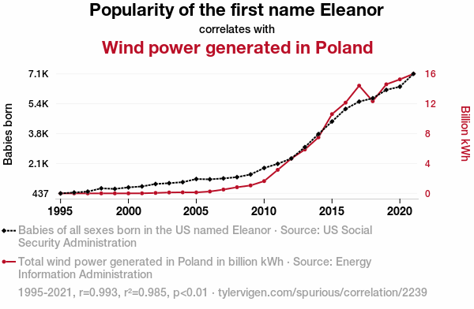
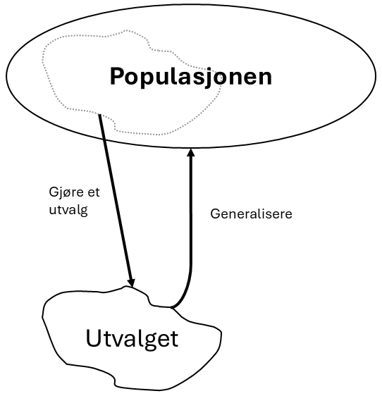
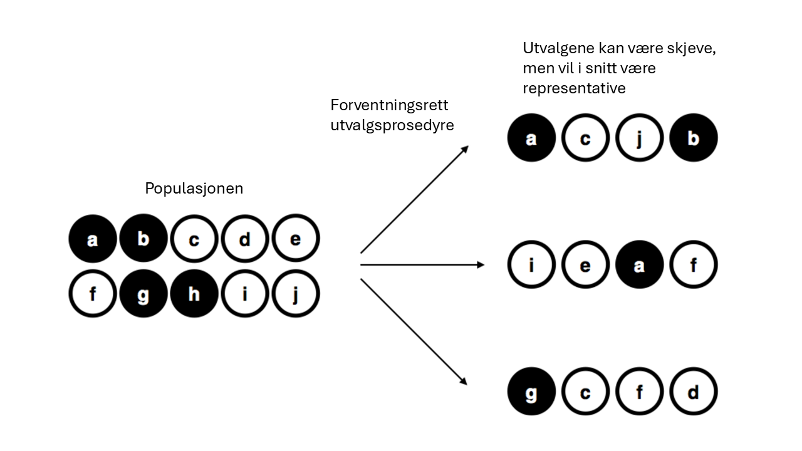
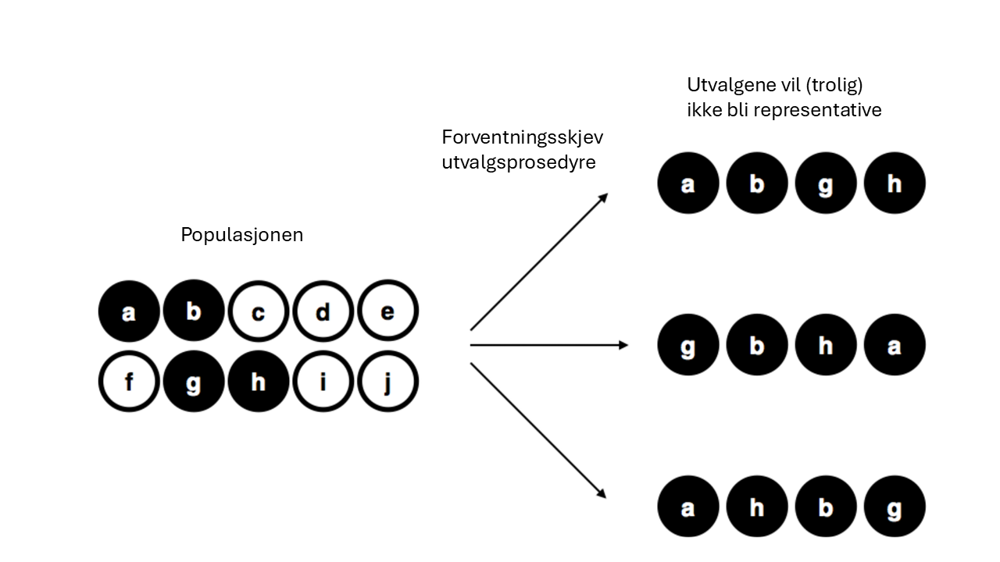

\placetextbox{0.26}{0.06}{\scriptsize{©2025 D.R. Foxcroft and D.J. Navarro,}}
\placetextbox{0.195}{0.05}{\scriptsize{CC BY-SA 4.0}}
\placetextbox{0.70}{0.06}{\scriptsize{\url{https://doi.org/10.11647/OBP.0333.01}}}

# Forskningsdesign i kvantitativ metode

```{r}
#| include: FALSE
source("chapter_header.R")
```

## Formålet med forskningen {#sec-purposes}

### Beskrive

Beskrivende forskning er en av de mest grunnleggende formene for kvantitativ forskning i utdanningsfeltet. Beskrivende kvantitativ forskning har som hovedformål å gi et systematisk og nøyaktig bilde av hvordan en eller flere variabler fordeler seg i en bestemt populasjon. Denne typen forskning søker å svare på spørsmål som "hva", "hvor mange" og "hvor mye", men ikke nødvendigvis "hvorfor". I utdanningsforskning kan beskrivende studier for eksempel kartlegge:

- Gjennomsnittlig karakternivå på videregående skoler i ulike fylker
- Ungdomsskolelæreres utdanningsbakgrunn
- Leseferdighetene til femteklassinger i Norge

Disse eksemplene beskriver bare én variabel av gangen. Her ønsker forskeren å få oversikt over hvordan denne variabelen ser ut i populasjonen. Dette kan innebære å beregne sentralmål som gjennomsnitt, median og typetall, samt spredningsmål som standardavvik og variasjonsbredde, eller å vise dataene med en passende figur.

Ofte er forskere interessert i å beskrive sammenhenger mellom to eller flere variabler.  Et klassisk eksempel fra internasjonal utdanningsforskning er å undersøke sammenhengen mellom elevers leseferdigheter og hvilket land de kommer fra. Gjennom studier som PISA (Programme for International Student Assessment) kan forskere beskrive hvordan leseferdighetene varierer systematisk mellom land. De kan rapportere at elever i Norge i gjennomsnitt skårer lavere enn elever i Finland, uten nødvendigvis å forklare hvorfor denne forskjellen eksisterer.

Beskrivende forskning er viktig selv om den ikke gir oss forklaringer på hvorfor noe skjer. Beskrivende studier gir oss:

- **Oversikt over status quo**: Hvor står vi i dag innenfor et bestemt område?
- **Grunnlag for sammenligning**: Hvordan ser situasjonen ut i ulike grupper eller kontekster?
- **Identifikasjon av mønstre**: Finnes det systematiske forskjeller eller likheter som fortjener nærmere oppmerksomhet?
- **Utgangspunkt for årsaksforklaringer**: Hvilke sammenhenger observerer vi som kan undersøkes videre?

Beskrivende forskning er derfor ikke bare et første steg, men en verdifull forskningsaktivitet i seg selv som bidrar til å bygge kunnskapsgrunnlaget i utdanningsfeltet.

### Predikere

Prediksjon er et viktig formål innen utdanningsforskning som handler om å forutsi fremtidige utfall basert på tilgjengelig informasjon. I motsetning til beskrivende studier som fokuserer på å kartlegge eksisterende forhold, har prediksjonsbasert forskning som mål å kunne si noe om hva som vil skje i fremtiden.

En av de mest utbredte anvendelsene av prediksjon i utdanningsfeltet er kartleggingsprøver. Disse prøvene administreres tidlig i elevenes skoleløp, ofte på 1.-3. trinn, med det formål å identifisere elever som kanskje ikke vil klare å tilegne seg lærestoffet uten ekstra tilrettelegging. Målet er å kunne sette inn tiltak på et tidlig tidspunkt, før problemene blir for store. Kartleggingsprøver i lesing kan for eksempel teste elevers fonologiske bevissthet, bokstavkunnskap og avkodingsferdigheter. Basert på resultatene fra disse prøvene ønsker man å predikere hvilke elever som vil ha vanskeligheter med å følge ordinære undervisning. Elever som scorer lavt på slike prøver, kan dermed få tilbud om intensivert opplæring eller spesialundervisning.

Et sentralt problem med prediksjonsmodeller er at de forutsigelsene man ønsker å gjøre, ofte baserer seg på data som er generert under andre forhold enn de dataene modellen skal benyttes på. For eksempel kan en kartleggingsprøve være utviklet og testet på elever i nærheten av NTNU i Trondheim i 2010. Da er det ikke sikkert den fungerer godt i Nordland eller på Nordstrand. Når en prøve tas i bruk på elever med andre kjennetegn eller under andre samfunnsforhold vil prediksjonene ikke bli like gode.

### Finne årsaksforhold

Det tredje formålet med kvantitativ utdanningsforskning er å finne årsaksforhold, altså ikke bare beskrive eller predikere noe, men å forklare årsaken til at det er slik. Dette kalles å stadfeste **kausalitet**. Når vi kan etablere kausalitet, kan vi si at en variabel faktisk forårsaker endringer i en annen variabel. Man uttrykker ofte årsaker med piler. Hvis årsaken er $A$ og virkningen er $B$ kan man uttrykke "$A$ forårsaker $B$ som $A \rightarrow B$. Man kaller $A$ for **årsaken** og $B$ for **virkningen** eller **effekten**.

La oss se på et eksempel på kausalitet. På en skole sliter de med at elevene på femtetrinn har for dårlig engelsk ordforråd. De setter i gang en klassekonkurranse, der den klassen som får høyest gjennomsnitt på en stor gloseprøve på slutten av året vinner. På slutten av året finner de at femtetrinn skårer skyhøyt på ordforråd. Da har klassekonkurransen **forårsaket** en forbedring i ordforråd, altså
$$\text{klassekonkurranse}\rightarrow\text{økt ordforråd}$$
Vi kan si det er en **kausal sammenheng** mellom klassekonkurransen og ordforrådet; økt ordforråd var en **virkning** av klassekonkurransen.

Årsaksforklaringer er viktige i utdanningsforskning fordi hvis vi vet hva som forårsaker noe, så har vi ofte kontroll over det og kan endre det. Hvis vi hadde visst hva som forårsaket det dårlige engelsk-ordforrådet kunne vi fjernet årsaken, og fordi vi vet at klassekonkurransen har en kausal effekt på ordforrådet kan vi utbedre det. Hvis vi hadde visst hva som forårsaket at gutter oftere ikke fullfører videregående enn jenter kunne vi kanskje gjort noe med det. Kunnskap om årsaker er viktige for lærere, rektorer, kommuner, politikere -- rett og slett for alle som vil endre skolefeltet til det bedre. Hvis vi hadde visst hva som hadde fått norske elever til å trives enda bedre på skolen og skåre høyere på internasjonale undersøkelser er jeg temmelig sikker på at politikere kunne satt av penger til det. Problemet er å finne ut at noe forårsaker noe annet, å stadfeste kausalitet.

## Variablenes roller: avhengige og uavhengige variable

Forskningsformålene (beskrive, predikere og årsaksforklare) gir oss to forskjellige typer Variabler.  Hvis man vil beskrive kjønnsforskjeller i motivasjon for kroppsøving, tenker man gjerne at "kjønn" forklarer motivasjon for kroppsøving og ikke motsatt, at motivasjonen for kroppsøving forklarer hvilket kjønn du er. Når vi predikerer noe, er det én variabel vi ønsker å predikere og mange andre variable vi ønsker å bruke til å gjøre prediksjonen. I en årsaksforklaring er én variabel virkningen og potensielt flere variabler er årsakene. Det er viktig å holde de to rollene - "ting som forklarer" og "ting som blir forklart" - adskilt fra hverandre.

La oss være tydelige på dette ved å introdusere matematiske symboler for å beskrive variabler (noe du vil møte igjen og igjen). Vi kan betegne variabelen som "skal forklares" som $Y$, og variablene som "gjør forklaringen" som $X_1 , X_2$, og så videre. Når vi gjør en analyse, har vi forskjellige navn for $X$ og $Y$ siden de spiller ulike roller. De klassiske navnene er **uavhengig variabel** og **avhengig variabel**. Uavhengig variabel er variabelen du bruker til å gjøre forklaringen (altså $X$ene), mens avhengig variabel er variabelen som blir forklart (altså $Y$). Logikken bak disse navnene er at hvis det virkelig er et årsaksforhold mellom $X$ og $Y$, kan vi si at $Y$ avhenger av $X$, mens $X$ er uavhengig av $Y$.

Jeg må innrømme at jeg synes disse navnene er problematiske. De er vanskelige å huske og ganske misvisende, fordi (1) uavhengig variabel er stort sett avhengig av en hel masse variable, og (b) hvis det ikke er noe årsaksforhold, avhenger ikke den avhengige variabelen faktisk av den uavhengige variabelen. Siden jeg ikke er alene om å synes "uavhengig variabel" og "avhengig variabel" er uklare navn, finnes det heldigvis flere alternativer som er mer intuitive. Begrepene jeg vil bruke for $Y$ i denne boka er **utfall** eller **utfallsvariabel**. Tanken her er at samme om du beskriver en sammenheng, predikerer en variabel eller årsaksforklarer en variabel, så er "utfall" et vanlig ord å bentytte som er mindre forvirrende enn avhengig variabel. Begrepene jeg vil bruke for variablene $X_1, X_2,$ og så videre, er **forklaringsvariabel**, **prediktor** og **årsaksvariabel**. Tanken her er at ingen av ordene er egentlig dekkende på tvers av de tre forskningsformålene, så da er flere ord i vanlig bruk. Det er ikke en regel at man må bruke ordet kun til det ene forskningsformålet, og du kommer til å se at ordene blir benyttet om hverandre, sikkert i denne boken også. [^02-a-brief-introduction-to-research-design-6] Dette er oppsummert i @tbl-tab2-5.

```{r}
#| label: tbl-design-var-names
#| tbl-cap: "Navn på variablenes roller"

tt(
  tibble(
    `variabelens rolle` = c("skal forklares", "skal forklare"),
    `matematisk symbol` = c("$Y$", "$X$"),
    `klassisk navn` = c("avhengig variabel", "uavhengig variabel"),
    `beskrivende navn` = c("utfall", "forklaringsvariabel"),
    `predikerende navn` = c("utfall", "prediktor"),
    `årsaksforklarende navn` = c("utfall", "årsaksvariabel")
  )
) |> 
  format_tt(j = 2, math = TRUE)
```


[^02-a-brief-introduction-to-research-design-6]: Det finnes dessverre mange forskjellige navn som brukes i litteraturen. Jeg vil ikke liste alle - det ville ikke tjene noen hensikt - bortsett fra å nevne at "responsvariabel" noen ganger brukes der jeg har brukt "utfall". Denne typen terminologisk forvirring er dessverre svært vanlig i forskningsfeltet.

## Eksperimentelle studier og observasjonsstudier

Et av de viktigste skillene du bør kjenne til er forskjellen mellom forskning som benytter **eksperimenter** og forskning som ikke gjør det. Dette skillet handler om hvor mye kontroll forskeren har over deltakerne og situasjonen i studien.

Et **eksperiment** er en studie der forskeren prøver å kontrollere en eller flere sider ved situasjonen i studien. For eksempel kan det være forskeren ønsker å undersøke hvordan elevene responderer på et nytt undervisningsopplegg hen har laget. Da må forskeren forsikre seg om at undervisningsopplegget blir benyttet. Det kan gjøres ved at forskeren eller en assistent underviser opplegget, eller at de får en lærer til å utføre opplegget. Det opplegget forskeren har planlagt for å påvirke undervisningen kalles en **intervensjon**. Forskeren manipulerer eller varierer forklaringsvariablene (altså undervisningsopplegget) med intervensjonen, mens utfallsvariabelen (elevenes respons) får variere naturlig. Da kan forskeren studere verden slik den ser ut når forklaringsvariabelen er akkurat slik forskeren ønsker.

En sentral trussel mot gyldigheten til eksperimentelle studier er at intervensjonen ikke virker. I utdanningsforskning er det vanlig å ville teste forskjellige undervisningsopplegg, men det er vanskelig for lærerne å følge undervisningsopplegget til punkt å prikke, kanskje fordi de har for dårlig tid til å sette seg inn i opplegget eller fordi opplegget er så annerledes fra slik de vanligvis underviser at de ikke får det til. I så fall kan det være forskerne tror de forsker på _undervisningsopplegget slik det er planlagt_, men i virkeligheten forsker de på _undervisningsopplegget slik det ble seende ut i eksperimentet_. Dette kan også være interessant, men da er det viktig å være klar over forskjellen og at man ikke tror intervensjonen har kontrollert forklaringsvariabelen. Derfor trengs ofte kvalitativ følgeforskning for å forsikre seg om at intervensjonen var vellykket.

Studier uten eksperimenter kalles **observasjonsstudier**. Da prøver forskeren å unngå å påvirke situasjonen hen forsker på. Man kan for eksempel sette opp små kameraer og mikrofoner i mange klasserom og gjøre opptak av undervisningen -- etter å ha søkt etisk godkjenning og innhentet samtykke, så klart. En sentral trussel mot gyldigheten til observasjonsstudier er at forskeren påvirker situasjonen, samme hvor mye hen prøver å la være. Det kan jo være læreren forbereder seg ekstra til undervisningtimene som skal forskes, eller at elevene oppfører seg annerledes når kameraene gjør opptak.

## Korrelasjon er ikke kausalitet {#sec-correlation-causality}

En sentral innsikt i kvantitativ forskning er at korrelasjon ikke nødvendigvis er kausalitet. Vi skal lære mer presist senere hva korrelasjon er, men for nå holder det å vite at to variable er korrelert hvis den ene variabelen har en høy verdi når den andre variabelen har det, og omvendt, at de har lave verdier når den andre har det. Forskere vet at det er en sterk positiv korrelasjon mellom variabelen _antall bøker hjemme_ og variabelen _elevers leseferdigheter_, altså at at elever med flere bøker hjemme har en tendens til å lese bedre.[^design-outdated] Man kunne lett tenke at det å ha mange bøker hjemme forårsaker bedre leseferdigheter. Tenk over dette -- tror du at det stemmer? I så fall sier du deg enig i at en elevs leseferdighet hadde gått opp hvis du hadde kjøpt masse bøker og plassert i bokhylla hjemme.

[^design-outdated]: OK, jeg vet ikke om dette gjelder lenger nå som alle har digitale dingser. Men før var det i hvert fall sterk korrelasjon mellom antall bøker foreldrene hadde i bokhylla hjemme og alt mulig av positive utfall for elevene.

La oss analysere korrelasjonen i detalj. La oss kalle antall bøker for $A$ og leseferdighet for $B$. Hvis det hadde vært en årsakssammenheng mellom $A$ og $B$, altså $A\rightarrow B$, så hadde $A$ og $B$ vært korrelerte, og korrelasjonen hadde oppstått på grunn av årsakssammenhengen mellom $A$ og $B$. Vi kan oppsummere det i en regel

> *En årsakssammenheng $A\rightarrow B$ skaper en korrelasjon mellom $A$ og $B$.*[^design-regel]

[^design-regel]: Vel, dette er ikke helt sant. For eksempel kan noen prøve å hindre at $B$ inntreffer. Det å utføre et vellykket ran, $A$, kan gjør deg mer tilbøyelig til å utføre flere ran, $B$, men $B$ vil ikke inntreffe hvis man blir arrestert først. Et annet eksempel er at å påføre kraft på en boks vil forårsake at boksen flytter seg, men det gjelder ikke hvis boksen står inntil en vegg.

Dette er et nyttig resultat som jeg tror er enkelt å skjønne.

Men den "motsatte" regelen er ikke sann -- det er ikke slik at en korrelasjon mellom $A$ og $B$ betyr at man kan konkludere med $A\rightarrow B$. Dette er ikke like enkelt å skjønne. Hvorfor i huleste heiteste er det korrelasjon hvis den ene ikke forårsaker den andre? Hvis de var helt urelaterte burde det jo være ingen korrelasjon? Er korrelasjonen bare en tilfeldighet?

**Tilfeldige korrelasjoner** har blitt manges forklaring på hvorfor korrelasjon ikke er kausalitet. En tilfeldig korrelasjon er en korrelasjon som oppstår av, nettopp, tilfeldigheter. Hvis man hadde gjort samme studie om igjen hadde ikke korrelasjonen vært der, fordi den oppsto på grunn av tilfeldigheter med utvalget eller noe annet. Ideen om tilfeldige korrelasjoner har blitt popularisert gjennom det meget vittige nettstedet <https://www.tylervigen.com/spurious-correlations> som generer tusenvis av tilfeldige korrelasjoner som @fig-spurious.


{#fig-spurious fig-alt="To grafer som viser utviklingen fra 1995 til 2021 i antall babyer i USA som heter Eleanor og antall kilowattimer vindkraft generert i Polen. Grafene er nesten perfekt overlappende."}


Korrelasjonen i @fig-spurious er mellom antall babyer i USA som heter Eleanor og antall kilowattimer vindkraft produsert i Polen. Det er ingen årsakssammenheng mellom variablene, for hvis alle i USA kalte jentebarna sine Eleanor ville ikke vindkraftutbyggingen i Polen skutt fart. Denne korrelasjonen er nok helt tilfeldig.

Men de fleste korrelasjoner er ikke tilfeldige, man kan finne dem igjen i studie etter studie.  Det kan være helt tydelig at korrelasjonen alltid vil være der, men _likevel_ trenger det ikke være slik at den ene variabelen forårsaker den andre. Vi skal se på to problemer som gjør at man ikke kan konkludere med en årsakssammenheng mellom to variable selv om de er korrelerte, retningsproblemet og konfundere.

**Retningsproblemet** er ganske enkelt at hvis man har en korrelasjon mellom $A$ og $B$, så kan det like gjerne være at $A$ påvirker $B$ som at $B$ påvirker $A$. Man kan rett og slett ikke finne ut av hvilken vei kausaliteten går -- hvilken av følgende piler som stemmer

```{tikz}
#| fig-align: "center"
#| out-width: 10cm
\begin{tikzpicture}
  \node (A) at (0,0) {A};
  \node (B) at (1,0) {B};
  \draw[->] (A) -- (B);
  
  \node (C) at (2,0) {A};
  \node (D) at (3,0) {B};
  \draw[->] (D) -- (C);
\end{tikzpicture}
```

I eksempelet vårt betyr retningsproblemet at vi ikke vet om antall bøker hjemme fører til økt leseferdighet eller om elevens leseferdighet fører til mange bøker hjemme. Hvis et barn er veldig flink og interessert i å lese, så høres det jo sannsynlig ut at foreldrene kjøper flere bøker for å imøtekomme barnets interesse. Det trenger altså ikke være at å ha mange bøker hjemme gjør at eleven får mye god lesetrening.

En **konfunder** til variablene $A$ og $B$ er en variabel $C$ som er slik at den påvirker både $A$ og $B$. Altså $C\rightarrow A$ og $C\rightarrow B$. Ofte tegner man dette i et diagram slik som dette:

[^sec-design-konfunder]: "Konfunder" uttales med samme trykk som "vidunder". _Konfunder_ er en norsk oversettelse av det engelske _confounder_. Det finnes dessverre ingen vanlige oversettelser av _confounder_, og både tredjevariabel, forvirringsvariabel, forstyrrende variabel, og bakenforliggende faktor er i bruk, i tillegg til konfunder. Konfunder er like vanlige som disse, og jeg bruker konfunder slik at man lettere forstår ordet hvis man leser det på engelsk. Å konfundere [betyr egentlig å forvirre](https://naob.no/ordbok/konfundere).

::: {#fig-confounder layout=[30,70]}

```{tikz}
#| label: fig-confounder-general
#| fig-cap: "Her er $C$ en konfunder for $A$ og $B$."
#| fig-align: "center"
#| out-width: 6cm
\begin{tikzpicture}
  \node (A) at (0,0) {$A$};
  \node (B) at (2,0) {$B$};
  \node (C) at (1,1) {$C$};
  \draw[dashed] (A) -- (B);
  \draw[->] (C) -- (A);
  \draw[->] (C) -- (B);
\end{tikzpicture}
```

```{tikz}
#| label: fig-confounder-reading
#| fig-cap: "Her er \"foreldres leseinteresse\" en konfunder for korrelasjonen mellom \"antall bøker hjemme\" og \"leseforståelse\"."
#| fig-align: "center"
#| out-width: 12cm
\begin{tikzpicture}
  \node (A) at (0,0) {antall bøker hjemme};
  \node (B) at (4,0) {leseforståelse};
  \node (C) at (2,1) {foreldres leseinteresse};
  \draw[dashed] (A) -- (B);
  \draw[->] (C) -- (A);
  \draw[->] (C) -- (B);
\end{tikzpicture}
```
:::

Konfundere kan meget gjerne være grunnen til at det er en korrelasjon mellom antall bøker hjemme og en elevs leseferdighet. I @fig-confounder-reading har vi foreslått en mulig konfunder, nemlig foreldrenes leseinteresse. Foreldrene med høy leseinteresse har trolig mange bøker hjemme. Foreldrenes leseinteresse kan også påvirke barnas leseinteresse, kanskje fordi de har lest mye for barna eller fordi de har gener for leseinteresse som er brakt videre til barna, noe som gjør at barna også er interesserte i å lese. Da oppstår det en korrelasjon mellom antall bøker hjemme og elevens leseinteresse, men det er ikke fordi antall bøker hjemme påvirker leseinteressen, det er fordi foreldrenes leseinteresse påvirker _både_ antall bøker hjemme og elevens leseinteresse.

Det finnes statistiske teknikker for å fjerne påvirkningen til en konfunder. Dette kalles å "kontrollere for" eller å "ta hensyn til" variabelen, og er en av hovedgrunnene til å bruke, for eksempel, regresjonsanalyse, som du lærer om i @sec-regression. Slike statistiske teknikker kan fungere fint, men er ofte utilstrekkelige. Et hovedproblem er at man bare kan kontrollere for variable man har målt. I en stor studie kan det være man har målt 8-10 variable, og disse variablene kan man kontrollere for, men det finnes uendelig antall variable man ikke har målt. Derfor kan det finnes flere viktige konfundere man ikke har målt. Dette kalles **ikke-målt konfundering** og er et problem det ikke finnes statistiske teknikker for å unnslippe. Hvis du har tviholdt rundt håpet om å lære en statistisk teknikk som lar deg finne kausalitet i korrelasjoner bør du slippe taket nå -- dette håpet vil kun føre til skuffelse.

At korrelasjon ikke betyr kausalitet høres enkelt ut, nesten banalt, men all erfaring viser at det ikke er enkelt -- folk tråkker rett og slett feil for ofte. I avisoverskrift etter avisoverskrift hører man om "sammenhengen mellom tomater og kreft" og liknende. Uten unntak er dette aviser som hinter til kausalitet (tomater fører til kreft) ut fra korrelasjoner (folk som spiser tomater får oftere kreft). Også i utdanningsforskning er det mange eksempler. I mange (hver eneste?) av årgangene av PISA-studiene er variabelen "utforskende arbeidsformer i naturfag" korrelert med lavere skår på variabelen "naturfagskompetanse" [@jensen2024]. Hver eneste gang benytter grupper som ønsker mer lærerstyrt undervisning dette resultatet til å skrike høyt om at utforskende arbeidsformer i naturfag gir dårligere resultater, altså en kausal slutning. Man benytter ganske enkelt kvantitativ forskning til å bekrefte eksisterende oppfatninger. (En god øving kan være å forklare hvorfor denne kausale slutningen ikke nødvendigvis holder, altså komme opp med noen konfundere eller vise at retningsproblemet kan gjelde? Se i fotnoten for fasit.[^design-confounder-fasit])

Man kan også gå i motsatt felle, at man blankt avviser alle årsaksforklaringer basert på at to variable er korrelert. Men husk, en kausal sammenheng mellom to variable skaper en korrelasjon. En korrelasjon er derfor et sterkt hint om at det kan være en kausal sammenheng mellom variablene og bør ikke avvises blankt. Om det er lurt å konkludere med kausalitet basert på en korrelasjon bør vurderes fra tilfelle til tilfelle, og vurderingen kommer til å avhenge av det teoretiske ståstedet ditt.

[^design-confounder-fasit]: Retningsproblemet gjelder i hvert fall: Det kan være at hvis lærere har en elevgruppe som har lav naturfagskompetanse, så gjør man mye utforskende undervisning.

    En mulig konfunder kan være variabelen "læreren har spesialisering i naturfag". Lærere med spesialisering i naturfag vil kanskje gi elevene høyere naturfagskompetanse. Hvis lærerne med spesialisering i naturfag gjør mindre utforskende undervisning, vil det oppstå en korrelasjon mellom høy naturfagskompetanse hos elevene og lite utforskende undervisning.
  
    Foreldrepress er en annen mulig konfunder. Kanskje ønsker foreldrene til de akademisk sterkeste barna tradisjonell undervisning, ikke noe sånn "nymotens utforskende nånnsens", og legger press på læreren. I så fall vil "foreldrepress" konfundere korrelasjonen.
  
    Jeg må legge inn et tilbakeblikk til @sec-measurement også, fordi det er så nærliggende for meg å tro at korrelasjonen oppstår på grunn av svak måling av variabelen "utforskende undervisning". Variabelen "naturfagskompetanse" tror jeg er glitrende målt av PISA, for PISAs hovedformål er å måle elevenes kompetanse. Jeg tror derimot at "utforskende undervisning" er målt dårligere. For det første er det målt med spørreskjema til elevene, og jeg tror ikke elevene er så presise informanter om hvorvidt de har hatt utforskende undervisning. Variabelen er målt med Likert-spørsmål som _Students are given opportunities to explain their ideas_, og jeg tror sterke og svake elever svarer forskjellig på dette spørsmålet. Det kan jo være at svaktpresterende elever synes de blir spurt om å forklare ting alt for ofte, mens de høytpresterende gjerne skulle forklart ting oftere. Da vil svakt- og høytpresterende elever svare forskjellig på spørsmålet, selv om de har blitt spurt om å forklare ideene sine like ofte. Da vil korrelasjonen oppstå på grunn av en målefeil! 
  
    Måleproblemene er uendelige i dette tilfellet. Tror du at en norsk elev, en kinesisk elev og en estisk elev vil svare sammenliknbart på disse spørsmålene? Det _må_ de gjøre hvis det skal være noen vits i å sammenlikne på tvers av land! Man kan kose seg en hel helg med å tenke over alle måleproblemene som kan få denne korrelasjonen til å oppstå, noe jeg vil anbefale på det sterkeste.
    
## Randomiserte kontrollstudier

Forrige delkapittel forklarte hvorfor det er vanskelig å finne ut at noe forårsaker noe annet. Heldigvis finnes det et studiedesign man kan bruke for å utelukke alle tenkelige [konfundere](#sec-correlation_causality), nemlig **randomiserte kontrollstudier**. Randomiserte kontrollstudier kalles også _randomiserte kontrollerte forsøk_ og _randomiserte kontrollerte eksperimenter_, og du møter ofte på begrepet på engelsk, der det heter _randomized controlled trials_. Først forklarer vi hva det er, og så forklarer vi hvorfor det _likevel_ ikke er enkelt å finne ut av årsaksforklaringer. !!!

En randomisert kontrollstudie er et eksperimentelt forskningsdesign hvor deltakere tilfeldig tildeles ulike grupper for å teste effektiviteten av en intervensjon. I utdanning betyr dette å tilfeldig dele inn elever, lærere eller skoler i en **intervensjonsgruppe** og en **kontrollgruppe**. Intervensjonsgruppa mottar intervensjonen, som kan være en ny undervisningsmetode, en digital dings, et antimobbeopplegg eller hva som helst annet. Kontrollgruppa får ikke intervensjonen.

Det som gjør randomiserte kontrollstudier så gode er **tilfeldig gruppeinndeling**. Når vi fordeler deltakerne til ulike grupper basert på ren tilfeldighet, oppnår vi noe ganske elegant: de som naturlig ville reagert positivt eller negativt på intervensjon blir jevnt spredt utover alle gruppene. Resultatet? Eventuelle forskjeller vi ser i resultatene vil skyldes intervensjonen vi tester, og ikke at de som responderer best eller dårligst på intervensjonen tilfeldigvis havnet i samme gruppe. 

Forklaringen i avsnittet over, at randomiseringen gjør at verdien på utfallsvariabelen blir jevnt fordelt på tvers av gruppene, er tilstrekkelig, men mange lurer likevel på hvorfor ikke konfundere er et problem. Vil ikke konfundere (for eksempel underliggende forskjeller mellom deltagerne) kunne påvirke resultatet? Nei, for alle de underliggende forskjellene mellom deltakerne -- som evner, motivasjon, bakgrunn og andre personlige egenskaper -– blir også balansert mellom intervensjons- og kontrollgruppen.

Et eksempel på en randomisert kontrollert studie fra Norge er om lærende og låste tankesett [@bettinger2018]. Forskerne utviklet en intervensjon som ønsket å påvirke elevenes tankesett til å være mer lærende, altså slik at elevene får tro på at de kan lære. Intervensjon besto av en 45 minutters læringsmodul som elevene skulle fullføre individuelt på sin egen digitale enhet. Forskerne rekrutterte én videregående skole i Rogaland som tilbydde modulen til alle elevene og der elevene kunne samtykke til å delta i forskningen hvis de ville. Det var 458 elever den dagen modulen skulle gjennomføres, og 385 samtykket til å være med i forskningen. Da elevene samtykket ble de randomiserte til intervensjons- og kontrollgruppa. Intervensjonsgruppa ble vist en læringsmodul som forklarte med nevrovitenskap hvordan alle kan lære hvis de gjør en innsats. Kontrollgruppas læringsmodul forklarte andre ting om hjernen.

Denne intervensjonen skulle påvirke forklaringsvariabelen _tankesett_ til å være mer lærende. De hadde to utfallsvariable, _iherdighet_ (perseverance) og _algebraferdighet_. Iherdighet ble målt ved om elevene valgte vanskeligere oppgaver på en algebratest, og algebraferdighet ble målt ved om de fikk til flere av oppgavene.

Noen uker etterpå var andre økt. Da målte forskerne først forklaringsvariabelen (tankesett) for å finne ut om intervensjonen hadde virket. Tankesettet var langt mer lærende i intervensjonsgruppa enn i kontrollgruppa (faktisk 56% av et standardavvik høyere), så forskerne konkluderte med at intervensjonen hadde lyktes. Deretter ga de en algebratest for å måle _iherdighet_ og _algebraferdighet_. Siden mange var fraværende fra den andre økta var det bare 289 elever som var til stede i begge øktene, altså 63% av de 458 elevene som ble spurt om å delta.


Datafilen deres må da ha sett ca. slik ut:

```{r}
#| label: tbl-mindset-data
#| tbl-cap: De første radene på en tenkt datafil tilhørende Bettinger et al. @bettinger2018 sin randomiserte kontrollstudie. Hver rad tilhører én student. Én nominell variabel angir om studenten er i intervensjons- eller kontrollgruppa, _tankesett_ er forklaringsvariabelen og _iherdighet_ og _algebraferdighet_ er utfallsvariable.
tribble(
  ~gruppe, ~tankesett, ~iherdighet, ~algebraferdighet,
  "kontroll", 1.4    , 8          , 2.8,
  "intervensjon", 3.1, 8          , 2.1,
  "intervensjon", 2.8, 5          , 3.8,
  "kontroll", 2.1    , 5          , 1.9,
  "intervensjon", 3.7, 7          , 3.6,
) |> 
  tt()

```

Resultatene viste at intervensjonsgruppa skåret høyere på iherdighet, de valgte altså vanskelige algebraspørsmål oftere enn kontrollgruppa. (Forskjellen var 24% av et standardavvik.) De skåret også litt høyere på algebraferdighet (rundt 12 % av et standardavvik), men disse forskjellene var _ikke signifikante_, som betyr at man vil få så store forskjeller ganske ofte selv hvis intervensjonen ikke har effekt. Mer om dette i @sec-tests. Siden dette var en randomisert kontrollstudie er vi temmelig sikre på at forskjellene ikke skyldes at intervensjons- eller kontrollgruppa hadde annerledes gjennomsnittsverdi på iherdighet og algebraferdighet fra før av.

Randomiserte kontrollstudier er ikke perfekte, og det er flere utfordringer vi bør være oppmerksomme på:

- **Effekten på individnivå er ukjent** i randomiserte kontrollstudier. De gir kun et estimat av intervensjonens gjennomsnittlige effekt. Man kan samle inn mer data om deltagerne for å beskrive effekten i undergrupper, for eksempel effekten for forskjellige kjønn, men da finner man bare gjennomsnittseffekten for hvert kjønn. Du kan aldri finne ut hva effekten vil være for deg, barna dine, eller noen andre. Kanskje vil en intervensjon som ser ut til å ha positive effekter ha negative effekter for akkurat de du bryr deg om.
- **Frafall** kan skape problemer. Av de 458 elevene som opprinnelig ble invitert til å delta, var det kun 289 som gjennomførte hele studien. Dette frafallet skjer sjelden tilfeldig – kanskje var det nettopp de minst motiverte elevene som hoppet av underveis? Så lenge elevene i begge gruppene har like stor sannsynlighet for å falle fra, påvirker ikke dette resultatene våre. Men hvis for eksempel elevene i kontrollgruppen systematisk forsvinner fordi læringsmodulen deres var for kjedelig, kan dette påvirke konklusjonene selv om vi har randomisert.
- **Generalisering** er en annen utfordring. I vårt eksempel deltok bare én skole i Rogaland, og randomiseringen forteller oss ikke hvordan samme tiltak vil fungere på andre skoler, i andre deler av landet, eller for andre aldersgrupper.
- **Etiske hensyn** kan gjøre randomiserte kontrollstudier kompliserte. Noen ganger fordi vi ikke kan gjennomføre intervensjonen av etiske årsaker – tenk for eksempel på hvor umulig det ville være å studere hvordan bakrus påvirker konsentrasjonen til videregåendeelever. Andre ganger fordi det kan være uetisk å _ikke_ gi intervensjonen til kontrollgruppen, særlig hvis de foreløbige resultatene er svært lovende. I medisinsk forskning har faktisk flere studier måttet stoppes fordi behandlingen viste seg å være så effektiv at det ble ansett som uetisk å holde den tilbake fra kontrollgruppen. Det kan også være vanskelig å rekruttere deltakere fra visse befolkningsgrupper, for eksempel hvis de er skeptiske til forskning eller myndigheter. Dette fører til at sårbare grupper ofte er underrepresentert i studier, og da vet vi ikke om funnene våre gjelder for dem også.
- **Tilfeldige avvik** forekommer. Randomisering er, vel, tilfeldig, og noen ganger er de som responderer godt på intervensjonen samlet i den ene gruppa. Da får du et dårlig estimat på effekten. Men randomisering kan analyseres matematisk, så i tillegg til intervensjonens gjennomsnittseffekt kan man regne ut en usikkerhet i estimatet, se [#sec-confidence].

## Utvalg fra en populasjon

### Populasjon, utvalg og analyseenhet

```{r}
year <- format(Sys.Date(), "%Y")
```

Mange forskningsspørsmål i kvantitativ metode dreier seg om å finne ut av noe for en viss **populasjon**. Populasjonen er den mengden av folk eller ting man ønsker at forskningen sin skal gjelde for. For eksempel kan det være jeg vil finne ut hvordan motivasjonen for skole endrer seg mellom barneskolen og ungdomsskolen. I så fall vil populasjonen kanskje være noe slikt som "alle norske elever som starter på ungdomsskolen i `{r} year`". Merk at populasjonen er det jeg *ønsker* at forskningen skal gjelde for, og at vi sjeldent kan undersøke hele populasjonen.

I praksis må man gjøre et **utvalg** fra populasjonen. Siden man ikke velger hele populasjonen, men kun et utvalg, er en sentral del av kvantitativ forskning å **generalisere** det som gjelder for utvalget til hele populasjonen. I kvantitativ metode trekker vi slutninger *fra* utvalget *om* populasjonen. Dette er illustrert i @fig-design-sampling.


{#fig-design-sampling}


I stedet for å forske på alle norske elever som skal starte på ungdomsskolen må jeg forske på et mindre utvalg -- alt annet er umulig med mindre man har uendelig med penger. Hvis jeg skulle forsket på alle elevene, kunne jeg analysert data fra "Elevundersøkelsen", som gis hvert år og er obligatorisk for alle norges elever på 7. trinn. Men for å finne ut av motivasjonen på ungdomsskolen trenger data fra 8. trinn også, og der er Elevundersøkelsen frivillig å gjennomføre, så det blir bare et utvalg av populasjonen. Hvordan skal utvalget ellers være? Skal jeg rekruttere 100 elever fra hvert fylke? Skal jeg legge ut en reklame for studien på TikTok og nøye meg med de svarene jeg får? Slike valg er helt sentrale for å få gode svar på kvantitative undersøkelser.

Et sentralt spørsmål er hvilken **analyseenhet** man skal benytte. Analyseenheten er de enhetene (tingene) du samler data fra. Hvis jeg undersøker elevenes motivasjon ved å spørre elevene selv, er det _eleven_ som er analyseenheten. Hvis jeg spør læreren om å vurdere motivasjonen til klassen, er det _læreren_ eller _klassen_ som er analyseenheten. Hvis jeg sender ut observatører i mange klasserom for å forsøke å observere klassens motivasjon i forskjellige undervisningsøkter, er det kanskje _undervisningsøkter_ som er analyseenheten.

I det følgende presenterer vi et lite knippe vanlige utvalgsmetoder og deres fordeler og ulemper.

### Enkle tilfeldige utvalg

For å generalisere til populasjonen vil i de fleste tilfeller det beste utvalget er et utvalg som er helt likt populasjonen, bare mye mindre. I stedet for å velge ut alle de ca. 60 000 syvendeklassingene i Norge (populasjonen) og målt motivasjonen deres, hadde det vært ideelt å valgt ut 600 syvendeklassinger slik at disse svarer likt som populasjonen. Dette vil si at hvis 10 % av elevene i populasjonen er topp motiverte, så er 10 % av utvalgets elever det også; hvis 20 % av populasjonen er ganske motiverte, så er 20 % av utvalgets elever det også, og så videre. Denne egenskapen, at utvalget er likt populasjonen, kalles at utvalget er **representativt med hensyn til variabelen**.

Aller helst bør ikke utvalget bare være representativt med hensyn til én variabel, det bør være likt på alle andre mulige måter også. Hvis man ønsker å finne ut om elever med lave eller høye karakterer har forskjellig motivasjon, er det viktig at de elevene i utvalget med høye (eller lave) karakterer representerer elevene i populasjonen med høye (eller lave) karakterer. Hvis utvalget er representativt med hensyn på alle mulige variabler, kaller vi utvalget **representativt**. Hvis utvalget ikke er representativt er det **skjevt**.

Det virker helt uoppnåelig å skaffe et representativt utvalg. Tenk på det, det finnes uendelig mange variable, og man må forsikre seg om at utvalget er likt populasjonen på alle sammen. Men det finnes et triks som fikser et representativt utvalg for deg, **randomisering**.

For å holde ting enkle kan vi forestille oss at vi har en pose med 10 brikker. Hver brikke har sin egen unike bokstav, så vi kan skille dem fra hverandre. Brikkene kommer i to farger - svart og hvit. Dette settet med brikker er populasjonen vi er interessert i, og den er vist grafisk til venstre i @fig-design-unbiased. Som du kan se på bildet, er det 4 svarte brikker og 6 hvite brikker. Men i virkeligheten ville vi selvfølgelig ikke vite dette uten å kikke i posen først!

La oss nå forestille oss at du kjører følgende "eksperiment": Du rister posen godt, lukker øynene og trekker ut 4 brikker uten å legge noen av dem tilbake. Først kommer $a$-brikken (svart), så $c$-brikken (hvit), deretter $j$ (hvit) og til slutt $b$ (svart). Hvis du har lyst, kan du legge alle brikkene tilbake i posen og gjenta hele eksperimentet - akkurat som vist på høyre side av @fig-design-unbiased. Hver gang vil du få forskjellige resultater, selv om du følger nøyaktig samme prosedyre. Dette at samme utvalgsmetode kan gi forskjellige utvalg hver gang, kaller vi et **tilfeldig utvalg**. [^08-estimating-unknown-quantities-from-a-sample-1]

Siden vi ristet posen før vi trakk ut brikkene, virker det rimelig å anta at hver brikke har like stor sjanse for å bli valgt. En slik prosedyre - hvor hvert medlem av populasjonen har samme sjanse for å bli valgt - kalles et **enkelt tilfeldig utvalg**. Det at vi ikke legger brikkene tilbake etter å ha trukket dem, betyr at du ikke kan observere den samme brikken to ganger. I slike tilfeller sier vi at observasjonene er utvalgt.[^sec-design-with-replacement]


{#fig-design-unbiased fig-alt="Et diagram viser en populasjon bestående av 10 sirkler merket a til j. Piler peker fra denne populasjonen til tre grupper av sirkler, som demonstrerer enkle tilfeldige utvalg uten tilbakelegging. Gruppene er merket 'a, c, j, b,' 'i, e, a, f,' og 'g, c, f, d.'"}


Hvis du studerer utvalgene i @fig-design-unbiased nøye ser du at ingen av dem gjengir populasjonen riktig. I populasjonen er 40% av brikkene svarte, og i utvalgene er 50%, 25% og 25% svarte. Så utvalgene er skjeve, altså ikke representative, men hvis man hadde repetert utvalgsmetoden mange, mange ganger, hadde man hatt 40% svarte brikker i utvalgene sine i gjennomsnitt. Derfor sier man at enkelt tilfeldig utvalg er en **forventingsrett** utvalgsmetode.[^sec-design-forventningsrett] Hvert enkelt utvalg er ikke nødvendigvis representativt, men hvis man repeterer utvalget mange ganger kan man forvente at gjennomsnittet er representativt, og hvis man gjør utvalget veldig veldig stort vil avviket fra et representativt utvalg være veldig lite, se [^sec-law-of-large-numbers].

[^sec-design-forventningsrett]: På engelsk heter forventningsrett "unbiased". Mange har begynt å bruke biased og unbiased på norsk også, men jeg vil utfordre deg til å si at "utvalget er forventningsskjevt" eller "dommeren er partisk" i stedet for å bare bruke "biased" om alt mulig.

[^08-estimating-unknown-quantities-from-a-sample-1]: Den matematisk korrekte definisjonen av tilfeldighet er ekstraordinært teknisk og langt utenfor det vi dekker i denne boken. For oss holder det å si at utvalget er tilfeldig hvis vi vil forvente å få forskjellig utvalg selv hvis vi repeterer utvagsmetoden nøyaktig.

For å sikre at du forstår hvor viktig utvalgsprosedyren er, kan vi tenke på en alternativ måte å gjennomføre eksperimentet på. La oss si at min fem år gamle sønn hadde åpnet posen og bestemt seg for å bare trekke ut fire svarte brikker, uten å legge noen tilbake. Dette skjeve utvalget er illustrert i @fig-design-biased. Tenk nå på hvor mye vi kan lære av å se 4 svarte brikker og 0 hvite brikker. Det avhenger helt klart av hvordan utvalget ble gjort, ikke sant? Hvis du vet at prosedyren var skjev og bare valgte svarte brikker, forteller et utvalg med bare svarte brikker deg ikke særlig mye om populasjonen som helhet! Derfor liker statistikere virkelig godt når et datasett kan betraktes som et enkelt tilfeldig utvalg -- det gjør dataanalysen *mye* enklere.

{#fig-design-biased fig-alt="Et diagram viser skjevt utvalg (uten tilbakelegging) fra en populasjon på 10 elementer merket a til j. Tre utvalg på fire elementer hver blir trukket: 'a, b, g, h', 'g, b, h, a', og 'a, h, b, g'. Svarte sirkler viser valgte elementer; hvite sirkler viser ikke-valgte elementer."}

[^sec-design-with-replacement]: Det er også verdt å nevne en tredje prosedyre. Denne gangen lukker vi øynene, rister posen og trekker ut en brikke. Men nå registrerer vi observasjonen og _legger så brikken tilbake i posen_ før vi trekker neste brikke. Vi gjentar denne prosessen til vi har 4 brikker. Datasett som genereres på denne måten er fortsatt enkle tilfeldige utvalg, men siden vi legger brikkene tilbake umiddelbart etter at vi har trukket dem, kalles det et utvalg **med tilbakelegging**. Forskjellen mellom denne situasjonen og den første er at det nå er mulig å observere samme brikke flere ganger.

    I utdanningsvitenskap er nesten alle utvalg uten tilbakelegging, siden samme person vanligvis ikke får lov til å delta i undersøkelsen to ganger. Men det meste av statistisk teori bygger på antakelsen om at dataene kommer fra et enkelt tilfeldig utvalg **med tilbakelegging**. I praksis spiller dette sjelden noen rolle. Hvis populasjonen vi er interessert i er stor (for eksempel har mer enn 10 enheter!), er forskjellen mellom utvalg med og uten tilbakelegging så liten at vi ikke trenger å bekymre oss for den. Forskjellen mellom enkle tilfeldige utvalg og skjeve utvalg derimot - det er ikke noe vi kan se bort fra så lett!

Og så for å hamre inn et siste poeng: tilfeldige utvalg er forventningsrette med hensyn på alle mulige variable. I eksemplene tok vi frem variabelen svart/hvit, men brikkene kan variere i størrelse, materiale, eller alder også. Enkle tilfeldige utvalg er forventningsrette med hensyn på disse variablene og alle andre variable du kan tenke deg, også. Du bør dvele ved dette, for det er det nærmeste man kommer magi i forskningsdesign. Ved et enkelt triks kan velge et utvalg som representerer populasjonen på alle mulige måter -- wow! Men det er med enkle tilfeldige utvalg som med magi -- de finnes ikke på ordentlig.

Vi ramser opp noen grunner til at enkle tilfeldige utvalg ikke finnes:

- **Manglende liste over enheter i populasjonen**: For å få et enkelt tilfeldig utvalg trenger man først en liste over alle enhetene i populasjonen. Stort sett finnes ingen slik liste. Hvis jeg vil forske på alle musikklærere på ungdomstrinnet i Norge skulle jeg gjerne hatt en liste over alle disse musikklærerne, men en slik liste finnes ikke.
- **Selektiv deltagelse**: Hvis man er så heldig at det finnes lister over alle i populasjonen, for eksempel hvis populasjonen din er "ungdomsskoler i Oslo", så kan du banne på at ikke alle ønsker å være med i studien din.
- **Selektiv dropout**: Og mens studien pågår kommer garantert noen til å droppe ut av studien.

Du har ikke et enkelt tilfeldig utvalg hvis 40% av de tilfeldig utvalgte skolene sier de ikke ønsker å være med og hvis 10 % av skolene som ville delta slutter å svare på epostene dine halvveis ut i studien. Og de skolene du mister fra utvalget ditt skiller seg sannsynligvis fra de andre skolene -- for eksempel ved at de har mange egne problemer de må løse og derfor ikke har tid til å delta -- og derfor heter det _selektiv_ deltagelse og dropout. Dessverre er selektiv deltagelse og dropout helt vanlig, og derfor er enkle tilfeldige utvalg noe man bare kan tilnærme seg, men sjeldent eller aldri oppnå.

### Tilfeldige klyngeutvalg

Et tilfeldig klyngeutvalg brukes der populasjonen er samlet i naturlige klynger som er fysisk nær hverandre. I utdanningsforskning er de desidert vanligste klyngene skoler eller klasser. Et **tilfeldig klyngeutvalg** er et utvalg der man i steg 1 velger klynger tilfeldig og i steg 2 velger deltagere innad i hver klynge. Dette betyr at man først velger klasser tilfeldig, og deretter bestemmer seg for hvilke elever man skal velge. Man kan enten velge alle deltagerne i klyngen eller velge tilfeldig innenfor hver klynge.

Tilfeldige klyngeutvalg gir også representative utvalg, slik som enkle tilfeldige utvalg, men man må bruke mer avanserte statistiske teknikker i utregningene og man får mer variasjon i svarene. Fordelene med klyngeutvalg er enklere å utføre, og i mange tilfeller der enkle tilfeldige utvalg er umulige å gjennomføre er klyngeutvalg mulige! Vi nevnte tidligere at det ville være umulig å gjøre et enkelt tilfeldig utvalg med norske musikklærere på ungdomstrinnet, fordi det ikke finnes noen liste over norske musikklærere på ungdomstrinnet. Derfor er et enkelt tilfeldig utvalg umulig. Men det finnes lister over alle ungdomsskoler i landet, så et klyngeutvalg er mulig! Man velger først ungdomsskoler tilfeldig, og deretter spør man rektorene om hvem musikklærerne på skolen er.

Store internasjonale undersøkelser benytter klyngeutvelgelse for å få representative utvalg, se @sec-ILSA.

### Ikke-tilfeldige utvalg

Som du ser fra listen over mulige populasjoner jeg viste tidligere, er det nesten umulig å få et enkelt tilfeldig utvalg fra de fleste populasjoner vi er interessert i. Vi rekker ikke å diskutere andre utvalgsmetoder grundig i denne boken, men for å gi deg en følelse av hva som finnes der ute, vil jeg liste opp noen av de viktigste.

**Bekvemmelighetsutvalg** er mer eller mindre det det høres ut som. Utvalgene velges på en måte som er praktisk for forskeren. Et vanlig eksempel i utdanningsforskning er at man velger ut lærere og elever som befinner seg på skoler i nærheten av forskerne. Dette høres kanskje lite prinsipielt ut, men det kan være gode grunner for å gjøre det slik, for da sparer man reisepenger i forskningsbudsjettet og de besparelsene kan man bruke til å heve kvaliteten på andre sider ved studien.

**Stratifisert utvalg** er å gjøre utvalget fra flere forskjellige underpopulasjoner, også kalt strataer. I stratifiserte utvalg velger man deltagere innad i hvert av strataene. Hvis du ønsker å inkludere lærere med ulik mengde erfaring, kan du velge 50 lærere fra gruppene "0 til 5 års erfaring", "5 til 10 års erfaring", "10 til 15 års erfaring" og "mer enn 15 års erfaring", for eksempel. Stratifisert utvalg kan være tilfeldig og ikke-tilfeldig.

Stratifisert utvelgelse kan være mer effektivt, særlig når noen av underpopulasjonene er sjeldne. For eksempel, hvis du skal sammenlikne hvordan det går med elever med og uten ADHD-diagnose på ungdomsskolen, bør du gjøre et stratifisert utvalg. Siden rundt 6% av elevmassen har en ADHD-diagnose ville et enkelt tilfeldig utvalg med 100 elever inneholdt kun seks med diagnose. Da måtte utvalget vært veldig stort for å få med mange diagnostiserte elever. Med et stratifisert utvalg kunne man valgt 100 elever med diagnose og 100 elever uten diagnose, noe som ville vært mer effektivt. (Merk at det ikke er lett å få et utvalg med spesifikke diagnoser, for du må først få tilgang til en liste over hvem som har diagnosen.) Stratifiserte utvalg kan være tilfeldige og ikke-tilfeldige.

**Snøball-utvalg** er en teknikk som er spesielt nyttig når man skal ta utvalg fra en "skjult" eller vanskelig tilgjengelig populasjon, og brukes ofte i samfunnsvitenskapene. La oss si at forskere ønsker å gjennomføre en meningsmåling blant transpersoner. Forskerteamet har kanskje bare kontaktopplysninger til noen få transpersoner, så undersøkelsen starter med å spørre dem om å delta (fase 1). På slutten av undersøkelsen blir deltakerne bedt om å oppgi kontaktopplysninger til andre personer som kanskje vil delta. I fase 2 blir disse nye kontaktene intervjuet. Prosessen fortsetter til forskerne har tilstrekkelig data. Den store fordelen med snøball-utvalg er at det gir deg data i situasjoner som ellers kunne vært umulige å få tak i. Hovedulempen at utvalget kommer til å avhenge sterkt av informantene i fase 1 og derfor ikke nødvendigvis representerer populasjonen "transpersoner" godt. En annen ulempe er at utvalgsprosessen kan føre til store ulemper for deltagerne og kanskje bli uetisk. Skjulte populasjoner er ofte skjulte av en grunn. Jeg valgte transpersoner som eksempel her for å fremheve dette problemet. Hvis du ikke var forsiktig, kunne du ende opp med å "oute" personer som ikke ønsker å bli outet. Det kan også være invaderende å bruke folks sosiale nettverk til å studere dem. I mange tilfeller kan den enkle handlingen å kontakte dem og si "hei, vi vil studere deg fordi du er trans" være sårt hvis man allerede blir objektivisert fordi man er trans. Da burde  man innhentet informert samtykke på forhånd, men hvordan innhenter man samtykke før man har kontaktet noen? Sosiale nettverk er komplekse ting, og selv om du _kan_ bruke dem til å få data, betyr ikke det at du _bør_.

#### Hvor stor rolle spiller det at du ikke har et tilfeldig utvalg?

I virkeligheten, og i hvert fall i utdanningsforskning, ser vi sjeldent enkle tilfeldige utvalg. Men hvor stort problem er egentlig dette? Det kan virke som et kritisk problem, bare sammenlikn @fig-design-unbiased og @fig-design-biased, men ofte er situasjonen ikke like håpløs.

Noen typer skjeve utvalg er faktisk helt uproblematiske, for eksempel i tilfeldige stratifiserte utvalg. Da vet du nøyaktig hva skjevheten består i siden du har skapt den med vilje -- ofte for å gjøre studien mer effektiv. Og det finnes statistiske teknikker som kan justere for skjevhetene, selv om vi ikke dekker dem i denne boken. I slike tilfeller er det altså ingen grunn til bekymring.

Andre ganger trenger man ikke enkle tilfeldige utvalg for å generalisere, fordi man kan generalisere med teoretiske argumenter. Hvis jeg lurer på om multiplikasjons-spillet jeg har utviklet er passe vanskelig for norske elever, holder det at jeg gjør et bekvemmelighetsutvalg og tester det på noen nærskoler der jeg har et godt forhold til rektorene, eller må jeg teste det ut i Finnmark og Agder også? Det teoretiske argumentet mitt for at det holder å teste det ut på nærskoler kan være at kun ferdighetsnivå og språkbakgrunn teller, og jeg finner ulike ferdighetsnivåer og språkbakgrunner på nærskolene.

Det er også viktig å huske at tilfeldig utvalg er et verktøy for å nå et mål, ikke målet i seg selv. La oss si du har brukt et bekvemmelighetsutvalg som sannsynligvis er skjevt. Dette blir bare et problem hvis det fører til at du trekker feil konklusjoner. Sett fra dette perspektivet trenger vi ikke at utvalget skal være representativt med hensyn på alle mulige konstrukter -- det holder at det er representativt med hensyn på konstruktene vi studerer.

To viktige poenger skjuler seg i denne diskusjonen:

- Når du designer egne studier, tenk nøye over hvilken populasjon du faktisk bryr deg om, og prøv å gjøre et passende utvalg. I praksis blir du ofte tvunget til å bruke bekvemmelighetsutvalg, og da bør du bruke tid på å tenke gjennom hvilke problemer utvalget skaper.
- Hvis du skal kritisere andres forskning for å ha brukt bekvemmelighetsutvalg i stedet for tilfeldige utvalg, bør du gi teoretiske argumenter for hvordan dette kan ha påvirket resultatene.


<!-- ## Noen vanlige forskningsdesign i utdanningsforskning -->

<!-- ### Beskrivende bekvemmelighetsutvalg -->


<!-- ### Randomiserte kontrollerte studier -->


<!-- ### Store internasjonale undersøkelser -->

<!-- ### Nasjonale prøver -->


## En studies validitet

Som forsker er det viktigste målet ditt at forskningen skal være "gyldig", noe som kalles **validitet**. Vi drøftet målemetoders validitet i @sec-measurement, men selv hvis målingene er valide betyr ikke det at studiens slutninger er valide. Ideen bak validitet er egentlig ganske enkel: Kan du stole på resultatene fra studien din? Hvis svaret er nei, er studien ugyldig. 

Dette høres kanskje enkelt ut, men i praksis er det utfordrende å vurdere en studies gyldighet fordi det er så mange ting som spiller inn på om studiens slutninger er gyldige. Bare i løpet av dette kapittelet har vi møtt mange trusler mot en studies validitet, konfundere, retningsproblemet, skjeve utvalg, selektiv deltagelse og dropout, og flere. Derfor er det nyttig å bryte validitet ned i forskjellige undertyper. De viktigste er indre- og ytre validitet. 

### Indre validitet

**Indre validitet** er om slutningene dine er gyldige for utvalget ditt. Det inkluderer målevaliditet, se @sec-measurement-validity, og i forskning med formål om å finne årsaksforklaringer, så inkluderer det om årsaksforklaringen er godt underbygget. Det kalles "indre" fordi det dreier seg om sammenhengene mellom ting som skjer innenfor selve studien. 

Et enkelt eksempel er en studie som ønsker å finne ut om universitetsutdanning gjør folk til bedre skribenter. Du samler en gruppe førsteårsstudenter, ber dem skrive et essay på 1000 ord, og teller opp stavefeil og grammatiske feil. Så gjør du det samme med tredjeårsstudenter, som jo har mer universitetsutdanning bak seg. Hvis tredjeårsstudentene gjør færre feil, kan du da konkludere med at universitetsutdanning forbedrer skriveferdighetene?

Her ligger problemet: Tredjeårsstudentene er jo også eldre og har helt naturlig fått mer skriveerfaring over tid, så alder er en konfunder. Så hva er egentlig årsaken til at de skriver bedre? Er det alderen? Når man blir eldre får man jo skrevet mer, uavhengig av om man går på universitetet eller ikke. Eller er det universitetsutdanningen? Du kan rett og slett ikke vite årsken basert på denne studien. Dette er et klassisk eksempel på svak indre validitet -– studien klarer ikke å utelukke konfundere på en god nok måte.

### Ytre validitet

**Ytre validitet** handler om hvor godt funnene dine kan overføres til andre situasjoner og utvalg. Spørsmålet er: Vil du se det samme mønsteret i "den virkelige verden" som du så i studien din? Tenk på det slik: Studien din vil alltid ha ganske spesifikke rammer -– bestemte oppgaver, miljøer, deltakere, og så videre. Hvis resultatene ikke holder seg når du går utenfor disse rammene, har du et problem med ytre validitet. Det er to hovedproblemer med ytre validitet i utdanningsforskning, å generalisere til populasjonen, som er beskrevet i detalj over, og økologisk validitet.

Ideen bak **økologisk validitet** er at resultatene fra studien ikke kan fungere i den virkelige verden fordi studiesituasjonen skiller seg fra den virkelige situasjonen. Mange randomiserte kontrollstudier i utdanningsforskning sliter med økologisk validitet, fordi eksperimentet ikke vil fungere likedan utenfor studiesituasjonen. Hvis Oslo Kommune bestemmer seg for å gjennomføre en randomisert kontrollstudie der eksperimentet er å ta ut elever til smågruppeundervisning med kvalifiserte lærere, kan man ikke forvente å få samme resultat hvis kommunen etterpå vedtar å utvide tilbudet til alle skoler. Grunnen er at det ikke finnes nok kvalifiserte lærere, så eksperimentet vil se annerledes ut i virkeligheten enn i studien. Et annen eksempel er studier som undersøker effekten av å skrive på skjerm heller enn papir. For å gjøre skjerm-situasjonen så sammenliknbar som mulig med papir-situasjonen slår forskerne gjerne av stavekontrollen -- men de fleste har jo på stavekontrollen i den virkelige verden! Da finner man effekten av et eksperiment som ikke likner på den virkelige verden.


## Sammendrag

Denne korte introduksjonen til forskningsdesign har dekket noen av de viktigste temaene man må tenke på hvis man skal forske selv eller vurdere eksisterende forskning. Måling er en så sentral del av forskningsdesignet at det fikk et eget kapittel, @sec-measurement, mens resten fikk plass i dette kapittelet. Vi har dekket:

- **Formål med kvantitativ forskning**: å beskrive, predikere og å finne årsaksforhold.
- **Variables "roller"**: avhengige og uavhengige variable, i tillegg til en bråte andre navn. Jeg foretrekker prediktor og utfall.
- **Eksperimentelle studier og observasjonsstudier**.
- **Korrelasjon og kausalitet**: spesielt tilfeldige korrelasjoner, retningsproblemet og konfundere.
- **Utvalg**: to typer tilfeldige utvalg og tre typer ikke-tilfeldige utvalg.
- **Vurdering av en studies validitet**: Indre og ytre validitet, men husk også målevaliditet fra @sec-measurement.
