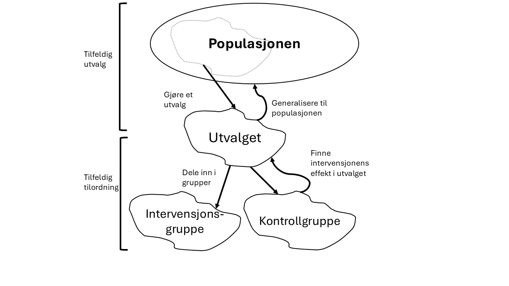

<!-- \placetextbox{0.26}{0.06}{\scriptsize{©2025 D.R. Foxcroft and D.J. Navarro,}} -->
<!-- \placetextbox{0.195}{0.05}{\scriptsize{CC BY-SA 4.0}} -->
<!-- \placetextbox{0.70}{0.06}{\scriptsize{\url{https://doi.org/10.11647/OBP.0333.01}}} -->

# Forskningsdesign i kvantitativ metode {#sec-design}

```{r}
#| include: FALSE
source("chapter_header.R")
```

**Forskningsdesign** er alle valgene en forsker tar før dataene samles inn: hva undersøkelsen skal svare på, hvem som skal være med, hvordan det som skal undersøkes skal måles, og hvordan dataene blir til. Disse valgene avgjør hva dataene i det hele tatt kan si noe om. Har man valgt feil, hjelper det ikke å regne mer avansert etterpå; ingen analyse kan gjøre en beskrivelse om til en årsaksforklaring, eller et skjevt utvalg om til et representativt utvalg. Derfor er forskningsdesign det første du bør se etter når du leser en studie, og det første du bør tenke på når du planlegger din egen.

Måling er en så viktig del av forskningsdesignet at det har fått sitt eget kapittel, @sec-measurement. Det du leste der, om konstrukter, operasjonalisering, målenivåer, reliabilitet og validitet, er altså like mye en del av designet som det som kommer nå. I dette kapittelet tar vi for oss resten: hva formålet med undersøkelsen er, hvilke roller variablene spiller, forskjellen på eksperimenter og observasjonsstudier, hvorfor en sammenheng ikke er det samme som en årsak, hvordan man trekker utvalg fra en populasjon, og til slutt hvordan man vurderer hvor mye man kan stole på en studie.

## Formålet med forskningen {#sec-purposes}

Man skiller ofte mellom tre ulike formål for kvantitative undersøkelser, å beskrive noe, å predikere noe og å finne årsaksforhold. Vi går gjennom hver i tur.

### Beskrive

Beskrivende forskning er en av de mest vanlige formene for kvantitativ forskning i utdanningsfeltet. Beskrivende kvantitativ forskning har som hovedformål å gi et systematisk og nøyaktig bilde av hvordan en eller flere variabler fordeler seg i en bestemt populasjon. Denne typen forskning søker å svare på spørsmål som "hva", "hvor mange" og "hvor mye", men ikke nødvendigvis "hvorfor". I utdanningsforskning kan beskrivende studier for eksempel kartlegge gjennomsnittlig karakternivå på videregående skoler i ulike fylker, ungdomsskolelæreres utdanningsbakgrunn eller leseferdighetene til femteklassinger i Norge, målt med nasjonale prøver.

Hvert av disse eksemplene beskriver bare én variabel. Her ønsker forskeren å få oversikt over hvordan denne variabelen ser ut i populasjonen. Dette kan innebære å beregne sentralmål som gjennomsnitt, median og typetall, samt spredningsmål som standardavvik og variasjonsbredde, eller å vise dataene med en passende figur.

Ofte er forskere interessert i å beskrive sammenhenger mellom to eller flere variabler.  Et klassisk eksempel fra internasjonal utdanningsforskning er å undersøke sammenhengen mellom elevers leseferdigheter og hvilket land de kommer fra. Gjennom studier som PISA (Programme for International Student Assessment) kan forskere beskrive hvordan leseferdighetene varierer systematisk mellom land. De kan rapportere at elever i Norge i gjennomsnitt skårer lavere enn elever i Finland, uten nødvendigvis å forklare hvorfor denne forskjellen eksisterer.

Beskrivende forskning er viktig selv om den ikke gir oss forklaringer på hvorfor noe er som det er. Beskrivende studier gir oss:

- **Oversikt over status quo**: Hvor står vi i dag innenfor et bestemt område?
- **Grunnlag for sammenligning**: Hvordan ser situasjonen ut i ulike grupper eller kontekster?
- **Identifikasjon av mønstre**: Finnes det systematiske forskjeller eller likheter som fortjener nærmere oppmerksomhet?
- **Utgangspunkt for årsaksforklaringer**: Hvilke sammenhenger observerer vi som kan undersøkes videre?

Beskrivende forskning er derfor ikke bare et første steg, men en verdifull forskningsaktivitet som i seg selv bidrar til å bygge kunnskapsgrunnlaget i utdanningsfeltet.

### Predikere

Prediksjon er et viktig formål innen utdanningsforskning som handler om å forutsi fremtidige utfall basert på tilgjengelig informasjon. I motsetning til beskrivende studier som har som hensikt å kartlegge eksisterende forhold, har prediksjonsbasert forskning som mål å kunne si noe om hva som kan skje i fremtiden.

En av de mest utbredte anvendelsene av prediksjon i utdanningsfeltet er kartleggingsprøver. Disse prøvene administreres tidlig i elevenes skoleløp, ofte på 1.-3. trinn, med det formål å identifisere elever som kanskje ikke vil klare å tilegne seg lærestoffet uten ekstra tilrettelegging. Målet er å kunne sette inn tiltak på et tidlig tidspunkt, før problemene blir for store. Kartleggingsprøver i lesing kan for eksempel teste elevers fonologiske bevissthet, bokstavkunnskap og avkodingsferdigheter. Basert på resultatene fra disse prøvene ønsker man å predikere hvilke elever som vil ha vanskeligheter med å følge ordinær leseopplæring. Elever som scorer lavt på slike prøver, kan dermed få tilbud om intensivert opplæring eller spesialundervisning.

Et sentralt problem med prediksjon er at de forutsigelsene man ønsker å gjøre, ofte baserer seg på data som er generert under andre forhold enn de dataene prediksjonen skal benyttes på. For eksempel kan en kartleggingsprøve være utviklet og testet på elever i nærheten av NTNU i Trondheim i 2010. Da er det ikke sikkert den fungerer godt i Nordland eller på Nordstrand i `{r} format(Sys.Date(), "%Y")`. Når en prøve tas i bruk på elever med andre kjennetegn eller under andre samfunnsforhold vil prediksjonene ikke bli like gode.

### Finne årsaksforhold

Det tredje formålet med kvantitativ utdanningsforskning er å finne årsaksforhold, altså ikke bare beskrive eller predikere noe, men å forklare årsaken til at det er slik. Dette kalles å stadfeste **kausalitet**. Når vi kan etablere kausalitet, kan vi si at en variabel faktisk forårsaker endringer i en annen variabel. Man uttrykker ofte årsaker med piler. Hvis årsaken er $X$ og virkningen er $Y$ kan man uttrykke "$X$ forårsaker $Y$" som $X \rightarrow Y$. Man kaller $X$ for **årsaken** og $Y$ for **virkningen** eller **effekten**.

La oss se på et eksempel på kausalitet. En skole sliter med at elevene på femtetrinn har for dårlig engelsk ordforråd. De setter i gang en klassekonkurranse der den klassen som får høyest gjennomsnitt på en stor gloseprøve på slutten av året, vinner. På slutten av året finner de at femtetrinn skårer skyhøyt på ordforråd. Da har klassekonkurransen **forårsaket** en forbedring i ordforråd, altså
$$\text{klassekonkurranse}\rightarrow\text{økt ordforråd}$$
Vi kan si det er en **kausal sammenheng** mellom klassekonkurransen og ordforrådet; økt ordforråd var en **virkning** av klassekonkurransen.

Årsaksforklaringer er viktige i utdanningsforskning fordi hvis vi vet hva som forårsaker noe, så har vi ofte kontroll over det og kan endre det. Hvis vi hadde visst hva som forårsaket det dårlige engelsk-ordforrådet kunne vi fjernet årsaken, og fordi vi vet at klassekonkurransen har en kausal effekt på ordforrådet gir dette et konkret handlingsgrunnlag for å bedre situasjonen. Hvis vi hadde visst hva som forårsaket at gutter oftere ikke fullfører videregående enn jenter, kunne vi kanskje gjort noe med det. Kunnskap om årsaker er viktige for lærere, rektorer, kommuner og politikere -- rett og slett for alle som vil endre skolefeltet til det bedre. Hvis vi hadde visst hva som hadde fått norske elever til å trives enda bedre på skolen og skåre høyere på internasjonale undersøkelser, ville politikerne med stor sannsynlighet satt inn målrettede tiltak og bevilget midler til det. Problemet er at å fastslå at noe forårsaker noe annet, altså å stadfeste kausalitet, er vanskelig.

## Variablenes roller: avhengige og uavhengige variabler

Forskningsformålene, beskrive, predikere og årsaksforklare, gir oss to ulike typer variabler. Hvis man for eksempel vil beskrive kjønnsforskjeller i motivasjon for kroppsøving, legger man gjerne til grunn at "kjønn" forklarer motivasjon for kroppsøving og ikke motsatt, at motivasjonen for kroppsøving forklarer hvilket kjønn du er. Når vi predikerer noe, er det én variabel vi ønsker å predikere og mange andre variabler vi ønsker å bruke til å gjøre prediksjonen. I en årsaksforklaring er én variabel virkningen og potensielt flere variabler er årsakene. Det er viktig å holde de to rollene - "ting som forklarer" og "ting som blir forklart" - adskilt fra hverandre.

La oss være tydelige på dette ved å introdusere matematiske symboler for å beskrive variabler (noe du vil møte igjen og igjen). Vi kan betegne variabelen som "skal forklares" som $Y$, og variablene som "gjør forklaringen" som $X_1 , X_2$, og så videre. Når vi gjør en analyse, har vi forskjellige navn for $X$ og $Y$ siden de spiller ulike roller. De klassiske navnene er **uavhengig variabel** og **avhengig variabel**. Uavhengig variabel er variabelen du bruker til å gjøre forklaringen (altså $X$ene), mens avhengig variabel er variabelen som blir forklart (altså $Y$). Logikken bak disse navnene er at hvis det virkelig er et årsaksforhold $X \rightarrow Y$, altså at $X$ påvirker $Y$ og ikke omvendt, så kan vi si at $Y$ avhenger av $X$, mens $X$ er uavhengig av $Y$.

Jeg må innrømme at jeg synes disse navnene er problematiske. De er vanskelige å huske og ganske misvisende, fordi (a) uavhengig variabel er stort sett avhengig av en hel masse variabler, og (b) hvis det ikke er noe årsaksforhold, avhenger ikke den avhengige variabelen faktisk av den uavhengige variabelen. Siden jeg ikke er alene om å synes "uavhengig variabel" og "avhengig variabel" er uklare navn, finnes det heldigvis flere alternativer som er mer intuitive. I denne boka bruker jeg begrepene **utfall** og **utfallsvariabel** for $Y$, altså for den avhengige variabelen. Poenget er at uansett om vi beskriver en sammenheng, forsøker å predikere noe eller undersøker en mulig årsak, er "utfall" et mer intuitivt ord enn "avhengig variabel", for det handler om hva som kommer ut av prosessen. Begrepene jeg vil bruke for variablene $X_1, X_2,$ og så videre, er **forklaringsvariabel**, **prediktor** og **årsaksvariabel**. Tanken her er at ingen av begrepene er dekkende på tvers av de tre forskningsformålene, så da brukes flere begrep i stedet for uavhengig variabel. Det er ikke en regel at man må bruke et av begrepene kun til det forskningsformålet det korresponderer med, og du kommer til å se at ordene blir benyttet om hverandre, sikkert i denne boken også. [^02-a-brief-introduction-to-research-design-6] Dette er oppsummert i @tbl-design-var-names.

```{r}
#| label: tbl-design-var-names
#| tbl-cap: "Navn på variablenes roller"
tt(
  tibble(
    `variabelens rolle` = c("skal forklares", "skal forklare"),
    `matematisk symbol` = c("Y", "X"),
    `klassisk navn` = c("avhengig variabel", "uavhengig variabel"),
    `beskrivende navn` = c("utfall", "forklaringsvariabel"),
    `predikerende navn` = c("utfall", "prediktor"),
    `årsaksforklarende navn` = c("utfall", "årsaksvariabel")
  ) |>
    pivot_longer(-`variabelens rolle`, names_to = "navn", values_to = "verdi") |>
    pivot_wider(names_from = `variabelens rolle`, values_from = verdi)
) |> 
  format_tt(i = 1, j = 2:3, math = TRUE)

# tt(
#   tibble(
#     `variabelens rolle` = c("skal forklares", "skal forklare"),
#     `matematisk symbol` = c("$Y$", "$X$"),
#     `klassisk navn` = c("avhengig variabel", "uavhengig variabel"),
#     `beskrivende navn` = c("utfall", "forklaringsvariabel"),
#     `predikerende navn` = c("utfall", "prediktor"),
#     `årsaksforklarende navn` = c("utfall", "årsaksvariabel")
#   )
# ) |> 
#   format_tt(j = 2, math = TRUE)
```


[^02-a-brief-introduction-to-research-design-6]: Det finnes dessverre mange forskjellige navn som brukes i litteraturen. Jeg vil ikke liste alle -- det ville ikke tjene noen hensikt -- bortsett fra å nevne at "responsvariabel" noen ganger brukes der jeg har brukt "utfall". Denne typen terminologisk forvirring er dessverre svært vanlig i forskningsfeltet.

## Eksperimentelle studier og observasjonsstudier

Et av de viktigste skillene du bør kjenne til, er forskjellen mellom forskning som benytter **eksperimenter** og forskning som ikke gjør det. Dette skillet handler om hvor mye kontroll forskeren har over deltakerne og situasjonen i studien.

Et **eksperiment** er en studie der forskeren prøver å kontrollere en eller flere sider ved datainnsamlingen. For eksempel kan forskeren ønske å undersøke hvordan elevene responderer på et nytt undervisningsopplegg. Da må forskeren forsikre seg om at akkurat det undervisningsopplegget blir benyttet. Det kan gjøres ved at forskeren eller en assistent underviser, eller at de får en lærer til å utføre opplegget. Det opplegget forskeren har planlagt for undervisningen kalles en **intervensjon**. I en intervensjon er det forskeren som aktivt manipulerer forklaringsvariabelen, altså gjennom undervisningsopplegget, for å undersøke hvordan dette opplegget påvirker elevenes respons. Undervisningsopplegget fungerer dermed som en forklaringsvariabel, fordi det er den faktoren forskeren endrer eller kontrollerer. Utfallsvariabelen, som er elevenes respons, får utvikle seg naturlig. Slik kan forskeren observere og vurdere hvilken effekt undervisningsopplegget har på elevene.

En sentral trussel mot gyldigheten til eksperimentelle studier er at intervensjonen ikke virker. I utdanningsforskning er det vanlig å ville teste forskjellige undervisningsopplegg, men det er vanskelig for lærerne å følge undervisningsopplegget til punkt og prikke, kanskje fordi de har for dårlig tid til å sette seg inn i opplegget eller fordi opplegget er så annerledes fra slik de vanligvis underviser at de ikke får det til. I så fall kan det være forskerne tror de forsker på _undervisningsopplegget slik det er planlagt_, men i virkeligheten forsker de på _undervisningsopplegget slik det ble seende ut i eksperimentet_. Dette kan også være interessant, men da er det viktig å være klar over forskjellen og ikke tro at intervensjonen har kontrollert forklaringsvariabelen. Derfor trengs ofte kvalitativ følgeforskning for å forsikre seg om at intervensjonen var vellykket.

Studier uten eksperimenter kalles **observasjonsstudier**. Da prøver forskeren å unngå å påvirke situasjonen hen forsker på. Man kan for eksempel sette opp små kameraer og mikrofoner i mange klasserom og gjøre opptak av undervisningen -- etter å ha søkt etisk godkjenning og innhentet samtykke, så klart. En sentral trussel mot gyldigheten til observasjonsstudier er at forskeren påvirker situasjonen, samme hvor mye hen prøver å la være. Det kan for eksempel være at læreren forbereder seg ekstra til de undervisningstimene som det skal forskes på, eller at elevene oppfører seg annerledes når kameraene gjør opptak.

## Korrelasjon er ikke kausalitet {#sec-correlation-causality}

En sentral innsikt i kvantitativ forskning er at korrelasjon ikke nødvendigvis er kausalitet. Vi skal lære mer presist i @sec-associations-correlation-coefficient hva korrelasjon er, men her holder det å vite at to variabler korrelerer hvis verdiene deres henger sammen. Sammenhengen kan gå to veier:

- I en **positiv korrelasjon** har den ene variabelen høye verdier når den andre har det, og lave verdier når den andre har det.
- I en **negativ korrelasjon** er det motsatt: Den ene variabelen har høye verdier når den andre har lave.

Forskere vet at det er en sterk positiv korrelasjon mellom variabelen _antall bøker hjemme_ og variabelen _elevers leseferdigheter_, altså at elever med flere bøker hjemme har en tendens til å lese bedre.[^design-outdated]

[^design-outdated]: OK, jeg vet ikke om dette gjelder lenger nå som alle har digitale dingser. Men før var det i hvert fall sterk korrelasjon mellom antall bøker foreldrene hadde i bokhylla hjemme og alt mulig av positive utfall for elevene.

Et sentralt spørsmål er om korrelasjonen viser et årsaksforhold, altså at bøkene i bokhylla fører til at elevene leser bedre. Tenk over dette -- tror du at det stemmer? Tror du at en elevs leseferdighet hadde gått opp hvis du hadde kjøpt en større bokhylle til familien og fylt den med masse bøker? Det ville i så fall bety at korrelasjonen mellom antall bøker og leseferdighet oppsto fordi det var et årsaksforhold.

La oss analysere korrelasjonen i detalj. La oss kalle antall bøker for $X$ og leseferdighet for $Y$. Hvis det hadde vært en årsakssammenheng mellom $X$ og $Y$, altså $X\rightarrow Y$, så hadde $X$ og $Y$ korrelert, og korrelasjonen hadde oppstått på grunn av årsakssammenhengen mellom $X$ og $Y$. Vi kan oppsummere det i en tommelfingerregel

> *En årsakssammenheng $X\rightarrow Y$ skaper en korrelasjon mellom $X$ og $Y$.*

Dette er et nyttig resultat som jeg tror er enkelt å skjønne.

::: {.callout-warning}
Vel, regelen er sann i de fleste tilfeller. Men det *kan* være at $X$ har en årsakspåvirkning på $Y$, men så er det noe som hindrer $Y$ fra å inntreffe. Det å utføre et vellykket ran, $X$, kan gjøre deg mer tilbøyelig til å utføre flere ran, $Y$, men $Y$ vil ikke inntreffe hvis man blir arrestert først. I så tilfelle vil ikke $X$ og $Y$ korrelere. Du kan sammenlikne det med å påføre kraft på en boks; det vil forårsake at boksen flytter seg (korrelasjon mellom _å påføre kraft_ og _bevegelse_), men det gjelder ikke hvis boksen står inntil en vegg.
:::

Men den "motsatte" regelen er ikke sann -- det er ikke slik at en korrelasjon mellom $X$ og $Y$ betyr at man kan konkludere med at $X$ er årsaken til $Y$ ($X\rightarrow Y$). Dette er ikke like enkelt å skjønne. Hvorfor er det korrelasjon hvis den ene ikke forårsaker den andre? Hvis de var helt urelaterte, burde det jo være ingen korrelasjon? Er korrelasjonen bare en tilfeldighet?

**Tilfeldige korrelasjoner** har blitt manges forklaring på hvorfor korrelasjon ikke er kausalitet. En tilfeldig korrelasjon er en korrelasjon som oppstår av, nettopp, tilfeldigheter. Hvis man hadde gjort samme studie om igjen hadde ikke korrelasjonen vært der, fordi den oppsto på grunn av tilfeldigheter med utvalget eller noe annet. Ideen om tilfeldige korrelasjoner har blitt popularisert gjennom det meget vittige nettstedet <https://www.tylervigen.com/spurious-correlations> som generer tusenvis av tilfeldige korrelasjoner som @fig-spurious.


{#fig-spurious fig-alt="To grafer som viser utviklingen fra 1995 til 2021 i antall babyer i USA som heter Eleanor og antall kilowattimer vindkraft generert i Polen. Grafene er nesten perfekt overlappende."}


Korrelasjonen i @fig-spurious er mellom antall babyer i USA som heter Eleanor og antall kilowattimer vindkraft produsert i Polen. Det er ingen årsakssammenheng mellom variablene, for hvis alle i USA kalte jentebarna sine Eleanor ville ikke vindkraftutbyggingen i Polen skutt fart. Denne korrelasjonen er helt tilfeldig.

Men de fleste korrelasjoner er ikke tilfeldige, man kan finne dem igjen i studie etter studie. Det kan være helt tydelig at korrelasjonen alltid vil være der, men _likevel_ trenger det ikke være slik at den ene variabelen forårsaker den andre. Vi skal se på to problemer som gjør at man ikke kan konkludere med en årsakssammenheng mellom to variabler selv om de korrelerer. De to problemene kalles retningsproblemet og konfundere.

### Retningsproblemet

**Retningsproblemet** er ganske enkelt at hvis man har en korrelasjon mellom $X$ og $Y$, så kan det like gjerne være at $X$ påvirker $Y$ som at $Y$ påvirker $X$. Man kan rett og slett ikke finne ut av hvilken vei kausaliteten går -- hvilken av følgende piler som stemmer:

```{tikz}
%| fig-align: "center"
%| out-width: 10cm
\begin{tikzpicture}
  \node (A) at (0,0) {$X$};
  \node (B) at (1,0) {$Y$};
  \draw[->] (A) -- (B);

  \node (C) at (2,0) {$X$};
  \node (D) at (3,0) {$Y$};
  \draw[->] (D) -- (C);
\end{tikzpicture}
```

I eksempelet vårt betyr retningsproblemet at vi ikke vet om antall bøker hjemme fører til økt leseferdighet eller om elevens leseferdighet fører til mange bøker hjemme. Hvis et barn er veldig god til og interessert i å lese, så høres det jo sannsynlig ut at foreldrene kjøper flere bøker for å imøtekomme barnets interesse. Det trenger altså ikke være at å ha mange bøker hjemme, fører til at barnet blir en god leser.

### Konfundere {#sec-design-konfunder}

En **konfunder** til variablene $X$ og $Y$ er en variabel $Z$ som er slik at den påvirker både $X$ og $Y$. Altså $Z\rightarrow X$ og $Z\rightarrow Y$. Ofte tegner man dette i et diagram slik som i @fig-confounder-general.

::: {.callout-note}
"Konfunder" uttales med samme trykk som "vidunder". _Konfunder_ er en norsk oversettelse av det engelske _confounder_. Det finnes dessverre ingen vanlige oversettelser av _confounder_, og både tredjevariabel, forvirringsvariabel, forstyrrende variabel, og bakenforliggende faktor er i bruk, i tillegg til konfunder. Konfunder er like vanlige som disse, og jeg bruker konfunder slik at man lettere forstår ordet hvis man leser det på engelsk. Å konfundere [betyr egentlig å forvirre](https://naob.no/ordbok/konfundere).
:::

::: {#fig-confounder  layout-ncol=1}

```{tikz}
%| label: fig-confounder-general
%| fig-cap: "Her er $Z$ en konfunder for $X$ og $Y$."
%| fig-align: "center"
\begin{tikzpicture}
  \node (A) at (0,0) {$X$};
  \node (B) at (2,0) {$Y$};
  \node (C) at (1,1) {$Z$};
  \draw[dashed, -] (A) -- (B);
  \draw[->] (C) -- (A);
  \draw[->] (C) -- (B);
\end{tikzpicture}
```

```{tikz}
%| label: fig-confounder-reading
%| fig-cap: "Her er \"foreldres leseinteresse\" en konfunder for korrelasjonen mellom \"antall bøker hjemme\" og \"leseferdighet\"."
%| fig-align: "center"
\begin{tikzpicture}
  \node (A) at (0,0) {antall bøker hjemme};
  \node (B) at (4,0) {leseferdighet};
  \node (C) at (2,1) {foreldres leseinteresse};
  \draw[dashed, -] (A) -- (B);
  \draw[->] (C) -- (A);
  \draw[->] (C) -- (B);
\end{tikzpicture}
```
:::

Konfundere kan meget gjerne være grunnen til at det er en korrelasjon mellom antall bøker hjemme og en elevs leseferdighet. I @fig-confounder-reading har jeg foreslått en mulig konfunder, nemlig foreldrenes leseinteresse. Foreldre med høy leseinteresse har trolig mange bøker hjemme. Foreldrenes leseinteresse kan også påvirke barnas leseinteresse, kanskje fordi de har lest mye for barna eller fordi de har gener for leseinteresse som er brakt videre til barna, noe som gjør at barna også er interesserte i å lese og dermed utvikler god leseferdighet. Da oppstår det en korrelasjon mellom antall bøker hjemme og elevens leseferdighet, men det er ikke fordi antall bøker hjemme påvirker leseferdigheten, det er fordi foreldrenes leseinteresse påvirker _både_ antall bøker hjemme og elevens leseferdighet.

Det finnes statistiske teknikker for å fjerne påvirkningen til en konfunder. Dette kalles å "kontrollere for" eller å "ta hensyn til" variabelen. Slike statistiske teknikker kan fungere fint, men er ofte utilstrekkelige. Et hovedproblem er at man bare kan kontrollere for variabler man har målt. I en stor studie kan det være man har målt 8-10 variabler, og disse variablene kan man kontrollere for, men det finnes uendelig antall variabler man ikke har målt. Derfor kan det finnes flere viktige konfundere man ikke har målt. Dette kalles **ikke-målt konfundering** og er et problem det ikke finnes statistiske teknikker for å unnslippe. Hvis du har tviholdt rundt håpet om å lære en statistisk teknikk som lar deg finne kausalitet i korrelasjoner bør du slippe taket nå -- dette håpet vil kun føre til skuffelse.

At korrelasjon ikke betyr kausalitet høres enkelt ut, nesten banalt, men all erfaring viser at det ikke er enkelt -- folk tråkker rett og slett feil for ofte. I avisoverskrift etter avisoverskrift hører man om "sammenhengen mellom tomater og kreft" og liknende. Uten unntak er dette aviser som hinter til kausalitet (tomater fører til kreft) ut fra korrelasjoner (folk som spiser tomater får oftere kreft). Også i utdanningsforskning er det mange eksempler. I mange, kanskje alle, av årgangene av PISA-studiene er det en **negativ** korrelasjon mellom variabelen "utforskende arbeidsformer i naturfag" og variabelen "naturfagskompetanse" [@jensen2024]. Utforskende arbeidsformer er her motstykket til lærerstyrt, tradisjonell undervisning. Jo mer utforskende arbeidsformer elevene rapporterer om, jo lavere skårer de altså på naturfagskompetanse. Hver eneste gang benytter grupper som ønsker mer lærerstyrt undervisning dette resultatet til å skrike høyt om at utforskende arbeidsformer i naturfag gir dårligere resultater, altså en kausal slutning. Man benytter ganske enkelt kvantitativ forskning til å bekrefte eksisterende oppfatninger. (En god øving kan være å forklare hvorfor denne kausale slutningen ikke nødvendigvis holder, altså komme opp med noen konfundere eller vise at retningsproblemet kan gjelde? Se i informasjonsboksen for fasit.)

::: {.callout-note}
Vi kaller _utforskende undervisning_ for $X$ og _naturfagskompetanse_ for $Y$. Spørsmålet er hvordan den negative korrelasjonen mellom $X$ og $Y$ kan oppstå uten at det skyldes årsaksforholdet $X\rightarrow Y$.

Retningsproblemet kan gjelde: Det kan være at hvis lærere har en elevgruppe som har lav naturfagskompetanse, så gjør man mye utforskende undervisning. I så fall er det $Y\rightarrow X$ som gjelder.

En mulig konfunder kan være variabelen "læreren har spesialisering i naturfag", se @fig-confounder-science. Lærere med mye spesialisering i naturfag har gjerne mastergrad i fysikk, kjemi eller biologi med PPU etterpå. Kanskje gir disse lærerne elevene høyere naturfagskompetanse. Hvis lærerne med slik spesialisering samtidig gjør mindre utforskende undervisning, vil det oppstå en negativ korrelasjon mellom elevenes naturfagskompetanse og mengden utforskende undervisning.

```{tikz}
%| label: fig-confounder-science
%| fig-cap: "\"Lærerens spesialisering i naturfag\" kan være en konfunder for korrelasjonen mellom utforskende undervisning ($X$) og naturfagskompetanse ($Y$)."
%| fig-align: "center"
%| out-width: 12cm
\begin{tikzpicture}
  \node (X) at (0,0) {utforskende undervisning ($X$)};
  \node (Y) at (7,0) {naturfagskompetanse ($Y$)};
  \node (Z) at (3.5,1.4) {lærerens spesialisering i naturfag};
  \draw[dashed, -] (X) -- (Y);
  \draw[->] (Z) -- (X);
  \draw[->] (Z) -- (Y);
\end{tikzpicture}
```

_Foreldrepress_ er en annen mulig konfunder. Kanskje ønsker foreldrene til de akademisk sterkeste barna tradisjonell undervisning, ikke noe sånn "nymotens utforskende nånnsens", og legger press på læreren. I så fall vil "foreldrepress" konfundere korrelasjonen. Foreldrepress virker altså inn på både barnas naturfagskompetanse og lærerens undervisningsform.

Jeg må legge inn et tilbakeblikk til @sec-measurement, fordi det er så nærliggende for meg å tro at korrelasjonen oppstår på grunn av svak måling av variabelen "utforskende undervisning". Variabelen "naturfagskompetanse" tror jeg er glitrende målt av PISA, for PISAs hovedformål er å måle elevenes kompetanse. Jeg tror derimot at "utforskende undervisning" er målt dårligere. For det første er det målt med spørreskjema til elevene, og jeg tror ikke elevene greier å informere så presist om hvorvidt de har hatt utforskende undervisning. Variabelen er målt med Likert-spørsmål som _Students are given opportunities to explain their ideas_, og jeg tror sterke og svake elever kan svare forskjellig på dette spørsmålet. Det kan være at svaktpresterende elever synes de blir spurt om å forklare ting alt for ofte, mens de høytpresterende gjerne skulle forklart ting oftere. Da vil svakt- og høytpresterende elever svare forskjellig på spørsmålet, selv om de har blitt spurt om å forklare ideene sine like ofte. Da vil korrelasjonen oppstå på grunn av en målefeil!

Måleproblemene er uendelige i dette tilfellet. Tror du at en norsk elev, en kinesisk elev og en estisk elev vil svare sammenliknbart på disse spørsmålene? Det _må_ de gjøre hvis det skal være noen vits i å sammenlikne på tvers av land! Man kan kose seg en hel helg med å tenke over alle måleproblemene som kan få denne korrelasjonen til å oppstå, noe jeg vil anbefale på det sterkeste.
:::

Man kan også gå i motsatt felle, at man blankt avviser alle årsaksforklaringer basert på at to variabler er korrelert. Men husk, en kausal sammenheng mellom to variabler skaper en korrelasjon. En korrelasjon er derfor et sterkt hint om at det kan være en kausal sammenheng mellom variablene og bør ikke avvises blankt. Om det er lurt å konkludere med kausalitet basert på korrelasjon, bør vurderes fra tilfelle til tilfelle. Som vi så i @sec-why-statistics, er det ikke data alene som gir konklusjoner; det er data og teori sammen som gir støtte til en konklusjon.

## Randomiserte kontrollstudier {#sec-design-rct-section}

Forrige delkapittel forklarte hvorfor det er vanskelig å finne ut at noe forårsaker noe annet. Heldigvis finnes det et studiedesign man kan bruke for å utelukke alle tenkelige [konfundere](#sec-correlation-causality), nemlig **randomiserte kontrollstudier**. Randomiserte kontrollstudier kalles også _randomiserte kontrollerte forsøk_ og _randomiserte kontrollerte eksperimenter_, og du møter ofte på begrepet på engelsk, der det heter _randomized controlled trials_. Først forklarer jeg hva slike studier er og hvorfor de er gode til å finne årsaksforklaringer. Deretter forklarer jeg hvorfor det selv med randomiserte kontrollstudier ikke er enkelt å finne ut av årsaksforklaringer.

En randomisert kontrollstudie er et eksperimentelt forskningsdesign hvor deltakerne blir tilfeldig fordelt i ulike grupper for å teste effektiviteten av en intervensjon. Deltagerne blir plassert enten i en **intervensjonsgruppe** eller en **kontrollgruppe**. Intervensjonsgruppa mottar intervensjonen, som kan være en ny undervisningsmetode, en digital dings, et antimobbeopplegg eller hva som helst annet. Kontrollgruppa får ikke intervensjonen, og gjennomfører skolehverdagen som normalt, uavhengig av forskningsprosjektet. Oppsettet er slik som i @fig-design-rct.

```{tikz}
%| label: fig-design-rct
%| fig-cap: "I en randomisert kontrollstudie undersøker vi om intervensjonen har en årsakspåvirkning på utfallet."
%| fig-align: "center"
%| out-width: 10cm
\begin{tikzpicture}
  \node (I) at (0,0) {intervensjon};
  \node (U) at (6,0) {utfall};
  \draw[->] (I) -- (U) node[midway, above] {mulig årsakspåvirkning};
\end{tikzpicture}
```

Det som gjør randomiserte kontrollstudier så gode er **tilfeldig gruppeinndeling**. Når vi fordeler deltakerne til ulike grupper basert på ren tilfeldighet, oppnår vi noe ganske elegant: de som naturlig ville reagert positivt eller negativt på intervensjon blir jevnt spredt utover alle gruppene. Resultatet? Eventuelle forskjeller vi ser i resultatene vil skyldes intervensjonen vi tester, og ikke at de som responderer best eller dårligst på intervensjonen tilfeldigvis havnet i samme gruppe. 

Forklaringen i avsnittet over er tilstrekkelig, men mange lurer likevel på hvorfor ikke konfundere er et problem. Vil ikke konfundere (for eksempel underliggende forskjeller mellom deltagerne) kunne påvirke resultatet? Nei, for alle de underliggende forskjellene mellom deltakerne -- som evner, motivasjon, bakgrunn og andre personlige egenskaper -- blir også balansert mellom intervensjons- og kontrollgruppen.

Jeg presenterer et eksempel på en randomisert kontrollstudie i dybden, både for å vise hvordan de kan se ut, men også for å diskutere svakhetene deres. Eksempelet er fra Norge [@bettinger2018] og handler om lærende og låste tankesett, såkalte _fixed_ og _growth mindset_. Forskerne utviklet en intervensjon som ønsket å påvirke elevenes tankesett til å være mer lærende, altså slik at elevene fikk tro på at de kunne lære. Intervensjon besto av en 45 minutters læringsmodul som elevene skulle fullføre individuelt på sin egen digitale enhet. Forskerne rekrutterte én videregående skole i Rogaland som tilbydde modulen til alle elevene og der elevene kunne samtykke til å delta i forskningen hvis de ville. Det var 458 elever til stede den dagen modulen skulle gjennomføres, og 385 samtykket til å være med i forskningen. Da elevene samtykket, ble de randomiserte til intervensjons- og kontrollgruppa. Intervensjonsgruppa ble vist en læringsmodul som forklarte med nevrovitenskap hvordan alle kan lære hvis de gjør en innsats. Kontrollgruppas læringsmodul forklarte andre ting om hjernen.

Intervensjonen skulle påvirke forklaringsvariabelen _tankesett_ til å være mer lærende. De hadde to utfallsvariabler, _iherdighet_ (perseverance) og _algebraferdighet_. Iherdighet ble målt ved om elevene valgte vanskeligere oppgaver på en algebratest, og algebraferdighet ble målt ved hvor mange av oppgavene de klarte å løse. Hensikten med studien var altså å undersøke om tankesett påvirket elevenes iherdighet og deres algebraferdighet.

Noen uker etterpå foregikk andre økt av intervensjonen. Da målte forskerne først forklaringsvariabelen (tankesett) for å finne ut om intervensjonen hadde virket. Tankesettet var langt mer lærende i intervensjonsgruppa enn i kontrollgruppa (til de som er interesserte, fremgangen var 56 % av et standardavvik), så forskerne konkluderte med at intervensjonen hadde lyktes. Deretter ga de en algebratest for å måle _iherdighet_ og _algebraferdighet_. Siden mange var fraværende fra den andre økta, var det bare 289 elever som var til stede i begge øktene, altså 63 % av de 458 elevene som ble spurt om å delta.

Forskerne publiserer ikke datafilene sine, men ut fra beskrivelsene i artikkelen må datafilen deres ha sett ut omtrent som i @tbl-mindset-data:

```{r}
#| label: tbl-mindset-data
#| tbl-cap: De første radene på en tenkt datafil tilhørende Bettinger et al. @bettinger2018 sin randomiserte kontrollstudie. Datafila er ikke publisert, så tabellen er rekonstruert ut fra beskrivelsene i artikkelen. Hver rad tilhører én elev. Den nominelle variabelen _gruppe_ angir om eleven er i intervensjons- eller kontrollgruppa, _tankesett_ er forklaringsvariabelen, og _iherdighet_ og _algebraferdighet_ er utfallsvariabler.
tribble(
  ~gruppe, ~tankesett, ~iherdighet, ~algebraferdighet,
  "kontroll", "1,4"    , "8"      , "2,8",
  "intervensjon", "3,1", "8"      , "2,1",
  "intervensjon", "2,8", "5"      , "3,8",
  "kontroll", "2,1"    , "5"      , "1,9",
  "intervensjon", "3,7", "7"      , "3,6",
  "⋮", "⋮"  , "⋮"  , "⋮",
) |>
  tt(align = "lccc")

```

Resultatene viste at intervensjonsgruppa skåret høyere på iherdighet, de valgte altså vanskelige algebraspørsmål oftere enn kontrollgruppa. Forskjellen var 24 % av et standardavvik. De skåret også litt høyere på algebraferdighet, rundt 12 % av et standardavvik.

Er du nå overbevist om kausaliteten i dette? Altså at å få et mer lærende tankesett gjør at man blir mer iherdig og får høyere algebraferdighet? Vi vet at intervensjons- og kontrollgruppa ville hatt samme gjennomsnittsverdi på iherdighet og algebraferdighet hvis vi ikke hadde gjennomført studien. Hvis det ikke var for intervensjonen, hvordan oppsto da forskjellen mellom gruppenes iherdighet og algebraferdighet?

Det er noen grunner til at randomiserte kontrollstudier kanskje ikke stadfester kausalitet. De to viktigste er:

- **Tilfeldige avvik** forekommer. Tilfeldig gruppeinndeling er, vel, tilfeldig, og noen ganger er de som responderer godt på intervensjonen samlet i den ene gruppa. Da får du et dårlig estimat på effekten. Men randomisering kan analyseres matematisk, så i tillegg til intervensjonens gjennomsnittseffekt kan man regne ut en usikkerhet i estimatet, se @sec-inf-konfidensintervall.
- **Skjevt frafall** kan skape problemer. Av de 385 elevene som opprinnelig samtykket til å delta, var det kun 289 som gjennomførte hele studien. Så lenge alle elevene i begge gruppene har like stor sannsynlighet for å falle fra, påvirker ikke dette resultatene våre. Men hvis for eksempel de minst motiverte elevene i kontrollgruppen systematisk forsvinner fordi læringsmodulen deres var for kjedelig, kan dette påvirke konklusjonene selv om vi har randomisert. Dette, at deltagerne som faller fra skiller seg fra de gjenværende deltagerne på en måte som påvirker resultatene, kalles _skjevt frafall_.

Randomiserte kontrollstudier er geniale verktøy, men det er flere begrensninger vi bør være oppmerksomme på:

- **Effekten på individnivå er ukjent** i randomiserte kontrollstudier. De gir kun et estimat av intervensjonens gjennomsnittlige effekt. Man kan samle inn mer data om deltagerne for å beskrive effekten i undergrupper, for eksempel effekten for forskjellige kjønn, men da finner man bare gjennomsnittseffekten for hvert kjønn. Du kan aldri finne ut hva effekten vil være for deg, barna dine, eller noen andre. Kanskje vil en intervensjon som har positive effekter likevel ha negative effekter for et enkeltindivid eller enkelte grupper elever.
- **Generalisering** er en annen utfordring. I vårt eksempel deltok bare én skole i Rogaland, og randomiseringen forteller oss ikke hvordan samme tiltak vil fungere på andre skoler, i andre deler av landet, eller for andre aldersgrupper. Randomiserte kontrollstudier forteller kun hvordan intervensjonen fungerte i utvalget og sier ingenting om hvordan den vil fungere andre steder eller til andre tider.
- **Etiske hensyn** kan gjøre randomiserte kontrollstudier kompliserte. Noen ganger kan vi ikke gjennomføre intervensjonen av etiske årsaker. Tenk for eksempel på hvor umulig det ville være å studere hvordan bakrus påvirker konsentrasjonen til videregåendeelever; intervensjonen måtte være å gi rusmidler til elevene. Andre ganger kan det være uetisk å _ikke_ gi intervensjonen til kontrollgruppen, særlig hvis de foreløpige resultatene virker svært lovende. I medisinsk forskning har faktisk flere studier måtte stoppes fordi behandlingen viste seg å være så effektiv at det ble ansett som uetisk å holde den tilbake fra kontrollgruppen. Det kan også være vanskelig å rekruttere deltakere fra visse befolkningsgrupper, for eksempel hvis de er skeptiske til forskning eller myndigheter. Dette fører til at sårbare grupper ofte er underrepresentert i studier, og da vet vi ikke om funnene våre gjelder for dem.

## Utvalg fra en populasjon

### Populasjon, utvalg og analyseenhet {#sec-design-population}

```{r}
year <- format(Sys.Date(), "%Y")
```

Mange forskningsspørsmål i kvantitativ metode dreier seg om å finne ut av noe for en viss **populasjon**. Populasjonen er den mengden av personer, objekt eller fenomen man ønsker at forskningen sin skal gjelde for. For eksempel kan man undersøke hvordan elevers motivasjon endrer seg mellom barneskolen og ungdomsskolen, der variabelen er _elevens skårer på Elevundersøkelsens spørsmål om motivasjon_. I så fall vil populasjonen kanskje være noe slikt som "alle norske elever som starter på ungdomsskolen i `{r} year`". Merk at populasjonen er det jeg *ønsker* at forskningsresultatene skal gjelde for. I konkrete studier undersøker vi sjelden hele populasjonen.

I praksis må man gjøre et **utvalg** fra populasjonen. Siden man ikke velger hele populasjonen, men kun et utvalg, er en sentral del av kvantitativ forskning å **generalisere** fra det som gjelder for utvalget til hele populasjonen. I kvantitativ metode trekker vi slutninger *fra* utvalget *om* populasjonen. Dette er illustrert i @fig-design-sampling.


{#fig-design-sampling}


I stedet for å forske på alle norske elever som skal starte på ungdomsskolen, må jeg forske på et mindre utvalg -- alt annet er umulig med mindre man har uendelig med ressurser. Hvis jeg skulle forsket på alle elevene i norsk skole, kunne jeg analysert data fra Elevundersøkelsen, som gis hvert år og er obligatorisk for alle elever på 7. trinn.[^design-elevundersokelsen] Men for å undersøke elevenes motivasjon på ungdomsskolen trenger vi data fra 8. trinn også, og der er Elevundersøkelsen frivillig å gjennomføre, så da får vi bare et utvalg av populasjonen. Hvordan skal utvalget da være? Skal jeg rekruttere 100 elever fra hvert fylke? Skal jeg legge ut en reklame for studien på TikTok og nøye meg med de svarene jeg får? Slike valg er helt sentrale for å få gode svar i kvantitative undersøkelser.

[^design-elevundersokelsen]: Se <https://www.udir.no/tall-og-forskning/brukerundersokelser/elevundersokelsen/>.

I utdanningsforskning er det svært mange forskjellige populasjoner som kan være interessante å forske på. Sjekk ut disse:

- Elever som
    - startet på 8. trinn i `{r} year`
    - går på barneskolen og har vedtak om spesialundervisning
    - har opplevd mobbing det siste året
- Lærere som
    - underviser i musikk på ungdomstrinnet
    - ikke har lærerutdanning
    - har erfaring med programmering i kunst og håndverk
- Andre voksne, for eksempel
    - foreldre til barn med autisme i norsk grunnskole
    - ansatte i skolehelsetjenesten
    - rektorer som er nye i jobben
- Objekter laget i eller for undervisning, slik som
    - historielæreres lysbildefremvisninger
    - elevenes skulpturer fra kunst og håndverk
    - lokale læreplaner i naturfag utarbeidet etter LK20
- Læringsressurser, slik som
    - IKT-baserte læringsverktøy i bruk i leseopplæringen
    - norske lærebøker i matematikk utgitt etter 1945
- Hendelser, slik som
    - foreldresamtaler gjennomført på 1. trinn i en kommune
    - avvik registrert i skolens avvikssystem
    - undervisningsøkter i samfunnsfag på mellomtrinnet i Nordland fylke

Et sentralt spørsmål er hvilken **analyseenhet** man skal benytte. Analyseenheten er de enhetene, altså individene, objektene eller fenomenene, du samler data fra. Hvis jeg undersøker elevenes motivasjon ved å spørre elevene selv, er det _eleven_ som er analyseenheten. Hvis jeg spør læreren om å vurdere motivasjonen til klassen, er det _læreren_ eller _klassen_ som er analyseenheten. Hvis jeg sender ut observatører i mange klasserom for å observere klassens motivasjon i forskjellige undervisningsøkter, er det kanskje _undervisningsøkter_ som er analyseenheten.

Populasjonen, analyseenheten og måten dataene samles inn på henger tett sammen, som i @tbl-design-units.

```{r}
#| label: tbl-design-units
#| tbl-cap: "Populasjon, analyseenhet og datainnsamling henger sammen. Legg merke til at analyseenheten ikke alltid er en person."
tt(
  tibble(
    Populasjon = c(
      "elever som startet på 8. trinn i 2026",
      "undervisningsøkter i samfunnsfag på mellomtrinnet",
      "norske lærebøker i matematikk utgitt etter 1945"
    ),
    Analyseenhet = c("eleven", "økta", "boka"),
    Datainnsamling = c("spørreskjema", "observasjon", "innholdsanalyse")
  )
)
```

I det følgende presenterer jeg et lite knippe vanlige utvalgsmetoder og deres fordeler og ulemper.

### Enkle tilfeldige utvalg {#sec-design-simple-random}

For å kunne generalisere til populasjonen er det som regel best å ha et utvalg som ligner populasjonen så mye som mulig, bare i mindre skala. I stedet for å velge ut alle de ca. 60 000 syvendeklassingene i Norge (populasjonen) og måle motivasjonen deres, hadde det vært ideelt å velge ut 600 syvendeklassinger som svarer likt som populasjonen. Dette vil si at hvis 10 % av elevene i populasjonen er topp motiverte, så er 10 % av utvalgets elever det også; hvis 20 % av populasjonen er ganske motiverte, så er 20 % av utvalgets elever det også, og så videre. Denne egenskapen, at utvalget gjenspeiler populasjonen, betyr at utvalget er **representativt med hensyn til variabelen**, i dette tilfellet motivasjon.

Aller helst bør ikke utvalget bare være representativt med hensyn til én variabel, det bør være likt på alle andre mulige måter også. En annen variabel kan være _karakter_ i fagene. Hvis man ønsker å finne ut om elever med lave eller høye karakterer har forskjellig motivasjon, er det viktig at elevenes karakterer i utvalget er representative for elevenes karakterer i populasjonen. Hvis utvalget er representativt for alle mulige variabler, kaller vi utvalget **representativt**. Hvis utvalget ikke er representativt, kalles det **skjevt**.

Det virker helt uoppnåelig å skaffe et representativt utvalg. Tenk på det, det finnes uendelig mange variabler, og man må forsikre seg om at utvalget er likt populasjonen for alle. Men det finnes et triks som fikser et representativt utvalg, nemlig **randomisering**.

Merk at dette er samme triks som i randomiserte kontrollstudier, se @sec-design-rct-section, men at det brukes til noe helt annet. Forskjellen er verdt å dvele ved, for den er lett å blande sammen, og den er vist i @fig-design-two-types-random. Ved *tilfeldig gruppeinndeling* randomiserer vi hvem som havner i hvilken gruppe, for å gjøre gruppene like, og gevinsten er at vi kan finne intervensjonens effekt i utvalget. Ved *tilfeldig utvalg* randomiserer vi hvem som blir med i studien i det hele tatt, for å gjøre utvalget likt populasjonen, og gevinsten er at vi kan generalisere til populasjonen. En studie kan gjøre begge deler, bare den ene, eller ingen av dem.

{#fig-design-two-types-random fig-alt="Øverst en ellipse merket 'Populasjonen'. En pil merket 'Gjøre et utvalg' peker ned til en figur merket 'Utvalget', og en pil merket 'Generalisere til populasjonen' peker tilbake opp. Disse to pilene er merket 'Tilfeldig utvalg'. Fra 'Utvalget' peker to piler merket 'Dele inn i grupper' ned til 'Intervensjonsgruppe' og 'Kontrollgruppe', og en pil merket 'Finne intervensjonens effekt i utvalget' peker tilbake opp til utvalget. Disse er merket 'Tilfeldig tilordning'."}

For å holde ting enkle kan vi forestille oss at vi har en pose med 10 brikker. Hver brikke har sin egen unike bokstav, så vi kan skille dem fra hverandre. Brikkene kommer i to farger - svart og hvit. Dette settet med brikker er populasjonen vi er interessert i, og den er vist grafisk til venstre i @fig-design-unbiased. Som du kan se på tegningen, er det 4 svarte brikker og 6 hvite brikker. Men i virkeligheten ville vi selvfølgelig ikke vite dette uten å kikke i posen først!

La oss nå forestille oss at du kjører følgende "eksperiment": Du rister posen godt, lukker øynene og trekker ut 4 brikker uten å legge noen av dem tilbake. Først kommer $a$-brikken (svart), så $c$-brikken (hvit), deretter $j$ (hvit) og til slutt $b$ (svart). Hvis du har lyst, kan du legge alle brikkene tilbake i posen og gjenta hele eksperimentet - akkurat som vist på høyre side av @fig-design-unbiased. Hver gang vil du få forskjellige resultater, selv om du følger nøyaktig samme prosedyre. Dette at samme utvalgsmetode kan gi forskjellige utvalg hver gang, kaller vi et **tilfeldig utvalg**.

Siden vi ristet posen før vi trakk ut brikkene, virker det rimelig å anta at hver brikke har like stor sjanse for å bli valgt. En slik prosedyre -- hvor hvert medlem av populasjonen har samme sjanse for å bli valgt -- kalles et **enkelt tilfeldig utvalg**.

{#fig-design-unbiased fig-alt="Et diagram viser en populasjon bestående av 10 sirkler merket a til j. Piler peker fra denne populasjonen til tre grupper av sirkler, som demonstrerer enkle tilfeldige utvalg. Gruppene er merket 'a, c, j, b,' 'i, e, a, f,' og 'g, c, f, d.'"}

Hvis du studerer utvalgene i @fig-design-unbiased nøye ser du at ingen av dem gjengir populasjonen riktig. I populasjonen er 40% av brikkene svarte, og i utvalgene er 50%, 25% og 25% svarte. Så utvalgene er skjeve, altså ikke representative, men hvis man hadde repetert utvalgsmetoden mange, mange ganger, hadde man hatt 40% svarte brikker i utvalgene sine i gjennomsnitt. Derfor sier man at enkelt tilfeldig utvalg er en **forventningsrett** utvalgsmetode.[^sec-design-forventningsrett] Hvert enkelt utvalg er ikke nødvendigvis representativt, men hvis man repeterer utvalget mange ganger kan man forvente at gjennomsnittet er representativt, og hvis man gjør utvalget veldig veldig stort vil avviket fra et representativt utvalg være veldig lite, se @sec-inf-clt.

[^sec-design-forventningsrett]: På engelsk heter forventningsrett "unbiased". Mange har begynt å bruke biased og unbiased på norsk også, men jeg vil utfordre deg til å si at "utvalget er forventningsskjevt" eller "dommeren er partisk" i stedet for å bare bruke "biased".

For å sikre at du forstår hvor viktig utvalgsprosedyren er, kan vi tenke på en alternativ utvalgsprosedyre. La oss si at min fem år gamle sønn skulle gjøre utvalget. Siden han liker svart, hadde han åpnet posen og bare trukket ut svarte brikker. Denne skjeve utvalgsprosedyren er illustrert i @fig-design-biased. Tenk nå på hvor mye vi kan lære om innholdet i posen av å se 4 svarte brikker og 0 hvite brikker. Ingenting! Derfor liker statistikere virkelig godt når et datasett kan betraktes som et enkelt tilfeldig utvalg -- det gjør dataanalysen *mye* enklere.

{#fig-design-biased fig-alt="Et diagram viser skjevt utvalg fra en populasjon på 10 elementer merket a til j. Tre utvalg på fire elementer hver blir trukket: 'a, b, g, h', 'g, b, h, a', og 'a, h, b, g'. Svarte sirkler viser valgte elementer; hvite sirkler viser ikke-valgte elementer."}

Og så for å hamre inn et siste poeng: Tilfeldige utvalg er forventningsrette med hensyn på alle mulige variabler. I eksemplene tok vi frem variabelen svart/hvit, men brikkene kan variere i størrelse, materiale, eller alder også. Enkle tilfeldige utvalg er forventningsrette med hensyn til disse variablene og alle andre variabler du kan tenke deg. Du bør dvele ved dette, for det er det nærmeste man kommer magi i forskningsdesign. Ved et enkelt triks kan vi lage et utvalg som representerer populasjonen på alle mulige måter -- wow! Men det er med enkle tilfeldige utvalg som med magi -- de finnes ikke på ordentlig.

Jeg ramser opp noen grunner til at enkle tilfeldige utvalg ikke finnes:

- **Manglende liste over enheter i populasjonen**: For å få et enkelt tilfeldig utvalg trenger man først en liste over alle enhetene i populasjonen. Stort sett finnes ingen slik liste. Hvis jeg vil forske på alle musikklærere på ungdomstrinnet i Norge skulle jeg gjerne hatt en liste over alle disse musikklærerne, men en slik liste finnes ikke.
- **Selektiv deltagelse**: Hvis man er så heldig at det finnes lister over alle i populasjonen, for eksempel hvis populasjonen din er "ungdomsskoler i Oslo", så kan du banne på at ikke alle ønsker å være med i studien din.
- **Selektiv dropout**: Og mens studien pågår kommer garantert noen til å droppe ut av studien.

Du har ikke et enkelt tilfeldig utvalg hvis 40% av de tilfeldig utvalgte skolene sier de ikke ønsker å være med og hvis 10 % av skolene som ville delta, slutter å svare på epostene dine halvveis ut i studien. Og de skolene du mister fra utvalget ditt, skiller seg sannsynligvis fra de andre skolene -- for eksempel ved at de har mange egne problemer de må løse og derfor ikke har tid til å delta -- og derfor heter det _selektiv_ deltagelse og dropout. Dessverre er selektiv deltagelse og dropout helt vanlig, og derfor er enkle tilfeldige utvalg noe man bare kan tilnærme seg, men sjelden eller aldri oppnå.

### Tilfeldige klyngeutvalg

Et tilfeldig klyngeutvalg brukes der populasjonen er delt inn i naturlige klynger. Et **tilfeldig klyngeutvalg** er et utvalg man gjør i flere steg. I steg 1 velger man klynger tilfeldig, og i steg 2 velger man deltagere innad i hver klynge tilfeldig. I utdanningsforskning er de desidert vanligste klyngene skoler eller klasser. Da vil et klyngeutvalg være at man først velger klasser tilfeldig, og deretter elever. Man kan enten velge alle deltagerne i klyngen eller velge tilfeldig innenfor hver klynge. Klyngeutvalg kan gjøres i mange trinn, for eksempel 1. velge kommuner, 2. velge skoler, 3. velge klasser, 4. velge elever.

Tilfeldige klyngeutvalg gir også representative utvalg, slik som enkle tilfeldige utvalg, men man må bruke mer avanserte statistiske teknikker i utregningene og man får mer variasjon i svarene. Fordelene med klyngeutvalg er at utvelgelsen er enklere å utføre, og i mange tilfeller der enkle tilfeldige utvalg er umulige å gjennomføre, er klyngeutvalg mulige. Vi nevnte tidligere at det ville være umulig å gjøre et enkelt tilfeldig utvalg med norske musikklærere på ungdomstrinnet, fordi det ikke finnes noen liste over norske musikklærere på ungdomstrinnet. Derfor er et enkelt tilfeldig utvalg umulig. Men det finnes lister over alle ungdomsskoler i landet, så et klyngeutvalg er mulig. Da velger man først ungdomsskoler tilfeldig, og deretter spør man rektorene om hvem musikklærerne på skolen er og gjør et utvalg blant dem, eller inkluderer alle i undersøkelsen.

Store internasjonale undersøkelser, som for eksempel PISA, benytter gjerne klyngeutvelgelse for å få representative utvalg.

### Stratifiserte utvalg {#sec-design-stratified}

I et **stratifisert utvalg** deler man først populasjonen inn i undergrupper, kalt **strata**, og trekker deretter et tilfeldig utvalg innenfor hvert eneste stratum. Strataene lager man ut fra en variabel som er viktig for forskningsspørsmålet, for eksempel kjønn, trinn eller landsdel. Legg merke til forskjellen fra klyngeutvalg: I et klyngeutvalg trekker man *noen få* av klyngene og lar resten være, mens i et stratifisert utvalg tar man med *alle* strataene.

Vanligvis lar man hvert stratum bidra med like stor andel av utvalget som det har i populasjonen. Utgjør ungdomsskolelærerne 30 % av populasjonen, utgjør de 30 % av utvalget. Da blir utvalget representativt, og man kan ikke være uheldig og trekke for få ungdomsskolelærere.

Men man kan også med vilje la et sjeldent stratum bidra med mer enn sin andel. Hvis du skal sammenlikne hvordan det går med elever med og uten ADHD-diagnose på ungdomsskolen, er dette veien å gå. Siden rundt 6 % av elevmassen har en ADHD-diagnose, ville et enkelt tilfeldig utvalg med 100 elever i teorien inneholdt kun seks med diagnose, og da må utvalget være svært stort for å få med nok. Med et stratifisert utvalg kan man i stedet trekke 100 elever tilfeldig fra hvert av de to strataene. Utvalget som helhet er da ikke representativt for populasjonen, men hvert stratum er representativt for sin egen undergruppe, og det er nettopp sammenlikningen mellom gruppene vi er ute etter. (Merk at det ikke er lett å få et utvalg med spesifikke diagnoser, for du må først få tilgang til en liste over hvem som har diagnosen. Slike lister finnes ikke, og dessuten er dette sensitive data som krever særskilt godkjenning.)

Deler man populasjonen i grupper på denne måten, men fyller gruppene med de deltagerne man tilfeldigvis får tak i i stedet for å trekke tilfeldig, har man et **kvoteutvalg**. Det er ikke en tilfeldig utvalgsmetode, og den arver svakhetene til bekvemmelighetsutvalget nedenfor.

### Ikke-tilfeldige utvalg

For de fleste av populasjonene i listen i @sec-design-population er det nesten umulig å få et enkelt tilfeldig utvalg; det finnes ganske enkelt ikke en liste over alle i populasjonen, så da kan vi ikke trekke tilfeldig fra den. Jeg rekker ikke å diskutere andre utvalgsmetoder grundig i denne boken, men for å gi deg en følelse av hva som finnes der ute, vil jeg liste opp noen av de viktigste.

**Bekvemmelighetsutvalg** er mer eller mindre det det høres ut som. Utvalgene velges på en måte som er praktisk for forskeren. Et vanlig eksempel i utdanningsforskning er at man velger ut lærere og elever som befinner seg på skoler i nærheten av forskerne. Dette høres kanskje lite prinsipielt ut, men det kan være gode grunner til å gjøre det slik, for da sparer man reisepenger i forskningsbudsjettet, og de besparelsene kan man bruke til å heve kvaliteten på andre sider ved studien.

**Snøball-utvalg** er en teknikk som er spesielt nyttig når man skal ta utvalg fra en "skjult" eller vanskelig tilgjengelig populasjon, og denne utvalgsmetoden brukes ofte i samfunnsvitenskapene. La oss si at forskere ønsker å gjennomføre en meningsmåling blant transpersoner. Forskerteamet har kanskje bare kontaktopplysninger til noen få transpersoner, så undersøkelsen starter med å spørre dem om å delta (fase 1). På slutten av undersøkelsen blir deltakerne bedt om å oppgi kontaktopplysninger til andre personer som de tror kan tenke seg å delta. I fase 2 blir disse nye kontaktene intervjuet. Prosessen fortsetter til forskerne har samlet inn tilstrekkelig med data. Den store fordelen med snøball-utvalg er at det gir deg tilgang til data i situasjoner som det ellers ville være vanskelig å få tak i informanter. Hovedulempen at utvalget kommer til å avhenge sterkt av informantene i fase 1 og derfor ikke nødvendigvis representerer populasjonen "transpersoner" godt. En annen ulempe er at utvalgsprosessen kan føre til store ulemper for deltagerne, for eksempel ved at de blir identifisert uten at de har gitt samtykke til det. Skjulte populasjoner er ofte skjulte av en grunn. Jeg valgte transpersoner som eksempel her for å fremheve dette problemet. Det kan være invaderende å bruke folks sosiale nettverk for å studere en spesifikk gruppe. I mange tilfeller kan den enkle handlingen å kontakte dem og si "hei, vi vil studere deg fordi du er trans" være sårt hvis man allerede opplever seg objektivisert fordi man er trans. Da burde man innhentet informert samtykke på forhånd, men hvordan innhenter man samtykke før man har kontaktet noen? Sosiale nettverk er komplisert, og selv om du _kan_ bruke dem til å få data, betyr ikke det at du _bør_. Dette er aspekt ved denne utvalgsmetoden som gjør den etisk problematisk.

#### Hvor stor rolle spiller det at du ikke har et tilfeldig utvalg?

I virkeligheten, og i hvert fall i utdanningsforskning, brukes sjelden enkle tilfeldige utvalg. Men hvor stort problem er egentlig dette? Det kan virke som et kritisk problem, slik sammenlikningen av representative og skjeve utvalg i @fig-design-unbiased og @fig-design-biased viser, men ofte er situasjonen ikke så håpløs.

Noen typer skjeve utvalg er faktisk helt uproblematiske, for eksempel stratifiserte utvalg der man med vilje har overrepresentert en sjelden gruppe, se @sec-design-stratified. Da vet du nøyaktig hva skjevheten består i siden du har skapt den med vilje -- ofte for å gjøre studien mer effektiv. Og det finnes statistiske teknikker som kan justere for skjevhetene, selv om jeg ikke dekker dem i denne boken. I slike tilfeller er det altså ingen grunn til bekymring.

Andre ganger trenger man ikke enkle tilfeldige utvalg for å generalisere, fordi man kan generalisere med teoretiske argumenter. Hvis jeg lurer på om multiplikasjons-spillet jeg har utviklet er passe vanskelig for norske elever, holder det at jeg gjør et bekvemmelighetsutvalg og tester det på noen nærskoler der jeg har et godt forhold til rektorene, eller må jeg teste det ut i Finnmark og Agder også? Det teoretiske argumentet mitt for at det holder å teste det ut på nærskoler kan være at kun ferdighetsnivå og språkbakgrunn teller, og jeg finner ulike ferdighetsnivåer og språkbakgrunner på nærskolene.

Det er også viktig å huske at tilfeldig utvalg er et verktøy for å nå et mål, ikke målet i seg selv. La oss si du har brukt et bekvemmelighetsutvalg som sannsynligvis er skjevt. Dette blir bare et problem hvis det fører til at du trekker feil konklusjoner om populasjonen. Sett fra dette perspektivet trenger vi ikke at utvalget skal være representativt med hensyn på alle mulige konstrukter -- det holder at det er representativt for de konstruktene vi studerer.

Her melder det seg en berettiget innvending: Du kan aldri *vite* at bekvemmelighetsutvalget ditt er representativt for konstruktene du studerer, nettopp fordi du ikke har trukket tilfeldig. Det stemmer. Men du kan argumentere for det, slik jeg gjorde med multiplikasjonsspillet over, og argumentet kan være godt eller dårlig. Det er argumentet leseren skal vurdere, ikke om ordet "tilfeldig" står i metodekapittelet.

To viktige poenger skjuler seg i denne diskusjonen:

- Når du designer egne studier, tenk nøye gjennom hvilken populasjon du faktisk vil si noe om, og lag et utvalg som er i tråd med det. I praksis blir du ofte tvunget til å bruke bekvemmelighetsutvalg, og da bør du bruke tid på å tenke gjennom hvilke metodiske utfordringer utvalget skaper.
- Hvis du skal kritisere andres forskning for å ha brukt bekvemmelighetsutvalg i stedet for tilfeldige utvalg, bør du gi teoretiske argumenter for hvordan dette kan ha påvirket resultatene.


<!-- ## Noen vanlige forskningsdesign i utdanningsforskning -->

<!-- ### Beskrivende bekvemmelighetsutvalg -->


<!-- ### Randomiserte kontrollerte studier -->


<!-- ### Store internasjonale undersøkelser -->

<!-- ### Nasjonale prøver -->


## En studies validitet

Som forsker er det viktigste målet ditt at forskningen skal være "gyldig", noe som kalles **validitet**. Vi drøftet målemetoders validitet i @sec-measurement, men selv hvis målingene er valide betyr ikke det at studiens slutninger er valide. Ideen bak validitet er egentlig ganske enkel: Kan du stole på resultatene fra studien din? Hvis svaret er nei, er studien ugyldig. 

Dette høres kanskje enkelt ut, men i praksis er det utfordrende å vurdere en studies gyldighet fordi det er så mange ting som spiller inn på om studiens slutninger er gyldige. Bare i løpet av dette kapittelet har vi møtt mange trusler mot en studies validitet, blant annet konfundere, retningsproblemet, skjeve utvalg, selektiv deltagelse og dropout. Derfor er det nyttig å bryte validitet ned i forskjellige undertyper. De viktigste er indre og ytre validitet.

### Indre validitet

**Indre validitet** handler om hvorvidt slutningene dine er gyldige for det utvalget du undersøker. Det omfatter målevaliditet, se @sec-validity, og i studier der formålet er å finne årsaksforklaringer, så handler det om hvor godt årsaksforklaringen er underbygget. Dette kalles "indre" fordi det dreier seg om sammenhenger innenfor selve studien.

Et enkelt eksempel er en studie som ønsker å finne ut om universitetsutdanning gjør folk til bedre skribenter. Du samler en gruppe førsteårsstudenter, ber dem skrive et essay på 1000 ord, og teller opp stavefeil og grammatiske feil. Så gjør du det samme med tredjeårsstudenter, som jo har mer universitetsutdanning bak seg. Hvis tredjeårsstudentene gjør færre feil, kan du da konkludere med at universitetsutdanning forbedrer skriveferdighetene?

Her ligger problemet: Tredjeårsstudentene er jo også eldre og har helt naturlig fått mer skriveerfaring over tid, så alder er en konfunder. Så hva er egentlig årsaken til at de skriver bedre? Er det alderen? Når man blir eldre får man jo skrevet mer, uavhengig av om man går på universitetet eller ikke. Eller er det universitetsutdanningen? Du kan rett og slett ikke fastslå årsaken basert på denne undersøkelsen. Dette er et klassisk eksempel på svak indre validitet -- studien klarer ikke å utelukke konfundere på en god nok måte.

### Ytre validitet

**Ytre validitet** handler om hvor godt funnene dine kan overføres til andre situasjoner og utvalg. Spørsmålet er: Vil du se det samme mønsteret i "den virkelige verden" som du så i studien din? Tenk på det slik: Studien din vil alltid ha ganske spesifikke rammer -- bestemte oppgaver, miljøer, deltakere, og så videre. Hvis resultatene ikke holder seg når du går utenfor disse rammene, har du et problem med ytre validitet. Det er to hovedproblemer med ytre validitet i utdanningsforskning: å generalisere til populasjonen, som er beskrevet tidligere, og økologisk validitet.

Ideen bak **økologisk validitet** er at resultatene fra studien ikke kan fungere i den virkelige verden fordi studiesituasjonen skiller seg fra den virkelige situasjonen. Mange randomiserte kontrollstudier i utdanningsforskning sliter med økologisk validitet, fordi eksperimentet ikke vil fungere likedan utenfor studiesituasjonen. Hvis Oslo kommune bestemmer seg for å gjennomføre en randomisert kontrollstudie der eksperimentet er å ta ut elever til smågruppeundervisning med kvalifiserte lærere, kan man ikke vente å få samme resultat hvis kommunen etterpå vedtar å utvide tilbudet til alle skoler. Grunnen er at det ikke finnes nok kvalifiserte lærere, så eksperimentet vil se annerledes ut i virkeligheten enn i studien. Et annet eksempel er studier som undersøker effekten av å skrive på skjerm heller enn på papir. For å gjøre skjerm-situasjonen så sammenliknbar som mulig med papir-situasjonen slår forskerne gjerne av stavekontrollen -- men de fleste har jo på stavekontrollen i den virkelige verden! Da finner man effekten av et eksperiment som ikke likner på den virkelige verden.


## Oppsummering

Denne korte introduksjonen til forskningsdesign har dekket noen av de viktigste temaene man må tenke på hvis man skal forske selv eller vurdere eksisterende forskning. Måling er en så sentral del av forskningsdesignet at det fikk et eget kapittel, @sec-measurement, mens resten fikk plass i dette kapittelet. Jeg har dekket:

- **Formål med kvantitativ forskning**: å beskrive, predikere og å finne årsaksforhold.
- **Variablenes "roller"**: avhengige og uavhengige variabler, i tillegg til en bråte andre navn. Jeg foretrekker prediktor og utfall.
- **Eksperimentelle studier og observasjonsstudier**.
- **Korrelasjon og kausalitet**: spesielt tilfeldige korrelasjoner, retningsproblemet og konfundere.
- **Utvalg**: tre typer tilfeldige utvalg (enkle tilfeldige, klynge- og stratifiserte utvalg) og to typer ikke-tilfeldige utvalg (bekvemmelighets- og snøball-utvalg).
- **Vurdering av en studies validitet**: Indre og ytre validitet, men husk også målevaliditet fra @sec-measurement.
