<!-- \placetextbox{0.26}{0.06}{\scriptsize{©2025 D.R. Foxcroft and D.J. Navarro,}} -->
<!-- \placetextbox{0.195}{0.05}{\scriptsize{CC BY-SA 4.0}} -->
<!-- \placetextbox{0.70}{0.06}{\scriptsize{\url{https://doi.org/10.11647/OBP.0333.05}}} -->

# Visualisere data {#sec-diagram}

```{r}
#| include: FALSE
source("chapter_header.R")
```

> *Above all else show the data.*\
> -- Edward Tufte
^[Opprinnelsen til dette sitatet er Tuftes flotte bok *The Visual Display of Quantitative Information.*]

Når du skal analysere data er en av de viktigste oppgavene å visualisere dem. Å visualisere dataene er viktig av to hovedgrunner:

- **For å forstå dataene dine**: å tegne grafer hjelper deg med å forstå dataene dine bedre. Grafene kan brukes for å besvare forskningsspørsmål, de kan hjelpe deg med å oppdage interessante trekk ved dataene du ikke hadde forventet og de kan vise deg hvis noe er galt med dataene dine.
- **For å kommunisere resultatene dine**: Ved å vise data på en ryddig og visuelt tiltalende måte gjør du det lettere for leserne å forstå budskapet ditt, og kanskje å overbevise dem.

Det klassiske eksempelet for å vise hvor overbevisende og kraftfulle grafer kan være, er vist i @fig-diagram-snow. Det er en stilisert versjon av en av de mest berømte grafene gjennom tidene -- legen John Snow sitt kart over koleradødsfall fra 1854. Bakgrunnen er et kolerautbrudd som hadde tatt livet av over 500 personer. På den tiden forklarte man hvordan sykdommer smittet med _miasme_-teorien. Denne teorien hadde vært til stor hjelp og hjalp leger med gode tiltak mot mange sykdommer, for eksempel bruk av munnbind og begraving av lik langt unna folk. At sykdom kunne smitte via vann var uhørt, og John Snow vant ikke gjennom med argumentene sine om at kolera smittet fra vannpumpen på Broad Street. Derfor lagde han en figur. Figuren er elegant, det er rett og slett et gatekart som viser vannpumper (blå stor prikk) og addressen til personer som døde av kolera (gul liten prikk). Selv et kjapt blikk på grafen gjør det klart at vannpumpen i Broad Street er en mistenkt. Med figuren klarte han å overbevise myndighetene om å fjerne håndtaket på pumpen, noe som stoppet utbruddet. Slik er kraften i en god datavisualisering.

```{r}
#| label: fig-diagram-snow
#| classes: .enlarge-image
#| fig-asp:  1
#| fig-cap: En stilisert omtegning av John Snows originale kolerakart over London. Hver lille oransje firkant representerer plasseringen av et koleradødsfall og hver blå sirkel viser plasseringen av en vannpumpe. Som plottet tydelig viser, er kolerautbruddet sentrert svært nært Broad St-pumpen
#| fig-alt: Et kart med tittelen "Snows kolerakart over London" viser oransje firkanter som indikerer kolerafaller klynget rundt Broad St. Blå prikker angir plasseringer av vannpumper, inkludert Castle St, Oxford St, Gt Marlborough, Crown Chapel og andre.

library(HistData)
library(ggpointdensity)
deaths = Snow.deaths
streets = Snow.streets
pumps = Snow.pumps
xmin = min(streets$x)
xmax = max(streets$x)
ymin = min(streets$y)
ymax = max(streets$y)


themeval = theme(panel.border = element_blank(),
                 panel.grid.major = element_blank(),
                 panel.grid.minor = element_blank(),
                 axis.line = element_blank(),
                 axis.ticks = element_blank(),
                 axis.text.x = element_blank(),
                 axis.text.y = element_blank(),
                 axis.title.x = element_blank(),
                 axis.title.y = element_blank(),
                 legend.key = element_blank(),
                 plot.margin = unit(c(0, 0, 0, 0), "cm"))
ggplot() +
  geom_path(data=streets,aes(x=x, y=y, group = street), color="grey") +
  geom_pointdensity(data=deaths,aes(x=x, y=y), color="orange", shape=15, size=2, adjust=0.1) +
  geom_pointdensity(data=pumps, aes(x=x, y=y), color=blueshade, shape=16, size=4, adjust=0.1) +
  geom_text(data=pumps, aes(x=x, y=y, label=label), size=3, nudge_x = -0.5, nudge_y = 0.5, check_overlap = F) +
  geom_segment(aes(x = 3.5, y = 20.5, xend = 7.5, yend = 20.5), color="grey50") +
  geom_segment(aes(x = 3.5, y = 20.3, xend = 3.5, yend = 20.7), color="grey50") +
  geom_segment(aes(x = 4.5, y = 20.3, xend = 4.5, yend = 20.7), color="grey50") +
  geom_segment(aes(x = 5.5, y = 20.3, xend = 5.5, yend = 20.7), color="grey50") +
  geom_segment(aes(x = 6.5, y = 20.3, xend = 6.5, yend = 20.7), color="grey50") +
  geom_segment(aes(x = 7.5, y = 20.3, xend = 7.5, yend = 20.7), color="grey50") +
  annotate(geom="text", x=9.9, y=20.5, label="100 meter", color="grey50") +
  theme(plot.title = element_text(hjust = 0.5)) +
  coord_fixed() +
  themeval
```

Vi viser deg de vanligste typene grafer og hvordan du lager dem i jamovi. I tillegg viser vi deg hvordan du kan lage undergruppeanalyser av grafene, noe som gjerne kan brukes for å besvare forskningsspørsmålene i en kvantitativ mastergrad. Grafene i seg selv er ikke så vanskelige å tolke, og jamovi gjør det enkelt å lage dem, så kapittelet er rett og slett ikke så vanskelig. Vi presenterer ikke hvordan man kan endre grafene, og muligens volder dette deg litt frustrasjon -- man skulle jo så gjerne endret aksen slik og fargen slik --  men jamovi har tilnærmet ingen muligheter for å endre på grafene. Programvaren prioriteter å gjøre det enkelt å lage standardgrafer i en tydelig og minimalistisk stil; hvis du vil gjøre noe ikke-standard, må du dessverre se deg om etter annen programvare.o

Og for ordens skyld, jeg kommer til å bruke graf, diagram, plott og visualisering om hverandre; jeg mener akkurat det samme med alle ordene.

## Stolpediagram {#sec-diagram-bar}

For nominelle og ordinale data er **stolpediagrammet** det som er mest kjent. Vi fortsetter med ICCS-datasettet fra forrige kapittel, @sec-descriptive. For å minne deg på hvilke variable datasettet inneholdt viser jeg de fem første radene.

```{r}
ICCS <- readRDS("data_and_tables/ICCS.RDS")

ICCS |>
  slice_sample(n = 5) |>
  tt()
```

For å tegne et stolpediagram i jamovi trykker du "Analyses" → "Exploration" → "Descriptives" slik vi har gjort mange ganger før. Nå, derimot, må du trykke på "Plots" og krysse av for "Bar plot", se @fig-diagram-jamovi-bar. I figuren har vi lagt til "Forventet utdanning" i variabelvinduet. Voilá, et flott stolpediagram. Siden "Forventet utdanning" er en ordinal variabel er stolpene tilogmed sortert i riktig rekkefølge.

```{r}
#| label: fig-diagram-jamovi-bar
#| fig-cap: Et stolpediagram over "Forventet utdanning" i jamovi.
#| out-width: "100%"
knitr::include_graphics("images/fig-diagram-jamovi-bar.png")
```

Som du ser av figuren er den langt fra optimal -- navnene på verdiene er så vide at de overlapper hverandre og blir uleselige! I jamovi er det ingen enkel måte å endre dette på. Det kanskje enkleste er å gå på "Variables" → "Edit" og skrive inn kortere navn på verdiene, for eksempel "Hø.Utd." i stedet for "Høyere utdanning". Der ser du med en gang hvor klønete det kan være å lage figurer i jamovi.

Hva med en undergruppe-analyse med stolpediagrammer? Da må vi legge til en variabel i "Split by"-vinduet. Vi legger til variabelen _Land_ først, se @fig-diagram-edu-x-country. Wow, dette begynner allerede å se ganske bra ut! Hva med hvis vi bytter rekkefølge på variablene, altså har _Land_ under "Variables" og _Forventet utdanning_ under "Split by"? Se i @fig-diagram-country-x-edu. Hvis du lurer på hvilket du skal velge må du tenke over "hvilken kommuniserer best det poenget jeg prøver å få frem?" eller "hvilken besvarer forskningspørsmålet best?" Det er vanskelig å si generelt hva som er best.

::: {#fig-diagram-bar-subgroups layout-ncol=1 fig-pos="H"}
```{r}
#| label: fig-diagram-edu-x-country
#| fig-cap: _Land_ i "Split by"
#| out.width: "100%"
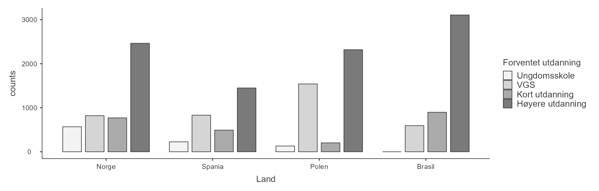
```

```{r}
#| label: fig-diagram-country-x-edu
#| fig-cap: _Forventet utdanning_ i "Split by"
#| out.width: "100%"
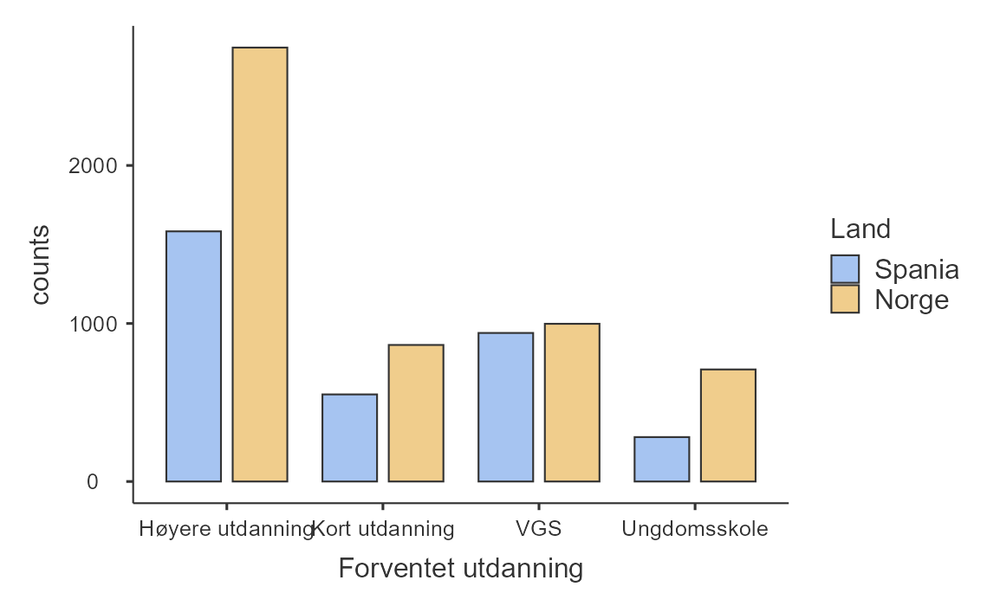
```
Undergruppeanalyse av _Forventet utdanning_ for hvert _Land_.
:::

Dette begynner allerede å se ganske bra ut!

OK, nå fikk jeg blod på tann. Jeg vil gjøre undergruppeanalyse med _enda en variabel_! Jeg ønsker å se om det er kjønnsforskjeller i om elever ser for seg høyere utdanning i Spania og Norge, altså _Forventet utdanning_ per _Kjønn_ og _Land_. Vi legger ganske enkelt til enda en variabel i enten "Variables" eller "Split by". På dette punktet bare sjonglerer jeg variable rundt mellom vinduene inntil jeg finner den figuren jeg liker best. I @fig-diagram-jamovi-bar-threeway ser du resultatet av _Land_ i "Variables" og _Forventet utdanning_ og _Kjønn_ i "Split by".

```{r}
#| label: fig-diagram-jamovi-bar-threeway
#| fig-cap: Undergruppeanalyse av _Forventet utdanning_ for hvert _Land_ og _Kjønn_
#| out.width: "100%"
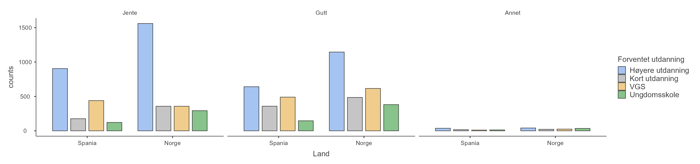
```

Uff, det ble en koloss av en figur! Hvis du klarer å lese skriften vil du likevel se at den er ganske informativ. Vi skal forbedre den i neste delkapittel.

## Stablede stolpediagram {#sec-diagram-stacked-bar}

Stolpediagrammer kan stables oppå hverandre, noe som gjør dem mer kompakte og lettere å forstå, i noen sammenhenger.  Vi trykker oss inn på en annen meny denne gangen, "Analyses" → "Frequencies" → "Independent samples ($\chi^2$ test of association)". Her må du trykke deg inn på "Plots", krysse av for "Bar plot". I denne menyen er det mange flere innstillingsmuligheter enn før, se @fig-diagram-jamovi-stacked-bar:

- Jeg legger inn _Forventet utdanning_ på "Rows" og _Land_ på "Columns". Dette er smak og behag for hvordan tabellen "Contingency Tables", som også genereres, blir seende ut.
- Jeg velger "Bar Type: Stacked", som altså betyr "Stolpetype: Stablet".
- Jeg velger "Percentages" på "Y-axis", fordi jeg ønsker å se andelen fra hvert land som ser for seg ulike utdanninger.
- Siden jeg ønsker å se andelen av hvert land, og jeg satte _Land_ på "Columns", må jeg velge "Percentages within column" for å regne prosenter for hvert land.

```{r}
#| label: fig-diagram-jamovi-stacked-bar
#| fig-cap: Innstillinger i jamovi for å få et stablet stolpediagram for _Forventet utdanning_ for hvert _Land_
#| out-width: "100%"
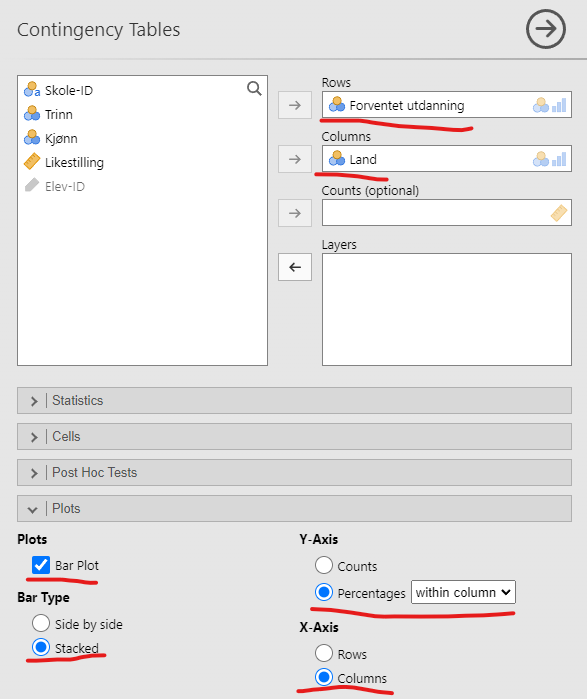
```

Resultatet ser du i @fig-diagram-stacked-bar. Dette viser samme informasjon som @fig-diagram-edu-x-country, så du kan sammenligne og se hvilken du liker best. Forskjellen er at det stablede stolpediagrammet viser "andel innad i hvert land". Her ser vi for eksempel at en noe større andel av de norske elevene planlegger høyere utdanning sammenlignet med de spanske elevene, men forskjellen er ganske liten. Hvis vi sammenligner med det vanlige stolpediagrammet, ser vi at dette viser absolutte tall. Der virker forskjellen mye større -- nesten dobbelt så mange norske som spanske elever ser for seg høyere utdanning! Grunnen til denne store forskjellen i stolpediagrammet er imidlertid at det er betydelig flere norske enn spanske elever i utvalget vårt (5317 mot 3355). Sannsynligvis er vi mer interessert i andelen elever som ser for seg høyere utdanning.

```{r}
#| label: fig-diagram-stacked-bar
#| fig-cap: Stablet stolpediagram av _Forventet utdanning_ for hvert _Land_
#| out-width: "100%"
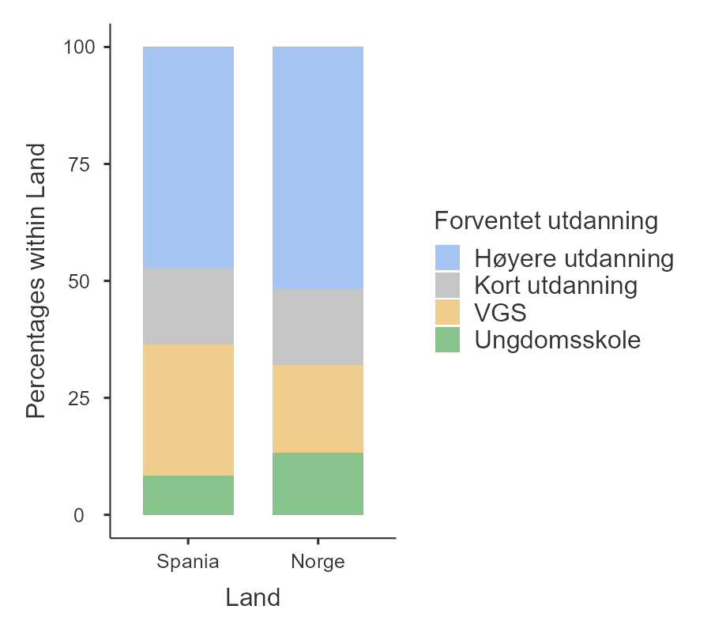
```

Nå kan vi igjen prøve å gjøre en undergruppeanalyse på tvers av to variable, _Kjønn_ og _Land_. _Kjønn_ ligger allerede under "Columns", så vi legger inn _Land_ under "Layers_. Resultatet blir som i @fig-diagram-stacked-bar-threeway. Her skinner virkelig det stablede stolpediagrammet -- se så kompakt og lesbart det ble i forhold til samme informasjon vist som et stolpediagram (@fig-diagram-stacked-bar-threeway). Den største forskjellen mellom disse to diagrammene er at "Annet" var umulig å lese med det vanlige stolpediagrammet fordi stolpene ble så små, men med stablede stolper gikk det an å se at de de norske elevene som valgte annet i veldig stor grad ikke ser for seg mer skole etter ungdomsskolen. (Men husk at disse stolpene er basert på veldig få elever.)

```{r}
#| label: fig-diagram-stacked-bar-threeway
#| fig-cap: Stablet stolpediagram av _Forventet utdanning_ for hvert _Land_ og _Kjønn_
#| classes: .enlarge-image
#| out.width: "100%"
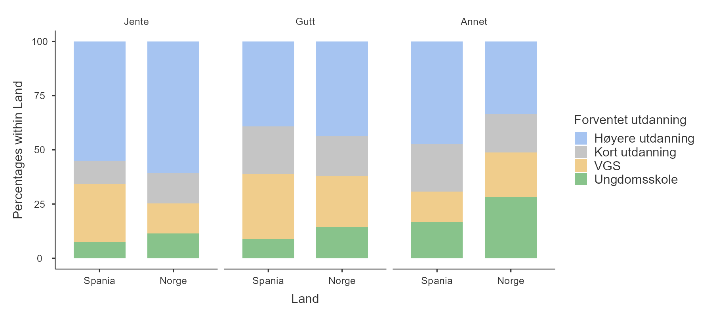
```

Sånn, der var vi ferdig med stolpene! Og da var vi også ferdig med grafene for nominelle og ordinale variable, for de neste delkapitlene er for tall-variable.

## Histogrammer {#sec-histogram}

**Histogrammer** er blant de mest grunnleggende og nyttige måtene å visualisere data på. De fungerer best når du har tallvariable, altså data på intervall- eller forholdstallsnivå slik som variabelen _Likestilling_ fra ICCS-dataene, og ønsker å få et overordnet inntrykk. De fleste kjenner nok til histogrammer, siden de brukes så ofte, men la meg likevel forklare hvordan de fungerer.

Prinsippet er enkelt: Du deler opp de mulige verdiene i **intervaller** og teller hvor mange observasjoner som faller innenfor hvert intervall. Denne tellingen kalles frekvensen eller tettheten til intervallet og vises som en vertikal stolpe. Jeg tror noe av grunnen til at de oppfattes som så enkle er at de minner om stolpediagrammer. For variabelen _Likestilling_ finner vi for eksempel rundt 4000 elever som fikk max poengsum, noe som representeres av høyden på den høyre stolpen i histogrammet @fig-diagram-ICCS-histogram, som vi også viste på starten av @fig-descriptive-ICCS-histogram.

```{r}
#| label: fig-diagram-ICCS-histogram
#| fig-cap: Et histogram av variabelen _Likestilling_ fra ICCS 2022.
#| fig-alt: Histogram som viser variabelen _Likestilling_. Den horisontale aksen ($x$-aksen) strekker seg fra fra 15 til 70, og den vertikale aksen (y-aksen) viser "count", altså hvor mange svar som havner innad i hver søyle.

source("R/jamovi-histogram.R")
ICCS |> 
  jamovi_histogram(Likestilling)
```

For å lage dette histogrammet i jamovi trykker vi "Analyses" → "Exploration" → "Descriptives" og velger "Plots" og "Histogram", se @fig-diagram-jamovi-ICCS-histogram.

```{r}
#| label: fig-diagram-jamovi-ICCS-histogram
#| fig-cap: Innstillingene man trenger for å få frem histogrammet i jamovi
#| out-width: "100%"
knitr::include_graphics("images/fig-diagram-jamovi-ICCS-histogram.png")
```

Problemet med histogrammer er at utseende deres er veldig avhengig av hvor mange stolper man lager. I @fig-diagram-histogram-bins ser vi den samme variabelen med litt forskjellig valg av antall stolper. De blir seende helt forskjellige ut.

```{r}
#| label: fig-diagram-histogram-bins
#| fig-cap: Det er ikke lett å si hva som er korrekt antall stolper i et histogram.
#| classes: .enlarge-image
#| out-width: 100%
#| fig-width: 8.571429

bins <-  c(5, 10, 20, 50)

p <- lapply(
  bins,
  function(bins){
    ICCS |> 
      jamovi_histogram(Likestilling, bins = bins) +
      labs(title = paste("Antall stolper:",bins))
  }
)

library(patchwork)
(p[[1]] + p[[2]])/(p[[3]] + p[[4]])

```

Et alternativ til histogrammer er **tetthetskurver**, noe som jamovi også tilbyr. Du kan gjøre dette ved å klikke på "Density"-avkrysningsboksen like ved "Histogram"-avkrysningsboksen. Resultatet vises i @fig-diagram-density. 

```{r}
#| label: fig-diagram-density
#| fig-cap: Det er ikke lett å si hva som er korrekt antall stolper i et histogram.
#| classes: .enlarge-image
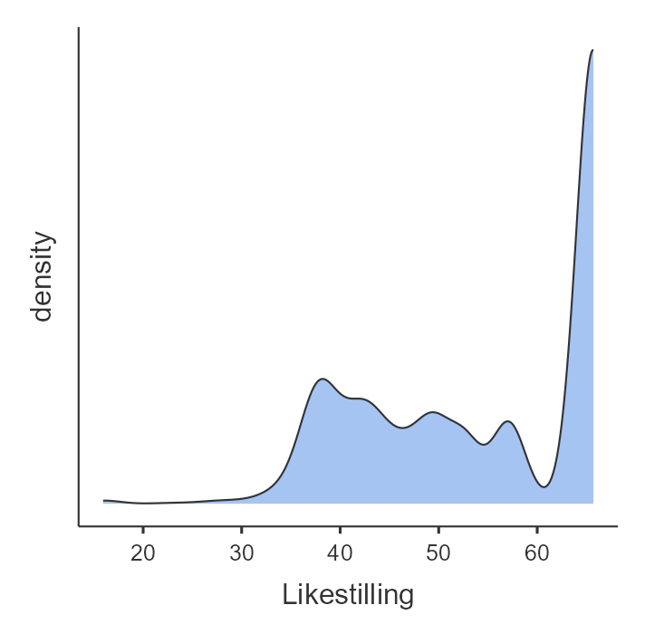
```

En tetthetskurve visualiserer hvordan dataene fordeler seg kontinuerlig. Det benytter en matematisk teknikk for å lage en jevn kurve som viser hvor tett verdiene ligger. Toppene i et tetthetskurver viser altså hvor verdiene er tettest konsentrert, og dalene viser hvor det er få verdier. En fordel med tetthetskurver har over histogrammer er at den ikke påvirkes av antall søyler som brukes, slik som i et histogram. Grunnen til at jeg nevner tetthetskurver er fordi du ofte trenger å kunne tolke dem, for eksempel når du lærer om fiolinplott nedenfor.

## Boksplott

Et flott alternativ til histogrammer er **boksplott**. Ideen bak et boksplott er å gi deg en rask og tydelig visuell oversikt over medianen, kvartilbredden og variasjonsbredden i dataene dine. Siden denne informasjonen var enkel å regne ut også før datamaskiner ble vanlig, og fordi boksplott presenterer all denne informasjonen på en kompakt måte, er boksplott blitt populære -- spesielt når du utforsker dataene for første gang og prøver å forstå hva de forteller deg. Vi tar en titt på variabelen _Likestilling_, se i @fig-diagram-boxplot-equality. For å lage et boksplott i jamovi trykker du på akkurat de samme knappene som for et histogram, du bare krysser av for "Box plot" i stedet for.

```{r}
#| label: fig-diagram-boxplot-equality
#| fig-cap: Et boksplott av variabelen _Likestilling plottet med jamovi
knitr::include_graphics("images/fig-diagram-boxplot-equality.png")
```

Den tykke linjen midt i boksen viser medianen. Av og til er det en firkantet stor prikk, og da viser den gjennomsnittet. Selve boksen dekker området fra 25. persentil til 75. persentil. De tynne linjene viser variasjonsbredden ved at de strekker seg ut til de mest ekstreme datapunktene i hver retning, i hvert fall nesten. Som vi skrev i @sec-descriptive-range, så er variasjonsbredden veldig følsom for hvor ekstreme de mest ekstreme verdiene er. Derfor viser de fleste boksplott ikke variasjonsbredden, men kutter strekene ved en eller annen grense. Som standard er denne grensen satt til 1,5 ganger kvartilbredden (IQR). Hvis noen observasjoner faller utenfor dette området, vises de som prikker eller sirkler i stedet for. Disse kalles **avviksverdier** (_outliers_ på engelsk).
^[Av naturlige årsaker blir dette ofte oversatt til "uteliggere" på norsk. Av like naturlige årsaker velger jeg å _ikke_ benytte ordet "uteligger" for avviksverdiene.]

I våre _Likestilling_-data er det ingen observasjoner som faller utenfor normalområdet, så det er ingen avviksverdier og derfor ingen prikker. En annen spesiell egenskap ved plottet er at det ikke er noen strek som går oppover. Grunnen til det er at det er ingen verdier som er høyere enn 75. persentil fordi det var så mange elever som fikk toppskår på _Likestilling_.

Du er kanskje ikke så imponert over boksplottet og synes histogrammet ga mer informasjon, og jeg er litt enig. Boksplottet viser riktignok medianen og kvartilbredden, men histogrammet viste mer nøyaktig hvordan verdiene fordelte. Boksplottet kommer til sin rett når man gjør en undergruppeanalyse, slik som i @fig-diagram-equ-x-edu. Det er rett og slett vanskelig å se forskjell på undergruppene med histogrammet, men med boksplottet er det lett å se at dess høyere utdanning eleven ser for seg, dess mer er eleven for likestilling mellom kjønnene. (Men merk at dette gjelder på gruppenivå og at det er mange unntak.) For å lage slike boksplott i jamovi er det bare å legge til en variabel i vinduet "Split by".

:::{#fig-diagram-equ-x-edu out.width="100%" layout-ncol=1}
```{r}
#| label: fig-diagram-histogram-equ-x-edu
#| fig-cap: Med histogrammet er det vanskelig å se forskjell på gruppene.
#| out.width: "100%"
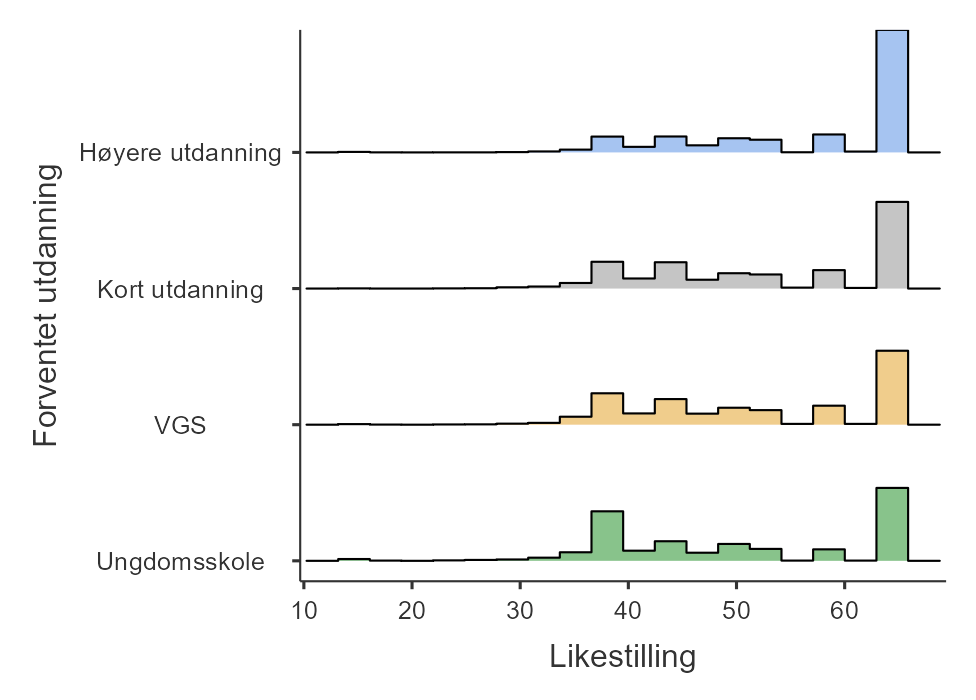
```

```{r}
#| label: fig-diagram-boxplot-equ-x-edu
#| fig-cap: Med boksplott kommer forskjellen tydelig frem, kanskje spesielt ved medianen og nedre kvartil.
#| out.width: "100%"
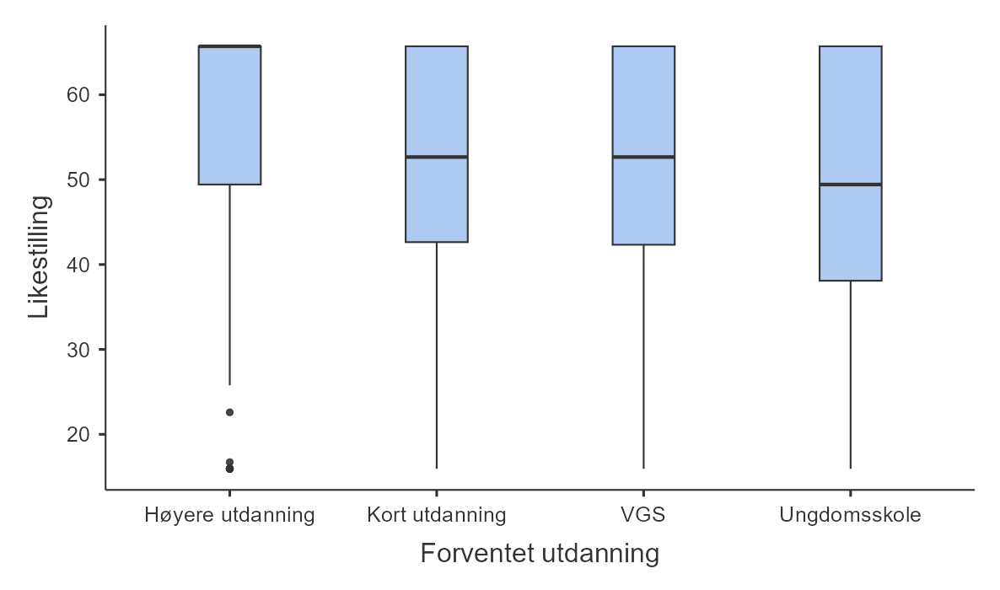
```
Sammenlikning av histogram og boksplott for å vise variabelen _Likestilling_ for hvert forventede utdanningsnivå, plottet med jamovi
:::

I boksplottet i @fig-diagram-boxplot-equ-x-edu ser du også hvordan avviksverdier ser ut med et boksplott, de er prikker som ligger utenfor halene.

### Fiolinplott

En moderne variant av det tradisjonelle boksplottet er fiolinplottet. Fiolinplott likner på tetthetskurver, men de er speilet slik at de ofte ser ut som en fiolinkropp.  I jamovi kan du lage fiolinplott ved å krysse av for "Violin" i stedet for "Histogram". Se @fig-diagram-violin for en undergruppeanalyse med fiolinplott. Her har vi også krysset av for at gjennomsnittet skal vises (på knappen står det "Mean").

```{r}
#| label: fig-diagram-violin
#| fig-cap: Et fiolinplott av _Likestilling_ per _Forventet utdanning_
#| fig-alt: Et fiolinplott som viser fordelingen av _Likestilling_ for hver verdi av _Forventet utdanning_.
#| fig-pos: 'h!'
#| out-width: "100%"
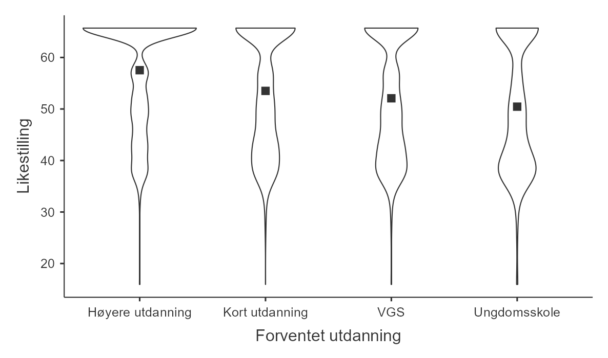
```

Fiolinplottet viser tydelig og kompakt hvordan verdiene fordeler seg. Hvis man i tillegg legger på informasjon som medianen eller gjennomsnittet kan man enkelt se forskjellene i sentraltendens mellom gruppene.

## Spredningsplott {#sec-scatter}

Så til den aller siste typen basisplott som vi skal gå gjennom, **spredningsplott**. Spredningsplott viser sammenhengen mellom to tallvariable. Histogrammer, boksplott og fiolinplott visualiserte én tallvariabel. Da jeg analyserte tallvariabelen opp mot andre variable, kalte jeg det en "undergruppeanalyse" og undergruppene var definert av en nominell eller ordinal variabel. Hva hvis du ønsker å gjøre en slags undergruppeanalyse definert av en tall-variabel? Da må du bruke et spredningsplott. La meg forklare.

Vi har to tallvariable i vår versjon av ICCS-datasettet, _Likestilling_ og _Sosioøkonomisk status_. Et naturlig spørsmål å stille er om elevene med ulik sosioøkonomisk status har forskjellig syn på likestilling mellom kjønnene. Hvis man prøver å gjøre en undergruppeanalyse der undergruppene er definert av _Sosioøkonomisk status_ støter man på problemer, fordi det er `r length(unique(ICCS[["Sosioøkonomisk status"]]))` ulike verdier av _Sosioøkonomisk status_. Man kan ikke vise så mange undergrupper! (De fem første verdiene i datasettet er `r set.seed(2025); slice_sample(ICCS,n = 5) |> _$'Sosioøkonomisk status'`, skjønner du problemet, eller?)

Løsningen er å legge hver sin variabel på hver sin akse og plotte hvert punkt. Hvis jeg vil legge _Sosioøkonomisk status_ på $x$-aksen og _Likestilling_ på $y$-aksen legger jeg inn dette i jamovi slik som i @fig-diagram-jamovi-scatter. Resultatet er i @fig-diagram-scatter. Vi ser at uavhengig av sosioøkonomisk status virker den vanligste verdien på _Likestilling_ å være den høyeste. Ut fra figuren er er det ikke klart om sosioøkonomisk status har noen sammenheng med syn på likestilling i det hele tatt. 


::: {#fig-scatter out.width="100%" layout-ncol=2}

```{r}
#| label: fig-diagram-jamovi-scatter
#| fig-cap: Trykk på "Analyses" → "Exploration" → "Scatter plot" for å få opp denne menyen.
#| fig-alt: Menyen der man velger innstillinger for "Scatter plot" i jamovi
#| out-width: "100%"
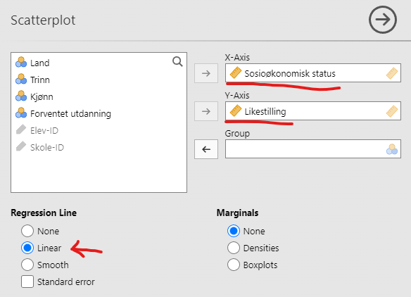
```


```{r}
#| label: fig-diagram-scatter
#| fig-cap: Spredningsplott over _Likestilling_ og _Sosioøkonomisk status_.
#| fig-alt: Et spredningsplott med Likestilling på y-aksen og Sosioøkonomisk status på x-aksen. Veldig mange punkter er samlet i en linje horisontal linje langs hele toppen, og ellers er punktene jevnt spredt utover.
#| out-width: "100%"
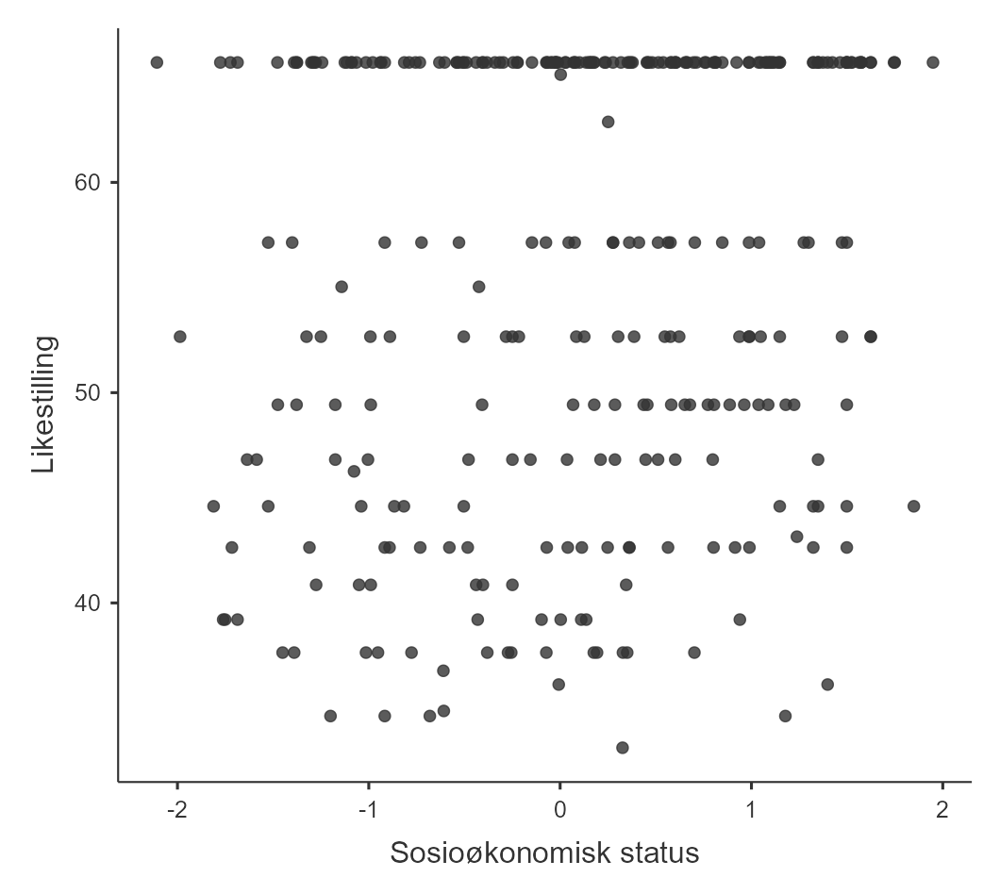
```
Spredningsplott med jamovi
:::

For å gjøre sammenhengen tydeligere er det vanlig å legge en linje over spredningsplottet, slik som i @fig-diagram-scatter-line. Den viser at det er en svak positiv tendens, altså at elever med høy sosioøkonomisk status svarer høyere på spørsmålene om likestilling. Du lærer mer om slike linjer, regresjonslinjer, i kapittelet om regresjon. <!-- !!! -->

```{r}
#| label: fig-diagram-scatter-line
#| fig-cap: Spredningsplott med en regresjonslinje lagt til
#| fig-alt: Samme figur som det forrige spredningsplottet, men med en linje lagt oppå punktene. Linja heller svakt oppover mot høyre.
#| classes: .enlarge-image
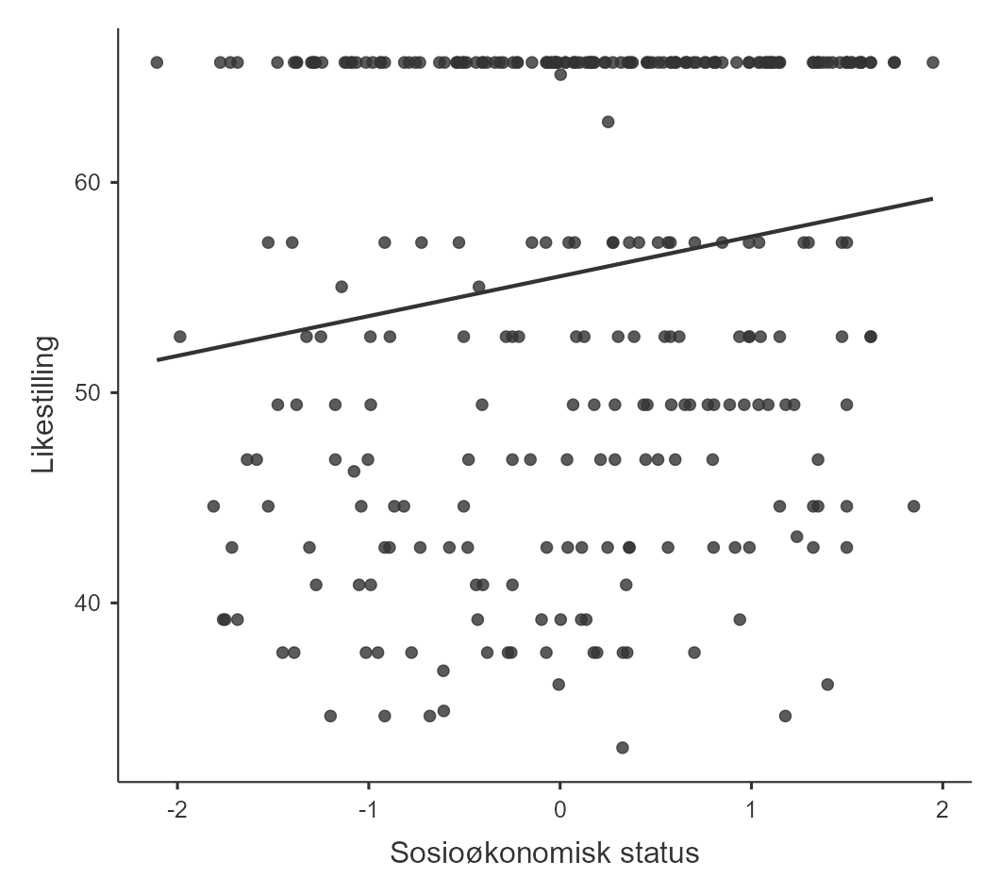
```


## Profesjonelle grafer

Jeg sa at jamovi tegnet standardgrafer som var tydelige og minimalistiske. Hva skiller dem fra mer forseggjorte grafer? Stort sett fargevalg og tekst-annoteringer som må skreddersys til hver graf. Se for eksempel på stolpediagrammet i @fig-diagram-owid-bar. Det er et vanlig stolpediagram, men

- det er lagt horisontalt slik at teksten skal bli lettere å lese,
- hver søyle er markert med prosenter,
- aksene er fjernet,
- farger er brukt for å vise grupper av søyler,
- Tittel og figurnoter forteller hele historien.

Alt i alt blir øyet ledet rundt i figuren slik at den samlet sett forteller en interessant historie om globale utdanningsforskjeller.

```{r}
#| label: fig-diagram-owid-bar
#| fig-cap: Et profesjonelt stolpediagram. Legg merke til forklarende tekst og farger. Grafen er laget av Roser -@roser2022. Utgitt under lisensen CC-BY.
#| classes: .enlarge-image
#| out-width: "100%"
knitr::include_graphics("images/fig-diagram-owid-bar.png")
```

Det var et standard stolpediagram -- andre diagrammer er spesiallagde. Se for eksempel på @fig-diagram-owid-line, som på en fantastisk måte viser at ungene lærer mer i Sør-Korea, Finland og Nederland enn i Brasil og Uruguay, selv hvis man sammenlikner familier med samme kjøpekraft. 

```{r}
#| label: fig-diagram-owid-line
#| fig-cap: Et profesjonelt linjediagram. Legg merke til forklarende tekst og farger. Grafen er laget av Roser -@roser2022. Utgitt under lisensen CC-BY.
#| classes: .enlarge-image
#| out-width: "100%"
knitr::include_graphics("images/fig-diagram-owid-line.png")
```

Andre visualiseringer er enda mer spesialiserte, som for eksempel for [å vise hvordan amerikanere tilbringer dagene sine](https://flowingdata.com/2015/12/15/a-day-in-the-life-of-americans/) eller hele denne saken fra NRKs team med data-journalister som [visualiserer naturnedbygging i Norge](https://www.nrk.no/dokumentar/xl/nrk-avslorer_-44.000-inngrep-i-norsk-natur-pa-fem-ar-1.16573560). Det er lov å la seg inspirere!

## Lagre bildefiler med jamovi

Du lurer kanskje på hvordan du lagrer alle grafene vi har laget. Bare høyreklikk på grafen og eksporter det til en fil. Du kan velge mellom flere formater som "png", "eps", "svg" eller "pdf". Alle disse formatene gir deg høy kvalitet på bildene, perfekt for å dele med kolleger, inkludere i oppgaver eller bruke i artikler og presentasjoner, men ".png" er trolig det som vil samarbeide best med Microsoft Word.

## Sammendrag

Hjernen vår har en fantastisk kapasitet til å analysere data, men bare så lenge vi kan se på dataene i form av en graf. Hvis vi presenter informasjonen på riktig måte, gir vi leseren mye kunnskap på kort tid. Og den aller viktigste leseren av grafene du lager er deg selv -- ved å lage mange grafer av dataene dine vil du skjønne dem bedre, oftere trekke velbegrunnede konklusjoner og sjeldnere trekke dårlig begrunnede konklusjoner. Derfor mener jeg dette er det viktigste kapittelet i boken hvis du skal gjøre kvantitativ forskning, i tillegg til @sec-measurement og @sec-design.

I dette kapitlet har vi dekket:

- **Vanlige plott**: Vi har fokusert på standardgrafer som statistikere ofte bruker, som [Stolpediagram], [Stablede stolpediagram], [Histogrammer], [Boksplott] (samt [Fiolinplott]) og [Spredningsplott]. Det er verdt å vite hvilke variabeltyper som passer til hver type plott, i tillegg til å kunne tolke dem.
