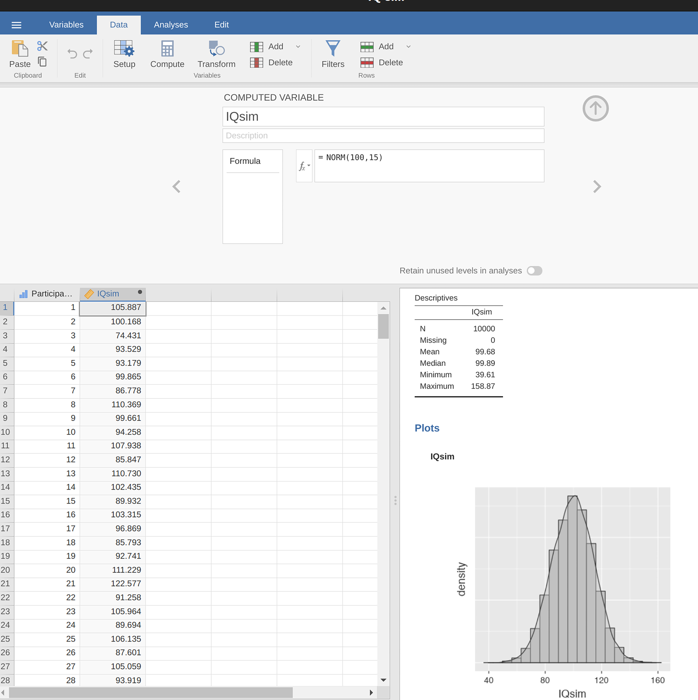
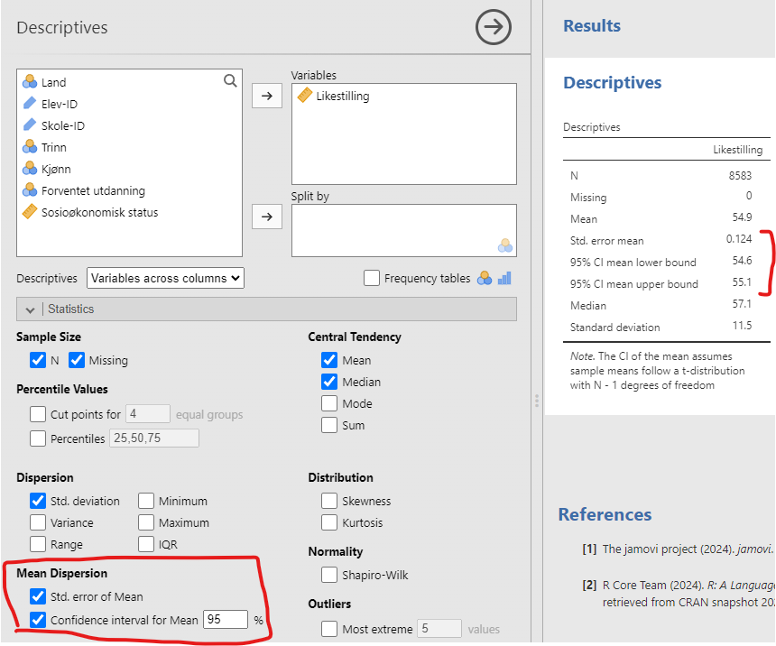

<!-- \placetextbox{0.26}{0.06}{\scriptsize{©2025 D.R. Foxcroft and D.J. Navarro,}} -->
<!-- \placetextbox{0.195}{0.05}{\scriptsize{CC BY-SA 4.0}} -->
<!-- \placetextbox{0.70}{0.06}{\scriptsize{\url{https://doi.org/10.11647/OBP.0333.08}}} -->

# Estimering av ukjente størrelser fra et utvalg {#sec-estimation}

```{r}
#| include: FALSE
source("chapter_header.R")
```

Husk at vi er på vei mot å lære om *inferensiell statistikk*. I kapittelet om deskriptiv statistikk, @sec-descriptive, lærte vi å sammenfatte og vise dataene på en kortfattet måte. Inferensiell statistikk har derimot som mål å lære om noe som går utover dataene, for eksempel populasjonen. Nå som vi vet litt om sannsynlighetsteori, er vi endelig klare til å ta fatt på problemstillingen rundt statistisk inferens. Vi skal lære to ting om inferensiell statistikk, estimering og hypotesetesting. 

I dette kapittelet vil vi utforske den første av disse store ideene -- estimering. Vi kommer til å benytte oss av mye av kunnskapen om utvalg, og spesielt enkle tilfeldige utvalg. Se @sec-design-simple-random hvis du trenger en oppfriskning.

## Populasjonsparametre og utvalgsobservatorer

Fram til nå har vi snakket om populasjoner slik en forsker ville gjort. For en psykolog kan en populasjon være en gruppe mennesker. For en økolog kan en populasjon være en gruppe bjørner. For en utdanningsforsker kan populasjonen være elever, lærere, skoler, lærebøker, undervisningstimer og mye mer. I de fleste tilfeller er populasjonene som forskere bryr seg om konkrete ting som faktisk eksisterer i den virkelige verden. Statistikere derimot er en rar gjeng. På den ene siden er de interessert i virkelige data og ekte vitenskap på samme måte som forskere er. På den andre siden opererer de også i ren abstraksjon på samme måte som matematikere gjør. Som følge av dette har statistisk teori en tendens til å være litt abstrakt i hvordan den omtaler populasjoner. Statistikere operasjonaliserer begrepet "populasjon" i form av et matematisk objekt som de vet hvordan de skal arbeide med. Du har allerede møtt disse objektene i @sec-probability-distributions -- de kalles sannsynlighetsfordelinger.

Ideen er ganske enkel. La oss si at vi snakker om IQ-skårer. For utdanningsforskeren er populasjonen en gruppe faktiske mennesker, for eksempel elever på 7. trinn i Norge. En statistiker "forenkler" dette ved operasjonelt å definere populasjonen som sannsynlighetsfordelingen vist i @fig-estimation-IQ (a). IQ-tester er designet slik at gjennomsnittlig IQ er 100, at standardavviket er 15 og at den er normalfordelt.
^[Ja, IQ-tester blir normert (altså regnet om) slik at dette stemmer.]
Disse verdiene omtales som **populasjonsparametre** fordi de er kjennetegn ved populasjonen. Det vil si at populasjonsgjennomsnittet $\mu$ er 100 og populasjonsstandardavviket $\sigma$ er 15.

```{r out.width="100%"}
#| label: fig-estimation-IQ
#| fig-cap: Populasjonsfordelingen av IQ-skårer (panel (a)) og to utvalg trukket tilfeldig fra den. I panel (b) har vi et utvalg på 100 observasjoner, og i panel (c) har vi et utvalg på 10 000 observasjoner
#| fig-alt: Bildet inneholder tre grafer av IQ-skårer. Grafen til venstre er en sannsynlighetstetthetskurve, den midterste grafen er et histogram med frekvenser, og grafen til høyre er et annet histogram med høyere frekvenser. Alle diagrammene viser IQ-skårer på x-aksen.
#| fig-with: 8.571429
#| 

plota <- ggplot(data = data.frame(x = seq(60, 140, 1)), aes(x)) +
  stat_function(fun = dnorm, n = 1000, args = list(mean = 100, sd = 15), col=blueshade, linewidth=1) +
  scale_x_continuous(breaks = seq(60, 140, 20)) +
  xlab("\nIQ-skår") +
  theme(
    axis.title.y = element_blank(),
    axis.text.y = element_blank(),
    axis.ticks.y = element_blank(),
    axis.line.y = element_blank()
  )

set.seed(99)
IQ_simul <- rnorm(100, 100, 15)
IQ_simul_mean <- round(mean(IQ_simul), digits = 2)
IQ_simul_sd <- round(sd(IQ_simul), digits = 2)

IQ_simul_big <- rnorm(10000, 100, 15)
IQ_simul_big_mean <-  round(mean(IQ_simul_big), digits = 4)
IQ_simul_big_sd <- round(sd(IQ_simul_big), digits = 4)

plotb <- ggplot(data = data.frame(x = IQ_simul), aes(x)) +
  geom_histogram(binwidth=6, col=blueshade, fill=blueshade, alpha=0.6) +
  scale_x_continuous(breaks = seq(60, 140, 20)) +
  xlab("\nIQ-skår") +
  theme(
    axis.title.y = element_blank(),
    axis.text.y = element_blank(),
    axis.ticks.y = element_blank(),
    axis.line.y = element_blank()
  )

plotc <- ggplot(data = data.frame(x = IQ_simul_big), aes(x)) +
  geom_histogram(binwidth=6, col=blueshade, fill=blueshade, alpha=0.6) +
  scale_x_continuous(breaks = seq(60, 140, 20)) +
  xlab("\nIQ-skår") +
  theme(
    axis.title.y = element_blank(),
    axis.text.y = element_blank(),
    axis.ticks.y = element_blank(),
    axis.line.y = element_blank()
  )

gridExtra::grid.arrange(plota, plotb, plotc, ncol = 3)
```

Anta nå at jeg gjennomfører en forskningsstudie. Jeg velger 100 personer med enkelt tilfeldig utvalg og gjennomfører en IQ-test, noe som gir meg et enkelt tilfeldig utvalg fra populasjonen. Utvalget mitt vil bestå av en samling tall som dette:

> 106 101 98 80 74 ... 107 72 100

Hver av disse IQ-skårene er trukket fra en populasjon med elever, men statistikeren ser på det som om det er tall trukket fra en normalfordeling med gjennomsnitt 100 og standardavvik 15. Hvis jeg lager et histogram av utvalget får jeg noe som det som vises i @fig-estimation-IQ (b). Som du kan se har histogrammet omtrent riktig form, men det er en svært grov tilnærming til den sanne populasjonsfordelingen vist i @fig-estimation-IQ (a). Også utvalgets gjennomsnitt og standardavvik er bare sånn omtrent likt populasjonsparametrene. Når jeg regner ut gjennomsnittet av utvalget mitt får jeg et tall som er ganske nært populasjonsgjennomsnittet 100, men ikke identisk. I dette tilfellet hadde utvalget en gjennomsnittlig IQ på `r IQ_simul_mean`, og standardavviket til IQ-skårene var på `r IQ_simul_sd`. Disse **observatorene** er egenskaper ved utvalget , og selv om de er ganske like de sanne populasjonsparametrene er de ikke de samme. Generelt er observatorer de tingene du kan beregne fra datasettet ditt, og populasjonsparametrene er de tingene du ønsker å lære om. Det er svært viktig å forstå skillet mellom en populasjonsparameter og en observator.

> Populasjonsparametre beskriver *populasjonens* fordeling. Observatorer beskriver *utvalget*.

For å hamre det inn lager jeg en tabell også, se @tbl-parametre-observatorer.

```{r}
#| label: tbl-parametre-observatorer
#| tbl-cap: Forskjellen på populasjonsparametre og utvalgsobservatorer, også bare kalt observatorer

tibble(
  "Nivå" = c("Populasjon", "Utvalg"),
  "Navn på utregnede størrelser" = c("Populasjonsparametre", "Observatorer"),
  "Eksempler på utregnede størrelser" = c("Populasjonens gjennomsnitt,\nPopulasjonens standardavvik,\nPopulasjonens maksimumsverdi,\nPopulasjonens variasjonsbredde","Utvalgets gjennomsnitt,\nUtvalgets standardavvik,\nUtvalgets maksimumsverdi,\nUtvalgets variasjonsbredde")
) |> 
  tt(width = c(2,3,6))
```


Senere i dette kapittelet skal vi lære å [estimere populasjonsparametrene](#sec-estimation-parameters) ved hjelp av observatorene dine. Vi skal også lære å [estimere et konfidensintervall](#sec-estimation-CI), men før vi kommer dit trenger vi mer teori. For kanskje hadde du en innvending mot å anta at populasjonen sin sannsynlighetsfordeling var normalfordelingen? Det var i så fall klokt! For eksempel var fordelingen til synet på likestilling mellom kjønnene overhodet ikke normalfordelt, se @fig-diagram-ICCS-histogram. Derfor trenger vi mer teori for å komme til "sentralgrenseteoremet" som forklarer hvorfor vi kan regne med normalfordelingen selv om populasjonsfordelingen er annerledes.

## Store talls lov {#sec-law-of-large-numbers}

Resultatene fra den fiktiv IQ-studien med en utvalgsstørrelse på $N = 100$ var ganske oppmuntrende. Siden det sanne populasjonsgjennomsnittet var 100, og utvalgsgjennomsnittet var `r IQ_simul_mean`, var det en rimelig god tilnærming. I mange vitenskapelige studier er dette presisjonsnivået helt akseptabelt, men i andre situasjoner trenger du å være mye mer presis. Hvis vi ønsker at observatorene våre skal bli enda likere populasjonsparametrene, hva kan vi gjøre? Det opplagte svaret er å samle inn mer data. 

La oss anta at vi gjennomførte en mye større studie, denne gangen hvor vi målte IQ-en til 10 000 personer. Jeg simulerer nok en gang tilfeldige trekk fra en normalfordeling med gjennomsnitt 100 og standardavvik 15. I @fig-estimation-IQ (c) ser du et histogram som viser at dette større utvalget gir en bedre tilnærming til den sanne populasjonsfordelingen enn det mindre utvalget. Dette gjenspeiles også i observatorene. Gjennomsnittlig IQ for det større utvalget er `r IQ_simul_big_mean` og standardavviket er `r IQ_simul_big_sd`. Disse verdiene er nå svært nære den sanne populasjonen.

```{r}
#| label: fig-fig8-5
#| 
#| fig-cap: Et tilfeldig utvalg trukket fra en normalfordeling ved hjelp av jamovi
#| fig-alt: Et jamovi-skjermbilde vises. Det inkluderer menyer for variabelmanipulering og dataanalyse. En beregnet variabel "IQsim" vises med en formel. En tabell lister opp numeriske IQsim-verdier, og et histogram med deskriptiv statistikk vises til høyre
#| out-width: "100%"

```

Det jeg vil at du skal ta med deg fra dette er at store utvalg generelt gir deg bedre informasjon, så lenge de er tilfeldige. Dette kan virke opplagt, og det er det også! Faktisk er det så opplagt at da Jacob Bernoulli, en av grunnleggerne av sannsynlighetsteori, formaliserte denne ideen tilbake i 1713, kommenterte han at vi alle har denne intuisjonen. Her er hvordan han beskrev det:

> *For even the most stupid of men, by some instinct of nature, by himself and without any instruction (which is a remarkable thing), is convinced that the more observations have been made, the less danger there is of wandering from one’s goal * [@Stigler1986, s. 65].

Utdraget kan høres litt nedlatende ut (for ikke å snakke om utdatert), men hovedpoenget hans er korrekt. Det føles virkelig opplagt at mer data vil gi deg bedre svar. Det viser seg at denne intuisjonen faktisk er matematisk korrekt så lenge utvalget er tilfeldig, og statistikere omtaler den som **store talls lov**. Store talls lov sier at vi kan forvente at utvalgsgjennomsnittet nærmer seg populasjonsgjennomsnittet når utvalgsstørrelsen blir stor, altså $n\longrightarrow\infty$. Vi skal virkelig ikke vise at store talls lov er sann, men loven er et av de viktigste verktøyene i statistisk teori.

Problemet nå til dags er at store talls lov gir oss grunnlag for å tro at det å samle inn mer og mer data til slutt vil føre oss til sannheten. Det vil den ikke. Store datasett er ofte dårligere enn små datasett fordi man ikke kan gjøre seg like flid med innsamlingen, eller at store datasett er samlet inn til andre formål enn forskning. For eksempel kan en kommune ha kjøpt inn et nytt nettbasert læringsspill og har derfor mye data om elevenes bruk spillet. Forskere ber om å få forske på dataene, og finner at elevene som bruker spillet mye har mye større fremgang på nasjonale prøver enn de eleven som ikke bruker spillet mye. Det er fristende å konkludere med at dette er et robust resultat siden man har så mye data -- det var jo tusenvis av elever i kommunen! Store talls lov må jo slå inn! Men store talls lov gjelder ikke her, dataene var ikke samlet inn med et tilfeldig utvalg fra en gitt populasjon. Dessuten må man ikke la seg forlede av den store datamengden og slutte å stille kritiske spørsmål. Kanskje er det konfundere til stede? Hva med de som ikke spilte spillet, de har man jo ikke noe data på? Intuisjonen bak store talls lov kan dessverre gjøre oss sikre på at gale estimater er presise.

## Fordelingen til utvalgsobservatorer og sentralgrenseteoremet

De store talls lov er et fantastisk verktøy, men det kan ikke svare på alle spørsmålene våre. Hovedproblemet er at det bare gir oss en "langsiktig garanti". På lang sikt, hvis vi på en eller annen måte klarte å samle inn uendelig mye data, garanterer de store talls lov at utvalgsobservatorene våre vil være korrekte så lenge utvalget er enkelt tilfeldig. Men som økonom John Maynard Keynes så treffende påpekte, har langsiktige garantier liten verdi i det virkelige livet.

> *[The] long run is a misleading guide to current affairs. In the long run we are all dead. Economists set themselves too easy, too useless a task, if in tempestuous seasons they can only tell us, that when the storm is long past, the ocean is flat again.* [@Keynes1923, p. 80].

Dette gjelder også i utdanningsforskning. Det holder ikke å vite at vi til slutt vil komme frem til det riktige svaret når vi beregner utvalgets gjennomsnitt hvis vi bare hadde et enormt utvalg. Å vite at et uendelig stort datasett vil gi meg den eksakte verdien av populasjonsgjennomsnittet, er en mager trøst når datasett har en utvalgsstørrelse på $N = 100$. I praksis må vi derfor forstå hvor variabelt estimatet for populasjonsgjennomsnittet er når det beregnes fra et mer beskjedent datasett. Dette delkapittelet omhandler derfor sannsynlighetsfordelingen til estimater av populasjonsparametrene. 

### Utvalgsfordelingen til gjennomsnittet {#sec-sampling-distribution-of-the-mean}

```{r}
simuls <- replicate(10,rnorm(5,100,15))
```

Nå skal vi forstå at estimatene av populasjonsparametrene (slik som populasjonens gjennomsnitt og standardavvik) også har en sannsynlighetsfordeling. Dette er viktig og erfaringsmessig er det vanskelig å forstå, så spenn deg godt fast før du leser videre.

For å forklare tenker vi oss en mer beskjeden studie. Denne gangen tar vi et utvalg på $N = 5$ personer og måler deres IQ-skårer, vel, i hvert fall simulerer jeg IQ-skårer ved hjelp av datamaskinen. Her er de fem IQ-skårene:

> `r round(simuls[, 1])`

Gjennomsnittlig IQ i dette utvalget er nøyaktig 95. Som forventet er dette mye mindre nøyaktig enn den forrige studien, fordi utvalget bare har 5 personer. Tenk deg nå at jeg bestemmer meg for å **replikere** studien. Det vil si, jeg gjentar studien så nøye som mulig og tar tilfeldig et utvalg på 5 nye personer og måler deres IQ. Derfor simulerer jeg fem nye tilfeldige verdier:

> `r round(simuls[, 2])`

Denne gangen er gjennomsnittlig IQ i mitt utvalg 101. Hvis jeg gjentar eksperimentet 10 ganger, får jeg resultatene vist i @tbl-IQ-simuls. Som du kan se, varierer utvalgets gjennomsnitt fra en replikasjon til den neste.

```{r}
#| label: tbl-IQ-simuls
#| tbl-cap: Ti replikasjoner av IQ-eksperimentet, hver med en utvalgsstørrelse på $( N = 5 )$

simuls <- simuls |>
  t() |>
  as_tibble() |>
  setNames(paste("Person", 1:5)) |>
  add_column(` ` = paste("Replikasjon",1:10), .before = 1) |> 
  mutate(
    `Utvalgets gjennomsnitt` = mean(c_across(starts_with("Person")))
  )

simul_means <- simuls |> pull("Utvalgets gjennomsnitt")

simuls |> 
  tt(width = 1) |> 
  format_tt(digits = 1, num_mark_dec = ",", num_zero = TRUE)
```

Tenk deg nå at jeg bestemte meg for å fortsette på denne måten, og replikere dette "fem IQ-skårer" eksperimentet om og om igjen. Hver gang jeg replikerer eksperimentet, skriver jeg ned utvalgets gjennomsnitt. Over tid ville jeg samle opp et nytt datasett, der hvert eksperiment genererer et enkelt datapunkt. De første 10 observasjonene fra datasettet mitt er utvalgsgjennomsnittene listet opp i @tbl-IQ-simuls, så datasettet mitt starter slik:

> `r round(simul_means)`

Hva om jeg fortsatte slik i 10 000 replikasjoner og deretter tegnet et histogram? Vel, det er nøyaktig det jeg gjorde, og du kan se resultatene i @fig-estimation-IQ-simuls. Som dette bildet illustrerer, ligger gjennomsnittet av 5 IQ-skårer vanligvis mellom 90 og 110. Men enda viktigere: figuren viser er at hvis vi replikerer et eksperiment om og om igjen, så ender vi opp med en fordeling av utvalgsgjennomsnitt! Denne fordelingen har et spesielt navn i statistikk – den kalles **utvalgsgjennomsnittets fordeling**.

Utvalgsfordelinger er blant de viktigste idéene i statistikk, og de er avgjørende for å forstå usikkerheten i estimater. For eksempel, da jeg kjørte den aller første "fem IQ-skårer"-studien, viste utvalgets gjennomsnitt seg å være `r simul_means[1]`. Det som utvalgsfordelingen i @fig-estimation-IQ-simuls forteller oss, er imidlertid at "fem IQ-skårer" eksperimentet ikke er særlig nøyaktig. Hvis jeg gjentar eksperimentet, forteller utvalgsfordelingen meg at jeg kan forvente å se et utvalgsgjennomsnitt hvor som helst mellom 80 og 120.

```{r out.width="80%"}
#| label: fig-estimation-IQ-simuls
#| fig-cap: Utvalgsfordelingen av gjennomsnittet for "fem IQ-skårer"-studiene. Hvis du tar et utvalg på 5 personer tilfeldig og beregner deres gjennomsnittlige IQ, vil du nesten helt sikkert få et tall mellom 80 og 120, selv om det er ganske mange individer som har IQ-er over 120 eller under 80. Til sammenligning viser den svarte linjen populasjonsfordelingen av IQ-skårer
#| fig-alt: Et histogram av IQ-skårer med en pålagt normalfordelingskurve. X-aksen spenner fra 60 til 140, med en topp rundt 100. Y-aksen viser frekvens. Histogramstolpene er blå, og normalfordelingskurven er svart
#| fig-width: 6
#| fig-height: 4
#| fig-pos: 'h!'

sdm_data <- lapply(1:10000, function (x) {
rnorm(5, 100, 15)
})
sdm_data_means <- data.frame(sample_means = unlist(lapply(sdm_data,mean)))

ggplot(data = sdm_data_means, aes(x = sample_means )) +
geom_histogram(aes(y =after_stat(density)), binwidth=4, col=blueshade, fill=blueshade, alpha=0.7) +
stat_function(fun = dnorm, args = list(mean = 100, sd = 15), col="black", linewidth=1) +
scale_x_continuous(limits=c(60,140), breaks = seq(60, 140, 20)) +
xlab("\nIQ-skåre") +
theme(
axis.title.y = element_blank(),
axis.line.y = element_blank(),
axis.ticks.y = element_blank(),
axis.text.y = element_blank())
```

I figur @fig-estimation-IQ-simuls er de blå søylene forskjellige verdier av gjennomsnittet, mens den svarte linjen er fordelingen til populasjonen. (Husk at i dette tilfellet vet vi fordelingen til populasjonen, den var normalfordelt med gjennomsnittlig IQ 100 og standardavvik 15.) Vi kan trekke to lærdommer fra dette:

- Vi ser at de blå søylene er mye mer samlet enn den svarte linjen, som betyr at "gjennomsnittlig IQ av fem tilfeldige personer" varierer mindre enn "IQ til en tilfeldig trukket person". Altså at gjennomsnittets utvalgsfordeling er mindre variabel enn populasjonsfordelingen.
- Vi ser at gjennomsnittet til de blå søylene er det samme som gjennomsnittet til den svarte linjen, som betyr at gjennomsnitts-IQen til utvalgene kan brukes til å estimere gjennomsnitts-IQen i populasjonen.

Dette delkapittelet er verdt å skjønne ordentlig; forskjellen på gjennomsnittet til populasjonen og gjennomsnittets utvalgsfordeling er nøkkelkunnskap. Man forsøker å estimere gjennomsnittet til populasjonen ut fra utvalgets gjennomsnitt, og utvalgets gjennomsnitt er trukket fra gjennomsnittets utvalgsfordeling.

### Utvalgsfordelinger finnes for enhver utvalgsobservator!

Noe viktig å huske på når vi jobber med utvalgsfordelinger: enhver statistikk du beregner fra et utvalg har sin egen utvalgsfordeling. La meg vise deg et eksempel.


```{r}

simul_max <- simuls |>
  mutate(
    max = max(c_across(starts_with("Person")))
    ) |>
  pull("Utvalgets gjennomsnitt")

```


Tenk deg at hver gang jeg gjentar "fem IQ-skårer"-eksperimentet, skriver jeg ned den høyeste IQ-skåren i gruppen. Dette gir meg et datasett som starter slik:

> `r simul_max[1:5]`

Hvis jeg gjør dette mange ganger, får jeg en helt annen utvalgsfordeling - nemlig utvalgsfordelingen til maksimumsverdien. Du kan se denne fordelingen i @fig-estimation-IQ-max. Resultatet er egentlig som man kan forvente: De blå søylene viser at når du plukker 5 personer tilfeldig og finner den med høyest IQ-skåre, vil denne personen ha en over gjennomsnittlig IQ. Mesteparten av tiden ender du opp med noen som har en IQ-skåre mellom 100 og 140.

```{r out.width="80%"}
#| label: fig-estimation-IQ-max
#| fig-cap: Utvalgsfordelingen til maksimum for "fem IQ-skårer eksperimentet". Hvis du tar et utvalg av 5 personer tilfeldig og velger den med høyest IQ-skåre vil du sannsynligvis se noen med en IQ mellom 100 og 140
#| fig-alt: Et histogram av IQ-skårer vises med blå søyler som indikerer frekvensen av hver skåregruppe. En svart klokkekurve ligger over som representerer normalfordelingen, med skårer fra 60 til 140 på x-aksen
#| fig-width: 6
#| fig-height: 4
#| fig-pos: 'H'

sdm_data <- lapply(1:10000, function (x) {
  rnorm(5, 100, 15)
})
sdm_data_max <- data.frame(sample_max = unlist(lapply(sdm_data,max)))

ggplot(data = sdm_data_max, aes(x = sample_max )) +
  geom_histogram(aes(y =after_stat(density)), binwidth=4, col=blueshade, fill=blueshade, alpha=0.7) +
  stat_function(fun = dnorm, args = list(mean = 100, sd = 15), col="black", linewidth=1) +
  scale_x_continuous(limits=c(60,140), breaks = seq(60, 140, 20)) +
  xlab("\nIQ-skåre") +
  theme(
    axis.title.y = element_blank(),
    axis.line.y = element_blank(),
    axis.ticks.y = element_blank(),
    axis.text.y = element_blank())
```

@fig-estimation-IQ-max viser oss også noe annet: å regne ut maksimumsverdien til utvalget vil ikke være noe godt estimat for maksimumsverdien i populasjonen -- det vil nesten garantert gi et for lavt estimat! Dette betyr at utvalgsobservatoren for maksimumsverdien _ikke_ er noe godt estimat på populasjonsparameteren. Man kan altså ikke forvente at hvis man regner ut en verdi for utvalget ditt, så vil dette være et godt estimat på den tilsvarende populasjonsparameteren. At det gjaldt for gjennomsnittet, slik vi så i @fig-estimation-IQ-simuls, er altså ganske spesielt.

### Sentralgrenseteoremet og standardfeilen {#sec-central-limit-theorem}

Nå som du forhåpentligvis har god forståelse av utvalgsfordelinger –- og spesielt utvalgsfordelingen til gjennomsnittet –- skal vi se på hvordan denne fordelingen endrer seg når utvalgsstørrelsen varierer.

Du kjenner sannsynligvis allerede deler av svaret intuitivt: Med få observasjoner blir utvalgsgjennomsnittet ganske unøyaktig. Dette betyr at hvis du gjør en studie med få (tilfeldig utvalgte) deltagere, så vil du ikke få et så presist estimat på populasjonsgjennomsnittet. Og hvis du gjør studien på nytt med andre (tilfeldig valgte) deltagere kan du få et svært forskjellig estimat på gjennomsnittet. Med andre ord er gjennomsnittets utvalgsfordeling ganske bred. Hvis du derimot gjør to store studier og beregner utvalgsgjennomsnittet for hver av dem, vil du sannsynligvis få omtrent det samme svaret i begge studiene, og dette vil være nært populasjonsgjennomsnittet. Da er utvalgsfordelingen blitt mye smalere.

Dette kan du se visuelt i @fig-central-limit-IQ, som viser at jo større utvalgsstørrelsen er, jo smalere blir utvalgsfordelingen til gjennomsnittet: I @fig-central-limit-IQ-1 inneholdt hvert datasett bare én observasjon, så gjennomsnittet av hvert utvalg er simpelthen IQ-skåren til én person. Derfor er utvalgsfordelingen til gjennomsnittet identisk med populasjonsfordelingen av IQ-skårer. Når vi øker utvalgsstørrelsen til 2 i @fig-central-limit-IQ-2, har gjennomsnittet en tendens til å ligge nærmere populasjonsgjennomsnittet enn IQ-skåren til hver enkelt person. Derfor blir histogrammet (utvalgsfordelingen) litt smalere enn populasjonsfordelingen. Når vi øker utvalgsstørrelsen til 10 i @fig-central-limit-IQ-3, ser vi at fordelingen av utvalgsgjennomsnitt samler seg tett rundt gjennomsnittet i populasjonen.

Vi kan måle hvor mye gjennomsnittet vil variere fra studie til studie ved å beregne standardavviket til utvalgsfordelingen, som kalles **standardfeilen**. Standardfeilen til en observator angir altså hvor mye observatoren vil variere hvis vi gjør nye tilfeldige utvalg fra populasjonen. Moralen fra @fig-central-limit-IQ: når utvalgsstørrelsen $N$ øker, blir standardfeilen mindre.

```{r}
#| label: fig-central-limit-IQ
#| fig-cap: En illustrasjon av hvordan utvalgsfordelingen til gjennomsnittet avhenger av utvalgsstørrelsen. I hvert panel genererte jeg 10 000 utvalg av IQ-data og beregnet gjennomsnittlig IQ observert innenfor hvert av disse datasettene. De blå histogrammene viser fordelingen av disse gjennomsnittene (dvs. utvalgsfordelingen til gjennomsnittet). Hver individuelle IQ-skår ble trukket fra en normalfordeling med gjennomsnitt 100 og standardavvik 15, som vises som den heltrukne sorte linjen. Den representerer populasjonens fordeling.
#| fig-alt: Tre histogrammer viser fordelingen av IQ-skårer med varierende utvalgsstørrelser. (a) Utvalgsstørrelse på 1:- bred fordeling. (b) Utvalgsstørrelse på 2:- smalere fordeling. (c) Utvalgsstørrelse på 10:- smalest fordeling. Alle har normalfordelingskurver lagt over.
#| fig-subcap:
#|   - Fordelingen til gjennomsnittene er den samme som fordelingen til populasjonen
#|   - Fordelingen til gjennomsnittene er smalere enn fordelingen til populasjonen
#|   - Fordelingen til gjennomsnittene er mye smalere enn fordelingen til populasjonen
#| layout-ncol: 3
#| fig-width: 2.857143
#| fig-asp: 1
#| out-width: "100%"

sampling_plots_df <- data.frame(n = c(1,2,10))
sampling_plots <- lapply(sampling_plots_df$n, function(i) {
  sdm_data <- lapply(1:10000, function (x) {
    rnorm(i, 100, 15)
  })
  sdm_data_mean <- data.frame(sample_mean = unlist(lapply(sdm_data,mean)))
  
  ggplot(data = sdm_data_mean, aes(x = sample_mean )) +
    geom_histogram(aes(y =after_stat(density)), binwidth=4, col=blueshade, fill=blueshade, alpha=0.7) +
    stat_function(fun = dnorm, args = list(mean = 100, sd = 15), col="black", size=1) +
    scale_x_continuous(limits=c(60,140), breaks = seq(60, 140, 20)) +
    xlab("IQ-skår") +
    ggtitle(paste0("Utvalgsstørrelse = ", i)) +
    theme(
      axis.title.y = element_blank(),
      axis.line.y = element_blank(),
      axis.ticks.y = element_blank(),
      axis.text.y = element_blank(),
      plot.title = element_text(hjust = 0.5))
})

sampling_plots[[1]]
sampling_plots[[2]]
sampling_plots[[3]]
```

Det var én del av historien. Men det er noe jeg har behandlet overfladisk så langt. Alle eksemplene mine har vært basert på "IQ-skår"-eksperimentene, og fordi IQ-skårer er tilnærmet normalfordelt, har jeg antatt at populasjonsfordelingen er normal. Men hva hvis den ikke er normal? Hva skjer med utvalgsfordelingen til gjennomsnittet da?

Her kommer det bemerkelsesverdige: Uansett hvilken form populasjonsfordelingen din har, så begynner utvalgsfordelingen til gjennomsnittet å ligne mer og mer på en normalfordeling når $N$ øker. For å demonstrere dette kjørte jeg noen simuleringer. Jeg startet med variabelen _Likestilling_ fra ICCS-studien som vi jobbet med i @sec-diagram. Den var svært lite normalfordelt, se @fig-central-limit-ICCS-1. Nå skal vi leke at de ca. 10 000 elevene som var med i dette datasettet er populasjonen. Da viser de blå søylene populasjonen og den svarte streken er en normalfordeling -- og de er svært ulike. Nå skal jeg simulere hva som skjer når man trekker elever tilfeldig fra ICCS-populasjonen. Dette etterlikner at man utfører en forskningsstudie med enkelt tilfeldig utvalg. Først viser jeg hva som skjer hvis man gjør en studie med 4 elever, så med 10 elever og deretter med 100 elever.

Først simulerer jeg altså at man kjører en studie med 4 elever fra ICCS-populasjonen og regner gjennomsnittet. Denne studien replikerer jeg 10 000 ganger. Fordelingen til alle de 10 000 gjennomsnittene ser du i @fig-central-limit-ICCS-2. Legg merke til at fordelingen til gjennomsnittene (i blått) likner mer på en normalfordeling (i svart).

Nå kjører vi en tilsvarende simulering, bare at vi simulerer en studie med 10 elever. Da fordeler utvalgsgjennomsnittene seg slik som i @fig-central-limit-ICCS-3. Det ser jo nesten helt likt ut som en normalfordeling! I @fig-central-limit-ICCS-4 gjør vi simuleringen for 100 elever av gangen, og da er det ikke mulig å se forskjellen på gjennomsnittets fordeling og en faktisk normalfordeling.

```{r}
#| label: fig-central-limit-ICCS
#| fig-cap: "En demonstrasjon av sentralgrenseteoremet ved å simulere at man gjør 10 000 studier med henholdsvis $n = 4$, $n = 10$ og $n = 100$. Som du kan se: selv om den opprinnelige populasjonsfordelingen ikke er normal, blir utvalgsfordelingen til gjennomsnittet ganske normalfordelt når $n$ øker."
#| fig-subcap: 
#|   - "For $n = 1$ viser gjennomsnittene (blå histogrammer) bare populasjonsfordelingen. En normalfordeling (svart linje) er en dårlig tilnærming"
#|   - "Allerede ved $n = 4$ er en normalfordeling en svært god tilnærming til gjennomsnittenes fordeling"
#|   - "Ved $n = 10$ er det knapt mulig å se forskjell på en normalfordeling og den faktiske fordelingen til gjennomsnittene"
#|   - "Ved $n = 100$ er det umulig å se forskjell på en normalfordeling og gjennomsnittenes fordeling"
#| layout-ncol: 2
#| fig-asp: 1
#| fig-width: 4.285714
#| out-width: "100%"
ICCS <- readRDS("data_and_tables/ICCS.RDS")

likestilling <- ICCS |> pull(Likestilling)
likestilling_mean <- mean(likestilling)
likestilling_sd <- sd(likestilling)

ns <- c(1,4,10,100)
plots <- lapply(
  ns <- c(1,4,10,100),
  function (n){
    df <- as_tibble(
      sample_mean <- replicate(
        10000,
        mean(likestilling[sample(length(likestilling), n)])
      )
    )
    
    plot <- df |> 
      ggplot(aes(x=sample_mean)) +
      geom_histogram(
        aes(y =after_stat(density)),
        col = blueshade,
        fill = blueshade,
        alpha = 0.6,
        binwidth = min(c(likestilling_sd/sqrt(n)/5, 2))
      ) +
      stat_function(fun = dnorm, args = list(mean = likestilling_mean, likestilling_sd/sqrt(n)), col="black", size=1) +
      scale_x_continuous(limits = c(10,70)) +
      scale_y_continuous() +
      xlab("Utvalgsgjennomsnitt") +
      ggtitle(paste0("\n\nUtvalgsstørrelse, n = ", n)) +
      theme(
        axis.title.y = element_blank(),
        # axis.title.x=element_text(size=20),
        axis.line.y = element_blank(),
        axis.ticks.y = element_blank(),
        axis.text.y = element_blank(),
        plot.title = element_text(hjust = 0.5)
      )
    return(list(df = df, plot = plot))
  })

plots[[1]]$plot
plots[[2]]$plot
plots[[3]]$plot
plots[[4]]$plot
```


Med andre ord: Så lenge utvalgsstørrelsen din ikke er liten, vil utvalgsfordelingen til gjennomsnittet være tilnærmet normal uansett hvordan populasjonsfordelingen din ser ut!

En annen ting du bør legge merke til ved @fig-central-limit-ICCS er at gjennomsnittene fordeler seg mindre og mindre spredt når utvalgsstørrelsen øker. For $n = 4$ er det vanlig å få gjennomsnitt mellom `r round(likestilling_mean - 2*likestilling_sd/2)` og `r round(likestilling_mean + 2*likestilling_sd/2)`, men for $n = 100$ er nesten alle gjennomsnittene å finne mellom `r round(likestilling_mean-2*likestilling_sd/10)` og `r round(likestilling_mean+2*likestilling_sd/10)`. (Den sanne gjennomsnittsverdien i ICCS-dataene er `r round(likestilling_mean, 1)`.)

Basert på disse figurene ser det ut som vi har bevis for følgende påstander om utvalgsfordelingen til gjennomsnittet:

- Gjennomsnittet av utvalgsfordelingen er det samme som gjennomsnittet av populasjonen
- Formen til utvalgsfordelingen blir normal når utvalgsstørrelsen øker
- Standardfeilen blir mindre når utvalgsstørrelsen øker

Som det viser seg, er ikke bare alle disse utsagnene sanne -– det finnes også et svært berømt teorem i statistikk som beviser at alle tre er sanne: **sentralgrenseteoremet**. Sentralgrenseteoremet gir oss ikke bare de tre punktene, det sier også hvordan standardfeilen minker med utvalgsstørrelsen, kvadratisk. Formelen for standardfeilen blir slik
$$ \text{standardfeil} = \frac{\text{standardavvik}}{\sqrt{N}}$$
For oss som ikke snakker flytende matematisk betyr dette at hvas du vil halvere standardfeilen må du firedoble utvalgsstørrelsen. Og hvis du trenger en tidel så stor standardfeil må utvalgsstørrelsen være 100 ganger større. Yikes, det koster å estimere gjennomsnittet mer presist!

Sentralgrenseteoremet er ekstremt nyttig. Det forklarer hvorfor store studier er mer pålitelige enn små, så lenge utvalget er enkelt og tilfeldig, og fordi det gir oss en eksplisitt formel for standardfeilen forteller det oss hvor pålitelig estimatet av gjennomsnittet i en studie er. Teoremet gir også en forklaring på hvorfor normalfordelingen er så vanlig. I virkelige studier er mange av tingene vi ønsker å måle et gjennomsnitt av mange forskjellige størrelser. For eksempel er en persons høyde trolig bestemt av mange gener, så hvor høy du er blir et slags gjennomsnitt av mange enkeltgener -- da vil sentralgrenseteoremet spå at høyden din blir normalfordelt! På grunn av denne matematiske loven dukker normalfordelingen opp igjen og igjen i virkelige data.^[Men husk også at vi i @sec-probability-binomial så hvordan normalfordelingen dukket opp fra en binomisk fordeling. I statistikken er det slik at nesten alle veier fører til en normalfordeling.]

Som vanlig er jeg litt slurvete og upresis i dette delkapittelet, for sentralgrenseteoremet er mer generelt jeg har antydet. Jeg har bare diskutert én observator sentralgrenseteoremet gjelder for, gjennomsnitt. Imidlertid er sentralgrenseteoremet mye mer generelt enn dette.

## Estimering av populasjonsparametere

I alle IQ-eksemplene i de forrige delkapitlene kjente vi populasjonsparametrene på forhånd. Som mange vet er IQ-skårer definert til å ha gjennomsnitt 100 og standardavvik 15, men dette er ikke hele sannheten. Hvordan vet vi at IQ-skårer har et sant populasjonsgjennomsnitt på 100? Vi vet dette fordi personene som utformet testene har gitt dem til svært store utvalg, og deretter justert poenggivningsreglene slik at utvalget deres har gjennomsnitt 100. Det er selvfølgelig ikke noe galt med dette -- det er en viktig del av å utforme en psykologisk måling. Det er imidlertid viktig å huske at dette teoretiske gjennomsnittet på 100 kun gjelder for populasjonen som testdesignerne brukte til å utforme testene. Gode testdesignere vil faktisk gjøre en innsats for å tilby "testnormer" som kan anvendes på mange forskjellige populasjoner (for eksempel ulike aldersgrupper, nasjonaliteter og så videre).

Dette er greit nok, men selvfølgelig ethvert forskningsprosjekt vil dreie seg om en annen populasjon, og du kommer ikke til å vite gjennomsnittlig IQ i den populasjonen. Derfor må vi uansett **estimere** populasjonsparameterne fra utvalget du har. Så hvordan gjør vi dette? Det skal vi lære i dette kapittelet, og siden vi har gjort så grundig forarbeid kommer kapittelet til å være nesten komisk enkelt.

### Estimering av populasjonsgjennomsnittet {#sec-estimation-population-mean}

La oss si at du får tak i et enkelt tilfeldig utvalg med 100 forsøkspersoner fra en populasjon, la oss si populasjonen i Uppsala, og gir alle en IQ-test. Deretter regner du ut gjennomsnittet på IQ-testen og får 107. Dette er utvalgets gjennomsnitt, altså observatoren. Hva vil ditt beste gjett på hva populasjonens gjennomsnitt er, altså populasjonsparameteren, altså gjennomsnittlig IQ i Uppsala?

Hvis du tenkte at det beste gjettet på populasjonsparameteren var 107 har du helt rett. Det var akkurat det sentralgrenseteoremet viste! Og det viste mer enn det også. Hvis populasjonen sitt standardavvik var på, for eksempel 16, så kan du regne ut standardfeilen til estimatet ditt med formelen vi viste over:
$$ \text{standardfeil} = \frac{\text{standardavvik}}{\sqrt{N}} = \frac{16}{\sqrt{100}} = 1{,}6$$

Så vi estimerte populasjonens gjennomsnitt til å være 107, og vi vet at gjennomsnittets utvalgsfordeling i dette tilfelle har standardavvik 1,6 -- det som vi kalte standardfeilen. Og siden vi husker tommelfingerregelen om at 68 % av en normalfordeling er innenfor ett standardavvik, så vet vi at 68% av gangene vi replikerer denne studien vil populasjonens gjennomsnitt være innenfor $\pm 1{,}6$ av estimatet vårt.

I dette eksemplet er estimering av den ukjente populasjonsparameteren ganske grei. Beregn utvalgets gjennomsnitt og bruk det som et **estimat av populasjonsgjennomsnittet**. Du bør imidlertid tenke på utvalgsobservatoren og estimatet av populasjonsparameteren som konseptuelt forskjellige ting. En utvalgsobservator er en beskrivelse av dataene dine, mens estimatet er en beskrivelse av populasjonen. I enkle tilfeldige utvalg er imidlertid estimatet av utvalgsgjennomsnittet identisk med populasjonsgjennomsnittet.

### Estimering av populasjonsstandardavviket

Å estimere populasjonens standardavvik er vanskeligere, for der er ikke standardavviket til utvalget det beste estimatet på populasjonens standardavvik. For å innse dette skal vi tenke over hvordan vi laget et **estimat av populasjonsstandardavviket**.

Anta at jeg har et utvalg som inneholder en enkelt observasjon. For dette eksemplet hjelper det å vurdere et utvalg der du ikke har noen intuisjon i det hele tatt om hva de sanne populasjonsverdiene kan være, så la oss bruke noe helt fiktivt. Anta at observasjonen i spørsmålet måler cromulensen til skoene mine. Det viser seg at skoene mine har en cromulens på $20$. Så her er utvalget mitt:
$$20$$

Dette er et helt legitimt utvalg, selv om det har en utvalgsstørrelse på $N = 1$. Det har et utvalgsgjennomsnitt på $20$ og fordi hver observasjon i dette utvalget er lik utvalgsgjensnittet (selvfølgelig!) har det et utvalsstandardavvik på $0$. Som en beskrivelse av *utvalget* virker dette helt riktig, utvalget inneholder en enkel observasjon og derfor observeres ingen variasjon innenfor utvalget. Men som et estimat av *populasjonsstandardavviket* føles det helt vanvittig, ikke sant? Riktignok vet verken du eller jeg noe som helst om hva "cromulens" er, men vi vet noe om data. Den eneste grunnen til at vi ikke ser noen variabilitet i *utvalget* er at utvalget er for lite til å vise noen variasjon! Så hvis du har en utvalgsstørrelse på $N = 1$ føles det som det rette svaret bare er å si "ingen anelse i det hele tatt".

Legg merke til at du *ikke* har den samme intuisjonen når det kommer til utvalgsgjennomsnitt og populasjonsgjennomsnitt. Hvis du blir tvunget til å gjøre et beste gjetning om populasjonsgjennomsnitt føles det ikke helt vanvittig å gjette at populasjonsgjennomsnitt er $20$. Jada, du ville sannsynligvis ikke føle deg veldig sikker på det gjettet fordi du bare har den ene observasjonen å arbeide med, men det er likevel det beste gjettet du kan gjøre.

La oss utvide dette eksemplet litt. Datasettet mitt har nå $N = 2$ observasjoner av cromulensen til sko, og det komplette utvalget ser nå slik ut:
$$20, 22$$

Denne gangen er utvalget vårt akkurat stort nok til at vi kan observere litt variabilitet: to observasjoner er det minste antallet som trengs for at noen variabilitet kan observeres! For vårt nye datasett er utvalgsgjennomsnitt $\bar{X} = 21$, og utvalsstandardavviket er $1$.
Utregningen blir
$$\text{standardavvik} = \sqrt{\frac{(20-21)^2 + (22-21)^2}{2}} = \sqrt{\frac{1 + 1}{2}} = \sqrt{1} = 1$$

Så det var utvalgets standardavvik. Hvilke intuisjoner har vi om populasjons standardavvik? Gjetter du at den også er 1, basert på trekningen av 20 og 22? Det du bør tenke over er at 21 sannsynligvis ikke er den eksakte verdien for populasjonens gjennomsnitt. Hvis populasjonens gjennomsnitt var, for eksempel 21,5, ville standardavviket blitt 1,12:
$$\text{standardavvik} = \sqrt{\frac{(20-21{,}5)^2 + (22-21{,}5)^2}{2}} = \sqrt{\frac{2{,}25 + 0{,}25}{2}} \approx 1{,}12$$
Det er faktisk bare hvis estimatet av populasjonsgjennomsnittet er _eksakt likt_ populasjonsgjennomsnittet at standardavviket til utvalget er det beste estimatet på populasjonens standardavvik. I _alle andre tilfeller_ vil estimatet være litt for lite.

Heldigvis har matematikere for lengst funnet ut hva som er det beste estimatet for gjennomsnittet. Vi forstørrer utvalgets gjennomsnitt bittelitt ved å gange med $n/(n-1)$ der $n$ er utvalgsstørrelsen, noe som kalles **Bessel's korreksjon**. Poenget er ikke at lærere trenger å gå rundt å huske dette, jeg tar med disse detaljene slik at du får et eksempel på at utvalgets observator ikke nødvendigvis er et godt estimat på den tilhørende populasjonsparameteren. Stort sett må det en omregning til.

Jeg innså ikke forskjellen mellom observatoren og populasjonsparameteren de første tre årene av doktorgraden min. Jeg studerte en variabel (hvilke tilbakemeldinger lærere gir elever underveis i timen) som var svært skjevfordelt i utvalget. Jeg syntes dette var litt trist, at noen elever bare fikk overfladiske tilbakemeldinger på arbeidet de gjorde. Men så kom jeg på at skjevheten i utvalget ikke er det beste estimatet på skjevheten i populasjonen. Da jeg korrigerte for dette var ikke tilbakemeldingene mer skjevfordelt enn man kunne forvente!

En siste innvending: I @sec-descriptive-sd regnet vi ut standardavviket med jamovi. Dette var i kapittel om deskriptiv statistikk og det var under jamovi sin "Descriptives"-meny. Man skulle derfor tro at jamovi regner ut standardavviket til utvalget, men nei, jamovi regner det ut med Bessels korreksjon, så det er altså et estimat på standardavviket til en populasjon. Jeg synes dette er meget uheldig -- man må jo holde beskrivelser av utvalget og estimater av populasjonen adskilt -- men i praksis betyr det ikke så mye, for forskjellen blir veldig liten for store utvalg.

## Estimering av konfidensintervall {#sec-estimation-CI}

> *Statistics means never having to say you're certain*\
> -- Ukjent opprinnelse[^08-estimating-unknown-quantities-from-a-sample-8]

[^08-estimating-unknown-quantities-from-a-sample-8]: Dette sitatet dukker opp på svært mange t-skjorter, nettsteder og enkelte akademiske artikler (f.eks. [https://jse.amstat.org/v10n3/friedman.html](https://jse.amstat.org/v10n3/friedman.html)), men jeg har aldri funnet den opprinnelige kilden.

Våre estimater av populasjonsparametre blir aldri helt nøyaktige, og vi trenger en måte å uttrykke usikkerheten i estimatene på. For eksempel ville det vært fint å kunne si at det er en $95\%$ sjanse for at det sanne gjennomsnittet ligger i _dette_ intervallet. Navnet på dette er et **konfidensintervall** for gjennomsnittet.

Siden vi skjønner utvalgsfordelinger er det ganske enkelt å konstruere et konfidensintervall for gjennomsnittet. Vi vet fra [sentralgrenseteoremet](#sec-central-limit-theorem) at utvalgsfordelingen til gjennomsnittet er omtrent normal. Vi vet fra [kapittelet om normalfordelinger](sec-probability-normal) at det er en $95\%$ sjanse for at en normalfordelt størrelse vil falle innenfor omtrent to standardavvik fra det sanne gjennomsnittet. Eller, for å være helt presis, det er en $95\%$ sjanse for at en normalfordelt størrelse vil falle innenfor $1.96$ standardavvik fra det sanne gjennomsnittet. Husk at standardavviket til utvalgsfordelingen omtales som standardfeilen. Når vi setter sammen disse tre ingrediensene får vi at det er 95% sannsynlighet for at utvalgets gjennomsnitt, som vi faktisk har observert, ligger innenfor $1.96$ standardfeil fra populasjonsgjennomsnittet.
^[Selvfølgelig er det ingenting spesielt med tallet $1{,}96$. Det er bare tilfeldigvis multiplikatoren du trenger å bruke hvis du vil ha et $95\%$ konfidensintervall. Hvis jeg hadde ønsket et $70\%$ konfidensintervall, ville jeg ha brukt $1{,}04$ som det magiske tallet i stedet for $1{,}96$.]

I [eksempelet om IQen i Upssala]{#sec-estimation-population-mean} var estimatet på populasjonens gjennomsnitt $107$ og standardfeilen $1,6$. Da regner vi nedre grense for konfidensintervallet slik $107 - 1{,}6*1{,}96 = 103,9$ og øvre grense slik $107 + 1{,}6*1{,}96 = 110,1$. Da er 95% konfidensintervall fra 103,9 til 110,1. Man ser dette skrevet i artikler slik som dette:

> Our estimate of the mean IQ in the Uppsala population was 107 95% CI [103.9, 110.1].


Det vanskeligste med konfidensintervaller er å tolke dem riktig. Husk at vi jobber innenfor en [frekventistisk forståelse av sannsynlighet](#sec-probability-frequentism), og det gjør at mange tolker utsagnet "det er en 95% sannsynlighet for at det sanne gjennomsnittet ligger innenfor konfidensintervallet" feil. 

Husk at i en frekventistisk forståelse av sannsynlighet er utsagn enten riktige eller gale, så det sanne gjennomsnittet ligger innenfor konfidensintervallet eller det gjør det ikke. Punktum. Når man skal tolke en sannsynlighet om konfidensintervaller må man se for seg at man replikerer hele studien helt likt og under akkurat samme omstendigheter uendelig mange ganger. Konfidensintervallet betyr at i 95% av disse studiene vil konfidensintervallet inneholde det sanne gjennomsnittet, men det sier ingenting om akkurat den studien du er interessert i. Den kan ha bomma grovt. 

Denne ideen blir vanligvis illustrert slik som i @fig-estimation-CI-interpretation, som viser konfidensintervallene til 50 replikasjoner av studier. Legg merke til at det sanne gjennomsnittet ligger fast på 100, mens estimatene fra de forskjellige studiene hopper opp og ned. Likevel er det slik at 95% av konfidensintervallene inneholder det sanne gjennomsnittet. Dessverre vet man ikke om den studien man selv har gjennomført er blant de som "traff" eller om den er blant de som "bommet" som er markert med en blå stjerne. @fig-estimation-CI-interpretation-1 viser replikasjoner av studier med $n = 10$ og @fig-estimation-CI-interpretation-2 viser for $n = 100$.

```{r}
#| label: fig-estimation-CI-interpretation
#| fig-width: 8.571429
#| out-width: "100%"
#| fig-cap: 95% konfidensintervaller for to ulike utvalgsstørrelse. Hvert panel viser 50 simulerte replikasjoner av en studie. Prikken markerer plasseringen av utvalgets gjennomsnitt og linjen viser 95% konfidensintervallet. De fleste av de 50 konfidensintervallene inneholder det sanne gjennomsnittet (dvs. 100), men noen få -- i blått og markert med stjerner -- gjør ikke det.
#| fig-subcap: 
#|   - For $n = 10$ er konfidensintervallene store. Vi forventer at 95% av konfidensintervallene inneholder det sanne gjennomsnittet, 100.
#|   - For $n = 100$ er konfidensintervallene små. Vi forventer likevel at 95% av konfidensintervallene inneholder det sanne gjennomsnittet, 100.
#| fig-alt: To stolpediagram er vist vertikalt. Den øverste grafen (a) har "Utvalgsstørrelse = 10" og den nederste grafen (b) har "Utvalgsstørrelse = 25." Begge grafene har replikasjonsnumre på x-aksen og IQ-gjennomsnittsverdier med feilmarginer på y-aksen. Blå datapunkter er markert med stjerner
#| fig-pos: 'H'


N <- 50
n <- 10
ci.demo.10 <- matrix(rnorm(n*N, 100,15),N,n)
ci_m <- apply(ci.demo.10,1,mean)
ci_se <- (apply(ci.demo.10,1,sd))/sqrt(n)
uci <- ci_m + 1.95*ci_se
lci <- ci_m - 1.95*ci_se
ci.demo.10 <- data.frame(Replication=c(1:50), ci_m, ci_se, lci, uci)
plotcol <- with(ci.demo.10, ifelse(lci>100 | uci<100, blueshade, "darkgrey"))
asterisk_pos <- 118-ci_m
ci.demo.10 <- cbind(ci.demo.10, plotcol, asterisk_pos)

ggplot(data=ci.demo.10, aes(x=Replication, y=ci_m)) +
  geom_point(col=plotcol) +
  geom_linerange(ymin=lci, ymax=uci, col=plotcol) +
  geom_hline(yintercept=100, col="darkgrey", linetype="dashed") +
  geom_text(aes(label = ifelse(plotcol == blueshade, "*", "")), col=blueshade, size=10, nudge_y = asterisk_pos) +
  xlab("\nReplikasjonsnummer") +
  ylab("Gjennomsnittlig IQ\n") +
  ggtitle(paste("Utvalgsstørrelse =", n)) +
  scale_fill_identity() +
  scale_y_continuous(limits=c(80,120)) +
  theme(
    plot.title = element_text(size=11)
  )

N <- 50
n <- 100
ci.demo.25 <- matrix(rnorm(n*N, 100,15),N,n)
ci_m <- apply(ci.demo.25,1,mean)
ci_se <- (apply(ci.demo.25,1,sd))/sqrt(n)
uci <- ci_m + 1.95*ci_se
lci <- ci_m - 1.95*ci_se
ci.demo.25 <- data.frame(Replication=c(1:50), ci_m, ci_se, lci, uci)
plotcol <- with(ci.demo.25, ifelse(lci>100 | uci<100, blueshade, "darkgrey"))
asterisk_pos <- 118-ci_m
ci.demo.10 <- cbind(ci.demo.10, plotcol, asterisk_pos)


ggplot(data=ci.demo.25, aes(x=Replication, y=ci_m)) +
  geom_point(col=plotcol) +
  geom_linerange(ymin=lci, ymax=uci, col=plotcol) +
  geom_hline(yintercept=100, col="darkgrey", linetype="dashed") +
  geom_text(aes(label = ifelse(plotcol == blueshade, "*", "")), col=blueshade, size=10, nudge_y = asterisk_pos) +
  xlab("\nReplikasjonsnummer") +
  ylab("Gjennomsnittlig IQ\n") +
  ggtitle(paste("Utvalgsstørrelse =", n)) +
  scale_fill_identity() +
  scale_y_continuous(limits=c(80,120))  +
  theme(
    plot.title = element_text(size=11)
  )
```

Det kan være at det sanne gjennomsnittet i Uppsala var 100, selv om vi estimerte 107 95% CI [103,9; 110,1]. Vi vet rett og slett ikke om vi gjennomførte en sånn studie som bomma, markert med blå stjerne. Konfidensintervallet var likevel riktig regnet ut, og 95% av gangene vi hadde gjort en slik studie hadde intervallet inneholdt 100.

Dette minner meg om da avisene skrev at de statistiske prediksjonsmodellene bommet grovt da Trump vant valget i USA i 2016. Altså, prediksjonsmodellene ga Trump mellom 15% og 30% sjanse for å vinne valget. Hendelser med så stor sannsynlighet skjer hele tiden, og at Trump vant betyr ikke at prediksjonsmodellene var gale, for å finne ut av det måtte man latt valget skje på nytt et uendelig antall ganger ...

### Beregning av konfidensintervaller i jamovi

jamovi gjør det enkelt å beregne konfidensintervaller for gjennomsnittet gjennom 'Descriptives'-funksjonen. Under 'Descriptives' → 'Statistics' finner du avkrysningsbokser for både standardfeilen ("Std. error of Mean") og konfidensintervallet ("Confidence interval for the mean"). Her kan du beregne 95% konfidensintervallet, som er standardinnstillingen, se @fig-estimation-jamovi-CI.

Hvis du laster inn variabelen _Likestilling_ fra ICCS-dataene og krysser av for "Confidence interval for the mean", vil du se konfidensintervallet for det simulerte gjennomsnittlige IQ-et.

```{r}
#| label: fig-estimation-jamovi-CI
#| fig-cap: Hvordan man regner ut konfidensintervaller i jamovi. Denne menyen er under "Descriptives".
#| out-width: "100%"


```

Svaret blir at gjennomsnittet er 54,9 95% CI [54,6; 55,1], men vær obs, utvalget i ICCS er ikke et enkelt tilfeldig utvalg, det er et tilfeldig klyngeutvalg, så dette konfidensintervallet er for lite.

Du kan også visualisere konfidensintervaller i jamovi, men dessverre kun når du sammenlikner flere gjennomsnitt. Det skal vi gjøre i @sec-means.

## Sammendrag

I dette kapittelet har vi vist hvordan man kan estimere populasjonsparametre. Vi har lært om

- [Store talls lov] og hvorfor den ikke er nok, fordi våre utvalg ikke er uendelig store.
- [Utvalgsfordelinger](sec-sampling-distribution-of-the-mean) og hvordan [sentralgrenseteoremet](#sec-central-limit-theorem) gir oss informasjonen vi trenger om utvalgsfordelingen til gjennomsnittet.
- [Estimering av populasjonsparametere], spesielt gjennomsnitt og standardavvik.
- [Estimering av konfidensintervall](sec-estimation-CI), i hvert fall gjennomsnittet sitt.

Et viktig tema som ikke er behandlet her, er hvordan man håndterer situasjoner der man ikke har et enkelt tilfeldig utvalg. Det finnes omfattende statistisk teori for slike tilfeller, men dette faller utenfor rammen av denne boken.
