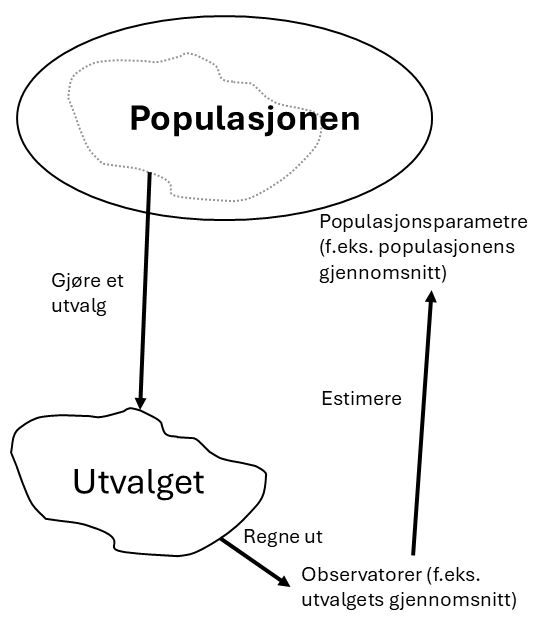

<!-- \placetextbox{0.26}{0.06}{\scriptsize{©2025 D.R. Foxcroft and D.J. Navarro,}} -->
<!-- \placetextbox{0.195}{0.05}{\scriptsize{CC BY-SA 4.0}} -->
<!-- \placetextbox{0.70}{0.06}{\scriptsize{\url{https://doi.org/10.11647/OBP.0333.08}}} -->

# Usikkerhet og konfidensintervall {#sec-inferential}

<!-- Arbeidstittel. Alternativ: "Usikkerhet i kvantitativ metode". -->

```{r}
#| include: FALSE
source("chapter_header.R")
```

```{r}
#| label: lag-populasjon
#| include: FALSE

# Lesehastighets-populasjonen for 4. trinn, målt i ord per minutt med
# Carlstenprøven. Populasjonen er bimodal: en liten gruppe som ennå ikke har
# knekket lesekoden (en hump nær 0-20 ord/min) og en hovedtyngde av elever som
# leser raskt. Hovedtyngden er venstreskjev (modellert med en speilvendt
# gamma-fordeling) slik at det finnes en hale av svakere lesere ned mot 40
# ord/min som binder de to gruppene sammen; det er ingen rein "kløft".
# Jeg siktet etter mu = 100 og sigma = 20, men den skjeve, bimodale formen gir et
# noe høyere standardavvik. NB: ikke hentet fra Carlsten, de publiserer
# ingenting.

set.seed(2024)
N_pop <- 60000
andel_ikke_lesere <- 0.06

ikke_lesere <- rnorm(round(N_pop * andel_ikke_lesere), mean = 15, sd = 7)
lesere <- 143 - rgamma(round(N_pop * (1 - andel_ikke_lesere)), shape = 3, scale = 13)

lesehastighet_pop <- pmax(0, c(ikke_lesere, lesere))

pop_mean <- mean(lesehastighet_pop)
pop_median <- median(lesehastighet_pop)
pop_sd <- sd(lesehastighet_pop)
```

> *[God] has afforded us only the twilight ... of Probability.*\
> -- John Locke

I de foregående kapitlene har vi beskrevet dataene våre ved å regne ut gjennomsnitt og andre oppsummerende tall og laget figurer. Men forskere ønsker nesten alltid å si noe som går _utover_ dataene vi faktisk har samlet inn. Da trenger vi **inferensiell statistikk**, og det møter du faktisk oftere enn du tror.

Samme dag som jeg skriver dette, våren 2025, er hovedoppslagene i media en ny meningsmåling der 28% av 1000 respondenter svarer at, om det hadde vært valg i dag, så hadde de stemt på Arbeiderpartiet. Dette viser at Arbeiderpartiet ligger an til å gjøre et godt valg, fortelles det. Ser du at dette går forbi deskriptiv statistikk? At 280 av 1000 personer svarte at de ville stemme Arbeiderpartiet betyr ikke at de vil gjøre et godt valg, for Arbeiderpartiet trenger mange flere stemmer enn 280 for å gjøre det godt. Media antar at disse 1000 personene sier noe om de 4 350 000 andre stemmeberettigede i Norge også. Dette krever inferensiell statistikk: Ved å spørre 0,02% av populasjonen kan man finne ut noe om de resterende 99,98%.

Dette kapittelet handler kun om én ting fra inferensiell statistikk: hvor godt kan man estimere gjennomsnittsverdien i en populasjon fra et utvalg. Å _estimere_ betyr å anslå størrelsen på noe. Når vi estimerer gjennomsnittet i populasjonen, forsøker vi altså å finne et tall på hvor stort gjennomsnittet er. Problemet med å estimere gjennomsnittet i populasjonen er at estimatet ville blitt annerledes med et annet utvalg. Med et annet utvalg, ville man fått ca. samme estimat eller et helt annet?

Målet med kapittelet er å skjønne begrepet **standardfeil**. Deretter er det forholdsvis enkelt å skjønne hva et **konfidensintervall** er. Med disse begrepene vil du kunne forstå flere resultater i forskningsartikler, samt skjønne magien ^[Vel, matematikken, men siden matematikk har et image-problem velger jeg å benytte ordet _magi_.] statistikere støtter seg til når de uttaler seg sikkert om populasjonen uten å ha samlet noe særlig data fra den Det vil også gjøre det lettere for deg å forstå statistisk hypotesetesting, noe de fleste innføringsbøker i kvantitativ metode bruker mye plass på, men som vi ikke ser oss tjent med.

::: {.callout-tip}

## Men jeg ønsker å lære om statistisk hypotesetesting!

Noen lærerutdannere (og kanskje noen studenter) ønsker gjerne å dekke statistisk hypotesetesting i innføringskurs i kvantitative metoder. Argumentene _for_ å lære om hypotesetesting er at det opptrer svært ofte i forskningslitteraturen og at noen sensorer  kanskje vil forvente hypotesetesting i en kvantitativ masteroppgave. Argumentene _mot_ er svært mye bedre.

- statistisk hypotesetesting passer til _svært_ få forskningsspørsmål
- statistisk hypotesetesting blir svært ofte misforstått av studenter, forskere [@lytsy2022] og lærebokforfattere i kvantitativ metode [@cassidy2019]
- statistisk hypotesetesting innbyr til tanketom bruk [@gigerenzer2018]

Statistisk hypotesetesting er så ofte misbrukt at foreningen for amerikanske statistikere advarer mot å bruke det [@wasserstein2016].
:::

## Fire typer usikkerhet {#sec-inf-typer-usikkerhet}

Når en forsker rapporterer et resultat, er det alltid beheftet med usikkerhet. Det er sikkert en million forskjellige kilder til usikkerhet, og for oss vil det være nyttig å skille mellom minst fire:

- **Måleusikkerhet.** Måleinstrumentene våre er aldri perfekte. En lesehastighetsprøve fanger ikke opp lesehastighet helt presist; dagsform, konsentrasjon og tilfeldigheter ved akkurat den teksten eleven leste, spiller inn. Vi drøftet dette i @sec-measurement.
- **Modellusikkerhet.** Når vi analyserer data, gjør vi en rekke antakelser: at utvalget er tilfeldig, at en effekt er den samme for alle, og så videre. Hvis antakelsene er gale, er også konklusjonene usikre.
- **Utvalgsusikkerhet.** Vi har bare et utvalg, ikke hele populasjonen, og et annet utvalg ville gitt et annet estimat.
- **Tilordningsusikkerhet.** I eksperimenter fordeles deltakerne tilfeldig på en intervensjons- og en kontrollgruppe. Da vil den tilfeldige tilordningen være en kilde til usikkerhet: en annen tilfeldig inndeling av de _samme_ deltakerne ville gitt et litt annet resultat. Dette ligner utvalgsusikkerheten, men oppstår under prosessen med gruppetilordning, ikke utvalg.

Vi skal lære inferensiell statistikk som tar hensyn til de to siste usikkerhetene, utvalgs- og tilordningsusikkerhet. Men begrepene du lærer, standardfeil og konfidensintervall, gjelder ikke bare dem; de vil gjøre deg klar til å lære mye annen statistikk også. Måle- og modellusikkerheten ser vi dessverre bort fra, slik det ofte gjøres i utdanningsforskning. Selvsagt er det usikkerhet i målingene og selvsagt er det usikkerhet i de statistiske modellene, men kun sjeldent tas disse seriøst.


## Populasjonsparametre og observatorer {#sec-inf-populasjon}

Gjennom hele kapittelet skal vi estimere lesehastighet. Konstruktet er altså lesehastighet, og vi skal måle den i antall ord per minutt. Lesehastighet måles i de svært mye brukte Carlstenprøvene, som finnes i varianter fra 1. til 10. trinn. Carlstenprøven benyttes i nesten 80% av norske barneskoler [@arnesen2019]. Jeg husker selv at jeg tok denne prøven på barneskolen. Hele klassen ble bedt om å lese i et lesehefte, læreren sa fra da vi skulle stoppe og lese, vi markerte hvor langt vi kom med en strek, og så svarte vi på spørsmål om teksten så langt vi var kommet. I likhet med nesten alle kartleggingsprøvene som benyttes i norsk skole, har Carlstenprøven ingen informasjon om validitet og reliabilitet, og ingen studier har undørsøkt dette [@arnesen2019].

Vi tenker oss en forskergruppe som vil estimere den gjennomsnittlige lesehastigheten for alle norske 4.-klassinger. ^[Merk at dette er en _forskningsbruk_ av Carlstenprøven. I klasserommet bruker læreren prøven som en kartlegging av sine egne elever, ikke for å trekke slutninger om en populasjon.] Prosessen vi nå skal forstå er vist i @fig-inferential-estimate, som er en presisering av @fig-design-sampling.

{#fig-inferential-estimate}

Statistikere tenker på populasjonen som en fordeling: en kurve som forteller hvilke lesehastigheter som er vanlige og hvilke som er sjeldne blant alle norske 4.-klassinger. Egenskapene ved denne fordelingen kalles **populasjonsparametre**. De to viktigste er populasjonsgjennomsnittet og populasjonsstandardavviket. Disse kjenner forskerne ikke, og det er nettopp dem de vil finne ut av.

Siden forskerne ikke kan teste alle de rundt 60 000 fjerdeklassingene trekker de et utvalg og gir dem Carlstenprøven. Da får de mange størrelser de _kan_ regne ut, slik som gjennomsnittet og standardavviket i utvalget sitt. Slike størrelser, som beregnes fra dataene, kalles **observatorer**. Observatorene ligner gjerne på populasjonsparametrene, men de er ikke de samme.

> Populasjonsparametre beskriver *populasjonen*. Observatorer beskriver *utvalget*.

Det vi skal lære nå er den siste pila i @fig-inferential-estimate, hvordan man estimerer populasjonsparametre. Vi skal også lære hvordan man estimerer utvalgsusikkerheten. (Og for ordens skyld: legg merke til at figuren ikke nevner måleusikkerhet eller andre former for usikkerhet. Livet som utdanningsforsker blir mer komfortabelt hvis man bare lukker øyene for slikt.)

## Populasjonsfordelingen og utvalg trukket fra den.

Nå, mens jeg forklarer estimering av populasjonsparametre, skal vi ha all kunnskap om populasjonen. Det beste hadde vært om vi hadde et datasett der Carlstenprøven var gitt til hele populasjonen av norske fjerdeklassinger. Da hadde vi kunnet sett hvor godt populasjonsparameteren ble estimert. Det nest beste er å simulere et datasett som likner, så det er det jeg har gjort. Dessverre er jeg ikke lesedidaktiker, men jeg har gjort mitt beste for å lage et datasett som virker ekte.

Populasjonsfordelingen til det simulerte datasettet vises i panel (a) i @fig-inf-population. Legg merke til at fordelingen har to humper. Helt til venstre, nær 0–20 ord/min, er det en liten hump av elever som ennå ikke har knekt lesekoden. Hovedtyngden av elevene leser raskere, med en topp litt over 100 ord/min, men denne humpen er skjev: den har en lengre hale av svakere lesere.
^[Et poeng som er verdt å huske fra @sec-descriptive: Siden fordelingen er skjev, er ikke populasjonsgjennomsnittet og medianen like. Gjennomsnittet er på `r round(pop_mean)` ord/min, og er lavere enn populasjonsmedianen, som er på `r round(pop_median)` ord/min, som igjen er lavere enn den vanligste lesehastigheten, som er rundt `r 110` ord/min. Gjennomsnittet er altså noe vi _velger_ å regne ut og estimere, ikke nødvendigvis et godt sammendrag av en typisk elev, jamfør den økologiske feilslutningen, @sec-ecological.]

For å få gode estimater må utvalget være representativt for populasjonen, og den enkleste måten å få til representative utvalg på er ved tilfeldige utvalg. Se @sec-design-simple-random hvis du trenger å friske opp enkle tilfeldige utvalg. @fig-inf-population (b), (c) og (d) viser tre enkle tilfeldige utvalg med forskjellig størrelse. Alle tre har omtrent samme form som populasjonen, men det minste utvalget er en meget grov tilnærming. Gjennomsnittene er vist som en vertikal strek og med `M = `. Populasjonsgjennomsnittet er vist i rødt og er `r round(pop_mean)`. Utvalgenes gjennomnsnitt (observatorene) er vist med grå strek. Legg merke til at utvalgenes gjennomsnitt blir bedre og bedre estimater på populasjonsgjennomsnittet med større utvalg. For det minste utvalget ($n = 10$) er gjennomsnittet langt unna populasjonsgjennomsnittet, det mellomste ($n = 100$) er nære, og det største utvalget ($n = 10 000$) er nesten eksakt.

```{r}
#| label: fig-inf-population
#| fig-cap: Lesehastighet på 4. trinn i hele populasjonen og i tre tilfeldige utvalg trukket fra den. Den røde stiplede streken er gjennomsnittet i hvert panel; i utvalgspanelene viser den grå streken populasjonsgjennomsnittet til sammenligning.
#| fig-alt: Fire figurer av lesehastighet. Panel (a) er en glattet fordeling med to topper, en liten nær null og en stor rundt 110 ord per minutt. Panel (b), (c) og (d) er histogrammer av tre utvalg på henholdsvis 10, 100 og 10 000 elever, alle med omtrent samme form. Hvert panel har en rød stiplet loddrett strek på gjennomsnittet, og utvalgspanelene har i tillegg en grå strek på populasjonsgjennomsnittet
#| fig-subcap:
#|   - "Hele populasjonen"
#|   - "Utvalg på 10 elever"
#|   - "Utvalg på 100 elever"
#|   - "Utvalg på 10 000 elever"
#| layout-ncol: 2
#| fig-width: 4.285714
#| out-width: "100%"

set.seed(432)
utvalg <- list(
  bittelite = sample(lesehastighet_pop, 10),
  lite = sample(lesehastighet_pop, 100),
  stort = sample(lesehastighet_pop, 10000)
)

utvalg_sammendrag <- lapply(
  utvalg,
  function(x) {
    list(
      mean = mean(x),
      sd = sd(x),
      n = length(x)
    )
  }
)

x_akse <- scale_x_continuous(breaks = seq(0, 160, 40))
y_akse <- theme(
  axis.title.y = element_blank(),
  axis.text.y = element_blank(),
  axis.ticks.y = element_blank(),
  axis.line.y = element_blank()
)

snittfarge <- "grey35"
snittstrek <- function(x, col = snittfarge, alpha = 1) {
  geom_vline(
    xintercept = x,
    col = col,
    linetype = "dashed",
    linewidth = 0.8,
    alpha = alpha
  )
}
snittstrek_pop <- snittstrek(pop_mean, col = "firebrick", alpha = 0.5)

snittlabel <- function(label = "Gjennomsnitt", col = snittfarge) {
  annotate(
    "text",
    x = 60,
    y = Inf,
    hjust = 0,
    vjust = 1.5,
    label = label,
    col = col
  )
}

lag_utvalgsplot <- function(navn) {
  x <- utvalg[[navn]]
  s <- utvalg_sammendrag[[navn]]

  tittel <- paste0("Utvalg, n = ", format(s$n, big.mark = " "))

  ggplot(data.frame(x = x), aes(x)) +
    geom_histogram(binwidth = 8, col = blueshade, fill = blueshade, alpha = 0.6) +
    snittstrek_pop +
    snittstrek(s$mean) +
    snittlabel(paste("M =", round(s$mean))) +
    x_akse +
    xlab("Lesehastighet (ord/min)") +
    ggtitle(tittel) +
    y_akse +
    theme(plot.title = element_text(hjust = 0.5, size = rel(0.9)))
}

plota <- ggplot(data.frame(x = lesehastighet_pop), aes(x)) +
  geom_density(col = blueshade, fill = blueshade, alpha = 0.6, adjust = 1.2) +
  snittstrek_pop +
  snittlabel(
    paste("M =", round(pop_mean)),
    col = "firebrick"
  ) +
  x_akse +
  xlab("Lesehastighet (ord/min)") +
  ggtitle("Populasjon") +
  y_akse +
  theme(plot.title = element_text(hjust = 0.5, size = rel(0.9)))

plotb <- lag_utvalgsplot("bittelite")
plotc <- lag_utvalgsplot("lite")
plotd <- lag_utvalgsplot("stort")

plota
plotb
plotc
plotd
```

Hvis vi hadde vært lite ambisiøse kunne kapittelet sluttet her. I så fall hadde du lært følgende:

> **Hvis vi gjør et enkelt tilfeldig utvalg fra en populasjon** vil
>
> - utvalgsfordelingen tilnærme seg populasjonsfordelingen med større utvalg
> - observatorene tilnærme seg populasjonsparameteren med større utvalg

Men vi skal ikke slutte her, for i virkeligheten er det ikke nok å vite at vi kan estimere populasjonsparameteren bedre hvis vi gjør et større utvalg; vi må vite hvor godt vi har estimert populasjonsparameteren med det utvalget vi har. Hvis vi bare har råd til å gjøre Carlstenprøven på 100 elever, hvor godt får vi da estimert gjennomsnittet?

Målet nå er å sette et tall på hvor usikre estimatene er, men vi trenger litt teori først. Et naturlig sted å begynne er normalfordelingen.

## Normalfordelingen {#sec-inf-normalfordeling}

**Normalfordelingen** er berømt, så du har kanskje hørt om den allerede. Du skal ikke lære så mye om den, annet enn at den har klokkeform^[_Klokke_ som i _bjelle_, ikke som i _ur_.] og er fullt ut beskrevet av dets gjennomsnitt og standardavvik.

@fig-inf-standardnormal viser en normalfordeling med gjennomsnitt 0 og standardavvik 1. Denne normalfordelingen kalles en standard normalfordeling. På den vannrette aksen leser vi av verdien til en eller annen variabel, og høyden på kurven forteller hvilke verdier av variabelen som er sannsynlige.

```{r}
#| label: fig-inf-standardnormal
#| fig-cap: Normalfordelingen med gjennomsnitt 0 og standardavvik 1. På $x$-aksen finner man verdien til en variabel, og høyden på kurven forteller hvor sannsynlig den verdien er
#| fig-alt: En klokkeformet kurve med topp ved x lik 0, symmetrisk om toppen, som faller mot null på begge sider
#| fig-width: 4.571429
#| out-width: "80%"

ggplot(data = data.frame(x = seq(-3, 3, 1)), aes(x)) +
  stat_function(fun = dnorm, n = 1000, args = list(mean = 0, sd = 1), col = blueshade, linewidth = 1) +
  scale_x_continuous(breaks = seq(-3, 3, 1)) +
  xlab("\nObservert verdi") +
  theme(axis.title.y = element_blank(), axis.text.y = element_blank(),
        axis.ticks.y = element_blank(), axis.line.y = element_blank())
```

Normalfordelinger kan ha andre gjennomsnitt og standardavvik enn det som ble vist over, så nå skal vi forandre normalfordelingens gjennomsnitt og standardavvik for å se hvordan kurven forandrer seg. Jeg tenker på gjennomsnittet og standardavviket som to knotter vi kan skru på for å endre fordelingen. Endrer vi gjennomsnittet, _flytter_ hele kurven til venstre eller høyre uten å endre formen. Endrer vi standardavviket, blir kurven bredere eller smalere, men den blir værende på samme sted. En bred kurve betyr stor spredning; en smal kurve betyr at verdiene ligger tett rundt gjennomsnittet.

::: {.content-visible when-format="html"}
Skru på de to bryterne under og se selv! Den stiplede streken viser gjennomsnittet.

```{ojs}
//| echo: false

viewof mu = Inputs.range([0, 10], {value: 5, step: 0.5, label: "Gjennomsnitt"})
viewof sigma = Inputs.range([0.5, 3], {value: 1, step: 0.1, label: "Standardavvik"})

normalPdf = (x, m, s) => Math.exp(-0.5 * ((x - m) / s) ** 2) / (s * Math.sqrt(2 * Math.PI))

kurve = d3.range(-3, 13.01, 0.05).map(x => ({x, y: normalPdf(x, mu, sigma)}))

Plot.plot({
  height: 320,
  marginLeft: 20,
  x: {label: "Observert verdi", domain: [-3, 13]},
  y: {label: null, ticks: [], domain: [0, 0.85]},
  marks: [
    Plot.areaY(kurve, {x: "x", y: "y", fill: "#3d6da9", fillOpacity: 0.35}),
    Plot.lineY(kurve, {x: "x", y: "y", stroke: "#3d6da9", strokeWidth: 2}),
    Plot.ruleX([mu], {stroke: "#595959", strokeDasharray: "4 4"}),
    Plot.ruleY([0])
  ]
})
```
:::

::: {.content-visible unless-format="html"}
@fig-inf-normals-mean viser hva som skjer når vi endrer gjennomsnittet, og @fig-inf-normals-sd hva som skjer når vi endrer standardavviket.

```{r}
#| label: fig-inf-normals-mean
#| fig-cap: Hva som skjer når vi endrer gjennomsnittet. Den heltrukne linjen har gjennomsnitt 4, den stiplede 7. Begge har standardavvik 1. Formen er den samme; kurven er bare forskjøvet
#| fig-alt: To like klokkekurver, den ene forskjøvet til høyre for den andre
#| fig-width: 4.571429
#| out-width: "80%"

ggplot(data = data.frame(x = seq(0, 11, 1)), aes(x)) +
  stat_function(fun = dnorm, n = 1000, args = list(mean = 4, sd = 1), col = blueshade, linewidth = 1) +
  stat_function(fun = dnorm, n = 1000, args = list(mean = 7, sd = 1), col = blueshade, linetype = 2, linewidth = 1) +
  scale_x_continuous(breaks = seq(0, 10, 2)) +
  xlab("\nObservert verdi") +
  theme(axis.title.y = element_blank(), axis.text.y = element_blank(),
        axis.ticks.y = element_blank(), axis.line.y = element_blank())
```

```{r}
#| label: fig-inf-normals-sd
#| fig-cap: Hva som skjer når vi endrer standardavviket. Begge kurvene har gjennomsnitt 5. Den heltrukne har standardavvik 1, den stiplede 2. De er sentrert på samme sted, men den stiplede er bredere og lavere
#| fig-alt: To klokkekurver sentrert på samme sted, den ene smalere og høyere enn den andre
#| fig-width: 4.571429
#| out-width: "80%"

ggplot(data = data.frame(x = seq(0, 10, 1)), aes(x)) +
  stat_function(fun = dnorm, n = 1000, args = list(mean = 5, sd = 1), col = blueshade, linewidth = 1) +
  stat_function(fun = dnorm, n = 1000, args = list(mean = 5, sd = 2), col = blueshade, linetype = 2, linewidth = 1) +
  scale_x_continuous(breaks = seq(0, 10, 2)) +
  xlab("\nObservert verdi") +
  theme(axis.title.y = element_blank(), axis.text.y = element_blank(),
        axis.ticks.y = element_blank(), axis.line.y = element_blank())
```
:::

Nå vet du hvordan alle mulige normalfordelinger ser ut; de kan være lenger til høyre og venstre eller være smalere og bredere.

For alle normalfordelingene gjelder en enkel tommelfingerregel, **68–95–99,7-regelen**. Uansett hvilket gjennomsnitt og standardavvik fordelingen har, vil rundt 68 % av observasjonene ligge innenfor ett standardavvik fra gjennomsnittet, rundt 95 % innenfor to standardavvik, og hele 99,7 % innenfor tre. @fig-inf-normal-sds illustrerer de to første tilfellene.

```{r}
#| label: fig-inf-normal-sds
#| fig-cap: Andelen av en normalfordeling som ligger innenfor ett og standardavvik fra gjennomsnittet.
#| fig-alt: To klokkekurver. I den venstre er det midterste området innenfor ett standardavvik skravert og merket 68,3 prosent. I den høyre er området innenfor to standardavvik skravert og merket 95,4 prosent
#| fig-subcap:
#|   - "68,3 % av observasjonene faller innenfor ett standardavvik fra gjennomsnittet"
#|   - "95,4 % faller innenfor to standardavvik"
#| layout-ncol: 2
#| fig-width: 4.285714
#| out-width: "100%"

p1 <- ggplot(data = data.frame(x = seq(-4, 4, 1)), aes(x)) +
  stat_function(fun = dnorm, n = 1000, args = list(mean = 0, sd = 1), col = "grey",
                geom = "area", fill = "grey", alpha = 0.8, xlim = c(-1, 1)) +
  stat_function(fun = dnorm, n = 1000, args = list(mean = 0, sd = 1), col = blueshade, linewidth = 1) +
  scale_x_continuous(breaks = seq(-4, 4, 1)) +
  ggtitle("Skravert område = 68,3 %") + xlab(NULL) +
  theme(axis.text.y = element_blank(), axis.title.y = element_blank(),
        axis.line.y = element_blank(), axis.ticks.y = element_blank(),
        plot.title = element_text(hjust = 0.5))

p2 <- ggplot(data = data.frame(x = seq(-4, 4, 1)), aes(x)) +
  stat_function(fun = dnorm, n = 1000, args = list(mean = 0, sd = 1), col = "grey",
                geom = "area", fill = "grey", alpha = 0.8, xlim = c(-2, 2)) +
  stat_function(fun = dnorm, n = 1000, args = list(mean = 0, sd = 1), col = blueshade, linewidth = 1) +
  scale_x_continuous(breaks = seq(-4, 4, 1)) +
  ggtitle("Skravert område = 95,4 %") + xlab(NULL) +
  theme(axis.text.y = element_blank(), axis.title.y = element_blank(),
        axis.line.y = element_blank(), axis.ticks.y = element_blank(),
        plot.title = element_text(hjust = 0.5))

p1
p2
```

Kanskje lurer du på hvorfor du må lære dette om normalfordelingen. Lesehastigheten i populasjonen var jo _ikke_ normalfordelt; den har blant annet to humper, slik vi nettopp så i @fig-inf-population. Vi forventer ikke at fordelinger i den virkelige verden er normalfordelte, så hvorfor er normalfordelingen da så viktig for oss? Bare les videre.

## Utvalgsfordelingen til gjennomsnittet {#sec-inf-utvalgsfordeling}

Vi skal nå forstå noe litt vanskelig, så ta det rolig, les sakte, og forsøk å henge med. Hvis du ikke helt forstår, kan det være fint å lese videre uansett, men  deretter returnere til disse delkapitlene senere. Du skal lære at _utvalgets gjennomsnitt_ har sin egen fordeling. Dette er rart. Vi har jo bare ett utvalg vi kan estimere populasjonsgjennomsnittet med, så vi får bare én verdi for utvalgets gjennomsnitt. Hvordan kan denne ene verdien ha en fordeling?

For å forstå dette må vi gjøre et tankeeksperiment: Vi må se for oss alle tenkelige utvalg vi kunne fått. Tenk deg at vi gjør studien vår med 5 elever, altså $n = 5$. I @tbl-inf-replikasjoner vises 10 forskjellige tilfeldige utvalg vi kunne fått. Vi ser de fem elevene i utvalget har forskjellige lesehastigheter, og at dette gir forskjellige gjennomsnitt (kolonnen helt til høyre). Det er dette man mener med at utvalgets gjennomsnitt har en fordeling. Dette er bare 10 utvalg; det finnes enormt mange forskjellige slike utvalg man kunne trukket. 

```{r}
#| label: tbl-inf-replikasjoner
#| tbl-cap: Ti forskjellige utvalg av en liten lesehastighetsstudie, hver med et utvalg på $N = 5$ elever. Utvalgsgjennomsnittet varierer en god del fra replikasjon til replikasjon
#| tbl-colwidths: [22,13,13,13,13,13,18]

set.seed(314)
rep_data <- replicate(10, sample(lesehastighet_pop, 5))

rep_tbl <- rep_data |>
  round() |>
  t() |>
  as_tibble(.name_repair = ~ paste("Elev", 1:5)) |>
  add_column(` ` = paste("Utvalg", 1:10), .before = 1) |>
  mutate(`Utvalgets gjennomsnitt` = rowMeans(across(starts_with("Elev"))))

rep_means <- rep_tbl |> pull("Utvalgets gjennomsnitt")

rep_tbl |>
  tt() |>
  format_tt(digits = 1, num_mark_dec = ",", num_zero = TRUE)
```

Legg merke til hvordan gjennomsnittet varierer fra utvalg til utvalg. Lesehastighetene til hver enkelt elev varierer fra ca. 10 til 130, men gjennomsnittene varierer fra ca. 75 til 115. Gjennomsnittene varierer altså mindre enn lesehastighetene til enkeltelever. Hvis jeg hadde vist mange flere slike utvalg, med tilhørende gjennomsnitt, hadde vi fått mange forskjellige gjennomsnittsverdier. Da kunne jeg vist **utvalgsfordelingen til gjennomsnittet**, altså fordelingen til alle utvalgsgjennomsnitt man kan få. Denne fordelingen vil bestå av tallene i kolonnen lengst til høyre i @tbl-inf-replikasjoner, i hvert fall hvis kolonnen hadde vist alle mulige utvalg man kunne fått.

Men -- hey! -- vi har jo laget et datasett med hele populasjonen, så jeg _kan_ faktisk vise dette. Jeg kan jo bare simulere at jeg trekker, for eksempel, 10 000 utvalg og vise alle de gjennomsnittene! Nyt og beundre @fig-inf-replikasjoner der jeg har simulert 10 000 slike gjennomsnitt.

```{r}
#| label: fig-inf-replikasjoner
#| fig-cap: Utvalgsfordelingen til gjennomsnittet for studier med $N = 5$ elever. De grønne søylene viser fordelingen av 10 000 utvalgsgjennomsnitt. Til sammenligning viser den svarte linjen populasjonsfordelingen av lesehastighet
#| fig-alt: Et histogram av utvalgsgjennomsnitt som er samlet rundt 100, lagt oppå en bredere bimodal kurve som viser populasjonen. Histogrammet er merket «Utvalgsfordelingen til gjennomsnittet» og kurven er merket «Populasjonsfordelingen»
#| fig-width: 6
#| out-width: "80%"

set.seed(77)
sdm_means <- data.frame(
  m = replicate(10000, mean(sample(lesehastighet_pop, 5)))
)

ggplot(sdm_means, aes(x = m)) +
  geom_histogram(aes(y = after_stat(density)), binwidth = 4,
                 col = samplingfarge, fill = samplingfarge, alpha = 0.7) +
  geom_density(data = data.frame(x = lesehastighet_pop), aes(x = x),
               col = "black", linewidth = 1, adjust = 1.2) +
  annotate("text", x = 50, y = 0.018,
           label = "Utvalgsfordelingen til\ngjennomsnittet",
           col = samplingtekst, fontface = "bold", lineheight = 0.9) +
  annotate("curve", x = 50, y = 0.015, xend = 80, yend = 0.011,
           curvature = 0.3, arrow = arrow(length = unit(0.025, "npc")),
           col = samplingtekst, linewidth = 0.5) +
  annotate("text", x = 116, y = 0.025, hjust = 0,
           label = "Populasjons-\nfordelingen", col = "black",
           lineheight = 0.9) +
  annotate("curve", x = 130, y = 0.021, xend = 131, yend = 0.0141,
           curvature = -0.3, arrow = arrow(length = unit(0.025, "npc")),
           col = "grey30", linewidth = 0.5) +
  snittstrek(pop_mean, col = "firebrick", alpha = 0.8) +
  snittlabel("Gjennomsnitt", col = "firebrick") +
  annotate("curve", x = 78, y = 0.028, xend = pop_mean-2, yend = 0.029,
           curvature = +0.3, arrow = arrow(length = unit(0.03, "npc")),
           col = "firebrick", linewidth = 0.7) +
  scale_x_continuous(limits = c(0, 143), breaks = seq(0, 160, 40)) +
  xlab("\nLesehastighet (ord/min)") +
  theme(axis.title.y = element_blank(), axis.line.y = element_blank(),
        axis.ticks.y = element_blank(), axis.text.y = element_blank())
```

Jeg har tegnet inn populasjonsfordelingen som en svart linje, slik at vi kan sammenlikne den med utvalgsfordelingen til gjennomsnittet. Legg merke til det følgende i figuren:

- Utvalgsfordelingen til gjennomsnittet er jevnere og ser mer normalformet ut enn populasjonsfordelingen. De to humpene i populasjonsfordelingen har forsvunnet i utvalgsfordelingen, og de grønne søylene ser mer ut som en normalfordeling. 
- Utvalgsfordelingen til gjennomsnittet er sentrert på populasjonens gjennomsnitt. Derfor kan vi bruke utvalgets gjennomsnitt til å estimere populasjonens gjennomsnitt, fordi den grønne og den svarte fordelingen har samme gjennomsnitt.
- Utvalgsfordelingen til gjennomsnittet er mindre spredt en populasjonsfordelingen. Gjennomsnittet av fem tilfeldige elever varierer altså mindre enn lesehastigheten til én tilfeldig elev.

Dette delkapittelet er verdt å skjønne ordentlig, for utvalgsfordelingen til gjennomsnittet er nøkkelen for resten. Her er oppsummeringen:

- Vi prøver å estimere populasjonens gjennomsnitt ut fra utvalgets gjennomsnitt.
- Vi har bare ett utvalg og derfor bare ett gjennomsnitt, og det lager ingen fordeling. Men vi kan tenke oss gjennomsnittene til alle mulige utvalg vi kunne trukket; de utgjør utvalgsfordelingen til gjennomsnittet.
- Denne utvalgsfordelingen likner mer på normalfordelingen og har samme gjennomsnitt, men mindre spredning, enn populasjonsfordelingen.

Når vi har vårt ene utvalg og regner ut vårt ene gjennomsnitt, ser vi på dette som et trekk fra denne denne utvalgsfordelingen.

## Sentralgrenseteoremet og standardfeilen {#sec-inf-clt}

I sist delkapittel så vi at utvalgsfordelingen så litt normalfordelt ut, men det var kun for utvalg på fem elever, $n = 5$. Hvordan vil utvalgsfordelingen se ut for større utvalg?

Vi finner ut av det ved å tegne samme figur, bare for flere forskjellige $n$. I @fig-inf-clt viser vi utvalgsfordelingen for utvalg med 2 elever, 5 elever, 10 elever og 100 elever. Denne gangen er den svarte kurven den best tilpassede normalfordelingen, slik at man ser tydeligere hvor lik utvalgsfordelingen er normalfordelingen.

```{r}
#| label: fig-inf-clt
#| fig-cap: "Sentralgrenseteoremet demonstrert med lesehastighets-eksempelet. Hvert panel viser utvalgsfordelingen til gjennomsnittet (grønne søyler), med den best tilpassede normalfordelingen lagt over (svart linje). Selv om populasjonens fordeling er humpete, blir gjennomsnittets fordeling mer og mer normal når $n$ øker. Den blir også mindre spredt"
#| fig-subcap:
#|   - "For $n = 2$ ser man fremdeles de to humpene, og normalfordelingen passer dårlig"
#|   - "Allerede ved $n = 5$ ligner fordelingen mer på en normalfordeling, og den er smalere"
#|   - "Ved $n = 10$ er normalfordelingen en meget god tilnærming"
#|   - "Ved $n = 100$ er fordelingen svært smal og praktisk talt normal"
#| layout-ncol: 2
#| fig-asp: 1
#| fig-width: 4.285714
#| out-width: "100%"

set.seed(2025)
clt_ns <- c(2, 5, 10, 100)
clt_plots <- lapply(clt_ns, function(n) {
  m <- replicate(10000, mean(sample(lesehastighet_pop, n)))
  ggplot(data.frame(m = m), aes(x = m)) +
    geom_histogram(aes(y = after_stat(density)),
                   col = samplingfarge, fill = samplingfarge, alpha = 0.6,
                   binwidth = min(pop_sd / sqrt(n) / 4, 3)) +
    stat_function(fun = dnorm, args = list(mean = pop_mean, sd = pop_sd / sqrt(n)),
                  col = "black", linewidth = 1) +
    scale_x_continuous(limits = c(0, 170), breaks = seq(0, 160, 40)) +
    xlab("Utvalgsgjennomsnitt") +
    ggtitle(paste0("\nn = ", n)) +
    theme(axis.title.y = element_blank(), axis.line.y = element_blank(),
          axis.ticks.y = element_blank(), axis.text.y = element_blank(),
          plot.title = element_text(hjust = 0.5))
})
clt_plots[[1]] + 
  annotate("text", x = 10, y = 0.019, hjust = 0,
           label = "Best tilnærmede\nnormalfordeling", col = "black",
           lineheight = 0.9) +
  annotate("curve", x = 40, y = 0.016, xend = 70, yend = 0.010,
           curvature = 0.2, arrow = arrow(length = unit(0.025, "npc")),
           col = "grey30", linewidth = 0.5)
clt_plots[[2]]
clt_plots[[3]]
clt_plots[[4]]
```

Selv om populasjonsfordelingen var aldri så humpete, ser vi at utvalgsfordelingen til gjennomsnittet fort blir normalfordelt. Allerede ved $n = 10$ er utvalgsfordelingen nesten en perfekt klokkekurve, og ved $n = 100$ er den smal og praktisk talt helt normal. Dette er innholdet i sentralgrenseteoremet:

> **Sentralgrenseteoremet:**
>
> Uansett hvilken fordeling populasjonen har, gjelder følgende om gjennomsnittets utvalgsfordeling:
> 
> * den blir tilnærmet normal når utvalget ikke er for lite
> * den har samme gjennomsnitt som populasjonsfordelingen
> * den blir smalere og smalere (får mindre og mindre standardavvik) når $n$ øker.

> Standardavviket til utvalgsfordelingen kalles **standardfeilen**, og sentralgrenseteoremet gir oss en enkel formel for den:
>
> $$ \text{standardfeil} = \frac{\text{populasjonens standardavvik}}{\sqrt{n}}$$

Dette gjør normalfordelingen nyttig for oss. Selv om populasjonen vår slett ikke er normalfordelt, vet vi at utvalgsfordelingen til gjennomsnittet er normalfordelt (så lenge utvalget ikke er bittelite). Og ikke nok med det, vi vet presisjonen vi anslår gjennomsnittet med, siden vi vet standardfeilen.

Legg merke til kvadratroten i nevneren. Den har en viktig konsekvens: for å _halvere_ standardfeilen må du _firedoble_ utvalget, og for å gjøre den en tidel så stor må utvalget bli hundre ganger større. Presisjon er dyrt, og det er grunnen til at studier sjelden har så store utvalg som vi skulle ønske.

```{r}
#| label: inf-se-eksempel-data
#| include: FALSE

set.seed(100)
se_n <- 64
se_utvalg <- sample(lesehastighet_pop, se_n)
se_m <- mean(se_utvalg)
se_sd <- sd(se_utvalg)
se_se <- se_sd / sqrt(se_n)
se_ci_lav <- se_m - 1.96 * se_se
se_ci_hoy <- se_m + 1.96 * se_se
```

## Et eksempel

La oss se hvordan dette faktisk benyttes. Vi har søkt penger til studien vår for å anslå lesehastigheten til norske fjerdeklassinger. Vi ble svært skuffet da vi bare fikk nok penger til å samle data fra $n = `r se_n`$ tilfeldig trukkede elever. Huff, det er jommen dyrt å reise land og strand rundt for å gi Carlstenprøven til tilfeldige elever. Hvordan skal det gå, når vi anslår lesehastigheten til 60 000 elever ut fra bare 64?

Etter å ha samlet dataene, gjør vi litt deskriptiv statistikk. Husk at i virkeligheten ville vi ikke visst populasjonsfordelingen, det er bare i dette kapittelet vi faktisk vet "fasiten", så nå må late som om du ikke aner noe om den. @fig-inf-se-vs-sd-1 viser lesehastigheten til de `r se_n` elevene vi testet: gjennomsnittet ble M = `r round(se_m)` ord/min og standardavviket SD = `r round(se_sd)` ord/min. Disse tallene gjelder utvalget. Kanskje blir vi bekmymret av det rare histogrammet. Har vi hatt uflaks som har så mange elever med lav lesehastighet? Er utvalget vårt blitt lite representativt, slik at gjennomsnittet (M = 97) bommer grovt på populasjonen? Ingen grunn til bekymring, sentralgrenseteoremet kommer til unnsetning!

Ut fra de tre tallene, (M, SD og n), gir sentralgrenseteoremet oss en normalfordeling som er en svært god tilnærming til utvalgsfordelingen til gjennomsnittet. Denne er tegnet i @fig-inf-se-vs-sd-2. Som vi lærte i forrige delkapittel, er den sentrert på samme gjennomsnitt som populasjonen, men er mye smalere. Standardfeilen er
$\text{SE} = \frac{\text{SD}}{\sqrt{n}} = \frac{`r round(se_sd)`}{\sqrt{`r se_n`}} =$ `r format(se_se, digits = 1, nsmall = 1)`.
Nå er vi i mål!

I mål med hva da? Med å estimere populasjonsgjennomsnittet ut fra utvalget vårt. La oss tenke over hva vi har oppnådd. Utvalget vårt, @fig-inf-se-vs-sd-1, hadde en rar fordeling og høyt standardavvik. Sentralgrenseteoremet forteller oss at gjennomsnittet til utvalget er trukket fra en annen fordeling, vist i @fig-inf-se-vs-sd-2, en normalfordeling med mindre standardavvik som vi husker kalles standardfeilen. Vi har derfor svært god grunn til å tro at gjennomsnittet i populasjonen er ca. `r round(se_m)`. Og på grunn av 68-95-99,7-regelen (@sec-inf-normalfordeling) er vi 68 % sikre på at gjennomsnittet er innenfor én standardfeil 

Haha! For en berusende følelse! Vi visste ingenting om lesehastigheten til de 60 000 fjerdeklassingene, og så målte vi kun 64 av elevene, men likevel kan vi være 68% sikre på at snitthastigheten er `r round(se_m)` $\pm$ `r round(se_se, 1)`!!! Og siden to standardavvik er `r round(se_se, 1)` $\cdot$ 2 $=$ `r round(2*se_se, 1)`, så kan vi være 95% sikre på at gjennomsnittet er `r round(se_m)` $\pm$ `r round(2*se_se, 1)`. Wow!

```{r}
#| label: fig-inf-se-vs-sd
#| fig-cap: !expr paste0("En sammenlikning av fordelingen til utvalget på ", se_n, " elever, og den tilhørende utvalgsfordelingen til gjennomsnittet. Fordelingene har samme gjennomsnitt, men svært ulik spredning.")
#| fig-subcap:
#|   - "Lesehastigheten til hver enkelt elev, med gjennomsnittet (M) og standardavviket (SD)"
#|   - "Utvalgsfordelingen til gjennomsnittet slik sentralgrenseteoremet spår den: en normalfordeling sentrert på det samme gjennomsnittet, men med en spredning, standardfeilen (SE), som er mindre enn standardavviket"
#| fig-alt: !expr paste0("To paneler med samme vannrette akse for lesehastighet. Panel (a) er et bredt histogram av", se_n, " elevers lesehastighet med en vannrett pil som markerer standardavviket. Panel (b) er en smal, høy normalfordeling sentrert på samme gjennomsnitt, med en mye kortere vannrett pil som markerer standardfeilen")
#| layout-ncol: 1
#| fig-width: 8.571428
#| fig-asp: 0.5
#| out-width: "100%"

arrowfarge <- "grey15"
spredningspil <- function(senter, halv, y) {
  annotate(
    "segment",
    x = senter - halv, xend = senter + halv, y = y, yend = y,
    arrow = arrow(ends = "both", length = unit(1.4, "mm"), type = "closed"),
    col = arrowfarge, linewidth = 0.6
  )
}

se_bw <- 8
peak_a <- max(hist(se_utvalg, breaks = seq(0, 160, se_bw), plot = FALSE)$density)
peak_b <- dnorm(se_m, se_m, se_se)

plot_utvalg <- ggplot(data.frame(x = se_utvalg), aes(x)) +
  geom_histogram(aes(y = after_stat(density)), binwidth = se_bw, boundary = 0,
                 col = blueshade, fill = blueshade, alpha = 0.6) +
  snittstrek(se_m) +
  annotate("text", x = se_m + 3, y = 1.1 * peak_a, hjust = 0, vjust = 1,
           label = paste("M =", round(se_m)), col = snittfarge, fontface = "bold") +
  spredningspil(se_m, se_sd, 0.52 * peak_a) +
  annotate("text", x = se_m - 13, y = 0.52 * peak_a, vjust = -0.9,
           label = paste("SD =", round(se_sd)), col = arrowfarge) +
  coord_cartesian(xlim = c(0, 160), ylim = c(0, 1.2*peak_a)) +
  x_akse +
  xlab("Lesehastighet (ord/min)") +
  ggtitle(paste0("Utvalget vårt (n = ", se_n, ")")) +
  y_akse +
  theme(plot.title = element_text(hjust = 0.5, size = rel(0.9)))

plot_fordeling <- ggplot(data.frame(x = c(0, 160)), aes(x)) +
  stat_function(fun = dnorm, n = 1000, args = list(mean = se_m, sd = se_se),
                geom = "area", col = samplingfarge, fill = samplingfarge, alpha = 0.7) +
  snittstrek(se_m) +
  annotate("text", x = se_m + 3, y = 1.1 * peak_b, hjust = 0, vjust = 1,
           label = paste("M =", round(se_m)), col = snittfarge, fontface = "bold") +
  spredningspil(se_m, se_se, 0.5 * peak_b) +
  annotate("text", x = se_m - 15, y = 0.5 * peak_b,
           label = paste("SE =", format(round(se_se, 1), nsmall = 1)), col = arrowfarge) +
  coord_cartesian(xlim = c(0, 160), ylim = c(0, 1.2*peak_b)) +
  x_akse +
  xlab("Lesehastighet (ord/min)") +
  ggtitle("En tilnærming til gjennomsnittets utvalgsfordeling,\n gitt av sentralgrenseteoremet") +
  y_akse +
  theme(plot.title = element_text(hjust = 0.5, size = rel(0.9)))

plot_utvalg
plot_fordeling
```

Jeg pepret forrige avsnitt med utropstegn, fordi dette virkelig er helt fantastisk. Vi har en hemmelig ingrediens som, krydret med litt matematikk, gir oss muligheten til å uttale oss sikkert om 60 000 elever ut fra bare 64. Og hva er den hemmelige ingrediensen? 

Tilfeldig utvalg.

Uten tilfeldige utvalg fungerer ingenting av dette; vi har ikke peiling på om utvalgets gjennomsnitt er en tilnærming av populasjonsgjennomsnittet og vi har i hvert fall ingen peiling på usikkerheten.

Men, for å ikke bli alt for beruset av lykke over sentralgrenseteoremet, så kan det være lurt å komme med noen innvendinger:

* Tenk tilbake på @sec-design-simple-random om hvor enkelt det var å hente inn et tilfeldig utvalg. Det var så vanskelig at jeg skrev, litt satt på spissen, at enkle tilfeldige utvalg ikke finnes! Oops.
* Husk at statistiske resultater er heftet med mange typer usikkerhet. Enkelt tilfeldig utvalg lar oss kun anslå utvalgsusikkerheten. Hva med måleusikkerheten, for eksempel? Kanskje har vi ikke anslått elevenes lesehastighet så godt som vi tror.

::: {.callout-warning title="En unødvendig presisering: Bessels korreksjon"}
Problemet med formelen for standardfeilen er at den baserer seg på populasjonens standardavvik. Søren også, vi vet bare utvalgets, ikke populasjonens, standardavvik. I mer matematisk presise forklaringer må man først estimere populasjonsstandardavviket. Å skjønne dette blir for avansert for oss, men  resultatet kan jeg alltids gi: vår formel for standardfeilen må ganges med Bessels korreksjon, som er $\frac{n}{n-1}$. Dette gjør at den virkelige standardfeilen er bittelitt høyere enn den vi estimerte. For alt annet enn ørsmå utvalg er forskjellen helt ubetydelig, så du trenger ikke tenke mer på den.
:::

## Konfidensintervall {#sec-inf-konfidensintervall}

> *Statistics means never having to say you're certain*

Å rapportere et estimat sammen med en øvre og nedre grense er så vanlig at det har fått sitt eget navn, **konfidensintervall**. Det vanligste er å oppgi 95% konfidensintervall.

Oppskriften er enkel når vi først har standardfeilen. Vi vet fra sentralgrenseteoremet at gjennomsnittets utvalgsfordeling er normal, og vi vet fra 68–95–99,7-regelen at 95 % av en normalfordeling ligger innenfor (nesten nøyaktig) to standardavvik fra sentrum.
^[Det presise tallet er 1,96 standardavvik, ikke 2,0.]
Standardavviket til utvalgsfordelingen er jo standardfeilen, så derfor blir et **95 % konfidensintervall** ganske enkelt:

$$ \text{estimat} \pm 2 \cdot \text{standardfeil}$$

La oss regne det ut for studien vår. Vi trakk `r se_n` elever, fikk gjennomsnittet M = `r round(se_m)` ord/min og standardfeilen SE = `r format(round(se_se, 1), nsmall = 1)` (regnet ut i forrige delkapittel). Et 95 % konfidensintervall har da 

- nedre grense på `r round(se_m)` $-$ 2 $\cdot$ `r format(round(se_se, 1), nsmall = 1)` $=$ `r format(round(se_ci_lav, 1), nsmall = 1)`
- øvre grense på `r round(se_m)` $+$ 2 $\cdot$ `r format(round(se_se, 1), nsmall = 1)` $=$ `r format(round(se_ci_hoy, 1), nsmall = 1)`.

Konfidensintervallet strekker seg dermed fra `r format(round(se_ci_lav, 1), nsmall = 1)` til `r format(round(se_ci_hoy, 1), nsmall = 1)` ord/min.^[Se bort fra avrundingsfeil. De oppstår fordi jeg ikke viser alle desimaler og fordi jeg regner med 1,96 og ikke 2, slik jeg presiserte i forrige fotnote.]

@fig-inf-ci viser konfidensintervallet tegnet på gjennomsnittets utvalgsfordeling. Det skraverte området utgjør 95 % av fordelingen og er alt som ligger innenfor 2 standardfeil av estimatet. Det er nettopp dette midtpartiet konfidensintervallet fanger. Legg merke til hvor smalt det er sammenlignet med spennet av lesehastigheter som ble vist i @fig-inf-se-vs-sd-1.

```{r}
#| label: fig-inf-ci
#| fig-cap: "95 % konfidensintervall for studien vår, tegnet på gjennomsnittets utvalgsfordeling og på samme vannrette akse som forrige figur, slik at man ser hvor smal fordelingen er. Det skraverte området er de 95 % av fordelingen som ligger innenfor 2 standardfeil til hver side av estimatet (M); det er konfidensintervallet"
#| fig-alt: "En klokkeformet normalfordeling sentrert på gjennomsnittet, tegnet på en akse fra 0 til 160 slik at kurven er smal. Det midterste området, innenfor cirka to standardfeil fra gjennomsnittet, er skravert og utgjør de 95 prosentene som er konfidensintervallet"
#| fig-width: 6
#| out-width: "80%"

ci_peak <- dnorm(se_m, se_m, se_se)

ggplot(data.frame(x = c(0, 160)), aes(x)) +
  stat_function(fun = dnorm, args = list(mean = se_m, sd = se_se),
                geom = "area", fill = samplingfarge, alpha = 0.45,
                xlim = c(se_ci_lav, se_ci_hoy)) +
  stat_function(fun = dnorm, n = 1000, args = list(mean = se_m, sd = se_se),
                col = samplingfarge, linewidth = 1) +
  snittstrek(se_m) +
  annotate("text", x = se_m + 5, y = 1.06 * ci_peak, hjust = 0,
           label = paste("M =", round(se_m)), col = snittfarge, fontface = "bold") +
  annotate("text", x = 3, y = 0.92 * ci_peak, hjust = 0, vjust = 1,
           label = "95 % av fordelingen\nligger innenfor\nca. 2 standardfeil",
           col = "grey15", lineheight = 0.95, size = 3.4) +
  annotate("curve", x = 47, y = 0.74 * ci_peak,
           xend = se_ci_lav - 1, yend = 0.4 * ci_peak,
           curvature = -0.25, arrow = arrow(length = unit(0.02, "npc")),
           col = "grey30", linewidth = 0.5) +
  coord_cartesian(xlim = c(0, 160), ylim = c(0, 1.15 * ci_peak)) +
  x_akse +
  xlab("Lesehastighet (ord/min)") +
  y_akse
```

I en forskningsartikkel ser du gjerne estimatet og konfidensintervallet skrevet svært kompakt, ofte med engelsk *CI* for *confidence interval*:

> Gjennomsnittlig lesehastighet var `r round(se_m)` ord/min, 95% CI [`r sprintf("%.1f", se_ci_lav)`, `r sprintf("%.1f", se_ci_hoy)`].

::: {.callout-tip collapse="true" title="I jamovi: konfidensintervall for et gjennomsnitt"}
Analyses → Exploration → Descriptives. Legg variabelen du vil undersøke i Variables-boksen. Åpne så seksjonen Statistics og kryss av for "Confidence interval for the mean" (du finner den i bolken om gjennomsnitt). Standardinnstillingen er 95 %, men du kan endre prosenten i feltet ved siden av. Samme sted kan du krysse av for "Std. error of Mean" hvis du vil se standardfeilen direkte.
:::

## Tolking av konfidensintervallet {#sec-inf-tolkning}

Det vanskeligste med konfidensintervaller er å tolke dem riktig, og her snubler mange, også erfarne forskere. Den riktige tolkningen er:

> Ved tilfeldig utvalg fra en populasjon, vil et 95% konfidensintervall inneholde populasjonsparameteren i 95% av tilfellene.

Den riktige tolkningen handler om _prosedyren_ som er utført og ikke om _resultatet_ som er oppnådd. Se for deg at du replikerer hele studien uendelig mange ganger og regner ut et konfidensintervall hver gang. Da vil 95 % av disse intervallene inneholde det sanne gjennomsnittet. Men du vet ikke om akkurat _din_ studie er blant de 95 % som traff, eller blant de 5 % som bommet. Akkurat din studie kan jo ha bommet grovt.

@fig-inf-ci-interpretation illustrerer dette. Det sanne populasjonsgjennomsnittet ligger fast (den stiplede linjen i midten). De loddrette strekene viser 50 replikerte studier, altså samme studie utført 50 ganger med forskjellig tilfeldig utvalg, som gir forskjellige estimat på gjennomsnittlig lesehastighet. De fleste konfidensintervallene fanger det sanne gjennomsnittet, men noen få, markert i blått og med stjerne over, bommer. Når du gjør én enkelt studie, vet du ikke om du har fått et av de grå konfidensintervallene eller et av de blå, altså om konfidensintervallet inneholder populasjonsgjennomsnittet eller ikke. Det du vet er at ved å utføre prosedyren, altså ved å gjennomføre en studie med tilfeldig utvalg, så vil konfidensintervallet inneholde populasjonsparameteren 95% av gangene.

```{r}
#| label: fig-inf-ci-interpretation
#| fig-cap: 95 % konfidensintervaller fra 50 simulerte forskjellige utvalg av en lesehastighetsstudie med $n = 25$. Prikken er utvalgets gjennomsnitt og linjen er konfidensintervallet. Den stiplede vannrette linjen er det sanne populasjonsgjennomsnittet. De fleste intervallene inneholder det sanne gjennomsnittet, men noen få, i blått og markert med stjerne, gjør det ikke
#| fig-alt: Femti loddrette intervaller side om side, de fleste krysser en vannrett stiplet linje for det sanne gjennomsnittet, men noen få ligger helt over eller under og er markert med stjerne
#| fig-width: 8.571429
#| out-width: "100%"

set.seed(909)
N_rep <- 50
n_ci <- 25
sann <- pop_mean

ci_samples <- replicate(N_rep, sample(lesehastighet_pop, n_ci))
ci_m <- apply(ci_samples, 2, mean)
ci_se <- apply(ci_samples, 2, sd) / sqrt(n_ci)
uci <- ci_m + 1.96 * ci_se
lci <- ci_m - 1.96 * ci_se

ci_df <- data.frame(Replikasjon = 1:N_rep, ci_m, lci, uci)
bom <- ci_df$lci > sann | ci_df$uci < sann
ci_df$farge <- ifelse(bom, blueshade, "darkgrey")

ggplot(ci_df, aes(x = Replikasjon, y = ci_m)) +
  geom_hline(yintercept = sann, col = "darkgrey", linetype = "dashed") +
  geom_linerange(aes(ymin = lci, ymax = uci), col = ci_df$farge) +
  geom_point(col = ci_df$farge) +
  geom_text(aes(label = ifelse(bom, "*", "")), col = blueshade, size = 8, y = uci + 1) +
  xlab("\nReplikasjonsnummer") +
  ylab("Gjennomsnittlig lesehastighet\n")
```


Den fristende, men gale, tolkningen er at sannsynligheten handler om *resultatet*, altså om akkurat det konfidensintervallet du har fått. Hvorfor er det galt? Jo, fordi intervallet du har funnet enten inneholder populasjonsparameteren eller ikke; det er enten 100% sannsynlig eller 0% sannsynlig. Sannsynligheten er derfor knyttet til prosedyren ("95% av gangene man lager et slikt intervall, vil det treffe"), ikke til resultatet.

## Tilordningsusikkerhet i randomiserte kontrollstudier {#sec-inf-rct}

Så langt har usikkerheten vår handlet om _tilfeldig utvalg_: vi trakk elever tilfeldig fra en populasjon, og spørsmålet var hvor godt utvalgsgjennomsnittet estimerte populasjonsgjennomsnittet. Men konfidensintervaller dukker også opp ved _tilfeldig tilordning_ i randomiserte kontrollstudier.

Vi tenker oss en **randomisert kontrollstudie** (se @sec-design), for eksempel der forskerne rekrutterer 100 elever på 4. trinn fra én skole og deler dem tilfeldig i to grupper. Den ene gruppa, intervensjonsgruppa, får prøve ut en ny lesestrategi; den andre, kontrollgruppa, fortsetter som før. Alle elevene tar Carlstenprøven noen uker etterpå. Forskjellen i lesehastighet mellom de to gruppene er effekten av intervensjonen.

Anta at intervensjonsgruppa i snitt leste 4,2 ord/min mer enn kontrollgruppa etter intervensjonen. Denne _forskjellen i gjennomsnitt_ er også et estimat som har sin egen utvalgsfordeling og sin egen standardfeil, akkurat slik som gjennomsnittet i forrige eksempel. Forskere kan dermed finne et konfidensintervall, for eksempel et 95 % konfidensintervall på 0,3 til 8,1.

Forskjellen på dette konfidensintervallet og det forrige er hva usikkerheten beskriver. Her er det ingen tilfeldig trekning fra en populasjon av norske 4.-klassinger; det er bare disse 100 elevene, og de er ikke trukket tilfeldig fra noe sted. Det tilfeldige er _tilordningen_ til gruppene. Konfidensintervallet svarer derfor ikke på spørsmålet "hva er effekten av leseintervensjonen for norske 4.-klassinger generelt?", men på spørsmålet "hva er effekten av leseintervensjonen for akkurat disse 100 elevene?". Det er en usikkerhet knyttet til den tilfeldige tilordningen, siden estimatet av effekten hadde blitt annerledes med en annen tilordning. Den randomiserte kontrollstudien sier i utgangspunktet bare noe om elevene i utvalget, ikke om at funnet skal gjelde andre elever. Den ytre validiteten er altså ikke noe konfidensintervallet gir svar på for randomiserte kontrollstudier.

<!-- TODO: Her kan man ha en oppgave om at tilfeldig utvalg gir ytre validitet og tilfeldig tilordning gir indre validitet. Hvorfor det? -->

## Hva konfidensintervallet ikke fanger {#sec-inf-grenser}

Vi begynte med å skille mellom fire typer usikkerhet, og hittil har vi bare dekket utvalgs- og tilordningsusikkerhet. Det er nå på tide å innfri den lovnaden og minne om at konfidensintervallet bare dekker den ene av de tre. Det er lett å glemme, fordi konfidensintervallet er det eneste tallet vi faktisk regner ut, men de andre kildene til usikkerhet er der likevel, ofte større.

- **Måleusikkerhet.** Carlstenprøven måler ikke lesehastighet helt presist. Dagsform, teksten som benyttes i prøven, og tilfeldigheter i selve gjennomføringen gir feil som konfidensintervallet ikke fanger. Et smalt konfidensintervall rundt et upresist mål er fortsatt et upresist resultat.
- **Modellusikkerhet.** Hele regnestykket bygger på antakelser: at utvalget er et enkelt tilfeldig utvalg, målingen er god for alle elevene, og så videre. Hvis antakelsene er gale, for eksempel ved selektiv dropout (se @sec-design-simple-random), så kan konfidensintervallet være misvisende selv om det er aldri så smalt.
- **Ikke-tilfeldige utvalg.** Dette er det viktigste for lærerstudenters egne masteroppgaver. Nesten ingen masteroppgaver bygger på et enkelt tilfeldig utvalg fra en veldefinert populasjon; de bruker de elevene og lærerne forskeren får tak i. Da hviler konfidensintervallet på en forutsetning som ikke er oppfylt, og det er strengt tatt meningsløst. Det betyr ikke at studien er verdiløs, men at usikkerheten må vurderes med faglig skjønn og teoretiske argumenter, ikke med et konfidensintervall regnet ut uten at antagelsene er oppfylt.

## Sammendrag

I dette kapittelet har vi forklart hvordan man estimerer populasjonsparametre. Vi har bare vist hvordan man estimerer populasjonsgjennomsnittet, men liknende tenkning fungerer for alle mulige populasjonsparametre. For eksempel, hvis man skulle estimert populasjons_medianen_, så måtte man funnet utvalgsfordelingen til medianen, som kanskje ikke er normalfordelt. Da hadde man trengt noe som likner på  sentralgrenseteoremet, men som gjelder for medianer. Deretter kunne man regnet ut et konfidensintervall for medianen. Alle begrepene du har lært utgjør altså et språk for estimering og måling av usikkerhet som kan brukes mer generelt. Du har lært:

- [Fire typer usikkerhet](#sec-inf-typer-usikkerhet): måle-, modell-, utvalgs- og tilordningsusikkerhet. Kapittelet handlet mest om de to siste.
- [Populasjon og utvalg](#sec-inf-populasjon): forskjellen på populasjonsparametre og utvalgsobservatorer.
- [Normalfordelingen](#sec-inf-normalfordeling), en klokkeformet fordeling definert av to tall, gjennomsnitt og standardavvik. Den følger 68–95–99,7-regelen.
- [Utvalgsfordelingen til gjennomsnittet](#sec-inf-utvalgsfordeling): også gjennomsnittet har en fordeling.
- [Sentralgrenseteoremet og standardfeilen](#sec-inf-clt): utvalgsfordelingen til gjennomsnittet blir tilnærmet normalfordelt for store nok utvalg uansett hvordan populasjonsfordelingen ser ut; standardfeilen måler usikkerheten i gjennomsnittet.
- [Konfidensintervallet](#sec-inf-konfidensintervall): den vanligste måten å angi usikkerhet på. Vanligst med 95% konfidensintervall, regnet ut som $\pm 2 \cdot SE$. Vi lærte [hvordan det skal tolkes](#sec-inf-tolkning).
- At [samme matematikk](#sec-inf-rct) ligger bak konfidensintervaller i randomiserte kontrollstudier, men at usikkerheten der kommer fra tilordning, ikke utvalg.
- At [konfidensintervallet ikke fanger all usikkerhet](#sec-inf-grenser): det fanger ikke måleusikkerhet, og det trenger tilfeldig utvalg eller tilordning for å fungere.
