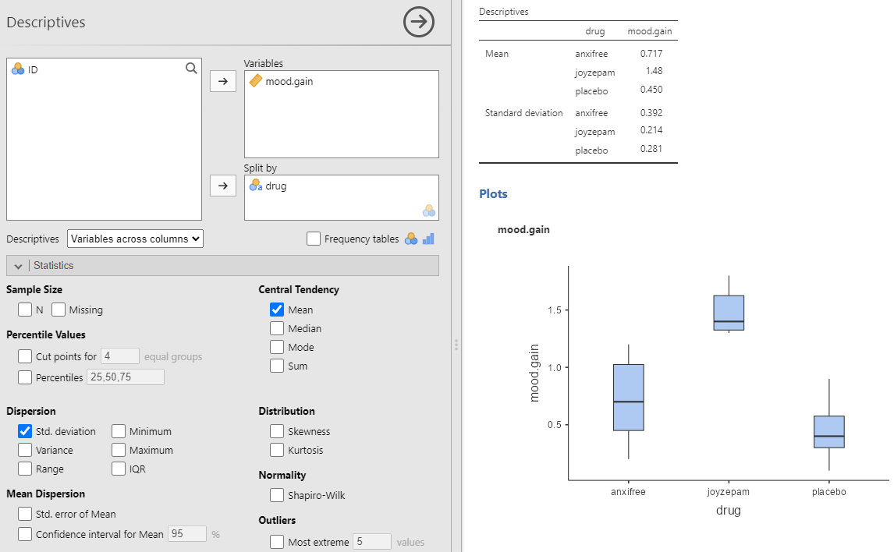
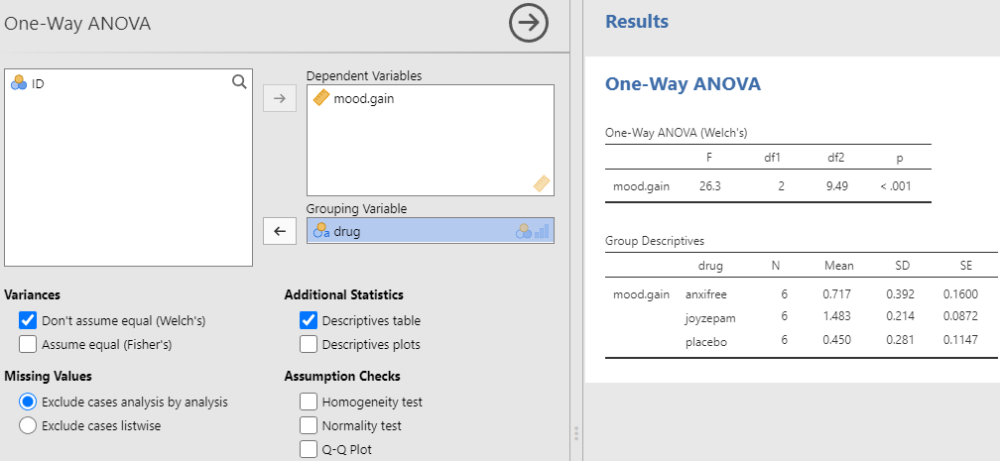
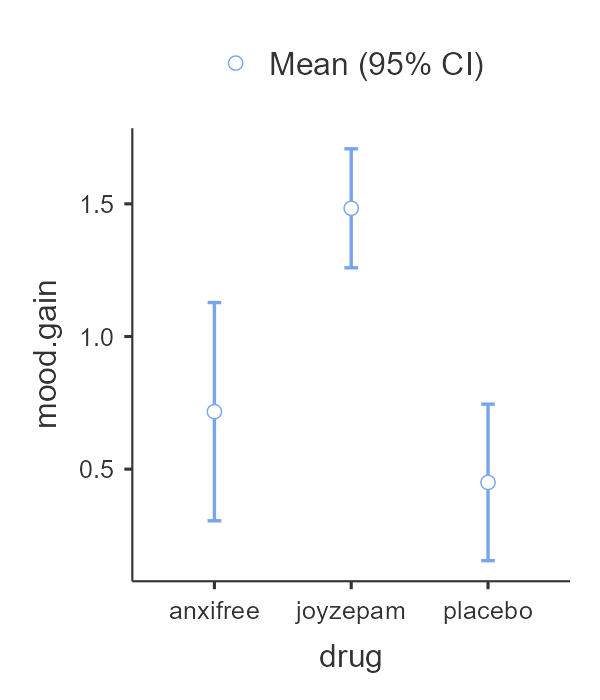
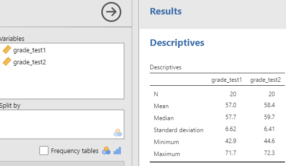
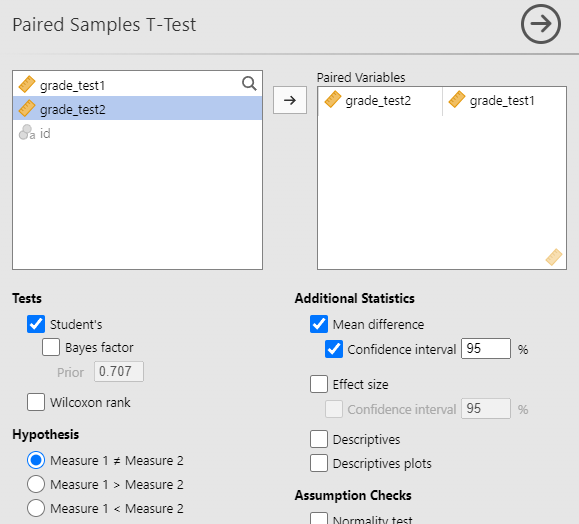
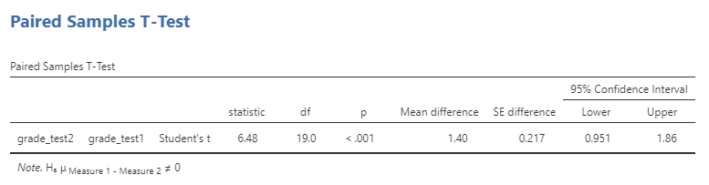

\placetextbox{0.26}{0.06}{\scriptsize{©2025 D.R. Foxcroft and D.J. Navarro,}}
\placetextbox{0.195}{0.05}{\scriptsize{CC BY-SA 4.0}}
\placetextbox{0.70}{0.06}{\scriptsize{\url{https://doi.org/10.11647/OBP.0333.13}}}

# Sammenlikne gjennomsnitt: ANOVA og paret $t$-test {#sec-means}

```{r}
#| include: FALSE
source("chapter_header.R")
```

Dette kapittelet introduserer to statistiske verktøy for å sammenlikne forskjeller i gjennomsnitt. Det første verktøyet, ANOVA, analyserer om gjennomsnittet er forskjellig i ulike grupper. Det andre verktøyet, paret $t$-test, kan brukes til å undersøke om gjennomsnittet har forandret seg mellom en før-test og etter-test.

## Sammenlikne gjennomsnitt i ulike grupper: ANOVA

Vi starter med **ANOVA**, som står for "ANalysis Of VAriance". Teknikken ble utviklet av Sir Ronald Fisher tidlig på 1900-tallet, og det er ham vi har å takke for den noe forvirrende terminologien. Begrepet ANOVA kan være litt misvisende på to måter. For det første handler ANOVA faktisk om å undersøke forskjeller i gjennomsnitt, selv om navnet refererer til varianser. For det andre finnes det flere forskjellige metoder som kalles ANOVA og som bare er løselig beslektet. Men i denne boka skal vi kun møte den enkleste formen for ANOVA, hvor vi har flere grupper av observasjoner og ønsker å finne ut om gjennomsnittet av en utfallsvariabel er forskjellig mellom gruppene. Denne varianten kalles for en "enveis ANOVA".

Kapitlet er strukturert slik: Først introduserer jeg et fiktivt datasett som vi bruker som løpende eksempel. Deretter forklarer jeg hvordan en enveis ANOVA faktisk fungerer [Hvordan ANOVA fungerer], før jeg viser hvordan du kan kjøre analysen i jamovi [Kjøre en ANOVA i jamovi]. Disse to seksjonene utgjør kjernen i kapitlet.

::: {.callout-warning}

Fra og med dette kapittelet har jeg ikke rukket å gjøre eksemplene relevante for utdanningsvitenskap. Det er mye arbeid å finne relevante datasett far utdanningsvitenskap og forklare analysene ved hjelp av dem, og det rakk jeg ikke før semesterstart for dette kapittelet. Derfor er eksempelet hentet fra originalboka @navarro2025, og omhandler psykofarmakologi, altså læren om medisiner for å behandle psykisk sykdom.
:::

### Et illustrerende datasett

Anta at du har blitt involvert i en klinisk studie hvor du tester et nytt antidepressivt legemiddel kalt *Joyzepam*. For å teste medisinens effektivitet, inkluderer studien tre separate medikamenter. Ett er et placebo, altså luretabletter som ikke inneholder medisin, og det andre er et eksisterende antidepressivt/angstdempende medikament kalt *Anxifree*. En samling av 18 deltakere med moderat til alvorlig depresjon er rekruttert til den innledende studien. Siden medikamentene noen ganger gis sammen med psykologisk terapi, inkluderer studien 9 personer som gjennomgår kognitiv atferdsterapi (*cognitive behavioral therapy*, CBT) og 9 som ikke gjør det. Deltakerne blir tilfeldig tildelt en behandling, slik at det er 3 CBT-personer og 3 personer uten terapi tildelt hver av de 3 medikamentene. Utfallsvariabelen er at en psykolog vurderer humøret til hver person før og etter en 3-måneders periode med hvert medikament, og den samlede forbedringen i hver persons humør vurderes på en skala fra $-5$ til $+5$. Med dette som studiedesign, endte dataene opp som i datafilen *[clinicaltrial.csv](data_and_tables/clinicaltrial.csv)*, se Vi kan se at dette datasettet inneholder de tre variablene *drug*, *therapy* og *mood.gain*.

```{r}
#| label: tbl-clinical-data
#| tbl-cap: Datafilen for den kliniske studien. 
#| tbl-alt: Et jamovi-skjermbilde som viser dataene fra den klinisk studien. Fire variable, ID (fra 1 til 18), drug (3 forskjellige), therapy (ingen og CBT) og mood gain (verdiene varierer fra 0,1 til 1,8).

clinical <- readr::read_csv("data_and_tables/clinicaltrial.csv")
clinical |> 
  tt() |> 
  theme_tt("spacing")
```

Vi er først og fremst interessert i effekten av *drug* på *mood.gain*. Slik vi lærte i @sec-descriptive er det alltid lurt å starte med å regne ut litt deskriptiv statistikk og tegne noen grafer for å skjønne dataene bedre, se @fig-fig13-1. Som plottet tydelig viser, er det en større forbedring i humør for deltakere i Joyzepam-gruppen enn for både Anxifree-gruppen og placebo-gruppen. Anxifree-gruppen viser en større humørforbedring enn kontrollgruppen, men forskjellen er ikke så stor. Spørsmålet vi ønsker å besvare er om disse forskjellene i gjennomsnitt er så store at det er usannsynlig å få så store forskjeller hvis gjennomsnittlig effekt egentlig er lik.

```{r}
#| label: fig-fig13-1
#| fig-cap: Deskriptiv statistikk og boksplott for humørforbedring for hvert medikament
#| fig-alt: Et jamovi-skjermbilde som viser resultater fra klinisk studie. Grensesnittet viser variabelvalg, deskriptive statistikker med gjennomsnitt og standardavvik for humørforbedring på tvers av tre medikamenter, og en boksplott-graf som sammenligner humørforbedringen for hvert medikament.
#| out-width: "100%"

```

### Nullhypotesen og alternativhypotesen {#sec-ANOVA-hypotheses}

Det eksperimentelle designet vi beskrev tidligere viser tydelig at vi ønsker å sammenligne den gjennomsnittlige humørforandringen mellom tre forskjellige medisiner. Det er akkurat slike forskningsspørsmål man undersøker med enveis ANOVA. Hvis vi analyserer dette oppsettet har vi to variable; vi har én variabel på forholdstallsnivå, *mood.gain*, og én kategorisk variabel, *drug*. En enveis ANOVA analyserer altså sammenhengen mellom en variabel på forholdstallsnivå og en kategorisk variabel. I vårt tilfelle har den kategoriske variabelen 3 kategorier, men den kan ha så få som 2 kategorier og det er ingen øvre grense for hvor mange kategorier den kan ha.

Den noe pessimistiske nullhypotesen vi ønsker å teste er at gjennomsnittlig *mood.gain* er lik for alle de tre medisinene -- altså at ingen av medisinene er mer effektive enn placebo:

$$H_0: \text{Gjennomsnittet av *mood.gain* er likt for de tre medisinene} $$

Den alternative hypotesen er at minst én av de tre behandlingene skiller seg fra de andre.

$$H_1: \text{Minst én av gjennomsnittene er ulik de andre} $$

Denne nullhypotesen er betydelig mer kompleks å teste enn de vi har sett tidligere. Gitt kapitteltittelen vil du kanskje gjette at løsningen er å "gjøre en ANOVA", men det er ikke umiddelbart opplagt hvorfor "analyse av varianser" kan hjelpe oss å lære noe om gjennomsnitt. Men vi vet at det vi må gjøre er å konstruere en passende testobservator.

### Testobservatoren $F$ og dens utvagsfordeling

```{r}
group_means <- c(70, 59, 72, 80)
group_sds_narrow <- c(2, 5, 4, 3)
group_sds_wide <- c(10, 15, 18, 7)

n <- 10000 #ensure divisible by 4
group <- rep(1:4, each = n/4)
outcome_narrow <- rnorm(n, mean = group_means[group], sd = group_sds_narrow[group])
outcome_wide <- rnorm(n, mean = group_means[group], sd = group_sds_wide[group])

xlims <- c(50, 90)

df <- 
  tibble(
    group,
    outcome_narrow,
    outcome_wide
  ) |>  
  pivot_longer(
    cols = starts_with("outcome_"),
    names_prefix = "outcome_",
    names_to = "sd_type",
    values_to = "outcome"
    ) |> 
  mutate(
    sd_type = case_match(sd_type,
      "narrow" ~ "Liten varians",
      "wide" ~ "Høy varians"
    )
  )
```


For å forstå hvordan dette fungerer, la oss begynne med å snakke om varianser. I ANOVA skiller man mellom to typer varianser, variansen *mellom gruppene* og *innad i gruppene* (@fig-means-F-wide). Variansen mellom gruppene vises i @fig-means-F-wide-1 som piler mellom gruppenes gjennomsnitt. Dess lengre piler, dess mer variasjon mellom gruppene. Variansen innad i gruppene vises i @fig-means-F-wide-2 som bredden på hver gruppes fordeling; dess bredere fordeling (lengre piler), dess mer varians. I denne figuren er pilene for variansen mellom gruppene og innad i gruppene ca. like store. Legg også merke til at de tre gruppenes fordeling overlapper ganske masse. Det virker ikke helt usannsynlig at gruppenes gjennomsnitt er like i populasjonen, og at forskjellen mellom gruppene skyldes at man er litt uheldig med det utvalget.


```{r}
#| label: fig-means-F-wide
#| fig-asp: 0.3
#| fig-cap: Grafisk illustrasjon av variansen mellom gruppene og innad i gruppene. Til venstre viser pilene forskjellen mellom gruppenes gjennomsnitt. Til høyre viser pilene variabiliteten innen hver gruppe
#| fig-subcap: 
#|   - "Variasjonen mellom gruppene er et mål på avstanden mellom gjennomsnittene"
#|   - "Variasjonen innad i gruppene er et mål på hvor bred fordelingen er i hver gruppe"
#| fig-alt: To grafer. (a) "Mellom-gruppe-variasjon" viser tre overlappende klokke-kurver for gruppe 1, 2 og 3 med horisontale piler mellom toppene. (b) "Innen-gruppe-variasjon" har tre klokke-kurver i samme posisjon med horisontale piler innenfor hver kurves topp.

ggplot(data = data.frame(x = seq(-5, 5, 1)), aes(x)) +
  stat_function(fun = dnorm, n = 1000, args = list(mean = -2, sd = 1), col="darkgrey", linewidth=1) +
  stat_function(fun = dnorm, n = 1000, args = list(mean = 0, sd = 1), col="darkgrey", linewidth=1) +
  stat_function(fun = dnorm, n = 1000, args = list(mean = 2, sd = 1), col="darkgrey", linewidth=1) +
  geom_segment(x=-2, xend=0, y=0.33, yend=0.33, arrow=arrow(ends='both', length=unit(0.30,"cm")), stat = "unique") +
  geom_segment(x=0, xend=2, y=0.28, yend=0.28, arrow=arrow(ends='both', length=unit(0.30,"cm")), stat = "unique") +
  geom_segment(x=-2, xend=2, y=0.23, yend=0.23, arrow=arrow(ends='both', length=unit(0.30,"cm")), stat = "unique") +
  #ggtitle("Between-group variation\n(i.e. differences amongst group means)") +
  xlab("\n(a)") +
  scale_x_continuous(breaks=c(-2,0,2), labels=c("group 1", "group 2", "group 3")) +
  theme(
    axis.text.y = element_blank(),
    axis.title.y = element_blank(),
    axis.line.y = element_blank(),
    axis.ticks.y = element_blank(),
    plot.title = element_text(hjust = 0.5, size=10)
    )

ggplot(data = data.frame(x = seq(-5, 5, 1)), aes(x)) +
  stat_function(fun = dnorm, n = 1000, args = list(mean = -2, sd = 1), col="darkgrey", linewidth=1) +
  stat_function(fun = dnorm, n = 1000, args = list(mean = 0, sd = 1), col="darkgrey", linewidth=1) +
  stat_function(fun = dnorm, n = 1000, args = list(mean = 2, sd = 1), col="darkgrey", linewidth=1) +
  geom_segment(x=-2.8, xend=-1.2, y=0.28, yend=0.28, arrow=arrow(ends='both', length=unit(0.30,"cm")), stat = "unique") +
  geom_segment(x=-0.8, xend=0.8, y=0.28, yend=0.28, arrow=arrow(ends='both', length=unit(0.30,"cm")), stat = "unique") +
  geom_segment(x=1.2, xend=2.8, y=0.28, yend=0.28, arrow=arrow(ends='both', length=unit(0.30,"cm")), stat = "unique") +
  #ggtitle("Within-group variation\n(i.e. deviations from group means)") +
  xlab("\n(b)") +
  scale_x_continuous(breaks=c(-2,0,2), labels=c("group 1", "group 2", "group 3")) +
  theme(
    axis.text.y = element_blank(),
    axis.title.y = element_blank(),
    axis.line.y = element_blank(),
    axis.ticks.y = element_blank(),
    plot.title = element_text(hjust = 0.5, size=10)
    )
```

Situasjonen er motsatt i @fig-means-F-narrow. I denne figuren har de tre gruppene samme gjennomsnitt, men variasjonen innad i hver gruppe er mye mindre. Variasjonen mellom gruppene er like stor som før, @fig-means-F-narrow-1, men variasjonen innad i gruppene er mye mindre, @fig-means-F-narrow-2. Derfor virker det helt usannsynlig at de tre gruppene har samme gjennomsnitt i populasjonen.
```{r}
#| label: fig-means-F-narrow
#| fig-asp: 0.3
#| fig-cap: Når variasjonen innad i gruppene er liten fremstår variasjonen mellom gruppene som veldig mye større. I dette eksempelet virker det helt usannsynlig at det ikke er noen forskjell mellom gruppene i populasjonen.
#| fig-subcap: 
#|   - "Variasjonen mellom gruppene er uendret, men fremstår større siden variasjon innad i gruppene er mindre"
#|   - "Variasjonen innad i gruppene er mye mindre"
#| fig-alt: To grafer. (a) "Mellom-gruppe-variasjon" viser tre normalfordelinger som nesten ikke overlapper for gruppe 1, 2 og 3 med horisontale piler mellom toppene. (b) "Innen-gruppe-variasjon" har tre veldig smale normalfordelinger i samme posisjon med horisontale piler innenfor hver kurves topp.

ggplot(data = data.frame(x = seq(-5, 5, 1)), aes(x)) +
  stat_function(fun = dnorm, n = 1000, args = list(mean = -2, sd = 0.2), col="darkgrey", linewidth=1) +
  stat_function(fun = dnorm, n = 1000, args = list(mean = 0, sd = 0.2), col="darkgrey", linewidth=1) +
  stat_function(fun = dnorm, n = 1000, args = list(mean = 2, sd = 0.2), col="darkgrey", linewidth=1) +
  geom_segment(x=-2, xend=0, y=1.4, yend=1.4, arrow=arrow(ends='both', length=unit(0.30,"cm")), stat = "unique") +
  geom_segment(x=0, xend=2, y=1.2, yend=1.2, arrow=arrow(ends='both', length=unit(0.30,"cm")), stat = "unique") +
  geom_segment(x=-2, xend=2, y=1.0, yend=1.0, arrow=arrow(ends='both', length=unit(0.30,"cm")), stat = "unique") +
  #ggtitle("Between-group variation\n(i.e. differences amongst group means)") +
  xlab("\n(a)") +
  scale_x_continuous(breaks=c(-2,0,2), labels=c("group 1", "group 2", "group 3")) +
  theme(
    axis.text.y = element_blank(),
    axis.title.y = element_blank(),
    axis.line.y = element_blank(),
    axis.ticks.y = element_blank(),
    plot.title = element_text(hjust = 0.5, size=10)
    )

ggplot(data = data.frame(x = seq(-5, 5, 1)), aes(x)) +
  stat_function(fun = dnorm, n = 1000, args = list(mean = -2, sd = 0.2), col="darkgrey", linewidth=1) +
  stat_function(fun = dnorm, n = 1000, args = list(mean = 0, sd = 0.2), col="darkgrey", linewidth=1) +
  stat_function(fun = dnorm, n = 1000, args = list(mean = 2, sd = 0.2), col="darkgrey", linewidth=1) +
  geom_segment(x=-2-0.16, xend=-2+0.16, y=1.4, yend=1.4, arrow=arrow(ends='both', length=unit(0.30,"cm")), stat = "unique") +
  geom_segment(x=-0.16, xend=+0.16, y=1.4, yend=1.4, arrow=arrow(ends='both', length=unit(0.30,"cm")), stat = "unique") +
  geom_segment(x=2-0.16, xend=2+0.16, y=1.4, yend=1.4, arrow=arrow(ends='both', length=unit(0.30,"cm")), stat = "unique") +
  #ggtitle("Within-group variation\n(i.e. deviations from group means)") +
  xlab("\n(b)") +
  scale_x_continuous(breaks=c(-2,0,2), labels=c("group 1", "group 2", "group 3")) +
  theme(
    axis.text.y = element_blank(),
    axis.title.y = element_blank(),
    axis.line.y = element_blank(),
    axis.ticks.y = element_blank(),
    plot.title = element_text(hjust = 0.5, size=10)
    )

```

Moralen er at når man analyserer forskjeller i gruppers gjennomsnitt, så må man ikke bare ta hensyn til hvor forskjellig gruppenes gjennomsnitt er, man må også ta hensyn til hvor mye spredning det er innad i gruppene. Denne informasjonen fanges opp i $F$-observatoren, som er testobservatoren til en ANOVA. Hvis man glatter over alle detaljene kan man si at den regnes ut slik:

$$ F = \frac{\text{variasjonen mellom gruppene}}{\text{summen av variasjonene innad i gruppene}}. $$
Vi hopper over mange detaljer slik som spesifikke utregninger og at $F$-fordelinger har to frihetsgrader, men vi viser en $F$-fordeling der frihetsgrad nummer 1 er 10 og frihetsgrad nummer 2 10, se @fig-means-F-dist.

```{r}
#| label: fig-means-F-dist
#| fig-cap: $F$-fordeling og forkastningsområdet for en $F$-test.
#| fig-alt: En F-fordeling som viser en høyreskjev kurve. En pil merket "kritiske verdi" peker på x-aksen, og området under grafen til høyre for pilen er skravert og markert med "Kritisk område".

df1 <-  10
df2 <-  10
critical_value <-  stats::qf(0.95, df1, df2)
xlim <- c(0, critical_value*1.8)
ggplot(data.frame(x = seq(xlim[1],xlim[2],0.01)), aes(x)) +
  stat_function(fun = stats::df, args = list(df1 = df1, df2 = df2), geom = "line") + 
  stat_function(fun = stats::df, args = list(df1 = df1, df2 = df2), geom = "area", fill = blueshade, alpha = 0.8, xlim = c(critical_value, xlim[2])) + 
  geom_text(x=critical_value*0.96, y=.22, label="Kritisk verdi", check_overlap = TRUE) +
  geom_segment(x = critical_value, y = .18, xend = critical_value, yend = .046,
               arrow = arrow(length = unit(0.03, "npc")), stat = "unique") +
  geom_text(x=critical_value*1.4, y=.06, label="Det kritiske området er skravert", check_overlap = TRUE) +
labs(
  x = "F-verdi",
  y = ""
) +
theme(
    axis.title.y = element_blank(),
    axis.text.y = element_blank(),
    axis.line.y = element_blank(),
    axis.ticks.y = element_blank(),
)
   
```
### Å gjennomføre ANOVA i jamovi

For å gjøre livet enklere kan jamovi utføre ANOVA for deg – hurra! Trykk på 'ANOVA' → 'One-way ANOVA', og flytt *mood.gain*-variabelen til 'Dependent Variable'-boksen og deretter *drug*-variabelen over til 'Fixed Factors'-boksen. Dette gir deg resultatene som vist i @fig-means-jamovi-ANOVA. Resultatene viser $F$verdien, samt begge frihetsgradene. Disse trenger ikke vi fokusere så mye på. Den oppgir også $p$-verdien, som i dette tilfellet er $p < 0{,}001.


```{r}
#| label: fig-means-jamovi-ANOVA
#| fig-cap: Resultater fra ANOVA i jamovi om humørforbedring etter å ha fått ulike medikamenter
#| fig-alt: En tabell fra jamovi med tittelen "ANOVA - mood.gain" viser resultater for en ANOVA-test med kolonnene:- "Sum of Squares," "df," "Mean Square," "F," "p," og "η²." Radene presenterer data for "drug" med verdiene (3.45, 2, 1.73, 18.61, 0.00009, 0.71) og "Residuals" med verdiene (1.39, 15, 0.09)
#| fig-pos: 'H'

```

Vi kan rapportere denne analysen slik:

> Vi gjennomførte en ANOVA-analyse for effekten av medikament på humørforbedring og fant en signifikant effekt ($F = 26.3, df1 = 2, df2 = 9{,}49, p < 0{,}001$).

Merk at disse resultatene ikke sier noe om hvilken av medikamentene som hadde størst og minst gjennomsnitt, den sier bare at vi forkaster hypotesen om at gjennomsnittet på utfallsvariabelen var lik i de tre gruppene. For å finne ut av hvilket medikament som var mest effektivt kan man titte på den deskriptive statistikken som jamovi tilbyr ved knappen "Descriptive table". Vi ser at de som fikk anxifree hadde en humørbedring på 0,717; de som gikk på joyzepam 1,483; og de på placebo 0,450. Joyzepam var altså det mest effektive legemiddelet. Merk at jamovi oppgir både standardavviket (SD) og standardfeilen (SE).
^[Hvis du husker tilbake til @sec-central-limit-theorem så var standardfeilen standardavviket til en observator, i dette tilfellet gjennomsnittet, så disse standardfeilene angir hvor mye vi estimerer at gjennomsnittene vil variere hvis vi gjør studien mange ganger.]

Med disse tallene kan vi rapportere videre:

> Effekten av joyzepam ga en humørforbedring på 1,48 95% CI [1,31; 1,65], som var større enn både anxifree (0,72 95% CI [0,41; 1,03]) og placebo (0,45 95% CI [0.23; 0.67]).

Det er lettere å sette seg inn i resultatene med en visualisering, så jeg viser også hva jamovi tilbyr under "Descriptives plots" i menyene til enveis ANOVA, se @fig-means-jamovi-ANOVA-plot. Her vises gjennomsnittene med en prikk og 95% konfidensintervall er vist med streker. Merk at konfidensintervallet er ca. 2 standardfeil, slik vi lærte i @sec-estimation-CI.

```{r}
#| label: fig-means-jamovi-ANOVA-plot
#| fig-cap: Resultater fra ANOVA i jamovi om humørforbedring etter å ha fått ulike medikamenter
#| fig-alt: En tabell fra jamovi med tittelen "ANOVA - mood.gain" viser resultater for en ANOVA-test med kolonnene:- "Sum of Squares," "df," "Mean Square," "F," "p," og "η²." Radene presenterer data for "drug" med verdiene (3.45, 2, 1.73, 18.61, 0.00009, 0.71) og "Residuals" med verdiene (1.39, 15, 0.09)
#| fig-pos: 'H'

```
Hvis ANOVA-analysen er den sentrale analysen i artikkelen din bør du trolig legge ved en liknende visualisering.

## Sammenlikne gjennomsnittlig forbedring: paret $t$-test

**Paret $t$-test** sammenlikner gjennomsnitt på tvers av to grupper, men der hver observasjon i den første gruppen svarer til en observasjon i den andre gruppen. Dette er en litt tungvindt måte å snakke på, så vi skal begrense oss til kun én slik situasjon, endring mellom en før-test og ettertest. Her er observasjonene naturlig delt i to grupper, før og etter, og hver deltager har en måling for både før-testen og for etter-testen. 

### Dataene

Datasettet vi skal bruke denne gangen kommer fra Dr. Chicos sin undervisning. I klassen hennes tar studentene to store tester -- en tidlig i semesteret og en senere i semesteret. Dr. Chico sine timer er utfordrende og studentene bør jobbe mye. Hun mener at ved å gi vanskelige vurderinger oppmuntres studentene til å jobbe hardere. Teorien hennes er at den første testen fungerer som en slags "vekkerklokke" for studentene. Når de forstår hvor vanskelig klassen faktisk er, vil de jobbe hardere til den andre testen og få bedre karakter. Stemmer dette? For å teste dette åpner vi [*chico.csv*](data_and_tables/chico.csv)-filen inn i jamovi, se @tbl-chico-data. 

Datasettet *chico* inneholder tre variabler: en *id*-variabel som identifiserer hver student i klassen, variabelen *grade_test1* med antall prosent riktig på den første testen, og variabelen *grade_test2* med antall prosent riktig på den andre testen.

```{r}
#| label: tbl-chico-data
#| tbl-cap: Chico sin datafil med resultater på før- og ettertesten
#| tbl-alt: Et jamovi-skjermbilde som viser Dr. Chico sine data. Tre variable, id (fra student1 til student20), grade_test1 (fra ca. 42 til 72) og grade_test2 (fra ca. 42 til 72) .

chico <- readr::read_csv("data_and_tables/chico.csv")
chico |> 
  tt() |> 
  theme_tt("spacing")
```

Når vi ser på dataene virker det som om klassen virkelig er vanskelig (de fleste karakterene ligger mellom 50% og 60%), og det er ikke opplagt at det er en forbedring fra den første til den andre prøven.

Tar vi en rask titt på den deskriptive analysen i @fig-means-jamovi-chico-descriptive-1 får vi forsterket inntrykket av at det ikke er en opplagt forbedring. Blant alle 20 studenter er gjennomsnittskarakteren 57% for den første testen og 58% for den andre testen. Men gitt at standardavvikene er henholdsvis 6,6% og 6,4%, kan det virke som om man lett kunne fått disse resultatene også hvis det ikke var noen effekt. Og inntrykket er det samme hvis vi visualiserer gjennomsnittene og konfidensintervallene, slik som i @fig-means-jamovi-chico-descriptive-2. Hvis vi skulle stolt på denne figuren og bredden på disse konfidensintervallene, ville vi lett ha trodd at forbedringen i studentenes prestasjoner kunne være tilfeldige.

```{r}
#| label: fig-means-jamovi-chico-descriptive
#| fig-cap: Deskriptive analyser av de to testene i chico-datasettet.
#| fig-subcap:
#|   - Deskriptiv statistikk for testene
#|   - Gjennomsnitt og 95% konfidensintervaller for testene
#| fig-alt: Et jamovi-skjermbilde som viser et datasett med studentkarakterer og et sammendrag av deskriptiv statistikk. Datasettabellen lister student-IDer og deres karakterer for to tester. Resultatpanelet viser deskriptiv statistikk inkludert N, gjennomsnitt, median, standardavvik, minimum- og maksimumsverdier.
#| layout-ncol: 2



```

Men dette inntrykket er feil! Grunnen er at vi kun har vist statistikk og grafer som ikke tar hensyn til at samme person har avlagt en før- og en etter-prøve. Vi har regnet ut gjennomsnittet for førtesten og ettertesten helt separat, og dette vil være en fin analyse hvis det er helt forskjellige folk som tar før-testen og etter-testen, men i vårt eksempel er det de samme studentene. For å illustrere at studentene faktisk har en fremgang kan vi regne ut hver students endring fra test 1 til test 2, altså regne ut differansen $\text{endring} = \text{grade_test2} - \text{grade_test1}$ og legge den til i datasettet. Jeg har visualisert denne variabelen i @fig-means-jamovi-chico-hist. Når vi ser på histogrammet blir det helt klart at det er en reell forbedring her. Det store flertallet av studentene scoret høyere på test 2 enn på test 1, noe som reflekteres i at nesten hele histogrammet ligger over null.

```{r}
#| label: fig-means-jamovi-chico-hist
#| fig-cap: Histogram som viser studentenes endring fra test 1 til test 2.
#| fig-alt: Et histogram med "Endring fra test1 til test2" på x-aksen. Bare to små søyler er under null og veldig mange er over null.
chico <- chico |> 
  mutate(
    change_score = chico$grade_test2 - chico$grade_test1
  )

chico |>
  ggplot() +
  aes(x = change_score) +
  geom_histogram(binwidth = 0.2, boundary = 0, col="white", fill=blueshade, alpha=0.6) +
  xlab("Endring fra test1 til test2") +
  ylab("Antall studenter")
```
Derfor trenger man en paret $t$-test. Man kunne sett for seg at man regnet ut en ANOVA med to grupper *før* og *etter*, men dette ville ikke tatt hensyn til at samme student befant seg i hver gruppe.

### Nullhypotesen og alternativhypotesen

Nullhypotesen for en paret $t$-test er

> $H_0$: gjennomsnittlig endring mellom de to testene er 0

Og alternativhypotesen er

> $H_1$: gjennomsnittlig endring mellom de to testene er ulik 0

Paret $t$-test gjøres ofte med en ensidet test, se @sec-testing-one-sided. For Dr. Chico, som tenkte at studentene ville få til mer på test 2, blir hypotesene:

> $H_0: \text{Gjennomsnittlig endring mellom de to testene er positiv, altså:}\ \text{endring} > 0$
>
> $H_1: \text{Gjennomsnittlig endring mellom de to testene er null eller negativ, altså:}\ \text{endring} \leq 0$

### Testobservatoren $t$ og dens utvalgsfordeling

Nå skal vi konstruere en passende test. Løsningen er ganske enkel, siden vi allerede har gjort det meste av arbeidet tidligere. I stedet for å analysere `grade_test1` og `grade_test2` hver for seg, undersøker vi om endringsvariabelen `grade_test2 - grade_test1` er ulik null.

Hvis studentene er plukket tilfeldig fra en populasjon, vet vi fra sentralgrenseteoremet, @sec-central-limit-theorem, at endringsvariabelen er normalfordelt. Derfor er testobservatoren vår normalfordelt ... nesten. Det eneste problemet er at vi ikke vet standardavviket til denne normalfordelingen, så den må estimeres. Dette gjør at testobservatoren vår er ekstremt lik normalfordelingen, men er bittelittegranne mer spredt fordi vi også må estimere standardavviket fra dataene våre. Den fordelingen som tar høyde for dette er $t$-fordelingen, så testobservatoren vår er $t$.

```{r}
#| label: fig-means-T-dist
#| fig-cap: ""
#| fig-subcap: 
#|   - Sammenlikning av $t$-fordeling og normalfordeling. $t$-fordeling er litt mindre presis, som vist ved at halene er tykkere, altså at store verdier er vanligere.
#|   - Forkastningsområdet til en tosidig $t$-test
#|   - Forkastningsområdet til en ensidig $t$-test
#| layout-ncol: 1

xlim <- c(-4,4)
df <- 19
critical_value <- list(
  "twosided" = qt(0.975,df),
  "onesided" = qt(0.95,df)
)

#comparison w normal
ggplot(data = data.frame(x = seq(xlim[1], xlim[2], 0.01)), aes(x)) +
  stat_function(fun = dt, n = 1000, args = list(df = df), col=blueshade, linewidth=1) +
  stat_function(fun = dnorm, n = 1000, args = list(mean = 0, sd = 1), col= "red", alpha = .5, linewidth=1) +
  geom_text(x=3, y=.20, label="t-fordeling i blått\nog normalfordeling i rødt", check_overlap = TRUE) +
  ylab("\n") +
  xlab("\nEndring fra test 1 til test 2") +
  
theme(
    axis.title.y = element_blank(),
    axis.text.y = element_blank(),
    axis.line.y = element_blank(),
    axis.ticks.y = element_blank(),
)

#twosided
ggplot(data = data.frame(x = seq(xlim[1], xlim[2], 0.01)), aes(x)) +
  stat_function(fun = dt, n = 1000, args = list(df = df), col=blueshade, linewidth=1) +
  stat_function(fun = dt, n = 1000, args = list(df = df), geom="area", fill=blueshade, alpha=0.8, xlim = c(critical_value$twosided, xlim[2])) +
  stat_function(fun = dt, n = 1000, args = list(df = df), geom="area", fill=blueshade, alpha=0.8, xlim = c(xlim[1], -critical_value$twosided)) +
  geom_text(x=3, y=.20, label="Det kritiske området til\nen tosidig test er skravert", check_overlap = TRUE) +
  ylab("\n") +
  xlab("\nEndring fra test 1 til test 2") +
theme(
    axis.title.y = element_blank(),
    axis.text.y = element_blank(),
    axis.line.y = element_blank(),
    axis.ticks.y = element_blank(),
)

#onesided
ggplot(data = data.frame(x = seq(xlim[1], xlim[2], 0.01)), aes(x)) +
  stat_function(fun = dt, n = 1000, args = list(df = df), col=blueshade, linewidth=1) +
  stat_function(fun = dt, n = 1000, args = list(df = df), geom="area", fill=blueshade, alpha=0.8, xlim = c(critical_value$onesided, xlim[2])) +
  geom_text(x=3, y=.20, label="Det kritiske området til\nen ensidig test er skravert", check_overlap = TRUE) +
  ylab("\n") +
  xlab("\nEndring fra test 1 til test 2") +
theme(
    axis.title.y = element_blank(),
    axis.text.y = element_blank(),
    axis.line.y = element_blank(),
    axis.ticks.y = element_blank(),
)
```

Og det er faktisk alt! Konseptet er veldig enkelt. Trikset er å gjenkjenne *når* en parvis test er passende, og forstå *hvorfor* den er bedre enn en ANOVA i slike situasjoner.

::: {.callout-warning}
Jeg har gjennom dette kapittelet sammenliknet paret $t$-test med ANOVA. De fleste lærebøker sammenlikner paret $t$-test med "vanlig" $t$-test. Jeg har valgt å ikke presentere den vanlige $t$-testen siden den er identisk med ANOVA når man har 2 grupper. Vi har altså spart oss fra å lære én test uten å tape noe.
:::

### Å gjøre testen i jamovi

Du finner jamovi sin funksjon for paret $t$-test under "T-tests" → "Paired samples t-tests". Jeg valgte innstillinger som i @fig-means-jamovi-t-1 og fikk resultatet i @fig-means-jamovi-t-2.

```{r}
#| label: fig-means-jamovi-t
#| fig-cap: Resultater som viser en paret $t$-test i jamovi.
#| fig-subcap:
#|   - Innstillingene
#|   - Resultatene
#| fig-alt: Et bilde av en tabell som viser resultater fra en paret utvalg $t$-test. Den inkluderer kolonner for statistikk, df, p, middel differanse, SE differanse, 95% konfidensintervall (nedre og øvre), og effektstørrelse. Eksempeldata for grade_test2 og grade_test1 er gitt.


```

Vi ser at resultatet er statistisk signifikant, og man kan rapportere det slik:

> Endringen fra test 1 til test 2 var statistisk signifikant, $t(19) = 6{,}48, p < 0{;}001$. Gjennomsnittlig forskjell fra test 1 til 2 var 1,40 95% CI [0,951; 1,86]. 

Man bør tenke over om forutsetningene for testen er oppfylt i dette tilfellet. Dr. Chico valgte ikke studentene tilfeldig fra en definert populasjon; hun valgte ganske enkelt alle studentene som tok faget hennes. Dr. Chico ønsker nok å generalisere til populasjonen over studenter som tar kurset sitt, ikke bare dette året, men alle år hun underviser det. Hun kan argumentere for at akkurat hvilke studenter som tok faget hennes dette året er ganske tilfeldig, slik at man kan betrakte studentene dette året som tilfeldig trukket. Er du enig i det? Det er ikke en helt usannsynlig antagelse, men det er viktig å tenke over om antagelsene virkelig er oppfylte og hvilke konsekvenser det eventuelt får om de ikke er det.

I menyene i jamovi er også det muligheter for å velge ensidige tester. Akkurat i Dr. Chico sitt tilfellet blir resultatet det samme, men ensidige hypotesetester er sterkere og vil noen gange kunne forkaste nullhypoteser som tosidige hypoteser ikke kan.

## Sammendrag

Her er hovedtemaene vi har dekket i dette kapittelet:

- For både ANOVA og paret $t$-test har vi lært
  - Når de kan anvendes
  - Hva nullhypotesen og alternativhypotesene er
  - Ideen bak testobservatorene, henholdsvis $F$ og $t$.
  - Hvordan man utfører testen i jamovi

Det viktigste som ikke er dekket er ulike forutsetninger for når man kan benytte testene. Noen av disse forutsetningene er ganske tekniske, så det vil være vanskelig å inkludere dem i et kurs på dette nivået. Den viktigste forutsetningen er at det bør være et enkelt tilfeldig utvalg fra en populasjon, hvis ikke kan det bli vanskelig å tolke testene.
