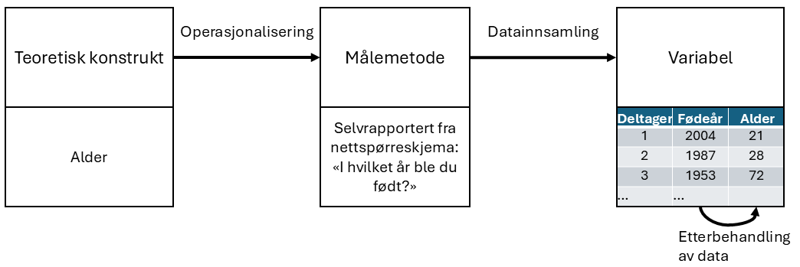
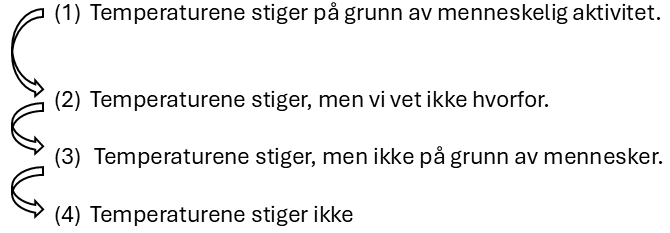
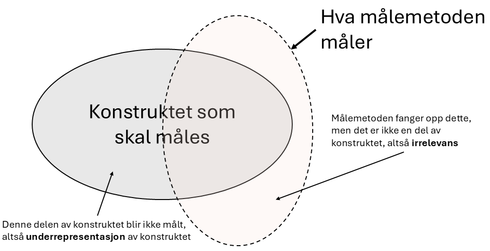

\placetextbox{0.26}{0.06}{\scriptsize{©2025 D.R. Foxcroft and D.J. Navarro,}}
\placetextbox{0.195}{0.05}{\scriptsize{CC BY-SA 4.0}}
\placetextbox{0.70}{0.06}{\scriptsize{\url{https://doi.org/10.11647/OBP.0333.02}}}

# Måling i utdanningsforskning {#sec-measurement}

```{r}
#| include: FALSE
source("chapter_header.R")
```

> *When you can measure what you are speaking about, and express it in numbers, you know something about it, when you cannot express it in numbers, your knowledge is of a meager and unsatisfactory kind; it may be the beginning of knowledge, but you have scarcely, in your thoughts advanced to the stage of science.*\
> -- Lord Kelvin [^measurement-kelvin]

[^measurement-kelvin]: Foredrag til _Institution of Civil Engineers_, 3. mai, 1883. Kilde: <https://en.wikiquote.org/wiki/William_Thomson>

Sitatet fra Lord Kelvin, en av attenhundretallets store vitenskapsmenn, viser en stor tro på verdien av å måle ting. Hvis man ikke kan måle noe, vet man ikke noe vitenskapelig om det. Nuvel, i samfunnsvitenskapene, og dermed i utdanningsforskning, gjelder nok ikke dette. Kanskje gjelder heller det motsatte, at hvis noe er målt, så bør vi være ekstra skeptiske til det:

> *We're seeing that the published literature--you know, in some of our best journals--features measures that have little or no validity evidence. Measurement, schmeasurement. Applied researchers are, as a norm, not engaged in this process of construct validation.*\
> -- Jessica Kay Flake[^measurement-flake]

[^measurement-flake]: Foredrag til _RIOT Science Club_, 23. november, 2020. Kilde: <https://youtu.be/Cq6n7AS_r8w?si=PSLqDe2VGExXp2qV&t=637>

I dette kapittelet skal vi lære hvorfor vi bør være skeptiske til kvantitative målinger i utdanningsforskning og hva som skal til for å gjøre gode målinger. Men først må vi lære de vanligste begrepene man benytter for å beskrive målinger. Dette kapittelet bygger i stor grad på @Campbell1963 og @stevens1946 for diskusjonen om måleskalaer.

## Begreper om målinger {#sec-measurement-concepts}

### Variable og verdier {#sec-variables-values}

Kvantitative analyser baserer seg på at man har gjort en spesifikk **måling** av mange forskjellige ting. I utdanningsforskning er tingene gjerne skoler, lærere, klasser, elever, rektorer, læreplaner, lærebøker, elevtekster eller liknende. Måling er å tildele tall, merkelapper eller andre veldefinerte beskrivelser til disse tingene. Så alle følgende eksempler vil regnes som målinger:

-   Min **alder** er *33* år.
-   Jeg **preferanse for ansjon** er at jeg *ikke liker det*.
-   Mitt **kromosomale kjønn** er *mann*.
-   Mitt **selvidentifiserte kjønn** er *kvinne*.

I denne listen viser den fete skriften "det vi skal måle", som kalles **variabelen**, og den kursiverte skriften viser "det som er målt", som kalles **verdien**. Skillet mellom variabelen og de ulike verdiene variabelen kan anta er sentralt:

-   Min **alder** (i år) kunne ha hatt verdiene *0, 1, 2, 3* ... osv. Den øvre grensen for verdien alderen min kunne hatt er litt uklar, men i praksis kan si at den høyeste mulige alderen er *150*, siden ingen mennesker noensinne har levd så lenge.
-   Når jeg blir spurt om jeg **liker ansjos**, kunne jeg ha svart at *jeg gjør det*, eller *jeg gjør det ikke*, eller *jeg har ingen mening*, eller *jeg gjør det av og til*.
-   Mitt **kromosomale kjønn** er nesten helt sikkert enten *mann* ($XY$) eller *kvinne* ($XX$), men det finnes noen andre verdier variabelen kunne hatt. Jeg kunne for eksempel hatt *Klinefelters syndrom* ($XXY$), som er mer likt mann enn kvinne.
-   Mitt **selvidentifiserte** kjønn er også svært sannsynlig enten mann eller kvinne, men det trenger ikke å samsvare med mitt kromosomale kjønn. Jeg kan også velge å identifisere meg med *ingen av delene*, eller eksplisitt kalle meg selv *transperson*.

Som du ser, for noen ting (som alder) virker det ganske opplagt hva mulige verdier bør være, mens for andre virker det vanskelig. Men selv det å definere alderen min kan være vanskelig. For eksempel, i eksemplet ovenfor antok jeg at det var greit å måle alder i år og runde av til heltall. Men hvis du er en pedagog som jobber med små barn er dette altfor grovt, og derfor måles ofte alder i *år og måneder* (hvis et barn er 2 år og 11 måneder, skrives dette vanligvis som "2;11"). Hvis du er interessert i nyfødte, vil du kanskje måle alder i *dager siden fødsel*, kanskje til og med *timer siden fødsel*. Med andre ord, måten du spesifiserer de tillatte måleverdiene på er en viktig del av å planlegge en studie.

### Operasjonalisering av teoretiske konstrukter {#sec-operationalization}

Alle tingene vi ønsker å måle (slik som alder, motivasjon, læring, undervisning) har en teoretisk beskrivelse. Denne teoretiske beskrivelsen kalles et *teoretisk konstrukt*. Ofte utelater man "teoretisk" om omtaler det bare som "konstruktet". Når vi skal gjøre en måling av et teoretisk konstrukt må vi lage en *målemetode*. Dette kalles å *operasjonalisere* konstruktet, og vi kaller målemetoden en *operasjonalisering* av konstruktet. Begrepene blir oppsummert i @fig-operasjonalisering.

```{r}
#| label: fig-operasjonalisering
#| fig-cap: "Operasjonalisering av konstruktet _alder_. Lengst til høyre er 'Alder' en variabel i datasettet som har verdiene 21, 38 og 72 for de tre første forskningsdeltagerne."
#| fig-alt: "Lengst til venstre er 'Teoretisk konstrukt: Alder' med en pil til 'Målemetode: Selvrapportering fra nettspørreskjema: 'hvilket år ble du født?''. Det står 'operasjonalisering' på pila. Derfra går det en pil, 'datainnsamling', til 'Variabel'. Ved 'Variabel' er det et datasett med 'Fødselsår' og 'Alder'. Fra 'Fødselsår' til 'Alder' går det en liten pil, 'Etterbehandling av data'."

```

Kort fortalt handler operasjonalisering om å omforme et konstrukt, som ofte er ganske vagt, til en helt presist definert måling. Operasjonalisering omfatter blant annet:

-   å definere hva som skal måles. For eksempel, betyr "alder" "tid siden fødsel" eller "tid siden unnfangelse"? Dette er et viktig skille når man undersøker læring hos de aller yngste barna.
-   å bestemme målemetode. For å måle alder, vil du spørre personen selv eller en forelder eller kanskje slå opp i et offisielt register? Hvis du bruker selvrapportering, hvordan vil du formulere spørsmålet?
-   å definere hvilke verdier målingene kan ha. Verdiene er ofte numeriske, men ikke alltid. Ved aldersmåling kan vi spørre: ønsker vi alder kun i år, eller skal vi inkludere måneder, dager, eller timer? For andre målinger, som kjønn, er verdiene ikke numeriske. Her må vi vurdere hvilke alternativer vi skal tilby. Er det tilstrekkelig med "mann" og "kvinne," eller er "annet" nødvendig? Skal vi la deltakerne velge blant forhåndsdefinerte svaralternativer eller skal forskningsdeltagerne få skrive fritt? Hvordan vil vi i så fall benytte disse svarene videre? Skal du slå sammen de som har skrevet "transmann" og "skeiv, men biologisk kvinne" til samme verdi?

Operasjonalisering er komplisert og det finnes ikke én riktig måte å gjøre det på. Hvordan du velger å operasjonalisere det uformelle konseptet "alder" eller "kjønn" til en formell måling avhenger av hva du trenger målingen til. Ofte vil du oppdage at forskerne som jobber innen ditt område har veletablerte praksiser for hvordan man skal måle konstruktet, men andre ganger må du utvikle en operasjonalisering av konstruktet som passer til din forskning.

Etter å ha operasjonalisert konstruktet kan man gjøre målinger. Hver enkelt måling gir en verdi, og samlingen av verdier utgjør en *variabel* i datasettet.

Til hverdags benytter forskere disse begrepene om hverandre, de kan for eksempel si "operasjonalisering av variabelen" heller enn "av konstruktet", men det er svært nyttig å forstå distinksjonene.

### Forskjellige målemetoder {#sec-measurement-methods}

I utdanningsforskning benytter vi oss av mange forskjellige målemetoder. Hvilken spesifikk målemetode skal du bruke for å finne ut hvor gammel noen er? Her er et utvalg:

-   *Selvrapportering*: Selvrapportering er at folk oppgir verdien på variabelen selv. Forskeren spør forskningsdeltagerne "hvor gammel er du?", for eksempel i et spørreskjema. Det er rakst, billig og enkelt, men det fungerer bare med folk som ikke lyver om alderen sin og er gamle nok til å forstå spørsmålet.
-   *Tredjepartsrapportering*: Du kan spørre andre om å oppgi verdien på variabelen, for eksempel foreldrene eller læreren til barnet.
-   *Registerdata*: Noen typer data kan du slå opp i offisielle registre, for eksempel fødselsdato. For de fleste typer informasjon om personer krever dette en søknad til en etiske komite, som for eksempel Sikt.
-   *Observasjon*: Observasjon er når forskerne observerer direkte. Det er vanskelig å observere alderen direkte.
-   *Biomarkører*: Biomarkører er lite benyttet i utdanningsforskning. Du kan anslå alderen til en person ved radiografi av tennene eller en celleprøve, du kan anslå hvor stresset en elev er ved en prøve ved å måle hjerteslagene eller du kan måle hjerneaktivitet ved et elektroencephalogram.

Hvilken type målemetode man benytter kommer først og fremst an på hvilket teoretisk konstrukt du ønsker å måle, men også hva som er praktisk gjennomførbart. Hvis du er interessert i samarbeidskulturen på en skole hadde kanskje det beste vært å observere samarbeidet direkte, men det er svært tidkrevende, og derfor dyrt og sikkert veldig vanskelig, så de fleste hadde nok benyttet en spørreundersøkelse der man lar lærerne og ledelsen på skolen svare på hvor fornøyde de er med hvordan de selv samarbeider (selvrapportering) og hvordan kollegaene deres samarbeider (tredjepartsrapportering). Hvis du er interessert i undervisningskvalitet burde du observere undervisning, men mange stiller heller lærerne spørsmål om hvordan de underviser (selvrapportering), eller spør elevene om hvordan læreren underviser (tredjepartsrapportering).

## Målenivåer {#sec-Scales-of-measurement}

Resultatet av en måling kalles altså en variabel. Vi skal lære fire forskjellige typer variable. Dette er de forskjellige **målenivåene** eller **måleskalaene**.

### Nominell variabel

En **nominell variabel** (også kjent som en **kategorisk variabel**) er en variabel der de mulige verdiene er navn på kategorier. Et eksempel er øyenfarge; de mulige verdiene er "grønn", "blå", "grå", "brun", og så videre. Kjønn er en nominell variabel som ofte har bare to mulige verdier, "mann" og "kvinne", men som kan ha flere. I utdanningsforskning er ofte variabelen *skole* av denne typen, der de mulige verdiene er navn på skoler ("Dalsiden Skole", "Vangenhaug Skole", osv.). Ordet *nominell* kommer av *nomen* som er latin for *navn* -- en nominell variabel har altså verdier som er navnet på kategorier. For denne typen variabler gir det ikke mening å si at en av dem er "større" eller "bedre" enn noen annen, man kan altså ikke sortere dem i noen naturlig rekkefølge. Og det gir absolutt ikke mening å snakke om gjennomsnittet av målingene -- hva skulle "elevene i studien sin gjennomsnittlige øyenfarge" ha vært? For å regne gjennomsnitt måtte man summert de 10 verdiene og delt på 10, men hva blir blå + grønn + blå + brun? Kort sagt, verdiene til nominelle variabler er kun navnet på en kategori. Verdiene har ikke noen naturlig rekkefølge, de kan ikke adderes, multipliseres eller regnes med på noen måte.

Men man kan telle antallet innenfor hver kategori. Anta at jeg forsker på hvordan lærere pendler til og fra jobb. En variabel jeg burde målt[^02-a-brief-introduction-to-research-design-2] er hva slags transportmiddel lærerne bruker for å komme seg på jobb. Denne "transporttype"-variabelen kan ha ganske mange mulige verdier, inkludert: "tog", "buss", "bil", "sykkel". La oss anta at disse fire er de eneste mulighetene og forestill deg at jeg spør 100 lærere om hvordan de kom seg på jobb i dag, med dette resultatet (@tbl-tab2-1).

[^02-a-brief-introduction-to-research-design-2]: Eller burde jeg skrevet "Et konstrukt jeg burde målt"? La det være et eksempel på at forskere benytter begrepene litt om hverandre.

```{r}
#| label: tbl-tab2-1
#| tbl-cap: Hvordan 100 lærere pendlet til jobb i dag
tt(
  tibble(
    Transportmiddel = c("(1) Tog", "(2) Buss", "(3) Bil", "(4) Sykkel"),
    `Antall lærere` = c(12, 30, 48, 10)
  )
)
```

Så, hva var den gjennomsnittlige transporttypen? Åpenbart er svaret her at det ikke finnes noen. Det er et tåpelig spørsmål å stille. Du kan si at reise med bil er den mest populære metoden, og reise med tog er den minst populære metoden, men det er stort sett alt. Legg også merke til at rekkefølgen jeg viser alternativene i ikke er veldig interessant. Jeg kunne ha valgt å vise dataene som i @tbl-tab2-2.

```{r}
#| label: tbl-tab2-2
#| tbl-cap: Hvordan 100 lærere pendlet til jobb i dag, en annen visning
tt(
  tibble(
    Transportmiddel = c("(3) Bil", "(1) Tog", "(4) Sykkel", "(2) Buss"),
    `Antall lærere` = c(48, 12, 10, 30)
  )
)
```

...og ingenting endrer seg egentlig.

### Ordinal variabel

En **ordinal variabel** er en nominell variabel der de ulike kategoriene har en naturlig rekkefølge. Ordet *ordinal* kommer av samme ord som "ordning", kategoriene kan ordnes i en rekkefølge, og det engelske "order", "the categories have a natural order". Her er et typisk eksempel: Tenk deg at jeg er interessert i elevers holdninger til klimaendringer. Jeg ber så noen elever om å velge det utsagnet som best samsvarer med deres holdning ut fra disse fire utsagnene:

1.  Temperaturene stiger på grunn av menneskelig aktivitet
2.  Temperaturene stiger, men vi vet ikke hvorfor
3.  Temperaturene stiger, men ikke på grunn av mennesker
4.  Temperaturene stiger ikke

Legg merke til at disse fire utsagnene faktisk har en naturlig rekkefølge i hvordan de måler enighet med nåværende vitenskapelig konsensus. Utsagn 1 er en nær match, utsagn 2 er en mindre nær match, utsagn 3 er ikke en særlig god match, og utsagn 4 er i sterk motsetning til nåværende konsensus. Derfor kan jeg ordne elementene som 1 $>$ 2 $>$ 3 $>$ 4, som viser at "holdning til klimaendring", operasjonalisert på denne måten, er en ordinal variabel.

La oss anta at jeg stilte 100 elever disse spørsmålene og fikk svarene vist i @tbl-tab2-3.

```{r}
#| label: tbl-tab2-3
#| tbl-cap: Holdninger til klimaendringer
tt(
  tibble(
    Respons = c(
      "(1) Temperaturene stiger på grunn av menneskelig aktivitet",
      "(2) Temperaturene stiger, men vi vet ikke hvorfor", 
      "(3) Temperaturene stiger, men ikke på grunn av mennesker",
      "(4) Temperaturene stiger ikke"
    ),
    Antall = c(51, 20, 10, 19)
  )
)
```

Det rimelig å gruppere, for eksempel, (1), (2) og (3) sammen, og si at 81 av 100 personer var i det *minste delvis* enig med vitenskapen. Og det er også ganske rimelig å gruppere (2), (3) og (4) sammen og si at 49 av 100 personer registrerte *i det minste noe uenighet*. Men det ville være fullstendig merkelig å gruppere (1), (2) og (4) sammen og si at 90 av 100 personer sa... hva da? Det er ingenting fornuftig som tillater deg å gruppere disse svarene sammen i det hele tatt.

Det er fristende å regne med svaralternativene (1) til (4) som om de var tall. For eksempel er det fristende å si at gjennomsnittet av svar (1), (2) og (3) er $\frac{2+3+4}{3} = 2$. Det ville vært galt, siden det regnestykket krever at det er like stor forskjell mellom svaralternativ (1) og (2) som mellom (2) og (3). Men man kan argumentere for at konstruktet "enighet med vitenskapelig konsensus" er som i @fig-ordinal, der det er større forskjell mellom (1) og (2) og (2) og (3).

```{r}
#| label: fig-ordinal
#| fig-cap: "I en ordinal variabel er ikke nødvendigvis avstanden mellom kategoriene like store. Her markerer pilene avstanden mellom kategoriene, og avstanden mellom kategori (1) og (2) er større enn de andre."
#| fig-alt: "Den ordinale variabelen \"enighet med vitenskapelig konsensus\" med forskjellig avstand mellom hvert svaralternativ. Det er størst avstand mellom (1) og (2)."

```

Når en ordinal variabel markeres med tall, som er helt vanlig, skal man altså ikke tolke tallstørrelsene bokstavelig og anta at man kan regne med dem -- tallene er der kun for å markere kategorienes rekkefølge.

Et vanlig eksempel på en ordinal variabel i utdanningsforskning er "høyeste fullførte utdanningssnivå". Du *kan* si at en person som kun har fullført ungdomsskolen har mindre utdanning en en person som har fullført videregående, og så videre. Med ordinale variable vet man ikke *hvor mye* større en verdi er enn en annen. For eksempel gir det ikke mening å spørre om det er større forskjell mellom "ungdomsskole" og "videregående" enn mellom "videregående" og "bachelor". Er utdanningsnivået på en bachelor mye høyere eller litt høyere enn fullført videregående? Hvis variabelen er ordinal kan man ikke besvare det spørsmålet.

### Intervallvariabel

I motsetning til variabler på nominellt og ordinalt målenivå, er **intervallvariable** og **forholdstallsvariable** variabler der tallverdien er meningsfull. For variabler med intervallskala er *forskjellene* mellom tallene tolkbare, men variabelen har ikke en "naturlig" nullverdi. Et godt eksempel på en variabel med intervallskala er temperaturmåling i grader celsius. Hvis det for eksempel var 15$^{\circ}$ i går og 18$^{\circ}$ i dag, så er differansen mellom dem, 3$^{\circ}$, meningsfull og måler en forskjell i temperatur. Dessuten er disse tre gradene i forskjell *nøyaktig den samme forskjellen* som mellom 7$^{\circ}$ og 10$^{\circ}$.[^02-a-brief-introduction-to-research-design-3] Kort sagt er addisjon og subtraksjon meningsfulle for variabler med intervallskala. Merk at dette *ikke* var tilfelle for ordinale variabler.

[^02-a-brief-introduction-to-research-design-3]: 02-a-brief-introduction-to-research-design-2

Men legg merke til at 0$^{\circ}$ ikke betyr "ingen temperatur i det hele tatt". Det betyr faktisk "temperaturen der vann fryser", noe som er ganske vilkårlig. Mangelen på et naturlig nullpunkt gjør meningsløst å multiplisere og dividere temperaturer. Det er feil å si at 20$^{\circ}$ er dobbelt så varmt som 10$^{\circ}$, akkurat som det er rart og meningsløst å hevde at 20$^{\circ}$ er negativ to ganger så varmt som -10$^{\circ}$.

Ordinale variabler er vanlige i utdanningsforskning. Anta at jeg er interessert i å undersøke bruken av nettbrett over tid. Da er det naturlig å sammenlikne bruken av nettbrett i forskjellige år, så en variabel i datasettet er årstall Dette er en variabel med intervallskala. En elev som begynte på skolen i 2018 begynte 5 år før en student som begynte i 2023; differanser gir altså mening. Det ville derimot vært helt meningsløst å dele 2023 på 2018 og si at den andre eleven begynte 0,24 % senere enn den første eleven; ganging og deling gir altså ikke mening. Derfor er årstall på en intervallskala.

Tid på døgnet er en annen variabel på intervallskala. (Det gir mening å sammenlikne klokka 14 og klokka 7 ved å si "sju timer senere", men det gir ikke mening å sammenlikne dem ved å si "dobbelt så mye tid på døgnet.")

### Forholdstallsvariabel

Den fjerde og siste typen variabel er variabler på *forholdstallsnivå*. Dette er variabler med et nullpunkt der det er greit å multiplisere og dividere. Et godt eksempel på en variabel på forholdstallsnivå er tid. Når man måler elevers ferdigheter er det vanlig å registrere hvor lang tid elevene bruker på å løse en oppgave, fordi det er en indikator på hvor vanskelig oppgaven er. Anta at Roar bruker 2,3 sekunder på å svare på et spørsmål, mens Bård bruker 3,1 sekunder. Som med en intervallskalavariabel, er både addisjon og subtraksjon meningsfulle her. Bård brukte virkelig 3,1 - 2,3 = 0,8 sekunder lengre enn Roar. Men legg merke til at multiplikasjon og divisjon også gir mening her: Bård brukte $3,1/2,3 = 1,35$ ganger så lang tid som Roar på å svare på spørsmålet. Og grunnen til at du kan gjøre dette for en forholdstallsvariabel er at "null sekunder" virkelig betyr "ingen tid i det hele tatt".

Her er noen flere variabler på forholdstallsnivå:

-   inntekt (0 kr betyr virkelig "ingen inntekt")
-   antall barn (0 barn betyr virkelig ingen barn)
-   antall år avlagt utdanning (0 år betyr ingen utdanning)
-   antall riktige på matematikkprøven (0 riktig betyr ingen riktig)

Det siste eksempelet krever en analyse. Ofte måles "kompetanse", "ferdighet" eller liknende ut fra antall riktige svar på en prøve eller annen ferdighetstest. La oss ta matematikkompetanse som et eksempel. Hvis Bård besvarer 20 spørsmål riktig på en matematikkprøve og Roar besvarer 10 riktig, kan man si at Bård fikk dobbelt så mange riktige. Man kan også si at han fikk 10 flere riktig. Addisjon, subtraksjon, multiplikasjon og divisjon gir mening, altså er det en forholdstallsvariabel. Men er det riktig å si at Bård har dobbelt så høy *matematikkompetanse* som Roar? Det kommer kanskje an på prøven og hvilke spørsmål man svarte riktig på? Hva hvis Roar svarte riktig på 10 vanskelige spørsmål mens Bård raste gjennom de 20 enkleste spørsmålene på prøven uten å få til noe mer? Eller hva hvis Roar ikke hadde besvart noen spørsmål riktig, hadde det vært riktig å si at han har null matematikkompetanse? Dette viser at hva som er riktig målenivå kan avhenge av hvilket konstrukt man operasjonaliserer; hvis forskeren operasjonaliserer *antall riktige på prøven* er variabelen på forholdstallsnivå, men hvis forskeren operasjonaliserer *matematikkompetanse* er saken en annen.[^02-a-brief-introduction-to-research-design-4]

[^02-a-brief-introduction-to-research-design-4]: 02-IRT

### Kontinuerlige og diskrete variabler

Man kan også karakterisere variable ut fra om de er kontinuerlige eller diskrete variabler (@tbl-tab2-4). Kort sagt handler det om dette:

-   En **kontinuerlig variabel** er en variabel hvor det for alle par av verdier du kan tenke deg alltid er mulig å ha en annen verdi imellom.
-   En **diskret variabel** er en variabel som ikke er kontinuerlig, altså vil det for en diskret variabel være to verdier uten noen annen verdi imellom.

Disse definisjonene virker sannsynligvis litt abstrakte, men de er ganske enkle når du ser noen eksempler. For eksempel er svartid kontinuerlig. Hvis Roar bruker 3,1 sekunder og Bård bruker 2,3 sekunder på å svare på et spørsmål, vil Louises responstid ligge imellom hvis hun bruker 3,0 sekunder. Og selvfølgelig vil det også være mulig for Ingrid å bruke 3,031 sekunder på å svare, noe som betyr at hennes svartid vil ligge mellom Louises og Roars. Fordi vi i prinsippet alltid kan finne en ny verdi for svartiden mellom to andre, er svartid en kontinuerlig variabel.

```{r}
#| label: tbl-tab2-4
#| tbl-cap: Forholdet mellom målenivåene og skillet mellom diskret/kontinuerlig. Celler med et hakemerke tilsvarer en kombinasjon som er mulig
tt(
  tibble(
    Målenivå = c("nominal", "ordinal", "intervall", "forholdstall"),
    kontinuerlig = c(" ", " ", "✓", "✓"),
    diskret = c("✓", "✓", "✓", "✓")
  )
)
```

Diskrete variabler er det motsatte. For eksempel er nominelle variabler alltid diskrete. Det finnes ikke en transporttype som faller "mellom" tog og fly, i hvert fall ikke på den samme måte som 2,65 faller mellom 2 og 3. Derfor er transporttype en diskret variabel. På samme måte er ordinale variable alltid diskrete. Selv om svaralternativet "Ganske enig" faller mellom "Helt enig" og "Hverken enig eller uenig", er det ingen svaralternativer som faller imellom. Intervallskala- og forholdstallskala-variabler kan gå begge veier. Som vi så ovenfor, er svartid (en forholdstallsvariabel) kontinuerlig. Temperatur i grader celsius (en variabel på intervallnivå) er også kontinuerlig. Imidlertid er året du gikk i første klasse (en intervallskala-variabel) diskret. Det er ikke noe år mellom 2002 og 2003. Antall spørsmål du får riktig på en flervalgsprøve (en forholdstallskala-variabel) er også diskret. Siden et flervalgsspørsmål ikke kan være være "delvis korrekt", er det ingenting mellom 5 av 10 riktige og 6 av 10 riktige. @tbl-tab2-4 oppsummerer forholdet mellom målenivåene og skillet mellom diskret/kontinuerlig. Celler med et hakemerke er mulige. Jeg prøver å hamre dette poenget hjem, fordi (a) noen lærebøker tar feil, og (b) folk veldig ofte sier ting som "diskret variabel" når de mener "nominalskala-variabel". Det er veldig upresist.

### Noen komplikasjoner: Likert-skalaer

I den virkelige verden er det mange variable som ikke passer så godt inn i disse målenivåene. Det er ikke problematisk, for målenivåene gir forskere likevel en mer presis måte å snakke om variablene sine. En vanlig målemetode som ikke helt passer inn i målenivåene er **Likert-spørsmål**. Likert-spørsmål er det vanligste verktøyet i spørreundersøkelser. Du har selv fylt ut hundrevis, kanskje tusenvis, av dem. Anta at vi har et spørsmål i en undersøkelse som ser slik ut:

> Jeg har vanskeligheter med å avslutte det jeg begynner på.
> 
> 1.  Sterkt uenig
> 2.  Uenig
> 3.  Verken enig eller uenig
> 4.  Enig
> 5.  Sterkt enig

Disse svaralternativene er et eksempel på en 5-punkts Likert-skala, der folk blir bedt om å velge mellom én av flere (i dette tilfellet 5) tydelig ordnede muligheter, vanligvis med en verbal beskrivelse gitt i hvert tilfelle. Det er imidlertid ikke nødvendig at alle elementene er beskrevet. Dette er også et eksempel på en 5-punkts Likert-skala:

> 1.  Sterkt uenig
> 2.  
> 3.  
> 4.  
> 5.  Sterkt enig

Likert-skalaer er veldig praktiske, om enn noe begrensede, verktøy. Men hva slags målenivå er en Likert-skala på? De er åpenbart diskrete, siden du ikke kan gi et svar på 2,5. De er åpenbart ikke nominelle skalaer, siden elementene er ordnet; og de er heller ikke forholdstallsskalaer, siden det ikke er noe naturlig nullpunkt.

Men er de ordinalskala eller intervallskala? Da må vi bestemme om forskjellene mellom nabosvaralternativene er like. Ett argument sier at vi egentlig ikke kan bevise at forskjellen mellom "sterkt enig" og "enig" er like stor som forskjellen mellom "enig" og "verken enig eller uenig". Det virker egentlig ganske åpenbart at de ikke er like i det hele tatt, så dette antyder at vi burde behandle Likert-skalaer som ordinale variabler. På den annen side ser det i praksis ut til at de fleste deltakerne tolker skalaen fra "sterkt uenig" til "sterkt enig" som "på en skala fra 1 til 5". For eksempel, hvis man spør folk om hvor fornøyde de er med inntekten sin på en 7-punkts Likert-skala og sammenlikner dette med deres faktiske inntekt, så ser man at hvert nivå på Likert-skalaen svarer til omtrent like mye penger. Som en konsekvens behandler mange forskere variable med Likert-skalaer som en intervallskala.[^02-a-brief-introduction-to-research-design-5] Det er ikke nødvendigvis en intervallskala, men i praksis er det nært nok til at vi tenker på det som en.

[^02-a-brief-introduction-to-research-design-5]: Kanskje er den egentlige grunnen at de statistiske utregningene med intervallskalaer er mye enklere enn de tilsvarende utregningene med ordinale skalaer.

### Samlevariabler

Mange teoretiske konstrukter er komplekse og fanges ikke opp av bare én måling. Hvis man skal måle kvaliteten på en lærers praksis i "Vurdering for læring" må man kanskje måle både hvordan læreren vurderer kompetansen til elever ut fra prøvesvar i tillegg til hvordan læreren gir tilbakemeldinger på prøven. Hvis man utelater en av delene har man ikke målt hele konstruktet "kvalitet på 'vurdering for læring'-praksis", så derfor må man kombinere delene. Når man kombinerer flere ulike målinger for å lage én variabel kalles det en **samlevariabel**.

I spørreundersøkelser måles gjerne konstruktene med samlevariabler, og et typisk eksempel er fra den store internasjonale undersøkelsen om elevers matematikk- og naturfags-kompetanse, TIMSS. For å måle elevenes indre motivasjon i matematikk stilte de elevene ni Likert-spørsmål på en firepunkts skala fra "Svært enig" til "Svært uenig". Her er spørsmålene[^measurement-timss]:

  1. Jeg liker å lære matematikk
  2. Jeg skulle ønske at jeg ikke var nødt til å lære matematikk
  2. Matematikk er kjedelig
  2. Jeg lærer mye interessant i matematikk
  2. Jeg liker matematikk
  2. Jeg liker alt skolearbeid som har med tall å gjøre
  2. Jeg liker å løse oppgaver i matematikk
  2. Jeg gleder meg til timene i matematikk
  2. Matematikk er et av de fagene jeg liker best
  
[^measurement-timss]: Hvis du er interessert i å se hele spørreskjemaet er det tilgjengelig her: <https://www.uv.uio.no/ils/forskning/prosjekter/timss/2019/elevskjema_9trinn.pdf">
  
Svarene på disse 9 spørsmålene slås sammen til en samlevariabel for indre motivasjon. Man kan tenke seg at man regner gjennomsnittet til de 9 svarene og lar det være verdien på elevens indre motivasjon, men i virkeligheten er det en mer avansert utregning for å lage samlevariabelen. Merk at spørsmål 2 og 3 måler indre motivasjon motsatt av de andre spørsmålene, altså at "Svært uenig" betyr at man har høy indre motivasjon. Før slike spørsmål analyseres reverserer man ofte svaralternativene slik at man kan tolke svarene likt som hos de andre spørsmålene.

Hvilket målenivå har slike samlevariabler? Det kommer an på. De kan være nominelle, for eksempel hvis en spesialpedagog lar elever ta et testbatteri og ut fra svarene lage en samlevariabel _dysleksi_ med to mulige verdier, "har dysleksi" og "har ikke dysleksi". Dette er en samlevariabel fordi den er regnet ut basert på mange andre. Men de aller vanligste samlevariablene er de som er laget på bakgrunn av mange Likert-spørsmål, slik som indre motivasjon ble målt i TIMSS-eksempelet over, og de behandles som om de er på en kontinuerlig intervallskala. Disse variablene er ikke helt kontinuerlige, for hvis man lager en samlevariablel ved å ta gjennomsnittet av 9 spørsmål, som hver har et heltall som svar, så kan man ikke få alle mulige verdier. For eksempel kan man få 3,11 og 3,22, men ikke 3,15. Likevel er det nært nok til at man benytter variablene som om de var kontinuerlige. De er kanskje heller ikke intervallskalaer, av samme grunner som ble nevnt om Likert-skalaer over.

## Å vurdere en målemetodes kvalitet: Reliabilitet og validitet {#sec-reliability}

Vi har nå lært begreper for å beskrive hvordan man operasjonaliserer et teoretisk konstrukt og dermed skaper en målemetode. Det er et åpenbart spørsmål vi ikke har diskutert ennå: er målingen god? Forskere diskuterer målemetoders kvalitet med to begreper  *reliabilitet* og *validitet*. Enkelt sagt forteller **reliabiliteten** til en målemetode deg hvor stabil den er, mens **validiteten** til en målemetode forteller deg hvor gyldig den er. 

### En målings reliabilitet

Reliabilitet betyr altså hvor stabil målemetoden er. Baderomsvekta mi gir en svært reliabel måling av vekta mi, fordi den gir meg det samme svaret hver gang hvis jeg går av og på vekta flere ganger. Legg merke til at dette ikke betyr at baderomsvekta viser riktig vekt; det kan være at springfjæra i vekta har blitt litt løs slik at den viser noen kg for mye. Isåfall stemmer ikke vekta sin måling overens med min sanne vekt i det hele tatt, noe som betyr at målingen har lav validitet, men den har likevel høy reliabilitet.

Reliabilitet betyr altså at målingen gir samme verdi på tvers av situasjoner. Dette gir opphav til mange forskjellige undertyper av reliabilitet:

-   **Test-retest-reliabilitet**. Hvis vi gjentar målingen på et senere tidspunkt, får vi det samme svaret?

    En prøve har høy test-retest-reliabilitet hvis elever hadde fått samme karakter hvis de tok prøven på et annet tidspunkt, som ville betydd at elevens dagsform ikke påvirker prøveresultatet.
  
    En forskers vurdering av kvaliteten på lærerens forklaringer har høy test-retest-reliabilitet hvis det ikke spiller noen rolle hvilken time forskeren observer.
    
-   **Inter-rater-reliabilitet**. Hvis en annen person gjennomfører målingen, får vi da det samme svaret?

    En måling av elevers adferd i en musikktime har høy inter-rater-reliabilitet hvis svarer er uavhengig av hvem som observerer timen.
  
    Hvis karakteren på skriftlig eksamen i engelsk ikke avhenger av hvilken sensor som retter,  har den høy inter-rater-reliabilitet. 
    
-   **Indre konsistens**. Hvis en samlevariabel er satt sammen av mange undervariable, har undervariablene en tendens til å gi lignende svar?

   Målingen av indre motivasjon fra TIMSS (nevnt over) har høy indre konsistens hvis de forskjellige undervariablene, altså svarene på hver av de ni spørsmålene, gir mer eller mindre samme svar.
   
   Ikke alle samlevariable trenger å ha høy indre konsistens. Hvis vi vil lage en samlevariabel for kvaliteten på en lærers skriveundervisning med undervariablene 'kvalitet på grammatikkundervisningen' og 'kvalitet på sjangerundervisningen' gjør det ikke noe om undervariablenes verdier avviker.

Hvordan man bør vurdere en variabels reliabilitet avhenger av det teoretiske konstruktet. Anta at man skal måle konstruktet "elevers utagerende adferd" ved å observere én undervisningstime. Hvis formålet er å gi en generell vurdering av elevenes utagerende adferd vil målingen ha lav test-retest-reliabilitet, fordi den vil gi svært forskjellige svar avhenging av om du utfører målingen siste time fredag eller første time tirsdag. Hvis formålet derimot er å finne ut av hvordan elevenes adferd varierer i en undervisningsuke er hele poenget med målingen å fange opp disse variasjonene. Derfor må man tenke over det teoretiske konstruktet og forskningsformålet for å gi en vurdering av en målemetodes reliabilitet.

### En målings validitet {#sec-validity}

En målemetode har høy **validitet** hvis den måler det man tror den måler. Validitet kalles også "gyldighet", som er et godt ord for validitet. Man skiller ofte mellom mange typer validitet, men den viktigste, som kanskje innebefatter alle andre måter å snakke om en målings validitet på, er konstruktvaliditet.

### Konstruktvaliditet

**Konstruktvaliditet** (også kalt begrepsvaliditet) er i bunn og grunn et spørsmål om hvorvidt du måler det du ønsker å måle. En måling har god konstruktvaliditet hvis den faktisk måler det teoretiske konstruktet, og dårlig konstruktvaliditet hvis den ikke gjør det. For å gi et veldig enkelt (om enn latterlig) eksempel, anta at jeg prøver å undersøke hyppigheten av juks blant ungdomsskoleelever på norsktentamen. Og måten jeg forsøker å måle det på er ved å be de juksende studentene om å reise seg i klasserommet slik at jeg kan telle dem. Når jeg gjør dette med en klasse på 30 elever, er det 0 elever som hevder å ha jukset. Så jeg konkluderer derfor med at andelen juksere i klassen min er 0 %. Dette er åpenbart litt latterlig. Men poenget her er ikke at dette er et veldig dypt metodologisk eksempel, men heller å forklare hva konstruktvaliditet er. Problemet med målingen min er at mens jeg prøver å måle "andelen personer som jukser", måler jeg faktisk "andelen personer som er ærlige nok til å innrømme juks, eller selvskadende nok til å late som om de juksa". Åpenbart er ikke disse det samme! Så målemetoden min har mislyktes, den måler ikke konstruktet jeg prøvde å måle, så den har dårlig konstruktvaliditet.

Det finnes flere måter en måling kan ha svak konstruktvaliditet på. For eksempel kan målingen bare måle en liten del av konstruktet, kalt (konstrukt-)*underrepresentasjon*, eller konstruktet kan måle andre ting enn det det skal, kalt (konstrukt-)*irrelevans*, se @fig-construct. 

```{r}
#| label: fig-construct
#| fig-cap: "At målemetoder fanger for lite eller for mye kalles underrepresentasjon og irrelevans"
#| fig-alt: "En ellipse det står \"Konstruktet som skal måles\" i. En anne ellipse, som delvis overlapper, er markert med \"Hva målemetoden måler\". Området inne i konstrukt-ellipsen som ikke overlapper er underrepresentasjon og området utenfor konstrukt-ellipsen, men inne i målemetode-ellipsen, er irrelevans."

```

For å ha høy konstruktvaliditet kan det være nødvendig å ha høy **prediktiv validitet**. Dette betyr at målingene dine samsvarer med andre variable -- altså predikerer andre variable -- slik man ville forvente. Hvis man måler en lærers motivasjon for yrket kan man kontrollere den prediktive validiteten ved å sjekke om de motiverte lærerne velger å bli i yrket. Hvis dette ikke er tilfelle har du lav prediktiv validitet, og da har du kanskje ikke målt lærernes motivasjon.

### Et eksempel: måling av elevers indre motivasjon for matematikk

Nå har vi vært gjennom en hel bråte med begreper som man benytter for å beskrive målemetoder og kvaliteter ved dem, og nå skal vi benytte begrepene til å diskutere et eksempel, elevers indre motivasjon for matematikk. Poenget med eksempelet er å vise hvordan måling av helt vanlige begreper i utdanningsforskning er komplisert.

I et eksempel over viste vi frem hvordan TIMSS målte indre motivasjon ved hjelp av ni spørsmål i et spørreskjema. Da ber man elevene om å selvrapportere om sin indre motivasjon for matematikk. Dette virker godt; eleven vet selv hvilke følelser den har overfor matematikk, om den liker å jobbe med matematikk, gleder seg til matematikktimen og så videre. Trolig kan ingen andre rapportere like godt om elevens indre motivasjon, slik som foreldre eller lærere, for det er tross alt elevens egen sinnstiltstand man ønsker å måle. Kun eleven har tilgang til den.

Selvrapportering av indre motivasjon har høy reliabilitet. Hvis man setter elevene til å svare på spørreskjemaet en annen dag vil de svare mer eller mindre likt (test-retest-reliabilitet). Det spiller heller ikke så stor rolle hvordan spørsmålene er utformet, som gir høy indre konsistens. Om man spør "jeg er glad i matematikk" (enig/uenig) eller "jeg liker å jobbe med matematikk", så har ikke det så mye å si, elevene svarer likt. Og det trengs ingen forsker til å vurdere hvor motivert eleven er, så målingen har perfekt inter-rater-reliabilitet.

Men sett fra andre sitt ståsted kan det se ut om elevens selvrapportering ikke er så god. Lærere kan observere at den eleven som svarer at den liker å jobbe med matematikk, ikke velger å jobbe med matematikk i timen, men heller foretrekker å tulle med sidemannen eller tegne i skriveboka si. Og omvendt kan læreren observere at elever som sier de "hater matte" jobbe flittig med oppgaver med et smil om munnen og kaster seg ut i helklassediskusjoner. Hva hvis det er tydelig at det ikke er samsvar mellom hvordan elevene selvrapporterer om sin indre motivasjon og hvordan andre observerer motivasjonen?

Selvrapporteringen kan bli påvirket av mange ting, for eksempel om det er sosialt akseptabelt å være interessert i matematikk i elevens omgangskrets. Hvis eleven er i et miljø der matematikk er ukult, kan eleven bli påvirket, bevisst eller ubevisst, til å svare at den er mindre indre motivert for matematikk enn den egentlig er. Dette kan også virke omvendt, hvis eleven går i en klasse der alle hater matematikk, men eleven synes matematikk er greit nok, kan eleven sammenlikne seg med de andre og svare veldig høyt fordi det ikke finnes noen som liker matematikk bedre. Respondenter i intervjuer og spørreundersøkelser har også en tendens til å svare det de tror at forskeren vil ha. Eleven kan svare at den er interessert i matematikk fordi den tror det er det svaret forskeren ønsker. Alt dette er konstrukt-irrelevans som selvrapporteringen fanger opp.

Siden selvrapportering av indre motivasjon lider av disse problemene kan det være fristende å heller observere motivasjon. Hvis en elev er indre motivert for matematikk betyr jo det at eleven villig jobber med matematikk i timen, noe som kan observeres. Da kan man ganske enkelt sette en forsker til å observere elevenes motivasjon. Men merk at en elev som er _ytre_ motivert vil også jobbe villig med matematikk i timen, så å observere kunne gitt en alvorlig konstrukt-irrelevans. Derfor måtte man gitt matematikkoppgaver eleven ikke kan bli ytre motivert av, for eksempel hvis læreren ikke er til stede og oppgaven ikke gir øving på stoff som skal vurderes. Vil observasjon da være et godt mål på en elevs indre motivasjon? Man kunne simpelthen målt hvor lenge eleven jobbet med en slik oppgave. Jeg liker tanken! "Hvor motivert var Petter?" "Sju minutter!" Selv om denne målemetoden unngår problemer med selvrapportering introduserer den mange nye. For eksempel kan jo elevene bli påvirket til å jobbe fordi det sitter en forsker bak i klasserommet. Dessuten kan reliabiliteten bli lav, for forskere kan være uenige i akkurat når eleven slutter å jobbe med oppgaven, eller målingen kan være veldig avhengig av hvilken oppgave man bruker, slik at test-retest-reliabiliten blir lav. Men kanskje viktigst av alt: siden indre motivasjon er en sinnstilstand er det unektelig rart å måle indre motivasjon ved observasjon av ytre adferd.

Dette er ikke kun et tankeeksperiment; det er svært reelt. Manglende samsvar mellom selvrapportering og observasjon går igjen i måling av mange konstrukter som handler om elevers og lærerers indre sinnstilstander, slik som tanker, holdninger, motivasjon og følelser [@leatham2006]. Men det er også ofte manglende samsvar når konstruktet ikke er en indre sinnstilstand, men handler om helt konkrete hendelser i et klasserom. For eksempel sier mange lærere at de synes helklassediskusjoner er viktige, at de setter av mye tid til det i timene og at de gir elevene rom til å diskutere heller enn å kun komme med korte svar, men når forskere observerer timene til disse lærerne er det få helklassediskusjoner og de er ofte lærerstyrte der elevene kun kommer med korte svar. Altså har målinger av helklassediskusjoner via selvrapportering lav validitet. Er elever og lærere løgnere, som ikke velger å svare sannferdig; hyklere, som gjør stikk motsatt av det de sier er viktig; eller er det noe annet som foregår? Min teori er rett og slett at selvrapportering er vanskelig, slik at vi ikke kan forvente annet enn avvik mellom observasjon og selvrapportering.

Det er fristende å droppe selvrapportering og observasjon av indre motivasjon, og heller finne en biomarkør. Kan det finnes et hormon eller en nevrotransmitter som slår ut når man jobber med en oppgave man er indre motivert for? Kanskje dopamin er et sånt stoff? Eller kan man måle puls eller hjernebølger? I så fall kunne man målt biomarkøren i elevenes kropper mens de jobbet med matematikk og slik fått en objektiv måling av elevens motivasjon for matematikk. Jeg har liten tro på at slike biomarkører ville fungere i praksis og føler meg ganske sikker på at man fremdeles ville klødd seg i hodet over hvorfor målingene av biomarkøren ikke stemmer overens med selvrapportert eller observert indre motivasjon.

## Oppsummering

I dette kapittelet har jeg kort diskutert følgende temaer:

- [Variable og verdier](#sec-variables-values).
- [Operasjonalisering av teoretiske konstrukter](#sec-operationalization). Hva betyr det å operasjonalisere et teoretisk konstrukt? Hva betyr verdier, variabler, konstrukter og målemetoder?
- [Målenivåer](#sec-Scales-of-measurement) og variabeltyper. Husk at det er to forskjellige distinksjoner her. Det er forskjellen mellom diskrete og kontinuerlige data, og det er forskjellen mellom de fire ulike målenivåene (nominal, ordinal, intervall og forholdstall).
- [Vurdering av målingers reliabilitet](#sec-reliability). Hvis jeg måler den "samme" tingen to ganger, bør jeg forvente å se samme resultat? Bare hvis målingen min er reliabel. Men hva betyr det å snakke om å gjøre den "samme" tingen? Vel, det er derfor vi har forskjellige typer pålitelighet. Sørg for at du husker hva de er.
- [Vurdering av målingers validitet](#sec-validity). Måler målemetoden din det du ønsker?

Målinger er en viktig del av kvantitativ forskning, og trolig har den for lite plass i bevisstheten til folk når de hører om forskningsresultater. I første kapittel refererte jeg til en samtale mellom oljefondets leder Nicolai Tangen og forskeren Angela Duckworth. Da Duckworth sa hun hadde forsket på folks pågangsmot og at hun hadde veldig store utvalg burde ikke Tangen blitt imponert over utvalgsstørrelsen, han burde spurt: "hvordan målte du pågangsmotet til så mange folk?" Svaret er jo at alle har svart på et [spørreskjema med 10 spørsmål](https://angeladuckworth.com/grit-scale/). Tror du det måler pågangsmot på en god måte?

