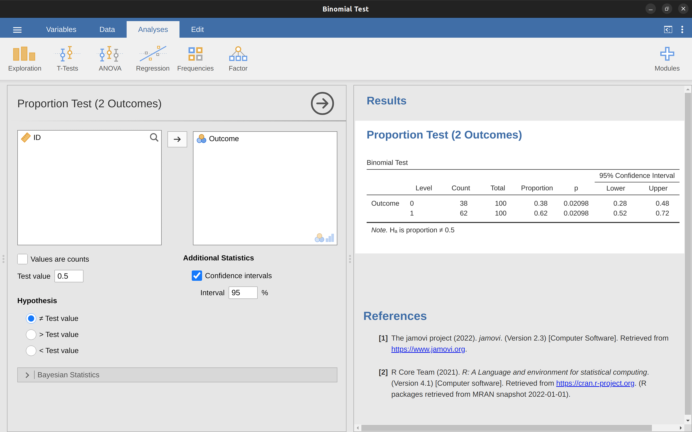

\placetextbox{0.26}{0.06}{\scriptsize{©2025 D.R. Foxcroft and D.J. Navarro,}}
\placetextbox{0.195}{0.05}{\scriptsize{CC BY-SA 4.0}}
\placetextbox{0.70}{0.06}{\scriptsize{\url{https://doi.org/10.11647/OBP.0333.09}}}

# Hypotesetesting {#sec-testing}

```{r}
#| include: FALSE
source("chapter_header.R")
```

> *The process of induction is the process of assuming the simplest law that can be made to harmonize with our experience. This process, however, has no logical foundation but only a psychological one. It is clear that there are no grounds for believing that the simplest course of events will really happen. It is an hypothesis that the sun will rise tomorrow: and this means that we do not know whether it will rise.*\
> -- Ludwig Wittgenstein
^[Sitatet kommer fra Wittgensteins *Tractatus Logico-Philosophicus.* (1922)]

Forrige kapittel handlet om estimering, som er en av to temaer i inferensiell statistikk som dekkes i boka. Dette kapittelet handler om den andre store idéen, *hypotesetesting*. I sin mest abstrakte form er hypotesetesting egentlig en veldig enkel idé. Forskeren har en teori om verden og ønsker å avgjøre om dataene faktisk støtter denne teorien. Jeg presenterer hvordan hypotesetesting fungerer i ganske stor detalj, ved å bruke et gjennomgående eksempel for å vise deg hvordan en hypotesetest "bygges". Vi fokuserer på den underliggende logikken i testprosedyren og lar andre ta seg av matematikken og utregningene. 

## Forskningshypoteser og statistiske hypoteser

Et lite, men produktivt forskningsfelt (i hvert fall målt i antall publikasjoner) undersøker ekstrasensorisk persepsjon (ESP), altså evnen til å føle ånder, vonde ting som skjer andre steder i verden og slikt. Vi kaller det ofte å være "synsk" eller å ha "klarsyn". Vi designer en studie for å påvise at ESP eksisterer. Vi rekrutterer deltakere, setter hver av dem i tur og orden ved et bord og viser dem et kort. Kortet er svart på den ene siden og hvitt på den andre. Forskningsassistenten som hjelper oss legger kortet på et bord i naborommet. Kortet plasseres med svart side opp eller hvit side opp helt tilfeldig. Vi spør deltakeren hvilken side av kortet som nå vender oppover.

Det er et engangseksperiment. Hver person ser bare ett kort og gir bare ett svar, og på intet stadium er deltakeren faktisk i kontakt med noen som kjenner det riktige svaret. Datasettet er derfor svært enkelt. Jeg har stilt spørsmålet til $N$ personer og et visst antall $X$ av disse personene har gitt det riktige svaret. For å gjøre det konkret, la oss anta at jeg har testet $N = 100$ personer og $X = 62$ av disse svarte riktig.

Jeg ville jo forventet $X = 50$, så $X = 62$ er et overraskende stort antall, kanskje, men er det stort nok til at jeg kan føle meg trygg på å hevde at jeg har funnet bevis for ESP? Ville man ikke fått $X = 62$ ganske ofte også om ESP ikke eksisterte? Dette er en situasjonen der hypotesetesting kommer til nytte. Vi har en hypotese og ønsker et "ja" eller "nei". Men før vi snakker om hvordan man tester hypoteser, må vi være klare på hva vi mener med hypoteser.

### Forskningshypoteser versus statistiske hypoteser

Det første skillet du må ha klart for deg er mellom forskningshypoteser og statistiske hypoteser. I ESP-studien vår er forskningshypotesen at ESP eksisterer. Forskningsmålet vårt er klart: vi håper å oppdage bevis for ESP. Eller kanskje er vi mer nøytrale, at vi ønsker å avgjøre om ESP eksisterer eller ikke. Poenget er at en forskningshypotese innebærer å fremsette en substansiell, testbar vitenskapelig påstand. Hvis du er utdanningsforsker, så handler forskningshypotesene dine om undervisning, læring og liknende ting. Alle disse vil telle som **forskningshypoteser**:

- *Å lytte til musikk reduserer evnen til å gjøre skolearbeid*. Dette er en påstand om årsaksforholdet mellom to meningsfulle konstrukter (å lytte til musikk og å gjøre skolearbeid), så det er en helt rimelig forskningshypotese.
- *Intelligens er relatert til mindset ("fixed" eller "growth")*. Som den forrige hypotesen er dette en relasjonell påstand om to konstrukter (intelligens og syn på egne evner), men påstanden er svakere, siden den undersøker korrelasjon og ikke kausalitet.
- *Åttendetrinnselever leser bedre i 2025 enn i 2015*. Enda en relasjonell påstand, men om samme konstrukt målt på ulike tidspunkt.
- *Intelligens er hvor fort man kan behandle informasjon*. Denne hypotesen har en helt annen karakter. Det er faktisk ikke en relasjonell påstand i det hele tatt, men er en ontologisk påstand, altså en påstand om hva intelligens er. Det er vanligvis lettere å lage forskningshypoteser av formen "påvirker $X$ $Y$?" enn på formen "hva er $X$?" I praksis er finner vi måter å teste relasjonelle påstander på som følger fra de ontologiske. For eksempel, hvis jeg tror at intelligens er hastigheten på informasjonsbehandling i hjernen, vil eksperimentene mine ofte innebære å lete etter sammenhenger mellom mål på intelligens og mål på hvor fort man kan behandle informasjon. Derfor er de fleste forskningsspørsmål relasjonelle av natur, selv om de er motivert av dypere ontologiske spørsmål.

I praksis glir slike forskningshypoteser litt over i hverandre. Mitt ultimate mål i ESP-eksperimentet kan være å teste en ontologisk påstand som "ESP eksisterer", men jeg begrenser meg til en smalere hypotese som "Noen mennesker kan 'se' objekter som med en sjette sans". Faktisk til den enda smalere påstanden "Noen mennesker kan si hvilken vei et kort ligger i et annet rom.". Men alle disse er likevel forskningshypoteser siden de handler om den virkelige verden.

**Statistiske hypoteser** er ikke påstander om den virkelige verden. Statistiske hypoteser er matematisk presise utsagn om hvordan vi ser for oss at dataene er generert, for eksempel "hva er sannsynligheten for å få $X = 62$ gunstige utfall når man gjør 100 trekk og sjansen for et gunstig utfall er $50\%$?" Likevel er hensikten at statistiske hypoteser skal hjelpe oss med å undersøke forskningshypotesene. For eksempel, i ESP-studien min er forskningshypotesen at noen mennesker er i stand til å se gjennom vegger eller hva det måtte være. For at den statistiske hypotesen skal kunne si noe om forskningshypotesen må de ha så tett sammenheng som overhodet mulig.

Så la oss tenke på hva den statistiske hypotesen vil være. Jeg er interessert i hva sjansen er for at folk svarer korrekt, $P(korrekt)$. Hva sannsynligheten for at folk i populasjonen svarer korrekt er ukjent. La oss bruke den greske bokstaven $\theta$ (*theta*) for å referere til denne sannsynligheten. Her er fire forskjellige forskningshypoteser og hvordan man kan gjøre dem om til statistiske hypoteser:

- *Deltagerne gjetter bare*: Hvis ESP ikke eksisterer og hvis eksperimentet mitt er godt designet, så gjetter deltakerne mine bare. Jeg forventer derfor at de gjetter riktig halvparten av tiden, og min statistiske hypotese er at den sanne sannsynligheten for å velge riktig er $\theta=0{,}5$.
- *Noen deltagere kan se kortet*: Hvis det er sant vil folk prestere bedre enn tilfeldig, og den statistiske hypotesen er at $\theta > 0.5$.
- *Noen deltagere blir lurt av klarsynet sitt*: ESP eksisterer, men fungerer slik at folk svarer riktig litt sjeldnere. Dette ville tilsvare en statistisk hypotese at $\theta < 0.5$.
- *ESP eksisterer*: Hvis ESP eksisterer, men jeg ikke har noen hypotese om folk ser den riktige fargen eller den gale, så vil den eneste statistiske hypotesen jeg kan lager være at $\theta \neq 0.5$.

Alle disse er legitime eksempler på en statistisk hypotese fordi de er uttalelser om en populasjonsparameter, $P(riktig)$.

Det denne diskusjonen gjør klart, håper jeg, er at når man forsøker å konstruere en statistisk hypotesetest har forskeren faktisk to ganske distinkte hypoteser å vurdere. Først har han eller hun en forskningshypotese (en påstand innen om utdanning, undervisning, læring, og så videre), og deretter lagen man en statistisk hypotese. For at den statistiske hypotesen skal si noe om forskningshypotesen må det være et klart samsvar mellom forskningshypotesen og den statistiske hypotesen. I ESP-eksemplet mitt kan disse være som vist i @tbl-hypothesis-research-and-statistics.

```{r}
#| label: tbl-hypothesis-research-and-statistics
#| tbl-cap: Forskningshypoteser og statistiske hypoteser

tibble(
  `Hypotesetype` = c("Forsknings", "Statistisk"),
  `Hypotese` = c("ESP eksisterer", "θ ≠ 0.5")
) |>
  tt()
```

Og en viktig ting å erkjenne er dette: En statistisk hypotesetest er en test av den statistiske hypotesen, ikke forskningshypotesen. Hvis studien din er dårlig designet, så er koblingen mellom forskningshypotesen din og den statistiske hypotesen ødelagt. For å gi et dumt eksempel, anta at ESP-studien min ble gjennomført i en situasjon hvor deltakeren faktisk kan se kortet reflektert i et vindu. Hvis det skjer ville jeg være i stand til å finne svært sterke bevis for at $\theta \neq 0{,}5$, men dette ville ikke fortelle oss noe om hvorvidt "ESP eksisterer".

### Nullhypoteser og alternative hypoteser

Alt vel så langt! Vi har en forskningshypotese som tilsvarer det vi "ønsker" å tro om verden, og forhåpentligvis kan knytte den til en statistisk hypotese som presist tilsvarer det jeg ønsker å tro. Det er på dette punktet at ting blir litt kontraintuitivt for mange. 

Fordi det jeg nå skal gjøre er å finne på en ny statistisk hypotese ("null"-hypotesen, $H_0$) som tilsvarer det eksakt motsatte av det jeg ønsker å tro, og deretter fokusere utelukkende på den –- nesten så jeg glemmer det jeg faktisk er interessert i (som nå kalles den "alternative" hypotesen, $H_1$). I vårt ESP-eksempel er nullhypotesen at $\theta = 0{,}5$, siden det er det vi ville forvente dersom ESP ikke eksisterte. Mitt håp er selvfølgelig at ESP er helt reell, og derfor er alternativet til denne nullhypotesen $\theta \neq 0{,}5$. 

I bunn og grunn deler vi her opp de mulige verdiene av $\theta$ i to grupper: de verdiene som jeg virkelig håper ikke er sanne (nullhypotesen), og de verdiene som jeg ville være fornøyd med dersom de viser seg å være riktige (alternativet). Etter å ha gjort dette, er det viktig å erkjenne at målet med en hypotesetest ikke er å finne støtte for den alternative hypotesen. Målet er å finne støtte for at nullhypotesen er usann. De fleste synes dette er ganske rart.

Én måte å tenke på dette på, er å forestille seg at en hypotesetest er en straffesak, **rettssaken mot nullhypotesen**. Nullhypotesen er den tiltalte, forskeren er påtalemyndigheten, og den statistiske testen er selve dommeren. Akkurat som i en straffesak antar vi at den tiltalte er uskyldig inntil det motsatte er bevist -- nullhypotesen anses å være sann med mindre du, forskeren, kan bevise utover rimelig tvil at den er usann. 

Du står fritt til å utforme forskningsstudien din akkurat som du ønsker (innenfor rimelighetens grenser, selvfølgelig!), og målet ditt når du gjør det er å maksimere sjansen for at dataene vil føre til en domfellelse, altså at hypotesetesten viser an nullhypotesen er usann. Haken er at den statistiske testen setter reglene for rettssaken, og disse reglene er utformet for å beskytte nullhypotesen -– for å sikre at dersom nullhypotesen faktisk er sann, så er sjansene for en falsk domfellelse garantert lave. Dette er ganske viktig. Tross alt får ikke nullhypotesen en advokat, og siden forskeren desperat prøver å bevise at den er usann, må noen beskytte den.

## To typer feil

Ideelt sett skulle vi konstruert hypotesetesten slik at den aldri tok feil. Dessverre er dette ikke mulig. Noen ganger er du bare virkelig uheldig -- selv en rettferdig mynt kan lande på kron 10 ganger på rad. Det føles kanskje som et sterkt bevis for at mynten ikke er rettferdig, men selv en rettferdig mynt vil land slik 1 av 1024 ganger. Med andre ord må vi alltid akseptere at det er en sjanse for at vi konkluderte feil. Derfor er målet ved statistisk hypotesetesting ikke å eliminere feil, men å minimere dem, eller i hvert fall å vite hvor ofte vi vil gjøre dem. Fordi vi aldri kan være sikker på om vi beholder eller forkaster riktig, bør man unngå å bruke ord som "bevise" hypotesen, det tryggeste er å bruke ord som "beholde" og "forkaste" hypotesen.

Hypotesetesten vår vil enten beholde nullhypotesen eller forkaste den, og hypotesen kan enten være sann eller ikke sann. Dette gir oss fire muligheter, oppsummert i @tbl-testing-errors.

```{r}
#| label: tbl-testing-errors
#| tbl-cap: Mulige utfall ved statistisk testing av nullhypoteser

tibble(
  `Sannhetsverdi` = c("$H_0$ er sann", "$H_0$ er usann"),
  `Behold $H_0$` = c("Korrekt", "Feil (type II)"),
  `Forkast $H_0$` = c("Feil (type I)", "Korrekt")
) |>
  tt()
```

Som vi ser av tabellen er det to typer feil. Hvis vi forkaster en nullhypotese som faktisk er sann, har vi gjort en **type I-feil**. Hvis vi beholder en nullhypotese som faktisk er usann, har vi gjort en **type II-feil**. Jeg er ganske frustrert over noen av navnene vi setter på ting i statistikk. For meg hadde det gitt mye mer mening å kalle type I-feil for "forkastingsfeil" og type II-feil for "beholdingsfeil", eller noe slikt. Jeg har ingen huskeregel for hva som er type I og type II, så lykke til med å lære dere det.

Jeg sa at statistisk testing var litt som en straffesak, og det gjelder for disse feilslutningene også. En straffesak krever at du etablerer "utover enhver rimelig tvil" at tiltalte er skyldig. Alle bevisreglene er (i teorien, i det minste) designet for å sikre at det er (nesten) ingen sjanse for å dømme en uskyldig tiltalt på feil grunnlag. Som den engelske juristen William Blackstone så famøst uttrykte det, "det er bedre at ti skyldige personer slipper unna enn at én uskyldig lider." Hypotesetesting er også utformet slik at nullhypotesen svært sjeldent skal forkastes hvis den er sann. Med andre ord, Type I-feil skal være svært sjeldne.

Det aller viktigste prinsippet vi bruker når vi konstruerer testen er derfor å kontrollere sannsynligheten for type I-feil. Dette er feilen man kan gjøre når $H_0$ er sann, se @tbl-testing-errors-alpha-1 Denne sannsynligheten, som betegnes $\alpha$ ("alfa"), kalles **signifikansnivået** til testen. Hvis det ikke står noe annet om hypotesetesten er $\alpha$ alltid satt til $0{,}05, altså $5\%$. Altså, en hypotesetest sies å ha signifikansnivå $\alpha$ hvis type I-feilraten er $\alpha$.

Så, hva med type II-feilraten, altså sannsynligheten for å beholde $H_0$ når den er usann? Vi betegner denne sannsynligheten med $\beta$ ("beta"), se @tbl-testing-errors-alpha-2. Når $H_0$ er usann er det mye vanligere referere til **styrken** til testen, det vil si sannsynligheten for å forkaste en nullhypotese når den virkelig er usann, som er $1 - \beta$. Altså, hvis testen sin $\beta$ er 20%, så er styrken til testen 80%, som betyr at man har "80% sjanse for å forkaste en usann nullhypotese". 

::: {#tbl-testing-errors-alpha}
```{r}
#| label: tbl-testing-errors-alpha-1
#| tbl-cap: Når $H_0$ er sann

tibble(
  "Avgjørelse" = c("beholde $H_0$", "forkaste $H_0$"),
  "Sannsynlighet" = c("1 - α", "α"),
  "Beskrivelse" = c(
    "sannsynlighet for å beholde",
    "type I-feil rate"
  )
) |> tt()

# Begge tabellene i én. (Originalen)
# tibble(
#   "$h_0$ sin status" = c("$H_0$ er sann", "$H_0$ er sann", "$H_0$ er usann", "$H_0$ er usann"),
#   "Avgjørelse" = c("beholde $H_0$", "forkaste $H_0$", "beholde $H_0$", "forkaste $H_0$"),
#   "Sannsynlighet" = c("1 - α", "α", "β", "1 - β"),
#   "Beskrivelse" = c(
#     "sannsynlighet for å beholde",
#     "raten for type I-feil", 
#     "raten for type II-feil",
#     "testens styrke"
#   )
# ) |> 
#   tt()
```
```{r}
#| label: tbl-testing-errors-alpha-2
#| tbl-cap: Når $H_0$ er usann.
tibble(
  "Avgjørelse" = c("beholde $H_0$", "forkaste $H_0$"),
  "Sannsynlighet" = c("β", "1 - β"),
  "Beskrivelse" = c(
    "raten for type II-feil",
    "testens styrke"
  )) |> tt()

```

Statistisk testing av nullhypotese (NHST) -- ytterligere detaljer
:::

En veldig god hypotesetest er en som har en liten verdi av $\beta$ og $\alpha$ samtidig. Av gammel vane bruker forskere $\alpha$-nivå $5\%$. Dessverre går det ikke an til å kontrolle $\beta$ på samme måte, så det er en asymmetri her: testene er designet for å sikre at $\alpha$-nivået holdes lite, men det er ingen tilsvarende garanti angående $\beta$. Vi ønsker at type II-feilraten skal være liten, og vi prøver å designe tester som holder den liten, men dette står i andre rekke. Som Blackstone ville ha sagt det hvis han var statistiker, det er "bedre å beholde 10 falske nullhypoteser enn å forkaste én eneste sann."

Jeg vet ikke om jeg er enig i denne filosofien. Det gir mening i noen situasjoner og ikke i andre. Hvis man undersøker læringseffekten av et nytt IKT-verktøy blir nullhypotesen at verktøyet ikke virker og alternativhypotesen at verktøyet virker. Da blir avveiningen om det er bedre å konkludere med at 10 IKT-verktøy som virker ikke virker, enn å konkludere med at ett IKT-verktøy som ikke virker virker. Du får bedømme selv hva du synes, men uansett må du vite at hypotesetesting er konstruert slik at nullhypotesen ikke skal avvises ved en feil.

## Testobservatorer og utvalgsfordelinger

Endelig kan vi se se konkret på hvordan en hypotesetest er bygget opp. For å gjøre dette bruker vi ESP-eksemplet vårt. For øyeblikket ser vi bort fra de faktiske dataene vi fikk, og fokuserer på strukturen: Av $N$ forsøkspersoner hadde $X$ sagt riktig farge på det skjulte kortet.

La oss anta at nullhypotesen faktisk er sann, altså at ESP ikke finnes og den sanne sannsynligheten for at noen velger riktig farge er nøyaktig $\theta = 0{,}5$. Hvordan ville vi da forvente at dataene så ut?

Vi ville naturligvis forvente at andelen mennesker som gir riktig svar ligger ganske nær 50%. Eller, for å uttrykke dette matematisk: $\frac{X}{N}\approx 0{,}5$. 

Men vi kan ikke forvente at brøken er nøyaktig 0,5. Hvis vi for eksempel testet $N = 100$ personer og $X = 53$ av dem svarte riktig, ville vi sagt at dataene var ganske konsistente med nullhypotesen. På den andre siden, hvis $X = 99$ av deltakerne svarte riktig, ville vi følt oss temmelig sikre på at nullhypotesen var feil. Tilsvarende, hvis bare $X = 3$ personer svarte riktig, ville vi også være sikre på at nullhypotesen var feil.

La oss uttrykke dette litt mer teknisk. Vi har en observator $X$. (En observator var noe man kunne beregne fra dataene.) Vi kaller $X$ en **testobservator** når vi bruker verdien av $X$ til å ta en beslutning om vi skal tro at nullhypotesen er korrekt eller om vi skal forkaste den.

Etter å ha valgt en testobservator, er neste steg å angi hvilke verdier av observatoren som vil føre til at vi forkaster nullhypotesen, og hvilke verdier som ville føre til at vi beholder den. For å gjøre dette må vi bestemme hva **utvalgsfordelingen til testobservatoren** ville være dersom nullhypotesen faktisk var sann (vi snakket om utvalgsfordelinger tidligere i @sec-sampling-distribution-of-the-mean). 

Hvorfor trenger vi dette? Fordi denne fordelingen forteller oss nøyaktig hvilke verdier av $X$ vi kan forvente å se hvis nullhypotesen var sann. Derfor kan vi bruke denne fordelingen som et verktøy for å vurdere hvor godt nullhypotesen stemmer overens med dataene våre.

Hvordan finner vi utvalgsfordelingen til testobservatoren? For de fleste hypotesetester er dette steget komplisert, og jeg unngår det for de fleste av testene i boken. Vi har sett på ett eksempel litt grundig, og det var gjennomsnittet; utvalgsfordelingen til gjennomsnittet var normalfordelingen. Og heldigvis for oss gir ESP-eksemplet vårt et av de enkleste tilfellene. 

Populasjonsparameteren vår $\theta$ er sannsynligheten for at en tilfeldig valgt person fra populasjonen svarer riktig, og testobservatoren vår $X$ er antallet personer som gjorde det av en utvalgsstørrelse på $N$. Vi har sett på akkurat dette før i @sec-probability-binomial, binomialfordelingen! 

Nullhypotesen sier at $X$ er binomialfordelt med $\theta = 0{,}5$ og $N = 100$. Dette gir utvalgsfordelingen, som vi ser i @fig-testing-binomial. Figuren viser at fordelingen til testobservatoren er $X = 50$ og at vi nesten sikkert vil se et sted mellom 40 og 60 riktige svar.

```{r width="100%"}
#| label: fig-testing-binomial
#| fig-cap: Utvalgsfordelingen for vår testobservator $X$ når nullhypotesen er sann. I ESP-studien er dette en binomialfordeling. Utvalgsfordelingen sier at den mest sannsynlige verdien er 50 (av 100) korrekte svar og de sannsynlige verdiene ligger mellom 40 og 60
#| fig-alt: Et søylediagram med tittelen "Utvalgsfordeling for X hvis nullhypotesen er sann" viser sannsynligheten (y-aksen) versus antall korrekte svar (X) (x-aksen). Fordelingen er ca. normalfordelt, med topp rundt 50 korrekte svar
#| fig-width: 8.571429

binom1 <- data.frame(success = 0:100, pmf = dbinom(x = 0:100, size = 100, prob = .5))

ggplot(data=binom1, aes(x = factor(success), y = pmf+.001)) +
  geom_col(col=blueshade, fill=blueshade, width=.4) +
  ggtitle("Utvalgsfordeling for X hvis nullhypotesen er sann") +
  labs(x = "\nAntall korrekte svar (X)",
       y = "Sannsynlighet\n") +
  scale_x_discrete(breaks=seq(0,100,20)) +
  theme(plot.title = element_text(hjust = 0.5))

```

## Beslutningsprosedyren

Flott! Vi nærmer oss målstreken. Vi har laget en testobservator, $X$, slik at hvis $X$ ligger nær 50 bør vi beholde nullhypotesen. Vi har også funnet utvalgsfordelingen som gjelder for testobservatoren hvis nullhypotesen er sann. Da har vi verktøyene for å finne ut om verdien av $X$ er kompatibel med nullhypotesen, eller om vi bør forkaste den. 

Det vi mangler er å finne ut nøyaktig hvilke verdier av testobservatoren som tilhører nullhypotesen, og hvilke som tilhører alternativhypotesen. I min ESP-studie har jeg for eksempel observert en verdi på $X = 62$. Hvilken avgjørelse bør jeg ta? Skal jeg velge å tro på nullhypotesen eller alternativhypotesen?

### Forkastningsområder og kritiske verdier

For å besvare spørsmålet må vi introdusere begrepet **forkastningsområde** for testobservatoren $X$. Forkastningsområdet til testen tilsvarer de verdiene av $X$ som fører til at vi forkaster nullhypotesen. Husk at vi ønsker å forkaste nullhypotesen med så liten sannsynlighet som mulig når nullhypotesen er sann, og at denne sannsynligheten betegnes $\alpha$. Hvis $\alpha$ er 5% må forkastningsområdet dekke 5% av $X$ sin utvalgsfordeling.

Forkastningsområdet består derfor av de 5% (eller $\alpha$) mest ekstreme verdiene, kjent som **halene** til fordelingen. Dette er illustrert i @fig-binomial-critical-two-sided. Siden vi ønsker $\alpha = 5%$, så tilsvarer forkastningsområdet $X \leq 40$ og $X \geq 60$. Det vil si, hvis antallet personer som sier kortets riktige farge er mellom 41 og 59, så bør vi beholde nullhypotesen. Hvis antallet er mellom 0 og 40 eller mellom 60 og 100, så bør vi forkaste nullhypotesen. Tallene 40 og 60 kalles de **kritiske verdiene** og siden de utgjør grensene for forkastningsområdet.

```{r width="100%"}
#| label: fig-binomial-critical-two-sided
#| fig-cap: Forkastningsområdet til ESP-studien sin hypotesetest med signifikansnivå $\alpha = 5%$. Plottet viser utvalgsfordelingen til $X$ under nullhypotesen (dvs. samme som @fig-testing-binomial). De grå stolpene tilsvarer de verdiene av $X$ hvor vi ville beholdt nullhypotesen. De blå (mørkere skyggelagte) stolpene viser forkastningsområdet, altså de verdiene av $X$ hvor vi ville forkastet nullhypotesen. Fordi alternativhypotesen er "tosidig" (dvs. tillater både $\theta < 0{,}5$ og $\theta > 0{,}5$), dekker forkastningsområdet begge halene til fordelingen. For å sikre et $\alpha$-nivå på $5%$, må hvert av områdeene dekke $2{,}5%$ av utvalgsfordelingen
#| fig-alt: En graf som viser forkastningsområdet til en tosidig test. X-aksen representerer antall korrekte svar (X) fra 0 til 100. Det nedre forkastningsområdet (2,5% av fordelingen) og øvre forkastningsområde (2,5% av fordelingen) er uthevet i blått
#| fig-width: 8.571429

binom1 <- data.frame(success = 0:100, pmf = dbinom(x = 0:100, size = 100, prob = .5))
binom1$plotcol <- with(binom1, ifelse(success<=40 | success >= 60, blueshade, "lightgrey"))
ggplot(data=binom1, aes(x = factor(success), y = pmf+.001)) +
  geom_bar(aes(colour=plotcol, fill=plotcol), width=.4, stat = "identity") +
  ggtitle("Forkastningsområde for en tosidig test") +
  labs(x = "\nAntall korrekte svar (X)") +
  geom_text(x=22, y=.035, label="nedre forkastningsområde\n(2,5% av fordelingen)", size=5, check_overlap = TRUE) +
  geom_segment(x = 40, y = .025, xend = 15, yend = .025,
               arrow = arrow(length = unit(0.03, "npc")), stat = "unique") +
  geom_text(x=80, y=.035, label="øvre forkastningsområde\n(2,5% av fordelingen", size=5, check_overlap = TRUE) +
  geom_segment(x = 61, y = .025, xend = 85, yend = .025, 
               arrow = arrow(length = unit(0.03, "npc")), stat = "unique") +
  scale_x_discrete(breaks=seq(0,100,20)) +
  scale_colour_identity() +
  scale_fill_identity() +
  theme(
    axis.title.y = element_blank(),
    axis.line.y = element_blank(),
    axis.text.y = element_blank(),
    axis.ticks.y = element_blank(),
    plot.title = element_text(hjust = 0.5)
    )

```

Nå er vi ferdige med å lage hypotesetesten, og prosedyren er som følger:

1. Vi velger et $\alpha$-nivå (f.eks., $\alpha = 0{,}05$)
2. Vi velger en testobservator (f.eks., $X$) som er egnet til å sammenligne $H_0$ med $H_1$
3. Vi finner utvalgsfordelingen til testobservatoren under antagelsen om at nullhypotesen er sann (i dette tilfellet binomialfordelingen)
4. Vi beregner forkastningsområdet som gir riktig $\alpha$-nivå (i dette tilfellet 0-40 og 60-100)

Nå må vi bare gjøre eksperimentet, beregne verdien av testobservatoren for de virkelige dataene (f.eks., $X$ = 62) og se om den faller innenfor forkastningsområdet. Siden 62 er større enn den kritiske verdien på 60, ville vi forkastet nullhypotesen. Vi sier at testen har produsert et **statistisk signifikant** resultat.

Når vi nå har laget en beslutningsprosedyre for hypotesetesten bør vi tenke over hva egenskapene til denne prosedyren er. Det har jeg prøvd å forklare gjennom hele kapittelet, men det er verdt å fremheve her:

> Hypotesetesten gjør at vi har kontroll på signifikansnivået, $\alpha$. Vi vet altså hvor ofte vi vil forkaste nullhypotesen ved en feil.

Hvis nullhypotesen er sann, vil denne prosedyren forkaste den bare $\alpha$ prosent av gangene, og $\alpha$ har vi stort sett alltid satt til $5\%$.

### En merknad om statistisk "signifikans"

> *Like other occult techniques of divination, the statistical method has a private jargon deliberately contrived to obscure its methods from non-practitioners.*\
> -- Attributed to G. O. Ashley
^[Internett virker overbevist om at Ashley sa dette, men jeg klarer ikke å finne en kilde for påstanden.]

Vi må nesten ta en kort pause for å diskutere ordet "signifikant", for det skaper en god del forvirring. Begrepet "statistisk signifikans" er egentlig enkelt, men navnet er uheldig. Når dataene våre lar oss forkaste nullhypotesen, sier vi at "resultatet er statistisk signifikant" eller bare "resultatet er signifikant". Problemet er at terminologien stammer fra en tid da det engelske "signify" bare betydde noe slikt som å indikere eller antyde. I dag forbinder vi ordet "signifikant" med noe som er viktig eller betydningsfullt, og da oppstår det forvirring. Mange som lærer statistikk for første gang tror at et "signifikant resultat" automatisk betyr et viktig resultat. Men det er altså ikke tilfellet. "Statistisk signifikant" betyr bare at dataene tillot oss å forkaste nullhypotesen. Om resultatet faktisk er viktig er et helt annet spørsmål.

### Forskjellen mellom ensidig og tosidig test {#sec-testing-one-sided}

Testen vi nettopp så på kalles **tosidet** fordi forkastningsområdet besto av halene på begge sider. Dette samsvarer godt med nullhypotesen og alternativhypotesen vi brukte:

$$H_0: \theta=0.5$$
$$H_1:\theta \neq 0.5$$ 

Alternativhypotesen dekker både muligheten for at $\theta < 0.5$ og muligheten for at $\theta > 0.5$. Dette gir mening hvis jeg tror ESP kan føre til både bedre-enn-tilfeldig prestasjon og dårligere-enn-tilfeldig prestasjon (noe enkelte faktisk mener), og derfor må forkastningsområdet for testen dekke begge haler av utvalgsfordelingen (2,5% på hver side når $\alpha$ = 0.05), som vi så tidligere i @fig-binomial-critical-two-sided.

Men det finnes andre muligheter. La oss si at jeg bare er villig til å tro på ESP hvis det gir bedre enn tilfeldig prestasjon. I så fall ville min alternativhypotese bare dekke muligheten for at $\theta > 0.5$, og hypotesene blir:

$$H_0: \theta \leq 0.5$$
$$H_1: \theta > 0.5$$

Dette kalles en **ensidig test**, og det kritiske området dekker bare én hale av utvalgsfordelingen. Dette er illustrert i @fig-binomial-critical-one-sided. Hvis du har en ensidig hypotese bør du benytte en ensidig test, fordi du da vil kunne forkaste nullhypotesen oftere når den er usann, testen vil altså ha større statistisk styrke.

```{r width="100%"}
#| label: fig-binomial-critical-one-sided
#| fig-cap: Forkastningsområdet for en ensidig test. Her er alternativhypotesen at $\theta \geq .5$, så vi forkaster bare nullhypotesen for store verdier av $X$. Derfor dekker forkastningsområdet bare den øvre halen av utvalgsfordelingen, nærmere bestemt de øvre 5% av fordelingen. Sammenlign dette med den tosidige versjonen i @fig-binomial-critical-two-sided
#| fig-alt: Et histogram som viser en normalfordeling av antall korrekte svar (X) med et uthevet forkastningsområde på høyre side, som representerer 5% av fordelingen. X-aksen spenner fra 0 til 100 korrekte svar.
#| fig-width: 8.571429

binom1 <- data.frame(success = 0:100, pmf = dbinom(x = 0:100, size = 100, prob = .5))
binom1$plotcol <- with(binom1, ifelse(success>= 58, blueshade, "lightgrey"))

ggplot(data=binom1, aes(x = factor(success), y = pmf+.001)) +
  geom_bar(aes(colour=plotcol, fill=plotcol), width=.4, stat = "identity") +
  ggtitle("Kritisk område for en ensidig test") +
  labs(x = "\nAntall korrekte svar (X)") +
  geom_text(x=78, y=.04, label="kritisk område\n(5% av fordelingen)", size=5, check_overlap = TRUE) +
  geom_segment(x = 59, y = .028, xend = 92, yend = .028,
               arrow = arrow(length = unit(0.03, "npc")), stat = "unique") +
  scale_x_discrete(breaks=seq(0,100,20)) +
  scale_colour_identity() +
  scale_fill_identity() +
  theme(
    axis.title.y = element_blank(),
    axis.line.y = element_blank(),
    axis.text.y = element_blank(),
    axis.ticks.y = element_blank(),
    plot.title = element_text(hjust = 0.5))

```

## $p$-verdier {#sec-p-value}

Vi kunne avsluttet om hypotesetesting nå, og sagt oss ferdige. Vi har konstruert en testobservator, funnet ut av testobservatorens utvalgsfordeling dersom nullhypotesen er sann, og deretter konstruert forkastningsområdet for testen. Vi trenger ingenting mer for å gjøre hypotesetester. Men hvis du skulle komme i skade for å lese en forskningsartikkel ville du sett et tall du ikke forsto noe av, **$p$-verdien**, så vi må snakke om det også. På ett vis er det synd å komplisere dette videre, men på en annen side vil det forenkle mye. Uten $p$-verdien måtte du ha forholdt deg til en bråte ulike testobservatorer, slik som $\theta$, $t$, $\chi^2$ og $F$, og hatt masse greier du hadde måtte huske på. Med $p$-verdien har du bare ett tall å forholde deg til.

Hver eneste verdi $X$ av testobservatoren svarer til én $p$-verdi, og den finner du på følgende måte. La oss si at $X = 45$. Da spør vi oss "hvor stor andel av fordelingen ligger i 'halene' utenfor denne verdien"? Da må vi finne ut hvor mye av fordelingen som ligger utenfor $X = 45$ og $X = 55$. Dette er vist i @fig-binomial-p-value-1. Vi ser at hver "hale" utgjør 18,4% av fordelingen, slik at 36,8% av fordelingen er lenger unna. Dette er $p$-verdien, og vi skriver $p = 0{,}368$. Dette betyr "36,8% av testobservatorens fordeling ligger lenger unna den verdien du ville forventet ut fra nullhypotesen". Det betyr at det er ganske vanlig få testobservatorer mindre enn $X = 45$ og større enn $X = 55$. Dette tolker vi som at $X = 45$ er en verdi som er kompatibel med nullhypotesen.

I @fig-binomial-p-value-2 ser vi at halene utenfor $X = 66$ utgjør $0{,}1\%$ av fordelingen, altså at $p = 0{,}002$. Det betyr at det er svært sjeldent å få en testobservator som er mer ekstrem enn $X = 66$, altså som er større enn $66$ eller mindre enn $34$. Dette tolker vi som at $X = 66$ er en verdi som er lite kompatibel med nullhypotesen.

```{r}
#| label: fig-binomial-p-value
#| fig-cap: jaja
#| fig-subcap:
#|   - " "
#|   - " "
#| fig-alt: jaja

binom_tail_plot <- function(X, N, theta){
  crit_lower <- min(X, N-X)
  crit_upper <- max(X, N-X)
  
  tail_prob <- pbinom(crit_lower, 100, 0.5)
  
  binom1 <- data.frame(success = 0:N, pmf = dbinom(x = 0:N, size = N, prob = theta))
  binom1$plotcol <- with(
    binom1,
    ifelse(success<= crit_lower | success >= crit_upper, blueshade, "lightgrey")
    )
  
  
  ggplot(data=binom1) +
    aes(x = factor(success), y = pmf+.001) +
    geom_bar(aes(colour=plotcol, fill=plotcol), width=.4, stat = "identity") +
    ggtitle(sprintf("For X = %d er p = %1.3f", X, tail_prob*2)) +
    labs(x = "\nAntall korrekte svar (X)") +
    geom_text(x = 22, y=.035, label=sprintf("Fra X = %d og ned er\n %1.1f%% av fordelingen", crit_lower, tail_prob*100), size=5, check_overlap = TRUE) +
    geom_segment(x = crit_lower, y = .025, xend = 0, yend = .025,
                 arrow = arrow(length = unit(0.03, "npc")), stat = "unique") +
    geom_text(x=80, y=.035, label=sprintf("Fra X = %d og opp er\n %1.1f%% av fordelingen", crit_upper, tail_prob*100), size=5, check_overlap = TRUE) +
    geom_segment(x = crit_upper, y = .025, xend = 85, yend = .025, 
                 arrow = arrow(length = unit(0.03, "npc")), stat = "unique") +
    scale_x_discrete(breaks = seq(0,N, N/5)) +
    scale_colour_identity() +
    scale_fill_identity() +
    theme(
      axis.title.y = element_blank(),
      axis.line.y = element_blank(),
      axis.text.y = element_blank(),
      axis.ticks.y = element_blank(),
      plot.title = element_text(hjust = 0.5)
    )
}

binom_tail_plot(45,100,0.5)
binom_tail_plot(66,100,0.5)

```
Oppsummert kan vi tolke $p$-verdien slik:

> En $p$-verdi angir sannsynligheten for å få en mer ekstrem verdi for testobservatoren hvis nullhypotesen er sann.

Nå kan vi bruke $p$-verdien til å finne ut om testobservatoren er i forkastningsområdet eller ikke. Hvis $p$ er mindre enn $\alpha$, som stort sett er $0{,}05$, så er testobservatoren i forkastningsområdet, og vi kan forkaste nullhypotesen. Dette gir følgende beslutningsprosedyre:

> Hvis $p$ er mindre enn $\alpha$ (som oftest $0{,}05$) forkaster vi nullhypotesen; resultatet er statistisk signifikant.
> 
> Hvis $p$ er større enn $\alpha$ beholder vi nullhypotesen; resultatet er ikke statistisk signifikant.

Fra nå av trenger vi altså ikke å tenke så mye på testobservatorer for å finne ut av om vi skal beholde eller forkaste nullhypotesen; vi trenger bare å finne $p$-verdien.

### En vanlig feiltolkning

Jeg har gitt dere én riktig måte å tolke $p$-verdien på. Det finnes andre riktige måter å tolke den på, som er logisk konsistente og nyttige. Dessverre er den aller vanligste måten å tolke $p$-verdien på *fullstendig feil* [@lytsy2022].

> **Feil tolkning av $p$-verdien**: $p$-verdien er sannsynligheten for at nullhypotesen er sann.

Denne tolkningen sier at $p = 0{,}03$ betyr at det er $3\%$ sjanse for at nullhypotesen er sann. Det må være intuitivt tiltalende å tenke slik, siden så mange gjør det, men det er feil. Nullhypotesetesting er et frekventistisk verktøy (se @sec-probability-frequentism hvis du trenger repetisjon), og den frekventistiske tilnærmingen til sannsynlighet tillater ikke at du tildeler sannsynligheter til nullhypotesen. I frekventisme er nullhypotesen enten sann eller ikke -- den kan ikke ha en "$3\%$ sjanse" for å være sann. Det $p = 0{,}03$ betyr er ikke at det er $3\%$ sjanse for at nullhypotesen er sann, men at *hvis vi antar at nullhypotesen er sann*, så vil vi se mer ekstreme verdier av testobservatoren i $3%$ av tilfellene.

En variant av denne misforståelsen er å si at "$p$-verdien er sannsynligheten for at resultatet bare er tilfeldig støy", men hvis resultatet bare er støy, så må det være fordi nullhypotesen er sann, så da er dette bare en omformulering av den gale tolkningen.

## Rapportere resultater fra hypotesetester

Nå gjenstår bare å skrive resultatet av ESP-hypotesetesten din i en vitenskapelig artikkel og publisere den. Hvis man skulle forklart det ned i minste detalj kunne man skrevet slik:

> I utvalget vårt valgte $X = 62$ deltagere riktig farge på kortet. Under en tosidig binomialtest der nullhypotesen var at deltagerne hadde $50\%$ sjanse for å velge riktig farge, gir dette $p = 0{,}02$, som er mindre enn det satte signifikansnivået $\alpha = 0{,}05$. Dette betyr at resultatet er statistisk signifiknant og forkaster nullhypotesen. Vi anerkjenner at vi har benyttet en beslutningsprosedyre som forkaster nullhypotesen $5\%$ av gangene selv når den er sann, men vi synes denne feilraten er akseptabel og vil betrakte nullhypotesen som forkastet inntil eventuelle nye studier får oss til å skifte mening.

Men det er vanligere å skrive det opp omtrent slik

> I utvalget gjettet $X = 62$ deltagere riktig farge på kortet, som var signifikant forskjellig fra den forventede verdien (todisidig binomialtest, $p = 0{,}02$).

Så står det usagt hva signifikansnivået var og hvordan man skal tolke "signifikant forskjellig".

Hvis man ikke får et signifikant resultat kunne man rapportert det ned i minste detalj slik:

> I utvalget vårt valgte $X = 45$ deltagere riktig farge på kortet. Under en tosidig binomialtest der nullhypotesen var at deltagerne hadde $50\%$ sjanse for å velge riktig farge, gir dette $p = 0{,}368$ som er over det satte signifikansnivået på $\alpha = 0{,}05$. Resultatet er ikke statistisk signifikant og vi beholder nullhypotesen. Vi anerkjenner at vi har benyttet en beslutningsprosedyre som vil beholde nullhypotesen med en viss sannsynlighet også når den er feil, og at vi ikke vet hvor stor denne sannsynligheten er.

Hvis du synes den siste setningen var lite tilfredsstillende, så er jeg enig i det, men slik er hypotesetesting -- den er designet for å kontrollere type I-feil og ikke type II-feil. (Man kan estimere sjansen for type II-feil hvis man spesifiserer eksakt hva alternativ-hypotesen er, for eksempel at sjansen for å trekke riktig kort er $70\%$, men det går vi ikke inn på i denne boka.)

I artikler rapporteres ikke-signifikante resultater ofte slik som dette:

> I utvalget gjettet $X = 45$ deltagere riktig farge på kortet, som ikke var statistisk signifikant (tosidig binomialtest, $p = 0{,}368$).

## Å utføre hypotesetesten i praksis

Du har kanskje lurt på om dette er en "ekte" hypotesetest, eller bare et lekeeksempel jeg har funnet på. Det er faktisk en helt ekte test. I den foregående diskusjonen bygget jeg testen fra grunnleggende prinsipper, og valgte det jeg mener er det enkleste mulige problemet du kan støte på i det virkelige liv. For eksempel kan det være du lurer på om elever har mer enn $25\%$ sjanse for å få riktig svar på et flervalgsspørsmål med fire alternativer, og da vil denne testen være passende. Testen kalles *binomialtest*, fordi den benytter binomisk fordeling, eller *andelstest*, fordi den tester om dataene inneholder en gitt andel av en verdi.

Testen finnes i jamovi som en av de statistiske analysene som er tilgjengelige når du klikker på 'Frequencies'-knappen og heter der "2 outcomes binomial test". For å teste nullhypotesen om at sannsynligheten er $0{,}5$, bruker vi data der $X = 62$ av $N = 100$ personer ga riktig respons. Disse dataene finner du i datafilen [binomialtest.omv](data_and_tables/binomialtest.omv) som du kan åpne i jamovi. I dataene er det 100 rader, én for hver forsøksperson, og en variabel "Outcome" som har verdien 0 (gjettet ikke riktig) eller 1 (gjettet riktig). Resultatene vises i @fig-fig9-4.

```{r}
#| label: fig-fig9-4
#| classes: .enlarge-image
#| fig-cap: Resultater av binomialtest-analyse i jamovi
#| fig-alt: Et jamovi-skjermbilde av en binomialtest med to utfall. Grensesnittet inkluderer en seksjoner for å velge variabler, justere hypoteser, se resultater og vise referanser. Resultat-seksjonen viser andeler, p-verdier og konfidensintervaller.

```

Akkurat nå ser kanskje disse resultatene ganske ukjente ut, men de forteller deg mer eller mindre de riktige tingene med begreper du kan kjenne igjen. Under "Proportion" står andelen 0 og 1 i dataene. Under "p" står testens $p$-verdi. Det viktigste å legge merke til er at $p$-verdien er $0,02$, som er mindre enn det vanlige valget av $\alpha = 0,05$. Dette betyr at vi kan forkaste nullhypotesen. Det er to $p$-verdier fordi programvaren tester både om andelen 0er og andelen 1er er $50\%$.

Vi kommer til å snakke mye mer om hvordan man leser denne typen resultater etter hvert. Med litt øvelse vil du forhåpentligvis finne det ganske lett å lese og forstå slike utdata.

## Sammendrag

Nullhyposetesting er en sentral del av kvantitativ analyse av data, og et stort flertall av kvantitative vitenskapelige artikler rapporterer en eller annen form for hypotesetest. Derfor er det nesten umulig å navigere i utdanningsforskningslitteraturen uten å ha i det minste en grunnleggende forståelse av hva en $p$-verdi betyr og hvordan man skal tolke et resultat som er (eller ikke er) statistisk signifikant. 

Dessverre brukes hypotesetesting ganske tankeløst, og noe av det viktigste for å unngå tanketom bruk er å kun benytte testene i denne boka når man har et enkelt tilfeldig utvalg. Det er kun ved enkle tilfeldige utvalg vi kjenner utvalgsfordelingen til testobservatoren, og uten å kjenne den har man ingen måte å finne de riktige kritiske verdiene eller den riktige $p$-verdien. Dessverre syndes dette mot i de fleste kvantitative artikler fra utdanningsforsking.

La oss avslutte med en rask oppsummering av de sentrale ideene vi har utforsket:

- [Forskningshypoteser og statistiske hypoteser]. [Nullhypoteser og alternative hypoteser].
- [To typer feil]. Type I og type II.
- [Testobservatorer og utvalgsfordelinger].
- [Beslutningsprosedyren] til hypotesetesting.
- [$p$-verdier].
- Hvordan [rapportere resultater fra hypotesetester].
- [Å utføre hypotesetesten i praksis] med jamovi.

